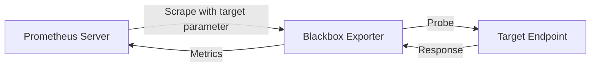

# Blackbox Exporter

## Introduction

The Blackbox Exporter is a crucial component in the Prometheus ecosystem that allows you to monitor endpoints from the outside. Unlike most Prometheus exporters that report internal metrics of systems, the Blackbox Exporter performs "black-box" testing - probing endpoints over HTTP, HTTPS, DNS, TCP, and ICMP to determine their availability, response time, and correctness.

This approach is essential for understanding how your services appear to users and external systems, providing a critical perspective that complements your internal monitoring.

## Why Use Blackbox Exporter?

- **External Validation**: Verify that your services are not only running but actually accessible and responding correctly
- **Protocol-specific Metrics**: Collect detailed metrics based on the protocol being tested (HTTP status codes, DNS resolution times, etc.)
- **SLI/SLO Monitoring**: Generate metrics for Service Level Indicators that can be used in Service Level Objectives
- **Synthetic Testing**: Create probes that simulate user interactions to detect issues before real users do

## Basic Concepts

The Blackbox Exporter works as a "prober" - it doesn't continuously monitor targets but instead responds to scrape requests from Prometheus. When Prometheus scrapes the Blackbox Exporter, it passes the target URL and probe type as parameters, and the exporter performs the probe on demand and returns the results.



## Installation

### Using Docker

The simplest way to get started is using the official Docker image:

```bash
docker run --rm -p 9115:9115 prom/blackbox-exporter:latest
```

### Using Binary

1. Download the latest release from the [GitHub releases page](https://github.com/prometheus/blackbox_exporter/releases)
2. Extract and run:

```bash
tar -xvzf blackbox_exporter-*.tar.gz
cd blackbox_exporter-*
./blackbox_exporter
```

## Configuration

The Blackbox Exporter uses a YAML configuration file to define the probes it can perform. Create a file named `blackbox.yml`:

```yaml
modules:
  http_2xx:
    prober: http
    timeout: 5s
    http:
      valid_status_codes: [200]
      method: GET
  
  http_post_2xx:
    prober: http
    timeout: 5s
    http:
      method: POST
      valid_status_codes: [200, 201, 204]
  
  tcp_connect:
    prober: tcp
    timeout: 5s
  
  icmp:
    prober: icmp
    timeout: 5s
    icmp:
      preferred_ip_protocol: "ip4"
```

Start the exporter with the configuration file:

```bash
./blackbox_exporter --config.file=blackbox.yml
```

Or with Docker:

```bash
docker run --rm -p 9115:9115 -v $(pwd)/blackbox.yml:/config/blackbox.yml prom/blackbox-exporter:latest --config.file=/config/blackbox.yml
```

## Configuring Prometheus to Use Blackbox Exporter

Add the following to your `prometheus.yml` file:

```yaml
scrape_configs:
  - job_name: 'blackbox'
    metrics_path: /probe
    params:
      module: [http_2xx]  # Use the module defined in the blackbox.yml
    static_configs:
      - targets:
        - https://example.com   # Target to probe
        - https://prometheus.io
    relabel_configs:
      - source_labels: [__address__]
        target_label: __param_target
      - source_labels: [__param_target]
        target_label: instance
      - target_label: __address__
        replacement: localhost:9115  # The Blackbox exporter's address
```

This configuration:
1. Creates a job named 'blackbox'
2. Sets the metrics path to `/probe` (the blackbox exporter's probe endpoint)
3. Specifies which module to use from your blackbox.yml
4. Lists the targets to be probed
5. Uses relabeling to:
   - Pass the target URL as a parameter to the exporter
   - Set the instance label to the target URL
   - Direct all scrapes to the blackbox exporter instead of directly to targets

## Probe Types and Examples

### HTTP Probe

The HTTP probe checks if a website or API is accessible and returning the expected status code:

```yaml
http_custom:
  prober: http
  timeout: 5s
  http:
    valid_status_codes: [200, 301, 302]
    method: GET
    headers:
      Accept: text/html
    fail_if_ssl: false
    fail_if_not_ssl: false
    fail_if_body_matches_regexp:
      - "Error"
    fail_if_body_not_matches_regexp:
      - "Welcome"
    preferred_ip_protocol: "ip4"
```

This probe:
- Accepts multiple status codes as valid responses
- Sets custom headers
- Validates response content using regular expressions

### TCP Probe

Check if a port is open and responding:

```yaml
tcp_tls:
  prober: tcp
  timeout: 5s
  tcp:
    tls: true
    preferred_ip_protocol: "ip4"
```

This probe:
- Checks TCP connectivity
- Uses TLS for secure connection

### DNS Probe

Verify DNS resolution:

```yaml
dns_example:
  prober: dns
  timeout: 5s
  dns:
    transport_protocol: "tcp"
    preferred_ip_protocol: "ip4"
    query_name: "example.com"
    query_type: "A"
    valid_rcodes:
      - NOERROR
    validate_answer_rrs:
      fail_if_matches_regexp:
        - ".*127.0.0.1.*"
```

This probe:
- Performs a DNS lookup for example.com
- Looks for an A record
- Validates that the response doesn't contain 127.0.0.1

### ICMP Probe

Test if a host is reachable via ping:

```yaml
icmp_example:
  prober: icmp
  timeout: 5s
  icmp:
    preferred_ip_protocol: "ip4"
```

## Practical Examples

### Monitoring Website Availability

Let's create a complete example of monitoring multiple websites with different requirements:

```yaml
# blackbox.yml
modules:
  http_2xx:
    prober: http
    timeout: 5s
    http:
      valid_status_codes: [200]
      method: GET
      no_follow_redirects: false
      fail_if_ssl: false
      fail_if_not_ssl: false
      tls_config:
        insecure_skip_verify: false
```

```yaml
# prometheus.yml
scrape_configs:
  - job_name: 'blackbox-http'
    metrics_path: /probe
    params:
      module: [http_2xx]
    static_configs:
      - targets:
        - https://example.com
        - https://prometheus.io
        - https://grafana.com
    relabel_configs:
      - source_labels: [__address__]
        target_label: __param_target
      - source_labels: [__param_target]
        target_label: instance
      - target_label: __address__
        replacement: blackbox-exporter:9115
```

### Setting Up Alerts

Create alerts based on blackbox metrics:

```yaml
# prometheus-rules.yml
groups:
- name: blackbox
  rules:
  - alert: HttpEndpointDown
    expr: probe_success == 0
    for: 1m
    labels:
      severity: critical
    annotations:
      summary: "Endpoint {{ $labels.instance }} down"
      description: "The HTTP endpoint {{ $labels.instance }} has been down for more than 1 minute."
  
  - alert: SlowHttpResponse
    expr: probe_duration_seconds > 1
    for: 5m
    labels:
      severity: warning
    annotations:
      summary: "Slow response from {{ $labels.instance }}"
      description: "{{ $labels.instance }} has responded slower than 1 second for more than 5 minutes."
```

## Key Metrics Provided

The Blackbox Exporter provides many useful metrics:

| Metric | Description |
|--------|-------------|
| `probe_success` | Indicates if the probe was successful (1 for success, 0 for failure) |
| `probe_duration_seconds` | Duration of the probe in seconds |
| `probe_http_status_code` | HTTP status code (for HTTP probes) |
| `probe_http_redirects` | Number of redirects followed (for HTTP probes) |
| `probe_dns_lookup_time_seconds` | Time taken for DNS lookup |
| `probe_ip_protocol` | IP protocol version used (4 or 6) |
| `probe_ssl_earliest_cert_expiry` | Unix timestamp of the earliest SSL cert expiry (for HTTPS) |

## Common Dashboards

Create a Grafana dashboard to visualize your blackbox metrics:

```json
{
  "panels": [
    {
      "title": "Endpoint Availability",
      "type": "graph",
      "targets": [
        {
          "expr": "probe_success",
          "legendFormat": "{{instance}}"
        }
      ]
    },
    {
      "title": "Response Time",
      "type": "graph",
      "targets": [
        {
          "expr": "probe_duration_seconds",
          "legendFormat": "{{instance}}"
        }
      ]
    },
    {
      "title": "SSL Certificate Expiry",
      "type": "graph",
      "targets": [
        {
          "expr": "(probe_ssl_earliest_cert_expiry - time()) / 86400",
          "legendFormat": "{{instance}} (days)"
        }
      ]
    }
  ]
}
```

## Best Practices

1. **Don't Overload Your Targets**: Keep scrape intervals reasonable
2. **Configure Timeouts Appropriately**: Set timeouts based on expected response times
3. **Use Labels for Organization**: Add meaningful labels to differentiate between environments and services
4. **Set Up Critical Alerts**: Alert on `probe_success` for important services
5. **Monitor Certificate Expiry**: Use `probe_ssl_earliest_cert_expiry` to avoid SSL certificate issues
6. **Test Different Network Paths**: Deploy multiple exporters in different locations for comprehensive coverage

## Debugging

If you're having trouble with your blackbox exporter, you can manually test probes using curl:

```bash
curl "http://localhost:9115/probe?target=https://example.com&module=http_2xx"
```

This will return all the metrics for the specified probe, which can help identify issues.

## Summary

The Blackbox Exporter is a powerful tool for external monitoring in the Prometheus ecosystem. It allows you to:

- Monitor the availability and performance of HTTP, HTTPS, DNS, TCP, and ICMP endpoints
- Validate the correct functioning of your services from an external perspective
- Build comprehensive monitoring for your web applications and APIs
- Create SLIs that reflect the actual user experience

By implementing blackbox monitoring alongside your internal metrics, you get a complete picture of your system's health and performance.

## Additional Resources

- [Official Blackbox Exporter GitHub Repository](https://github.com/prometheus/blackbox_exporter)
- [Prometheus Documentation](https://prometheus.io/docs/introduction/overview/)
- [Example Grafana Dashboards for Blackbox Exporter](https://grafana.com/grafana/dashboards/)

## Exercises

1. Set up the Blackbox Exporter to monitor your own website or a public API
2. Create a custom HTTP probe that checks for specific content in the response body
3. Configure alerts for when a service's response time exceeds a threshold
4. Implement DNS monitoring for critical domains in your infrastructure
5. Create a Grafana dashboard that shows the availability of multiple endpoints over time