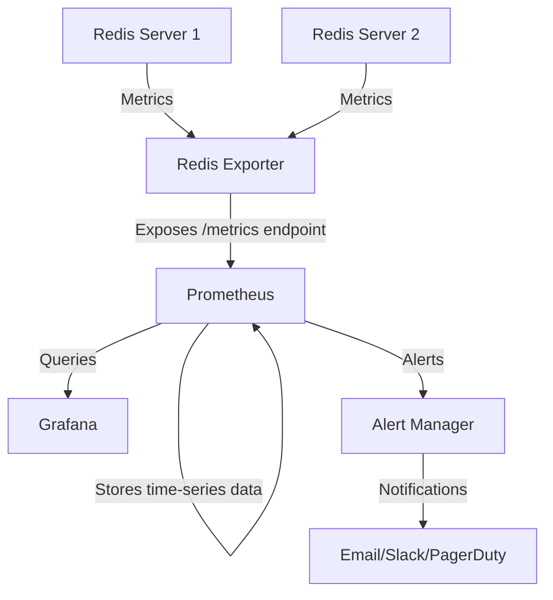

# Redis Exporter

## Introduction

Redis Exporter is a Prometheus exporter specifically designed to collect and expose metrics from Redis servers. Redis, being an in-memory data structure store used as a database, cache, and message broker, has various performance metrics that are crucial to monitor. The Redis Exporter bridges the gap between Redis and Prometheus by translating Redis metrics into a format that Prometheus can scrape and store.

In this guide, you'll learn:
- What Redis Exporter is and why it's important
- How to install and configure Redis Exporter
- The key metrics it exposes
- How to integrate it with Prometheus
- Real-world use cases and best practices

## Prerequisites

Before diving into Redis Exporter, you should have:
- Basic understanding of Redis and its functionality
- Familiarity with Prometheus fundamentals
- A working Redis instance for testing
- A working Prometheus server

## Understanding Redis Exporter

### What is Redis Exporter?

Redis Exporter is an open-source tool that extracts metrics from Redis instances and exposes them in Prometheus format. It acts as a bridge between your Redis servers and your Prometheus monitoring system.

The exporter connects to one or more Redis instances, collects various statistics and metrics about their performance and health, and makes these metrics available on an HTTP endpoint that Prometheus can scrape.

### Key Features

- Exports Redis server metrics such as memory usage, clients, and operations
- Monitors Redis keyspace information
- Supports monitoring multiple Redis instances
- Collects Redis INFO and latency statistics
- Works with Redis Cluster and Redis Sentinel
- Allows customization of metrics collection

## Installation and Setup

### Installing Redis Exporter

You can install Redis Exporter using Docker, which is the simplest method:

```bash
docker run -d --name redis-exporter -p 9121:9121 oliver006/redis_exporter
```

Alternatively, you can download the binary from the [GitHub releases page](https://github.com/oliver006/redis_exporter/releases) and run it directly:

```bash
# Download the appropriate binary for your system
wget https://github.com/oliver006/redis_exporter/releases/download/v1.x.x/redis_exporter-v1.x.x.linux-amd64.tar.gz

# Extract the archive
tar xvzf redis_exporter-v1.x.x.linux-amd64.tar.gz

# Run the exporter
./redis_exporter
```

### Basic Configuration

By default, Redis Exporter connects to a Redis instance at `redis://localhost:6379`. You can specify a different Redis instance using the `REDIS_ADDR` environment variable:

```bash
docker run -d --name redis-exporter -p 9121:9121 -e REDIS_ADDR=redis://redis-host:6379 oliver006/redis_exporter
```

To monitor multiple Redis instances, you can provide a comma-separated list:

```bash
docker run -d --name redis-exporter -p 9121:9121 -e REDIS_ADDR=redis://redis-host1:6379,redis://redis-host2:6379 oliver006/redis_exporter
```

If your Redis server requires authentication, use the `REDIS_PASSWORD` environment variable:

```bash
docker run -d --name redis-exporter -p 9121:9121 -e REDIS_ADDR=redis://redis-host:6379 -e REDIS_PASSWORD=mypassword oliver006/redis_exporter
```

## Key Redis Metrics

Redis Exporter collects many metrics from Redis servers. Here are some of the most important ones:

### System Metrics
- `redis_up`: Indicates if the Redis server is up (1) or down (0)
- `redis_uptime_in_seconds`: The number of seconds since Redis server start
- `redis_memory_used_bytes`: Total number of bytes allocated by Redis
- `redis_memory_max_bytes`: Maximum memory Redis can use

### Performance Metrics
- `redis_commands_processed_total`: Total number of commands processed
- `redis_connections_received_total`: Total connections received
- `redis_keyspace_hits_total`: Number of successful lookups of keys in the main dictionary
- `redis_keyspace_misses_total`: Number of failed lookups of keys in the main dictionary

### Client Metrics
- `redis_connected_clients`: Number of client connections (excluding connections from replicas)
- `redis_blocked_clients`: Number of clients pending on a blocking call

### Replication Metrics
- `redis_connected_slaves`: Number of connected replicas
- `redis_master_repl_offset`: The server's replication offset
- `redis_master_link_up`: Indicates if the link with the master is up (1) or down (0)

### Database Metrics
- `redis_db_keys`: Number of keys per database
- `redis_db_expires`: Number of keys with an expiration per database

Here's how these metrics might look in Prometheus format:

```
# HELP redis_memory_used_bytes Total number of bytes allocated by Redis using its allocator
# TYPE redis_memory_used_bytes gauge
redis_memory_used_bytes{addr="redis://localhost:6379"} 1023968
# HELP redis_uptime_in_seconds Redis server uptime in seconds
# TYPE redis_uptime_in_seconds gauge
redis_uptime_in_seconds{addr="redis://localhost:6379"} 2169
```

## Integrating with Prometheus

### Configuring Prometheus to Scrape Redis Exporter

To configure Prometheus to scrape metrics from Redis Exporter, add a scrape job to your `prometheus.yml` configuration file:

```yaml
scrape_configs:
  - job_name: 'redis'
    static_configs:
      - targets: ['redis-exporter:9121']
    metrics_path: /metrics
    relabel_configs:
      - source_labels: [__address__]
        target_label: instance
        regex: '(.*)'
        replacement: 'redis-server'
```

After adding this configuration, restart or reload Prometheus to apply the changes:

```bash
curl -X POST http://localhost:9090/-/reload
```

### Verifying the Integration

To verify that Prometheus is correctly scraping Redis metrics:

1. Access the Prometheus web interface (typically at http://localhost:9090)
2. Navigate to the "Status" > "Targets" page to confirm that the Redis Exporter target is up
3. Go to the "Graph" page and query some Redis metrics, for example:
   - `redis_up`
   - `redis_memory_used_bytes`
   - `redis_commands_processed_total`

## Visualizing Redis Metrics

### Creating a Grafana Dashboard

Grafana is an excellent tool for visualizing Prometheus metrics. Here's how to set up a basic Redis dashboard:

1. Add Prometheus as a data source in Grafana
2. Create a new dashboard
3. Add panels for key Redis metrics

You can create panels for:
- Memory usage over time
- Command rate
- Hit/miss ratio
- Client connections
- Operation latency

Here's an example of a Grafana query for memory usage:
```
redis_memory_used_bytes{instance="redis-server"}
```

For command rate:
```
rate(redis_commands_processed_total{instance="redis-server"}[5m])
```

For hit ratio:
```
redis_keyspace_hits_total / (redis_keyspace_hits_total + redis_keyspace_misses_total)
```

## Practical Example: Monitoring a Redis Cluster

Let's look at a real-world example of monitoring a Redis Cluster with multiple nodes.

### Scenario

You have a Redis Cluster with three nodes:
- redis-node1 (master)
- redis-node2 (replica)
- redis-node3 (replica)

### Setup the Redis Exporter

First, deploy Redis Exporter to monitor all nodes:

```bash
docker run -d --name redis-exporter -p 9121:9121 \
  -e REDIS_ADDR=redis://redis-node1:6379,redis://redis-node2:6379,redis://redis-node3:6379 \
  oliver006/redis_exporter
```

### Configure Prometheus

Add the Redis Exporter to Prometheus configuration:

```yaml
scrape_configs:
  - job_name: 'redis-cluster'
    static_configs:
      - targets: ['redis-exporter:9121']
    metrics_path: /metrics
```

### Create Alerting Rules

Set up alerting rules in Prometheus to notify you of potential issues:

```yaml
groups:
- name: redis_alerts
  rules:
  - alert: RedisDown
    expr: redis_up == 0
    for: 1m
    labels:
      severity: critical
    annotations:
      summary: "Redis instance down"
      description: "Redis instance {{ $labels.addr }} has been down for more than 1 minute."
      
  - alert: RedisMemoryHighUsage
    expr: redis_memory_used_bytes / redis_memory_max_bytes * 100 > 80
    for: 5m
    labels:
      severity: warning
    annotations:
      summary: "Redis memory usage high"
      description: "Redis instance {{ $labels.addr }} is using more than 80% of its available memory."
```

### Key Metrics to Watch

In a Redis Cluster environment, pay special attention to:

1. Replication lag between master and replicas:
```
redis_master_repl_offset - on_replica(redis_slave_repl_offset)
```

2. Memory fragmentation ratio:
```
redis_mem_fragmentation_ratio
```

3. Command latency:
```
redis_command_call_duration_seconds_total
```

## Best Practices for Redis Monitoring

### What to Monitor

- **Memory usage**: Redis is an in-memory database, so memory usage is critical
- **Eviction rate**: If keys are being evicted due to memory pressure
- **Connection count**: High numbers could indicate connection leaks
- **Latency**: Look for spikes in command execution time
- **Keyspace hits/misses**: Monitor cache efficiency
- **Persistence metrics**: For RDB/AOF configurations, monitor save operations
- **CPU usage**: Redis is single-threaded, so CPU can be a bottleneck

### Setting Meaningful Alerts

- **Redis service availability**: Alert immediately if Redis is down
- **Memory usage threshold**: Alert when memory usage exceeds 80% of max memory
- **Replica lag**: Alert when replication offset difference is high
- **Connection saturation**: Alert when approaching max connections
- **High latency**: Alert on abnormal command execution times

### Scaling Considerations

As you scale your Redis infrastructure, consider:

- Monitoring each Redis instance separately
- Aggregating metrics by cluster or environment
- Using Prometheus recording rules for complex calculations
- Implementing instance labels for better filtering

## Troubleshooting Common Issues

### Redis Exporter Can't Connect to Redis

If the exporter can't connect to Redis:
- Verify network connectivity between the exporter and Redis
- Check if Redis requires authentication
- Ensure the correct port is being used
- Verify Redis is listening on the expected interface (not just localhost)

Solution example:
```bash
# Test direct connection
redis-cli -h redis-host -p 6379 ping

# If authentication is required
redis-cli -h redis-host -p 6379 -a yourpassword ping

# Run exporter with debug logs
docker run -e DEBUG=1 -e REDIS_ADDR=redis://redis-host:6379 -p 9121:9121 oliver006/redis_exporter
```

### Missing Metrics

If some metrics are missing:
- Check if the metrics require special configuration to be exposed
- Verify Redis server version (some metrics are version-specific)
- Check if Redis is configured to limit the information returned by INFO

### High Cardinality Issues

If you're monitoring many Redis instances or keys, be careful about cardinality:
- Limit the use of `redis_key_*` metrics which can cause cardinality explosions
- Use metric filtering to focus on important keys only
- Consider using Prometheus recording rules to aggregate metrics

## Advanced Configuration

### Monitoring Specific Redis Keys

Redis Exporter can monitor specific keys using patterns:

```bash
docker run -d --name redis-exporter -p 9121:9121 \
  -e REDIS_ADDR=redis://redis-host:6379 \
  -e REDIS_KEY_PATTERNS="db0=user_session:*" \
  oliver006/redis_exporter
```

This will count keys matching the pattern and expose their values if they are numeric.

### Configuring Check Intervals

You can adjust how frequently the exporter collects metrics:

```bash
docker run -d --name redis-exporter -p 9121:9121 \
  -e REDIS_ADDR=redis://redis-host:6379 \
  -e CHECK_KEYS_INTERVAL=30 \
  -e CHECK_SINGLE_KEYS_INTERVAL=10 \
  oliver006/redis_exporter
```

### Exporting Latency Metrics

To enable latency metrics:

```bash
docker run -d --name redis-exporter -p 9121:9121 \
  -e REDIS_ADDR=redis://redis-host:6379 \
  -e REDIS_LATENCY=1 \
  oliver006/redis_exporter
```

## Redis Exporter Architecture

The following diagram illustrates how Redis Exporter fits into the monitoring architecture:



## Summary

Redis Exporter is a powerful tool for monitoring Redis instances through Prometheus. By exposing key metrics such as memory usage, operation rates, and client connections, it allows you to:

- Detect performance issues before they impact users
- Track usage patterns and plan capacity needs
- Set up alerts for critical thresholds
- Visualize Redis performance over time
- Make informed decisions for scaling and optimization

With proper setup and configuration, Redis Exporter becomes an essential component in your monitoring stack, providing deep insights into the health and performance of your Redis infrastructure.

## Additional Resources

Here are some resources to further enhance your understanding of Redis monitoring:

- [Redis Exporter GitHub Repository](https://github.com/oliver006/redis_exporter)
- [Prometheus Documentation](https://prometheus.io/docs/introduction/overview/)
- [Redis Documentation](https://redis.io/documentation)
- [Grafana Redis Dashboard Templates](https://grafana.com/grafana/dashboards/?search=redis)

## Exercises

1. **Basic Setup:**
   Install Redis Exporter and configure it to monitor a local Redis instance. Verify that metrics are being exposed correctly.

2. **Multi-Instance Monitoring:**
   Configure Redis Exporter to monitor multiple Redis instances with different roles (master/replica).

3. **Custom Dashboards:**
   Create a Grafana dashboard that shows:
   - Memory usage over time
   - Commands per second
   - Hit/miss ratio
   - Top 5 most used commands

4. **Alert Configuration:**
   Create Prometheus alerting rules for:
   - Redis instance availability
   - High memory usage (>80%)
   - Replica lag exceeding 10 seconds
   - Keyspace miss rate exceeding 30%

5. **Performance Testing:**
   Use a tool like Redis Benchmark to generate load on your Redis server and observe how the metrics change in your dashboard.