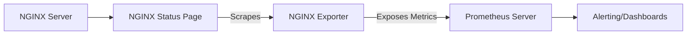

# NGINX Exporter

## Introduction

NGINX Exporter is a Prometheus exporter specifically designed to collect and expose metrics from NGINX web servers. As part of the Prometheus ecosystem, it enables you to monitor the performance, health, and operational statistics of your NGINX servers in real-time.

NGINX is one of the most popular web servers and reverse proxy solutions due to its high performance, stability, and resource efficiency. When running NGINX in production environments, monitoring its performance becomes crucial for ensuring system reliability and optimal operation.

In this guide, we'll explore:
- What NGINX Exporter is and why it's important
- How to install and configure NGINX Exporter
- Understanding the metrics provided by NGINX Exporter
- Practical examples of monitoring NGINX with Prometheus
- Best practices for setting up alerts and dashboards

## Prerequisites

Before diving into NGINX Exporter, you should have:
- Basic understanding of Prometheus and its architecture
- NGINX server installed and running
- Basic familiarity with Docker (optional, for containerized setup)
- Prometheus server set up and running

## Understanding NGINX Exporter

### What is NGINX Exporter?

NGINX Exporter is a lightweight application that extracts metrics from NGINX and converts them into Prometheus-compatible format. It acts as a bridge between your NGINX server and Prometheus monitoring system.

### How It Works

NGINX Exporter works by scraping the NGINX status page (typically provided by the `ngx_http_stub_status_module`) and translating that information into metrics that Prometheus can collect.



## Installation and Configuration

### Enabling NGINX Status Module

Before using NGINX Exporter, you need to enable the NGINX status module in your NGINX configuration:

```nginx
server {
    listen 80;
    
    location /nginx_status {
        stub_status on;
        allow 127.0.0.1;  # Only allow access from localhost
        deny all;         # Deny access from anywhere else
    }
}
```

After adding this configuration, reload NGINX:

```bash
sudo nginx -t      # Test the configuration
sudo nginx -s reload  # Reload NGINX
```

### Installing NGINX Exporter

#### Method 1: Using Binary Release

1. Download the latest release from the GitHub repository:

```bash
wget https://github.com/nginxinc/nginx-prometheus-exporter/releases/download/v0.10.0/nginx-prometheus-exporter_0.10.0_linux_amd64.tar.gz
```

2. Extract the downloaded file:

```bash
tar -xzvf nginx-prometheus-exporter_0.10.0_linux_amd64.tar.gz
```

3. Run the exporter:

```bash
./nginx-prometheus-exporter -nginx.scrape-uri=http://localhost/nginx_status
```

#### Method 2: Using Docker

If you prefer using Docker, you can run NGINX Exporter as a container:

```bash
docker run -p 9113:9113 nginx/nginx-prometheus-exporter:0.10.0 -nginx.scrape-uri=http://host.docker.internal/nginx_status
```

Note: The `host.docker.internal` is used to access the host machine from inside the Docker container. You might need to adjust this URL based on your network setup.

### Configuring Prometheus to Scrape NGINX Exporter

Add the following configuration to your Prometheus configuration file (`prometheus.yml`):

```yaml
scrape_configs:
  - job_name: 'nginx'
    static_configs:
      - targets: ['localhost:9113']
```

After updating the configuration, restart Prometheus to apply the changes.

## Understanding NGINX Exporter Metrics

NGINX Exporter provides several important metrics about your NGINX server. Here are the key metrics and what they represent:

| Metric | Description |
|--------|-------------|
| `nginx_connections_active` | Current number of active client connections |
| `nginx_connections_accepted` | Total number of accepted client connections |
| `nginx_connections_handled` | Total number of handled connections |
| `nginx_connections_reading` | Current number of connections where NGINX is reading the request header |
| `nginx_connections_writing` | Current number of connections where NGINX is writing the response back to the client |
| `nginx_connections_waiting` | Current number of idle client connections |
| `nginx_http_requests_total` | Total number of HTTP requests made |
| `nginx_up` | Shows whether the NGINX scrape was successful (1: success, 0: failure) |

## Practical Examples

### Example 1: Monitoring Basic NGINX Health

Let's create a simple dashboard to monitor the basic health of your NGINX server:

1. Create a PromQL query to check if NGINX is running:
```
nginx_up
```

2. Monitor active connections:
```
nginx_connections_active
```

3. Track request rate (requests per second):
```
rate(nginx_http_requests_total[1m])
```

### Example 2: Detecting Connection Issues

You can detect potential connection issues by monitoring:

1. Connection handling efficiency:
```
sum(nginx_connections_accepted - nginx_connections_handled)
```
A non-zero value indicates that NGINX couldn't handle some connections.

2. Connection saturation:
```
nginx_connections_active / nginx_connections_waiting
```
Higher values indicate more active connections relative to idle ones.

### Example 3: Setting Up Alerts

Here are some useful alerting rules for NGINX:

```yaml
groups:
- name: nginx.rules
  rules:
  - alert: NginxDown
    expr: nginx_up == 0
    for: 1m
    labels:
      severity: critical
    annotations:
      summary: "NGINX instance down"
      description: "NGINX instance has been down for more than 1 minute."
      
  - alert: NginxHighConnections
    expr: nginx_connections_active > 5000
    for: 5m
    labels:
      severity: warning
    annotations:
      summary: "High number of connections"
      description: "NGINX has a high number of connections (value: {{ $value }})."
```

## Best Practices

1. **Regular Monitoring**: Check your NGINX metrics regularly to establish a baseline of normal operation.

2. **Set Up Alerts**: Configure alerts for abnormal conditions like high connection counts or NGINX service unavailability.

3. **Secure the Status Page**: Always restrict access to the NGINX status page to prevent unauthorized access.

4. **Use Labels**: Utilize Prometheus labels to distinguish between different NGINX instances if you're monitoring multiple servers.

5. **Correlate with Other Metrics**: Combine NGINX metrics with system metrics (CPU, memory, network) for more comprehensive monitoring.

## Troubleshooting

### Common Issues and Solutions

1. **Exporter can't access NGINX status page**
   - Check if the status page is enabled and accessible
   - Verify firewall settings
   - Ensure correct permissions

2. **No metrics showing in Prometheus**
   - Confirm that Prometheus is correctly configured to scrape the exporter
   - Check if the exporter is running and listening on the expected port
   - Verify network connectivity between Prometheus and the exporter

3. **Inaccurate or missing metrics**
   - Make sure you're using a compatible version of NGINX Exporter
   - Check if your NGINX server has the `stub_status` module enabled
   - Verify that you have correct scraping interval configured

## Advanced Configuration

### Using NGINX Plus Metrics

If you're using NGINX Plus, you get access to a more comprehensive set of metrics. The NGINX Exporter can scrape these extended metrics as well:

```bash
./nginx-prometheus-exporter -nginx.plus -nginx.scrape-uri=http://localhost/api
```

NGINX Plus provides additional metrics such as:
- SSL handshake metrics
- Zone-specific statistics
- Cache performance metrics
- Upstream server health checks

### Custom Labels

You can add custom labels to your metrics to better organize and filter them:

```bash
./nginx-prometheus-exporter -nginx.scrape-uri=http://localhost/nginx_status -web.telemetry-path=/metrics -web.listen-address=:9113 -nginx.const-labels="instance=web-server-1,environment=production"
```

## Summary

NGINX Exporter is a powerful tool that bridges the gap between NGINX web servers and Prometheus monitoring. By exposing crucial metrics about your NGINX instances, it enables you to:

- Monitor the health and performance of your web servers
- Track request rates and connection statistics
- Set up alerts for potential issues
- Visualize NGINX performance trends over time

With proper configuration of NGINX Exporter, you can gain valuable insights into the operation of your web servers and ensure they continue to perform optimally under varying loads.

## Additional Resources

- [Official NGINX Prometheus Exporter GitHub Repository](https://github.com/nginxinc/nginx-prometheus-exporter)
- [Prometheus Documentation](https://prometheus.io/docs/)
- [NGINX Documentation](https://nginx.org/en/docs/)

## Exercises

1. Set up NGINX Exporter on your local system and connect it to Prometheus.
2. Create a Grafana dashboard to visualize key NGINX metrics.
3. Configure alerts for when connections exceed a certain threshold.
4. Compare the performance of your NGINX server under different loads using the exporter metrics.
5. Extend your monitoring setup to include multiple NGINX instances with proper labeling.