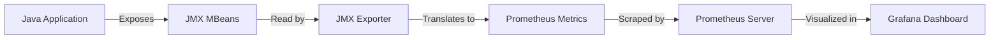

# JMX Exporter

## Introduction

Java Management Extensions (JMX) is a Java technology that provides tools for managing and monitoring Java applications. For organizations running Java-based applications, accessing these metrics in Prometheus format is essential for consistent monitoring across your infrastructure.

The **Prometheus JMX Exporter** bridges this gap by exposing JMX metrics from Java applications in a format that Prometheus can scrape. This makes it possible to monitor Java Virtual Machines (JVMs) alongside your other infrastructure components using a unified monitoring solution.

## What is JMX?

Before diving into the exporter itself, let's briefly understand what JMX is:

JMX (Java Management Extensions) provides a standard way to monitor and manage Java applications. It exposes metrics and management operations as **MBeans** (Managed Beans). These MBeans contain data about:

- JVM performance (memory usage, garbage collection, thread counts)
- Application-specific metrics (connection pools, request counts, response times)
- Operating system metrics (CPU usage, disk space)

However, JMX uses its own protocol and format which isn't directly compatible with Prometheus' pull-based monitoring approach.

## JMX Exporter Overview

The Prometheus JMX Exporter works by:

1. Connecting to the JMX MBean server in a Java application
2. Reading available metrics from MBeans
3. Translating these metrics into Prometheus format
4. Exposing them via an HTTP endpoint that Prometheus can scrape



## Deployment Options

The JMX Exporter can be deployed in two ways:

### 1. Java Agent (Recommended for Most Applications)

This approach runs the exporter as a Java agent directly within your target JVM. It's simpler to set up and maintains a smaller footprint.

### 2. Separate Process (Useful for Specific Cases)

This method runs the exporter as a separate process that connects to a remote JMX endpoint. This can be useful when you cannot modify the startup parameters of the target application.

## Getting Started with JMX Exporter

Let's start with the Java Agent approach, which is more commonly used.

### Step 1: Download the JMX Exporter JAR

First, download the latest JMX Exporter JAR file from the [official GitHub repository releases page](https://github.com/prometheus/jmx_exporter/releases).

### Step 2: Create a Configuration File

JMX Exporter needs a YAML configuration file to define which JMX metrics to collect and how to transform them. Create a file named `config.yaml` with basic settings:

```yaml
---
startDelaySeconds: 0
ssl: false
lowercaseOutputName: true
lowercaseOutputLabelNames: true

rules:
  - pattern: ".*"
```

This minimal configuration will export all available JMX metrics. In production, you'll want to create more specific rules.

### Step 3: Start Your Java Application with the JMX Exporter Agent

When starting your Java application, add the JMX Exporter as a Java agent:

```bash
java -javaagent:/path/to/jmx_prometheus_javaagent-0.17.0.jar=8080:config.yaml -jar your-application.jar
```

This command does the following:
- Loads the JMX Exporter as a Java agent
- Configures it to expose metrics on port `8080`
- Points to your configuration file `config.yaml`
- Runs your application JAR

### Step 4: Verify the Exporter is Working

Access `http://localhost:8080/metrics` in your browser or using curl. You should see Prometheus-formatted metrics:

```
# HELP jvm_memory_bytes_used Used bytes of a given JVM memory area.
# TYPE jvm_memory_bytes_used gauge
jvm_memory_bytes_used{area="heap"} 52428800
jvm_memory_bytes_used{area="nonheap"} 25165824

# HELP jvm_threads_current Current thread count of a JVM
# TYPE jvm_threads_current gauge
jvm_threads_current 23

# more metrics...
```

### Step 5: Configure Prometheus to Scrape the JMX Exporter

Add the following job to your `prometheus.yml` file:

```yaml
scrape_configs:
  - job_name: 'java_app'
    static_configs:
      - targets: ['localhost:8080']
```

## Advanced Configuration

The real power of JMX Exporter comes from its flexible configuration options. Let's explore some more advanced configurations:

### Filtering Metrics

To filter which metrics get exported, use the `pattern` field:

```yaml
rules:
  - pattern: "java.lang<type=Memory><>HeapMemoryUsage"
    name: "jvm_memory_heap_bytes"
    type: GAUGE
    attrNameSnakeCase: true
```

### Renaming Metrics

You can rename metrics to follow Prometheus conventions:

```yaml
rules:
  - pattern: "java.lang<type=OperatingSystem><>ProcessCpuLoad"
    name: "process_cpu_usage"
    type: GAUGE
```

### Adding Labels

Add custom labels to metrics:

```yaml
rules:
  - pattern: "kafka.server<type=(.+), name=(.+), clientId=(.+)><>Value"
    name: "kafka_server_$1_$2"
    type: GAUGE
    labels:
      client_id: "$3"
```

## Real-World Examples

### Example 1: Monitoring a Spring Boot Application

Spring Boot applications expose many useful metrics via JMX by default. Here's how to monitor them:

1. Download the JMX Exporter JAR
2. Create a configuration file `spring-boot-config.yaml`:

```yaml
---
startDelaySeconds: 0
ssl: false
lowercaseOutputName: true
lowercaseOutputLabelNames: true

rules:
  # Capture key Spring metrics
  - pattern: "org.springframework.boot<type=Endpoint, name=metricsEndpoint><>.*"
    name: "spring_$1_$2"
    
  # JVM Memory
  - pattern: "java.lang<type=Memory><HeapMemoryUsage>.*"
    name: "jvm_memory_heap_$3"
    attrNameSnakeCase: true
    type: GAUGE
    
  # Tomcat threads
  - pattern: "Tomcat<type=ThreadPool, name=\"http-nio.*\"><>currentThreadCount"
    name: "tomcat_threadpool_current_threads"
    type: GAUGE
```

3. Start your Spring Boot application with the agent:

```bash
java -javaagent:/path/to/jmx_prometheus_javaagent-0.17.0.jar=8080:spring-boot-config.yaml -jar your-spring-boot-app.jar
```

### Example 2: Monitoring a Kafka Broker

Kafka exposes comprehensive metrics via JMX. Here's a configuration example:

```yaml
---
startDelaySeconds: 0
ssl: false
lowercaseOutputName: true
lowercaseOutputLabelNames: true

rules:
  # Broker metrics
  - pattern: kafka.server<type=BrokerTopicMetrics, name=MessagesInPerSec><>OneMinuteRate
    name: kafka_broker_messages_in_rate
    type: GAUGE
    
  # Topic metrics with topic as a label
  - pattern: kafka.server<type=BrokerTopicMetrics, name=(.+), topic=(.+)><>Count
    name: kafka_server_$1_total
    type: COUNTER
    labels:
      topic: "$2"
      
  # Consumer group lag
  - pattern: kafka.server<type=FetcherLagMetrics, name=ConsumerLag, clientId=(.+), topic=(.+), partition=(.+)><>Value
    name: kafka_server_consumer_lag
    type: GAUGE
    labels:
      client_id: "$1"
      topic: "$2"
      partition: "$3"
```

## Troubleshooting JMX Exporter

Here are some common issues and their solutions:

### No Metrics Being Exported

1. Check if JMX is enabled in your Java application
2. Verify the port is not already in use
3. Ensure your configuration file is valid YAML

### Too Many or Unwanted Metrics

Refine your configuration file to filter out unwanted metrics:

```yaml
whitelistObjectNames: ["java.lang:*", "org.apache.cassandra.metrics:*"]
blacklistObjectNames: ["java.lang:type=Memory,*"]
```

### High CPU Usage

If the JMX Exporter is causing high CPU usage, try increasing the scrape interval in Prometheus or filtering out high-cardinality metrics.

## Best Practices

1. **Start with a minimal configuration** and gradually add the metrics you need
2. **Use appropriate metric types** (gauge, counter, summary, histogram)
3. **Follow Prometheus naming conventions** for consistent metrics
4. **Add descriptive help texts** to make metrics more understandable
5. **Monitor the JMX Exporter itself** to ensure it's functioning properly
6. **Create a Grafana dashboard** for visualizing your JVM metrics

## Summary

The JMX Exporter is a powerful tool that bridges the world of Java applications and Prometheus monitoring. By exposing JMX metrics in Prometheus format, it allows you to:

- Monitor Java applications alongside other infrastructure components
- Leverage Prometheus' powerful querying capabilities
- Create comprehensive dashboards that include JVM performance metrics
- Set up alerts based on Java application metrics

With the knowledge from this guide, you should be able to configure the JMX Exporter for your Java applications and start collecting meaningful metrics to improve your monitoring capabilities.

## Additional Resources

- [Official JMX Exporter Documentation](https://github.com/prometheus/jmx_exporter)
- [JMX Exporter Configuration Examples](https://github.com/prometheus/jmx_exporter/tree/master/example_configs)
- [Java Monitoring and Management Guide](https://docs.oracle.com/en/java/javase/11/management/monitoring-and-management-using-jmx-technology.html)

## Exercises

1. Set up the JMX Exporter with a simple Java application and verify you can see basic JVM metrics.
2. Create a custom configuration to monitor specific aspects of a Spring Boot application.
3. Set up a Grafana dashboard to visualize key JVM metrics from your application.
4. Configure alerts in Prometheus for critical JVM conditions like high memory usage or garbage collection problems.
5. Extend the configuration to capture application-specific metrics from your custom MBeans.