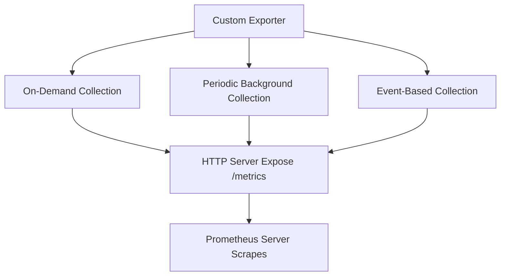

# Custom Exporter Development

## Introduction

In the Prometheus ecosystem, exporters serve as bridges that translate metrics from various systems into a format Prometheus can understand. While there are numerous official and community exporters available, you might encounter situations where you need to monitor a system or application that doesn't have a ready-made exporter. This is where custom exporter development comes into play.

In this guide, you'll learn how to develop your own Prometheus exporters from scratch. We'll cover the fundamental concepts, walk through the development process step by step, and explore real-world applications to help you understand when and how to implement custom exporters effectively.

## Prerequisites

Before diving into custom exporter development, you should have:

- Basic understanding of Prometheus and its architecture
- Familiarity with the Prometheus metrics format
- Working knowledge of Go programming (most exporters are written in Go)
- Understanding of HTTP servers and RESTful APIs

## Understanding Exporter Basics

At its core, a Prometheus exporter is an HTTP server that exposes metrics in the Prometheus text-based format. When Prometheus scrapes the exporter, it receives these metrics and stores them in its time-series database.

### Key Components of an Exporter

1. **HTTP Server**: Listens for requests from Prometheus
2. **Metrics Collection Logic**: Gathers data from the target system
3. **Metrics Exposition**: Formats and presents the metrics for Prometheus to scrape

## Designing Your Custom Exporter

Before writing any code, it's crucial to plan your exporter:

1. **Identify Metrics**: Determine what metrics are important to monitor for your system
2. **Define Metric Types**: Choose appropriate Prometheus metric types (counter, gauge, histogram, summary)
3. **Establish Labels**: Decide what labels will provide useful dimensions for your metrics
4. **Plan Collection Method**: Determine how to gather the data (API calls, file reading, etc.)

## Building a Simple Custom Exporter

Let's develop a basic custom exporter that monitors file system information. We'll use the Prometheus client library for Go.

### Step 1: Set Up Your Go Environment

First, create a new Go module:

```bash
mkdir file-exporter
cd file-exporter
go mod init github.com/yourusername/file-exporter
go get github.com/prometheus/client_golang/prometheus
go get github.com/prometheus/client_golang/prometheus/promhttp
```

### Step 2: Define Your Metrics

Next, let's define the metrics we want to expose:

```go
package main

import (
    "log"
    "net/http"
    
    "github.com/prometheus/client_golang/prometheus"
    "github.com/prometheus/client_golang/prometheus/promhttp"
)

// Define metric types with their help texts
var (
    fileCount = prometheus.NewGaugeVec(
        prometheus.GaugeOpts{
            Name: "directory_file_count",
            Help: "Number of files in a directory",
        },
        []string{"directory"},
    )
    
    directorySizeBytes = prometheus.NewGaugeVec(
        prometheus.GaugeOpts{
            Name: "directory_size_bytes",
            Help: "Size of a directory in bytes",
        },
        []string{"directory"},
    )
)

func init() {
    // Register metrics with Prometheus
    prometheus.MustRegister(fileCount)
    prometheus.MustRegister(directorySizeBytes)
}
```

### Step 3: Implement the Collection Logic

Now, let's implement the logic to collect the actual metrics:

```go
package main

import (
    "io/fs"
    "log"
    "net/http"
    "os"
    "path/filepath"
    "time"
    
    "github.com/prometheus/client_golang/prometheus"
    "github.com/prometheus/client_golang/prometheus/promhttp"
)

// ... (previous code)

func collectMetrics() {
    // Define directories to monitor
    directories := []string{"/tmp", "/var/log"}
    
    for {
        for _, dir := range directories {
            // Count files
            count := 0
            var size int64 = 0
            
            err := filepath.Walk(dir, func(path string, info fs.FileInfo, err error) error {
                if err != nil {
                    return err
                }
                if !info.IsDir() {
                    count++
                    size += info.Size()
                }
                return nil
            })
            
            if err != nil {
                log.Printf("Error walking directory %s: %v
", dir, err)
                continue
            }
            
            // Update metrics
            fileCount.WithLabelValues(dir).Set(float64(count))
            directorySizeBytes.WithLabelValues(dir).Set(float64(size))
        }
        
        // Sleep before next collection
        time.Sleep(30 * time.Second)
    }
}
```

### Step 4: Create the HTTP Server

Next, we'll set up the HTTP server to expose the metrics:

```go
func main() {
    // Start metrics collection in a goroutine
    go collectMetrics()
    
    // Expose metrics endpoint
    http.Handle("/metrics", promhttp.Handler())
    
    // Start the HTTP server
    log.Println("Starting exporter on :9100")
    log.Fatal(http.ListenAndServe(":9100", nil))
}
```

### Step 5: Complete Exporter Code

Here's the complete exporter code:

```go
package main

import (
    "io/fs"
    "log"
    "net/http"
    "os"
    "path/filepath"
    "time"
    
    "github.com/prometheus/client_golang/prometheus"
    "github.com/prometheus/client_golang/prometheus/promhttp"
)

// Define metric types with their help texts
var (
    fileCount = prometheus.NewGaugeVec(
        prometheus.GaugeOpts{
            Name: "directory_file_count",
            Help: "Number of files in a directory",
        },
        []string{"directory"},
    )
    
    directorySizeBytes = prometheus.NewGaugeVec(
        prometheus.GaugeOpts{
            Name: "directory_size_bytes",
            Help: "Size of a directory in bytes",
        },
        []string{"directory"},
    )
)

func init() {
    // Register metrics with Prometheus
    prometheus.MustRegister(fileCount)
    prometheus.MustRegister(directorySizeBytes)
}

func collectMetrics() {
    // Define directories to monitor
    directories := []string{"/tmp", "/var/log"}
    
    for {
        for _, dir := range directories {
            // Count files
            count := 0
            var size int64 = 0
            
            err := filepath.Walk(dir, func(path string, info fs.FileInfo, err error) error {
                if err != nil {
                    return err
                }
                if !info.IsDir() {
                    count++
                    size += info.Size()
                }
                return nil
            })
            
            if err != nil {
                log.Printf("Error walking directory %s: %v
", dir, err)
                continue
            }
            
            // Update metrics
            fileCount.WithLabelValues(dir).Set(float64(count))
            directorySizeBytes.WithLabelValues(dir).Set(float64(size))
        }
        
        // Sleep before next collection
        time.Sleep(30 * time.Second)
    }
}

func main() {
    // Start metrics collection in a goroutine
    go collectMetrics()
    
    // Expose metrics endpoint
    http.Handle("/metrics", promhttp.Handler())
    
    // Start the HTTP server
    log.Println("Starting exporter on :9100")
    log.Fatal(http.ListenAndServe(":9100", nil))
}
```

### Step 6: Build and Run

Build and run your exporter:

```bash
go build
./file-exporter
```

## Prometheus Configuration

To scrape your custom exporter, add this configuration to your `prometheus.yml`:

```yaml
scrape_configs:
  - job_name: 'file-exporter'
    static_configs:
      - targets: ['localhost:9100']
```

## Exporter Output Example

When Prometheus scrapes your exporter, it will receive metrics in this format:

```
# HELP directory_file_count Number of files in a directory
# TYPE directory_file_count gauge
directory_file_count{directory="/tmp"} 42
directory_file_count{directory="/var/log"} 156

# HELP directory_size_bytes Size of a directory in bytes
# TYPE directory_size_bytes gauge
directory_size_bytes{directory="/tmp"} 1048576
directory_size_bytes{directory="/var/log"} 52428800
```

## Best Practices for Custom Exporters

### 1. Performance Considerations

- **Caching**: Cache expensive operations to avoid overloading the target system
- **Asynchronous Collection**: Use goroutines for parallel metric collection
- **Timeouts**: Implement timeouts for external API calls

Example of implementing caching:

```go
type MetricsCache struct {
    values      map[string]float64
    lastUpdated time.Time
    mutex       sync.Mutex
}

func (c *MetricsCache) Get(key string) float64 {
    c.mutex.Lock()
    defer c.mutex.Unlock()
    return c.values[key]
}

func (c *MetricsCache) Update(key string, value float64) {
    c.mutex.Lock()
    defer c.mutex.Unlock()
    c.values[key] = value
    c.lastUpdated = time.Now()
}
```

### 2. Error Handling

Always implement robust error handling to ensure your exporter doesn't crash:

```go
func collectMetrics() {
    for {
        err := collectMetricsOnce()
        if err != nil {
            log.Printf("Error collecting metrics: %v", err)
            // Don't return, continue the loop
        }
        time.Sleep(30 * time.Second)
    }
}

func collectMetricsOnce() error {
    // Wrap all metric collection in a function that returns errors
    // ...
}
```

### 3. Logging

Implement informative logging to aid in debugging:

```go
func main() {
    // Configure logging
    log.SetFlags(log.Ldate | log.Ltime | log.Lshortfile)
    
    // Start the exporter
    log.Println("Starting file exporter")
    // ...
}
```

### 4. Configuration Options

Make your exporter configurable via flags or configuration files:

```go
package main

import (
    "flag"
    "log"
    // ...
)

func main() {
    // Define command-line flags
    listenAddr := flag.String("web.listen-address", ":9100", "Address to listen on for telemetry")
    metricsPath := flag.String("web.telemetry-path", "/metrics", "Path under which to expose metrics")
    
    // Parse flags
    flag.Parse()
    
    // Use flags in your code
    http.Handle(*metricsPath, promhttp.Handler())
    log.Printf("Starting exporter on %s", *listenAddr)
    log.Fatal(http.ListenAndServe(*listenAddr, nil))
}
```

## Real-World Custom Exporter Examples

### Example 1: API Response Time Exporter

Let's create an exporter to monitor API response times:

```go
package main

import (
    "log"
    "net/http"
    "time"
    
    "github.com/prometheus/client_golang/prometheus"
    "github.com/prometheus/client_golang/prometheus/promhttp"
)

var (
    apiResponseTime = prometheus.NewGaugeVec(
        prometheus.GaugeOpts{
            Name: "api_response_time_seconds",
            Help: "Response time of API endpoints in seconds",
        },
        []string{"endpoint", "method"},
    )
    
    apiRequestsTotal = prometheus.NewCounterVec(
        prometheus.CounterOpts{
            Name: "api_requests_total",
            Help: "Total number of API requests",
        },
        []string{"endpoint", "method", "status"},
    )
)

func init() {
    prometheus.MustRegister(apiResponseTime)
    prometheus.MustRegister(apiRequestsTotal)
}

func measureAPIResponseTime() {
    endpoints := map[string]string{
        "users":    "https://api.example.com/users",
        "products": "https://api.example.com/products",
    }
    
    for {
        for name, url := range endpoints {
            startTime := time.Now()
            
            resp, err := http.Get(url)
            duration := time.Since(startTime).Seconds()
            
            if err != nil {
                log.Printf("Error measuring API %s: %v", name, err)
                apiRequestsTotal.WithLabelValues(name, "GET", "error").Inc()
                continue
            }
            
            apiResponseTime.WithLabelValues(name, "GET").Set(duration)
            apiRequestsTotal.WithLabelValues(name, "GET", resp.Status).Inc()
            
            resp.Body.Close()
        }
        
        time.Sleep(60 * time.Second)
    }
}

func main() {
    go measureAPIResponseTime()
    
    http.Handle("/metrics", promhttp.Handler())
    log.Fatal(http.ListenAndServe(":9100", nil))
}
```

### Example 2: Database Connection Pool Exporter

Here's a simple exporter for monitoring a database connection pool:

```go
package main

import (
    "database/sql"
    "log"
    "net/http"
    "time"
    
    _ "github.com/go-sql-driver/mysql"
    "github.com/prometheus/client_golang/prometheus"
    "github.com/prometheus/client_golang/prometheus/promhttp"
)

var (
    dbConnections = prometheus.NewGauge(
        prometheus.GaugeOpts{
            Name: "database_connections_open",
            Help: "Number of open database connections",
        },
    )
    
    dbMaxOpenConnections = prometheus.NewGauge(
        prometheus.GaugeOpts{
            Name: "database_connections_max_open",
            Help: "Maximum number of open database connections",
        },
    )
    
    dbQueryDuration = prometheus.NewHistogram(
        prometheus.HistogramOpts{
            Name:    "database_query_duration_seconds",
            Help:    "Duration of database queries in seconds",
            Buckets: prometheus.DefBuckets,
        },
    )
)

func init() {
    prometheus.MustRegister(dbConnections)
    prometheus.MustRegister(dbMaxOpenConnections)
    prometheus.MustRegister(dbQueryDuration)
}

func monitorDatabase(db *sql.DB) {
    for {
        // Update connection stats
        dbConnections.Set(float64(db.Stats().OpenConnections))
        dbMaxOpenConnections.Set(float64(db.Stats().MaxOpenConnections))
        
        // Measure query performance
        start := time.Now()
        _, err := db.Exec("SELECT 1")
        if err != nil {
            log.Printf("Error executing query: %v", err)
        } else {
            duration := time.Since(start).Seconds()
            dbQueryDuration.Observe(duration)
        }
        
        time.Sleep(15 * time.Second)
    }
}

func main() {
    // Connect to database
    db, err := sql.Open("mysql", "user:password@tcp(localhost:3306)/dbname")
    if err != nil {
        log.Fatalf("Failed to connect to database: %v", err)
    }
    defer db.Close()
    
    // Set connection pool settings
    db.SetMaxOpenConns(25)
    db.SetMaxIdleConns(5)
    
    // Start monitoring in a goroutine
    go monitorDatabase(db)
    
    // Expose metrics endpoint
    http.Handle("/metrics", promhttp.Handler())
    log.Fatal(http.ListenAndServe(":9100", nil))
}
```

## Advanced Topics

### Implementing Multiple Collection Methods

For complex exporters, you might need different collection strategies:



### Implementing Custom Metrics Types

While the Prometheus client library provides standard metric types, you might need to implement custom behavior:

```go
type RollingAverageGauge struct {
    values      []float64
    maxValues   int
    currentIdx  int
    sum         float64
    prometheus.Gauge
    mutex       sync.Mutex
}

func (g *RollingAverageGauge) Add(value float64) {
    g.mutex.Lock()
    defer g.mutex.Unlock()
    
    // If array is full, remove oldest value from sum
    if len(g.values) == g.maxValues {
        g.sum -= g.values[g.currentIdx]
    } else {
        g.values = append(g.values, 0)
    }
    
    // Add new value
    g.values[g.currentIdx] = value
    g.sum += value
    
    // Update index
    g.currentIdx = (g.currentIdx + 1) % g.maxValues
    
    // Update the gauge with the average
    avg := g.sum / float64(len(g.values))
    g.Gauge.Set(avg)
}
```

## Building a Production-Ready Exporter

When preparing an exporter for production use, consider these additional aspects:

1. **Containerization**: Package your exporter as a Docker container
2. **Health Checks**: Implement a `/health` endpoint
3. **Version Information**: Expose build and version info as metrics
4. **Graceful Shutdown**: Handle SIGTERM and clean up resources
5. **Documentation**: Create clear usage documentation

Here's how to implement version information:

```go
var (
    buildInfo = prometheus.NewGaugeVec(
        prometheus.GaugeOpts{
            Name: "exporter_build_info",
            Help: "A metric with a constant '1' value labeled with version information",
        },
        []string{"version", "build_date", "commit"},
    )
)

func init() {
    prometheus.MustRegister(buildInfo)
    
    // Set the build information
    buildInfo.WithLabelValues("1.0.0", "2023-03-15", "abc123").Set(1)
}
```

## Security Considerations

Security is crucial for production exporters:

1. **Authentication**: Implement basic auth for the metrics endpoint
2. **TLS**: Enable HTTPS for secure communication
3. **Least Privilege**: Run with minimal permissions
4. **Sensitive Data**: Never expose passwords or keys in metrics

Example of implementing basic authentication:

```go
func basicAuth(handler http.Handler, username, password string) http.Handler {
    return http.HandlerFunc(func(w http.ResponseWriter, r *http.Request) {
        user, pass, ok := r.BasicAuth()
        
        if !ok || user != username || pass != password {
            w.Header().Set("WWW-Authenticate", `Basic realm="Restricted"`)
            http.Error(w, "Unauthorized", http.StatusUnauthorized)
            return
        }
        
        handler.ServeHTTP(w, r)
    })
}

func main() {
    // ...
    
    // Wrap the metrics handler with basic auth
    metricsHandler := promhttp.Handler()
    http.Handle("/metrics", basicAuth(metricsHandler, "prometheus", "secret"))
    
    // ...
}
```

## Summary

Developing custom Prometheus exporters gives you the flexibility to monitor virtually any system or application. By following these steps and best practices, you can create exporters that are reliable, performant, and secure.

Remember these key points:

1. **Define Clear Metrics**: Choose appropriate metric types and names
2. **Optimize Performance**: Implement caching and efficient collection
3. **Handle Errors Gracefully**: Ensure your exporter is resilient
4. **Follow Security Best Practices**: Protect your metrics endpoint
5. **Documentation and Testing**: Document your exporter and test it thoroughly

## Additional Resources

- [Prometheus Client Libraries](https://prometheus.io/docs/instrumenting/clientlibs/)
- [Prometheus Exposition Format](https://prometheus.io/docs/instrumenting/exposition_formats/)
- [Writing Exporters Best Practices](https://prometheus.io/docs/instrumenting/writing_exporters/)
- [GitHub: Example Exporters](https://github.com/prometheus/client_golang/tree/master/examples)

## Exercises

1. **Basic Exporter**: Create a simple exporter that monitors CPU and memory usage on your local machine.
2. **Web Service Exporter**: Develop an exporter that monitors a web service's availability and response time.
3. **Enhancement**: Add a configuration file to an existing exporter to make it more flexible.
4. **Security**: Implement TLS and authentication for your exporter's metrics endpoint.
5. **Dashboard**: Create a Grafana dashboard to visualize the metrics from your custom exporter.