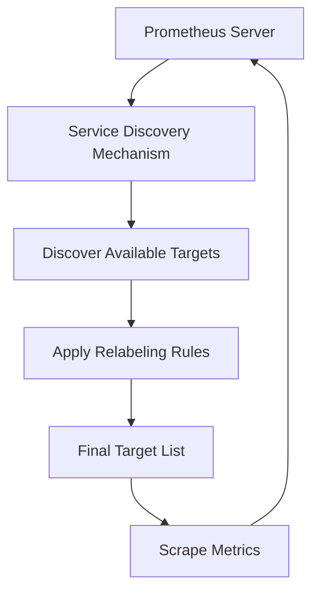

# Service Discovery Concepts

## Introduction

In modern distributed systems, applications are often deployed across multiple instances, containers, or servers that can dynamically change over time. This dynamic nature creates a significant challenge for monitoring systems: how does your monitoring tool know what targets to scrape metrics from when servers are constantly being created and destroyed?

This is where **service discovery** comes into play. Service discovery is a mechanism that automatically detects and keeps track of available services and their instances in your infrastructure. In Prometheus, this is a critical feature that allows it to maintain an up-to-date list of targets without manual configuration.

## What is Service Discovery?

Service discovery is the process of automatically identifying services and their associated endpoints within a network. In the context of Prometheus, it's how the monitoring system finds the targets it needs to scrape metrics from.

Without service discovery, you would need to manually maintain a list of all targets in your Prometheus configuration file, which quickly becomes unmanageable in dynamic environments like Kubernetes, cloud platforms, or any infrastructure using auto-scaling.

## Core Concepts of Service Discovery

### 1. Targets

A **target** in Prometheus represents an endpoint that exposes metrics. Typically, these are HTTP endpoints that expose metrics in the Prometheus format when scraped.

### 2. Service Discovery Mechanisms

Prometheus supports various service discovery mechanisms, each designed to work with different platforms:

- **File-based service discovery**: Uses static files or files that are dynamically generated
- **DNS-based service discovery**: Uses DNS SRV records
- **Cloud platform service discovery**: Native integration with AWS, GCP, Azure, etc.
- **Container orchestration service discovery**: Kubernetes, Docker, etc.
- **Service registry integration**: Consul, Zookeeper, etc.

### 3. Relabeling

**Relabeling** is a powerful Prometheus feature that allows you to manipulate target labels before scraping. This is often used to:

- Filter out targets you don't want to scrape
- Modify labels to add context
- Extract information from existing labels
- Change the target's endpoint or path

### 4. Labels

**Labels** are key-value pairs attached to time series data in Prometheus. When Prometheus discovers services, it attaches metadata as labels, which can be used for querying and filtering metrics later.

## How Service Discovery Works in Prometheus

The general workflow of service discovery in Prometheus follows these steps:

1. Prometheus is configured with one or more service discovery mechanisms
2. These mechanisms periodically discover available targets
3. Discovered targets go through relabeling if configured
4. Prometheus scrapes metrics from the final list of targets
5. This process repeats according to the configured refresh interval



## Service Discovery Methods

Let's explore some common service discovery methods in Prometheus:

### File-based Service Discovery

File-based service discovery is one of the simplest methods. Prometheus reads targets from a JSON or YAML file that can be updated dynamically.

Example configuration:

```yaml
scrape_configs:
  - job_name: 'file_sd_example'
    file_sd_configs:
      - files:
        - 'targets/*.json'
        refresh_interval: 5m
```

Example target file (`targets/servers.json`):

```json
[
  {
    "targets": ["server1:9100", "server2:9100"],
    "labels": {
      "env": "production",
      "job": "node"
    }
  },
  {
    "targets": ["database:9187"],
    "labels": {
      "env": "production",
      "job": "postgresql"
    }
  }
]
```

### DNS-based Service Discovery

DNS service discovery uses DNS SRV records to discover targets.

```yaml
scrape_configs:
  - job_name: 'dns_sd_example'
    dns_sd_configs:
      - names:
        - '_prometheus._tcp.example.com'
        type: 'SRV'
        refresh_interval: 30s
```

### Kubernetes Service Discovery

Prometheus has built-in support for discovering targets in Kubernetes clusters:

```yaml
scrape_configs:
  - job_name: 'kubernetes_pods'
    kubernetes_sd_configs:
      - role: pod
    relabel_configs:
      - source_labels: [__meta_kubernetes_pod_annotation_prometheus_io_scrape]
        action: keep
        regex: true
      - source_labels: [__meta_kubernetes_pod_annotation_prometheus_io_path]
        action: replace
        target_label: __metrics_path__
        regex: (.+)
```

## Relabeling: The Power Tool of Service Discovery

Relabeling is essential for manipulating service discovery data. Here's an example that demonstrates how to use relabeling to filter and modify target information:

```yaml
relabel_configs:
  # Keep only targets with a specific label
  - source_labels: [__meta_ec2_tag_Environment]
    regex: Production
    action: keep
    
  # Extract instance name from a label
  - source_labels: [__meta_ec2_instance_id]
    target_label: instance
    
  # Set a static label
  - target_label: region
    replacement: us-west-1
```

### Common Relabeling Actions

- `keep`: Keep targets that match the regex
- `drop`: Drop targets that match the regex
- `replace`: Replace the value of a label
- `labelmap`: Copy labels matching regex to new labels
- `labeldrop`: Remove labels matching regex
- `labelkeep`: Keep only labels matching regex

## Practical Examples

### Example 1: Multi-Environment Monitoring

Let's say you have applications running in both development and production environments, and you want to monitor them with the same Prometheus instance:

```yaml
scrape_configs:
  - job_name: 'production_services'
    file_sd_configs:
      - files: ['targets/production/*.json']
    relabel_configs:
      - target_label: environment
        replacement: production
  
  - job_name: 'development_services'
    file_sd_configs:
      - files: ['targets/development/*.json']
    relabel_configs:
      - target_label: environment
        replacement: development
```

### Example 2: Auto-discovering Microservices with Custom Paths

When dealing with microservices that expose metrics on different paths:

```yaml
scrape_configs:
  - job_name: 'microservices'
    consul_sd_configs:
      - server: 'localhost:8500'
        services: []  # Discover all services
    relabel_configs:
      # Only scrape services with prometheus.io/scrape=true
      - source_labels: [__meta_consul_tags]
        regex: .*,prometheus\.io/scrape=true,.*
        action: keep
        
      # Get metrics path from service metadata
      - source_labels: [__meta_consul_meta_prometheus_io_path]
        regex: (.+)
        target_label: __metrics_path__
        replacement: $1
        
      # Add service name as a label
      - source_labels: [__meta_consul_service]
        target_label: service
```

## Best Practices for Service Discovery

1. **Use appropriate discovery mechanisms**: Choose service discovery methods that align with your infrastructure (Kubernetes, cloud providers, etc.)

2. **Implement meaningful labels**: Design a consistent labeling scheme to make querying easier

3. **Filter unnecessary targets**: Use relabeling to filter out targets you don't need to monitor

4. **Test your configuration**: Verify that all expected targets are being discovered

5. **Monitor the monitoring**: Set up alerts to detect if targets suddenly disappear from service discovery

6. **Document your approach**: Ensure your team understands how services are discovered and monitored

7. **Use appropriate refresh intervals**: Balance between quick updates and system load

## Common Challenges and Solutions

### Challenge: Too Many Targets

**Solution**: Use relabeling to filter targets by specific criteria or implement hierarchical Prometheus setups.

### Challenge: Inconsistent Labels

**Solution**: Standardize label naming across your infrastructure and use relabeling to normalize labels.

### Challenge: Service Discovery Lag

**Solution**: Adjust refresh intervals based on your environment's rate of change and criticality.

### Challenge: Missing Targets

**Solution**: Implement meta-monitoring to alert when expected targets disappear.

## Summary

Service discovery is a fundamental concept in Prometheus that allows it to automatically find and monitor targets in dynamic environments. By understanding and properly configuring service discovery mechanisms and relabeling rules, you can create a flexible and scalable monitoring system that requires minimal manual maintenance.

The key takeaways from this topic include:

- Service discovery eliminates the need for manual target configuration
- Prometheus supports multiple service discovery mechanisms for different environments
- Relabeling provides powerful capabilities to filter and transform target information
- Properly labeled targets make querying and alerting more effective
- Different environments and infrastructure require different service discovery approaches

## Additional Resources

- [Prometheus Service Discovery Documentation](https://prometheus.io/docs/prometheus/latest/configuration/configuration/#scrape_config)
- [Relabeling in Prometheus](https://prometheus.io/docs/prometheus/latest/configuration/configuration/#relabel_config)
- [Life of a Label](https://www.robustperception.io/life-of-a-label/)
- [Service Discovery in Dynamic Environments](https://prometheus.io/blog/2018/10/18/tsdb-reaching-1.0/)

## Exercises

1. Configure file-based service discovery for a set of local services and experiment with different relabeling configurations.

2. If you have access to a Kubernetes cluster, set up Prometheus to discover and monitor pods with specific annotations.

3. Design a service discovery solution for a hypothetical microservice architecture with services running across multiple environments.

4. Create a relabeling configuration that extracts information from instance names and converts it into useful labels.

5. Implement meta-monitoring to track the number of discovered targets and alert on unexpected changes.