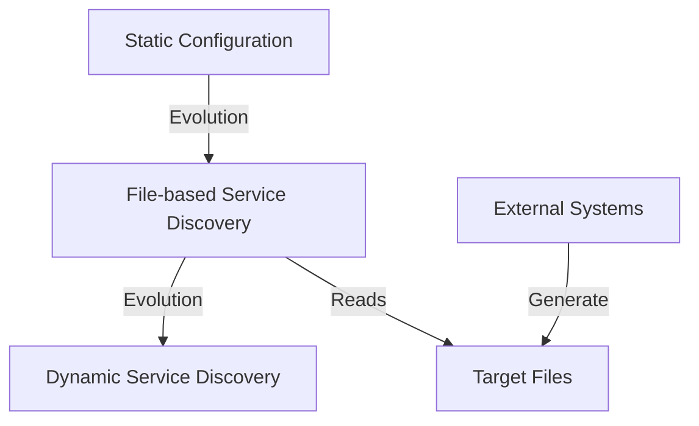

# File-based Service Discovery

## Introduction

Service discovery is a critical component in modern monitoring systems, allowing Prometheus to automatically find and monitor targets in dynamic environments. File-based service discovery is one of the simplest yet powerful methods Prometheus offers to dynamically discover targets.

In this guide, we'll explore how file-based service discovery works, how to configure it, and common use cases. Unlike static configurations that require manual updates, file-based service discovery enables Prometheus to adapt to changing environments by reading target information from files.

## What is File-based Service Discovery?

File-based service discovery allows Prometheus to discover targets by reading files from disk. These files typically contain JSON or YAML that define the targets Prometheus should scrape. When the files change, Prometheus automatically updates its scrape targets without requiring a restart.

This approach bridges the gap between static configurations and fully dynamic service discovery methods:



## How File-based Service Discovery Works

The process follows these steps:

1. You or an external system creates files in a specific format (JSON or YAML)
2. The files contain information about targets to scrape
3. You configure Prometheus to watch these files
4. Prometheus regularly checks these files for changes
5. When files change, Prometheus updates its target list automatically

## Basic Configuration

To use file-based service discovery, you need to configure the `file_sd_configs` section in your Prometheus configuration file:

```yaml
scrape_configs:
  - job_name: 'file-sd-example'
    file_sd_configs:
      - files:
        - 'targets/*.json'
        - 'targets/*.yml'
        refresh_interval: 30s
```

This configuration tells Prometheus to:
- Look for files matching the patterns `targets/*.json` and `targets/*.yml`
- Refresh the target list every 30 seconds

## File Formats

### JSON Format

The JSON format for file-based service discovery consists of an array of target groups:

```json
[
  {
    "targets": ["10.0.0.1:9100", "10.0.0.2:9100"],
    "labels": {
      "env": "production",
      "team": "infra"
    }
  },
  {
    "targets": ["10.0.0.3:9100"],
    "labels": {
      "env": "staging",
      "team": "backend"
    }
  }
]
```

### YAML Format

You can also use YAML, which is often more readable:

```yaml
- targets:
  - 10.0.0.1:9100
  - 10.0.0.2:9100
  labels:
    env: production
    team: infra
- targets:
  - 10.0.0.3:9100
  labels:
    env: staging
    team: backend
```

## Practical Example: Monitoring Dynamic Environments

Let's work through a practical example to see file-based service discovery in action.

### Scenario: Monitoring Containerized Applications

Imagine you're running applications in containers that are frequently starting and stopping. We'll create a simple system that:

1. Detects container starts and stops
2. Updates target files
3. Allows Prometheus to discover and monitor these containers

### Step 1: Create a File Generation Script

First, we'll create a simple script that generates target files:

```python
#!/usr/bin/env python3
import json
import subprocess
import time
import os

def get_running_containers():
    result = subprocess.run(['docker', 'ps', '--format', '{{.Names}},{{.Ports}}'], 
                           capture_output=True, text=True)
    containers = []
    
    for line in result.stdout.strip().split('
'):
        if not line:
            continue
        
        container_name, ports = line.split(',', 1)
        # Extract port mappings
        if '0.0.0.0:' in ports:
            port = ports.split('0.0.0.0:', 1)[1].split('->', 1)[0]
            containers.append((container_name, port))
    
    return containers

def write_targets_file(containers):
    target_groups = []
    
    app_containers = []
    db_containers = []
    
    for name, port in containers:
        target = f"localhost:{port}"
        
        if 'app' in name:
            app_containers.append(target)
        elif 'db' in name:
            db_containers.append(target)
    
    if app_containers:
        target_groups.append({
            "targets": app_containers,
            "labels": {
                "job": "application",
                "team": "development"
            }
        })
    
    if db_containers:
        target_groups.append({
            "targets": db_containers,
            "labels": {
                "job": "database",
                "team": "data"
            }
        })
    
    with open('/etc/prometheus/targets/containers.json', 'w') as f:
        json.dump(target_groups, f, indent=2)
    
    print(f"Updated targets file with {len(containers)} containers")

def main():
    os.makedirs('/etc/prometheus/targets', exist_ok=True)
    
    while True:
        containers = get_running_containers()
        write_targets_file(containers)
        time.sleep(15)  # Update every 15 seconds

if __name__ == "__main__":
    main()
```

This script:
1. Gets a list of running Docker containers with their exposed ports
2. Categorizes containers into "application" and "database" groups based on their names
3. Writes the target information to a JSON file
4. Updates the file every 15 seconds

### Step 2: Configure Prometheus

Next, configure Prometheus to use file-based service discovery:

```yaml
global:
  scrape_interval: 15s

scrape_configs:
  - job_name: 'containers'
    file_sd_configs:
      - files:
        - '/etc/prometheus/targets/*.json'
        refresh_interval: 5s
    relabel_configs:
      - source_labels: [__address__]
        target_label: instance
      - source_labels: [job]
        target_label: role
```

The `relabel_configs` section adds additional labels to make our metrics more useful.

### Step 3: Run Everything

Now when you:
1. Start the file generation script
2. Run Prometheus with this configuration
3. Start or stop containers

Prometheus will automatically update its scrape targets based on the current state of your containerized environment.

## Advanced Features

### Refresh Interval

The `refresh_interval` determines how often Prometheus checks the target files for changes:

```yaml
file_sd_configs:
  - files:
    - 'targets/*.json'
    refresh_interval: 60s  # Check every minute
```

For more dynamic environments, use a shorter interval. For more stable environments, a longer interval reduces disk I/O.

### Combining with Relabeling

File-based service discovery becomes particularly powerful when combined with Prometheus relabeling:

```yaml
scrape_configs:
  - job_name: 'containers'
    file_sd_configs:
      - files:
        - 'targets/*.json'
    relabel_configs:
      - source_labels: [__meta_filepath]
        regex: '.*/(.*?)\.json'
        target_label: datacenter
        replacement: '$1'
```

This example extracts the filename (without extension) and uses it as a datacenter label.

### Using with External Systems

You can integrate file-based service discovery with various external systems:

1. **Configuration Management Tools**: Ansible, Puppet, or Chef can generate target files
2. **Container Orchestrators**: Scripts integrated with Docker, Kubernetes, etc.
3. **Custom Applications**: Internal applications that know which services are running

## Common Patterns and Best Practices

### Organizing Target Files

Organize your target files based on meaningful categories:

```
/etc/prometheus/targets/
  ├── production-apps.json
  ├── production-dbs.json
  ├── staging-apps.json
  └── staging-dbs.json
```

This makes it easier to manage and understand your monitoring setup.

### Security Considerations

Remember these security best practices:

1. **File Permissions**: Restrict write access to target files
2. **Validation**: Validate target files before placing them where Prometheus can read them
3. **Rate Limiting**: Avoid too-frequent updates that could overload Prometheus

### Testing Your Configuration

Test your file-based service discovery with:

```bash
# Validate Prometheus configuration
prometheus --config.file=prometheus.yml --check-config

# Test with a sample target file
echo '[{"targets": ["localhost:9090"]}]' > targets/test.json
```

## Troubleshooting

Common issues and solutions:

### No Targets Discovered

If Prometheus isn't discovering targets:

1. Check file paths and permissions
2. Verify file format (valid JSON/YAML)
3. Look for errors in Prometheus logs
4. Ensure the refresh interval is appropriate

### Unexpected Target Labels

If labels aren't appearing as expected:

1. Check label syntax in target files
2. Verify relabeling configurations
3. Remember that some labels have special meaning in Prometheus

## Summary

File-based service discovery provides a flexible way to dynamically update Prometheus targets without restarts. Key benefits include:

- Simple implementation with minimal dependencies
- Works well in environments with existing configuration management
- Provides a bridge between static configuration and fully dynamic service discovery
- Allows integration with virtually any system that can write files

By using file-based service discovery, you can maintain a responsive monitoring system that automatically adapts to changes in your infrastructure.

## Additional Resources

- [Prometheus Documentation on Service Discovery](https://prometheus.io/docs/prometheus/latest/configuration/configuration/#file_sd_config)
- [Prometheus Relabeling Documentation](https://prometheus.io/docs/prometheus/latest/configuration/configuration/#relabel_config)

## Exercises

1. Create a file-based service discovery configuration that monitors different services based on environment (dev, test, prod).
2. Write a script that generates Prometheus target files based on services registered in Consul or etcd.
3. Implement a file-based discovery system that applies different scrape intervals to different types of services.