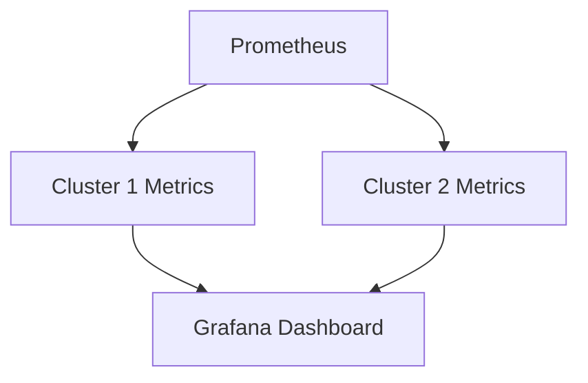

# Multi-cluster Service Discovery

## Introduction

Multi-cluster service discovery is an advanced Prometheus configuration pattern that allows you to monitor targets across multiple Kubernetes clusters from a single Prometheus instance. As organizations grow, they often deploy workloads across multiple clusters for reasons such as:

- Geographical distribution
- Isolation between environments (development, staging, production)
- Tenant isolation in multi-tenant setups
- High availability across regions or cloud providers

In this guide, we'll learn how to configure Prometheus to discover and scrape metrics from targets in multiple Kubernetes clusters, understand the challenges involved, and explore best practices for implementing an effective multi-cluster monitoring solution.

## Prerequisites

Before diving into multi-cluster service discovery, ensure you have:

- A basic understanding of Prometheus and its service discovery mechanisms
- Familiarity with Kubernetes concepts
- Access to multiple Kubernetes clusters
- The `kubectl` command-line tool configured to access your clusters

## Understanding Multi-cluster Service Discovery

### The Problem

By default, Prometheus's Kubernetes service discovery (`kubernetes_sd_config`) is designed to work with a single cluster. It connects to the Kubernetes API server specified in its configuration and discovers targets within that cluster only.

When dealing with multiple clusters, you face several challenges:

1. **Authentication**: Each cluster has its own authentication requirements
2. **Network accessibility**: Prometheus needs network access to all cluster API servers
3. **Target disambiguation**: You need to differentiate targets from different clusters
4. **Resource limitations**: A single Prometheus instance might struggle with too many targets

### Solutions

There are several approaches to solve multi-cluster service discovery:

1. **Multiple Kubernetes SD configs**: Configure multiple `kubernetes_sd_config` sections, each pointing to a different cluster
2. **Federation**: Use a hierarchical Prometheus setup with federation
3. **Push Gateway**: Use Prometheus Pushgateway as an intermediary
4. **Custom integrations**: Use specialized tools like Thanos or Cortex

We'll focus on the first approach in this guide, as it's the most straightforward to implement.

## Implementing Multi-cluster Service Discovery

### Step 1: Prepare Authentication for Each Cluster

First, you need to ensure your Prometheus instance can authenticate with each Kubernetes cluster's API server. Create service accounts with appropriate permissions in each cluster:

```yaml
# service-account.yaml
apiVersion: v1
kind: ServiceAccount
metadata:
  name: prometheus
  namespace: monitoring

---
apiVersion: rbac.authorization.k8s.io/v1
kind: ClusterRole
metadata:
  name: prometheus
rules:
- apiGroups: [""]
  resources:
  - nodes
  - nodes/proxy
  - services
  - endpoints
  - pods
  verbs: ["get", "list", "watch"]
- apiGroups: [""]
  resources:
  - configmaps
  verbs: ["get"]
- nonResourceURLs: ["/metrics"]
  verbs: ["get"]

---
apiVersion: rbac.authorization.k8s.io/v1
kind: ClusterRoleBinding
metadata:
  name: prometheus
roleRef:
  apiGroup: rbac.authorization.k8s.io
  kind: ClusterRole
  name: prometheus
subjects:
- kind: ServiceAccount
  name: prometheus
  namespace: monitoring
```

Apply this configuration to each cluster:

```bash
kubectl apply -f service-account.yaml --context=cluster1
kubectl apply -f service-account.yaml --context=cluster2
```

Then, obtain authentication tokens or kubeconfig files for each cluster. You'll need these to configure Prometheus.

### Step 2: Store Authentication Information as Secrets

Create secrets in the cluster where Prometheus runs:

```yaml
# cluster-secrets.yaml
apiVersion: v1
kind: Secret
metadata:
  name: cluster1-credentials
  namespace: monitoring
type: Opaque
stringData:
  token: "your-cluster1-service-account-token"
  
---
apiVersion: v1
kind: Secret
metadata:
  name: cluster2-credentials
  namespace: monitoring
type: Opaque
stringData:
  token: "your-cluster2-service-account-token"
```

Apply these secrets:

```bash
kubectl apply -f cluster-secrets.yaml
```

### Step 3: Configure Prometheus for Multi-cluster Discovery

Now, configure Prometheus to discover targets in multiple clusters:

```yaml
# prometheus-config.yaml
apiVersion: v1
kind: ConfigMap
metadata:
  name: prometheus-config
  namespace: monitoring
data:
  prometheus.yml: |
    global:
      scrape_interval: 15s
      evaluation_interval: 15s

    scrape_configs:
      # Cluster 1
      - job_name: 'cluster1-nodes'
        kubernetes_sd_configs:
        - role: node
          api_server: 'https://api.cluster1.example.com'
          tls_config:
            insecure_skip_verify: false
            ca_file: /var/run/secrets/kubernetes.io/serviceaccount/ca.crt
          bearer_token_file: /etc/prometheus/secrets/cluster1-credentials/token
        relabel_configs:
        - source_labels: [__meta_kubernetes_node_name]
          target_label: node
        - target_label: cluster
          replacement: 'cluster1'

      - job_name: 'cluster1-pods'
        kubernetes_sd_configs:
        - role: pod
          api_server: 'https://api.cluster1.example.com'
          tls_config:
            insecure_skip_verify: false
            ca_file: /var/run/secrets/kubernetes.io/serviceaccount/ca.crt
          bearer_token_file: /etc/prometheus/secrets/cluster1-credentials/token
        relabel_configs:
        - source_labels: [__meta_kubernetes_pod_annotation_prometheus_io_scrape]
          action: keep
          regex: true
        - source_labels: [__meta_kubernetes_pod_annotation_prometheus_io_path]
          action: replace
          target_label: __metrics_path__
          regex: (.+)
        - source_labels: [__address__, __meta_kubernetes_pod_annotation_prometheus_io_port]
          action: replace
          regex: ([^:]+)(?::\d+)?;(\d+)
          replacement: $1:$2
          target_label: __address__
        - target_label: cluster
          replacement: 'cluster1'

      # Cluster 2
      - job_name: 'cluster2-nodes'
        kubernetes_sd_configs:
        - role: node
          api_server: 'https://api.cluster2.example.com'
          tls_config:
            insecure_skip_verify: false
            ca_file: /var/run/secrets/kubernetes.io/serviceaccount/ca.crt
          bearer_token_file: /etc/prometheus/secrets/cluster2-credentials/token
        relabel_configs:
        - source_labels: [__meta_kubernetes_node_name]
          target_label: node
        - target_label: cluster
          replacement: 'cluster2'

      - job_name: 'cluster2-pods'
        kubernetes_sd_configs:
        - role: pod
          api_server: 'https://api.cluster2.example.com'
          tls_config:
            insecure_skip_verify: false
            ca_file: /var/run/secrets/kubernetes.io/serviceaccount/ca.crt
          bearer_token_file: /etc/prometheus/secrets/cluster2-credentials/token
        relabel_configs:
        - source_labels: [__meta_kubernetes_pod_annotation_prometheus_io_scrape]
          action: keep
          regex: true
        - source_labels: [__meta_kubernetes_pod_annotation_prometheus_io_path]
          action: replace
          target_label: __metrics_path__
          regex: (.+)
        - source_labels: [__address__, __meta_kubernetes_pod_annotation_prometheus_io_port]
          action: replace
          regex: ([^:]+)(?::\d+)?;(\d+)
          replacement: $1:$2
          target_label: __address__
        - target_label: cluster
          replacement: 'cluster2'
```

Notice the key elements in this configuration:

1. Each cluster has its own `kubernetes_sd_configs` section with:
   - Specific `api_server` URL
   - Separate authentication credentials
   - Unique `job_name`

2. We use `relabel_configs` to add a `cluster` label to each target, making it easy to identify which cluster a metric comes from.

### Step 4: Mount Secrets in Prometheus Deployment

Update your Prometheus deployment to mount the secrets:

```yaml
# prometheus-deployment.yaml (partial)
apiVersion: apps/v1
kind: Deployment
metadata:
  name: prometheus
  namespace: monitoring
spec:
  # ... other fields omitted for brevity
  template:
    spec:
      containers:
      - name: prometheus
        image: prom/prometheus:v2.45.0
        # ... other fields omitted for brevity
        volumeMounts:
        - name: config-volume
          mountPath: /etc/prometheus/
        - name: cluster1-credentials
          mountPath: /etc/prometheus/secrets/cluster1-credentials
          readOnly: true
        - name: cluster2-credentials
          mountPath: /etc/prometheus/secrets/cluster2-credentials
          readOnly: true
      volumes:
      - name: config-volume
        configMap:
          name: prometheus-config
      - name: cluster1-credentials
        secret:
          secretName: cluster1-credentials
      - name: cluster2-credentials
        secret:
          secretName: cluster2-credentials
```

## Network Considerations

For the configuration to work, ensure your Prometheus instance can reach:

1. The API servers of all clusters
2. The pods and nodes in all clusters that it needs to scrape

This might require:
- VPN connections between clusters
- Network peering
- Public endpoints with proper security measures

## Visualizing Multi-cluster Metrics

Let's create a simple Grafana dashboard to visualize metrics from multiple clusters:



Here's an example PromQL query that leverages the `cluster` label we added:

```
sum(up) by (cluster)
```

This query shows the count of up targets per cluster, providing a quick way to ensure both clusters are being monitored correctly.

## Best Practices

When implementing multi-cluster service discovery, follow these best practices:

1. **Label everything**: Always add a `cluster` label to distinguish metrics from different sources.

2. **Use consistent naming**: Keep job names and label schemes consistent across clusters.

3. **Consider resource requirements**: Multiple clusters mean more targets, which requires more resources for Prometheus.

4. **Implement security controls**: Ensure proper authentication and encryption for cross-cluster communication.

5. **Create cluster-aware dashboards and alerts**: Update your dashboards and alerting rules to account for the cluster dimension.

6. **Monitor the monitoring**: Set up alerts for Prometheus itself to ensure it's functioning correctly.

7. **Consider federation for large deployments**: For very large setups, consider implementing Prometheus federation.

## Alternative Approaches

### Federation

For large-scale deployments, you might want to run a Prometheus instance in each cluster and then use federation to aggregate metrics:

```yaml
# Federation example
scrape_configs:
  - job_name: 'federated-clusters'
    scrape_interval: 30s
    honor_labels: true
    metrics_path: '/federate'
    params:
      'match[]':
        - '{job=~".*"}'
    static_configs:
      - targets:
        - 'prometheus-cluster1.example.com:9090'
        labels:
          cluster: 'cluster1'
      - targets:
        - 'prometheus-cluster2.example.com:9090'
        labels:
          cluster: 'cluster2'
```

### Using Specialized Tools

For enterprise-scale multi-cluster monitoring, consider specialized tools:

- **Thanos**: Provides global query view, unlimited retention, and high availability
- **Cortex**: Offers horizontally scalable, highly available, multi-tenant Prometheus-as-a-Service
- **VictoriaMetrics**: A fast, cost-effective time-series database with multi-cluster support

## Troubleshooting

If you encounter issues with your multi-cluster setup, check:

1. **API server connectivity**: Can Prometheus reach all cluster API servers?
   ```bash
   kubectl exec -it prometheus-pod -- wget -O- --timeout=5 https://api.cluster1.example.com/healthz
   ```

2. **Authentication**: Are the tokens valid and have sufficient permissions?
   ```bash
   kubectl exec -it prometheus-pod -- cat /etc/prometheus/secrets/cluster1-credentials/token | jwt decode
   ```

3. **Target discovery**: Check if targets are being discovered:
   ```
   # PromQL query to check targets by cluster
   count(up) by (cluster, job)
   ```

4. **Labels and relabeling**: Verify your relabeling configurations are working as expected.

## Practical Example: Monitoring Applications Across Clusters

Let's look at a practical example of monitoring a distributed application across clusters.

Imagine you have a microservice-based e-commerce application with:
- Frontend services in Cluster 1
- Backend services in Cluster 2

You want to monitor the entire application flow. Here's how you might set up dashboard queries:

```
# Request rate across the entire application
sum(rate(http_requests_total[5m])) by (service, cluster)

# Error rate comparison between clusters
sum(rate(http_requests_total{status_code=~"5.."}[5m])) by (cluster) / 
sum(rate(http_requests_total[5m])) by (cluster)

# End-to-end latency (requires distributed tracing integration)
histogram_quantile(0.95, sum(rate(request_duration_seconds_bucket[5m])) by (le, cluster))
```

## Summary

Multi-cluster service discovery enables you to monitor complex, distributed environments from a single Prometheus instance. Key points to remember:

- Configure separate Kubernetes service discovery blocks for each cluster
- Ensure proper authentication for each cluster
- Add cluster labels to distinguish metrics sources
- Consider network requirements and security implications
- Scale your Prometheus resources according to the total number of targets
- Consider federation or specialized tools for very large deployments

By following these guidelines, you can build a comprehensive monitoring solution that provides visibility across your entire Kubernetes ecosystem, regardless of how many clusters you operate.

## Additional Resources

- [Prometheus Kubernetes SD Documentation](https://prometheus.io/docs/prometheus/latest/configuration/configuration/#kubernetes_sd_config)
- [Kubernetes RBAC for Monitoring](https://kubernetes.io/docs/reference/access-authn-authz/rbac/)
- [Thanos Documentation](https://thanos.io/tip/thanos/getting-started.md/)
- [Cortex Documentation](https://cortexmetrics.io/docs/)

## Exercises

1. Set up a local multi-cluster environment using kind or minikube and configure Prometheus to discover targets in both clusters.

2. Create a Grafana dashboard that shows the health status of applications across multiple clusters.

3. Implement alerting rules that account for the cluster dimension, for example, alerting when a specific service is down in any cluster.

4. Experiment with federation by setting up a Prometheus instance in each cluster and a global Prometheus that federates metrics from both.