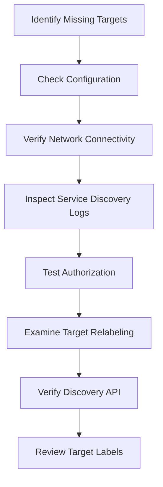

# Service Discovery Troubleshooting

## Introduction

Service discovery is a critical component of Prometheus's monitoring architecture. It enables Prometheus to automatically find and scrape targets without manual configuration. However, when service discovery doesn't work as expected, it can lead to missing metrics, incomplete monitoring, and potential blind spots in your observability setup.

This guide will help you understand, identify, and troubleshoot common issues with Prometheus service discovery mechanisms, ensuring your monitoring system captures all the targets it should.

## Common Service Discovery Issues

Before diving into specific troubleshooting techniques, let's understand the common issues that can occur with service discovery:

1. **Configuration errors** - Syntax issues or incorrect parameters in your service discovery configuration
2. **Network connectivity problems** - Prometheus unable to reach service discovery endpoints
3. **Authorization issues** - Incorrect or missing credentials for accessing discovery APIs
4. **Target relabeling problems** - Errors in relabeling rules leading to dropped targets
5. **Mismatched expectations** - Service discovery working correctly but not finding what you expect

## Troubleshooting Process Overview

When facing service discovery issues, follow this systematic approach:



## Step 1: Verify Prometheus Configuration

The first step is to validate that your Prometheus configuration is correct. Configuration errors are a common source of service discovery issues.

### Check Configuration Syntax

Ensure your configuration file follows the correct YAML syntax and matches the expected structure for your service discovery mechanism.

You can validate your configuration using the Prometheus command line tool:

```bash
promtool check config prometheus.yml
```

Example output for a valid configuration:

```
prometheus.yml SUCCESS
```

Example output for an invalid configuration:

```
Checking prometheus.yml
  FAILED: parsing YAML file prometheus.yml: yaml: line 42: did not find expected key
```

### Verify Service Discovery Parameters

Each service discovery method has specific parameters. Let's examine common parameters for Kubernetes service discovery as an example:

```yaml
scrape_configs:
  - job_name: 'kubernetes-pods'
    kubernetes_sd_configs:
      - role: pod
        api_server: 'https://kubernetes.default.svc:443'
        tls_config:
          ca_file: /var/run/secrets/kubernetes.io/serviceaccount/ca.crt
        bearer_token_file: /var/run/secrets/kubernetes.io/serviceaccount/token
```

Common misconfigurations include:
- Incorrect API server URL
- Missing or wrong path to credential files
- Incorrect role (should be one of: node, pod, service, endpoint, ingress)

## Step 2: Check Service Discovery Status

Prometheus exposes information about its service discovery status through its web interface and API.

### Using the Prometheus Web UI

1. Navigate to your Prometheus web interface (usually `http://your-prometheus-instance:9090`)
2. Go to **Status** > **Targets** to see all the discovered targets
3. Look for targets in the **Down** state or missing targets you expect to see

![Targets page showing discovered services]

### Using the Prometheus API

You can query the Prometheus API to get information about targets:

```bash
curl http://your-prometheus-instance:9090/api/v1/targets | jq
```

The response will include detailed information about each target, including:
- Discovery group
- Current state (up/down)
- Labels
- Last scrape time and duration
- Error information (if any)

### Analyzing Target States

When examining targets, pay attention to:

1. **Up targets**: Successfully discovered and scraped
2. **Down targets**: Discovered but failing to scrape
3. **Missing targets**: Not discovered at all (you'll need to infer these)

## Step 3: Enable Debug Logging

Increasing Prometheus's log verbosity can provide valuable insights into service discovery issues.

### Setting Debug Log Level

Start Prometheus with the `--log.level=debug` flag:

```bash
prometheus --config.file=prometheus.yml --log.level=debug
```

Or set it in your deployment configuration:

```yaml
args:
  - "--config.file=/etc/prometheus/prometheus.yml"
  - "--storage.tsdb.path=/prometheus"
  - "--log.level=debug"
```

### Analyzing Service Discovery Logs

Look for logs related to service discovery. For example, with Kubernetes service discovery:

```
level=debug ts=2023-05-15T10:23:45.123Z caller=kubernetes.go:267 component="discovery manager scrape" discovery=kubernetes msg="kubernetes service discovery started"
```

Error messages will provide clues about what's going wrong:

```
level=error ts=2023-05-15T10:24:12.456Z caller=kubernetes.go:321 component="discovery manager scrape" discovery=kubernetes msg="error retrieving pod objects" err="Get \"https://kubernetes.default.svc:443/api/v1/pods\": dial tcp: lookup kubernetes.default.svc on 10.96.0.10:53: no such host"
```

## Step 4: Check Network Connectivity

Service discovery mechanisms often rely on external APIs, so network connectivity is crucial.

### Testing API Connectivity

For Kubernetes service discovery, test connectivity to the Kubernetes API:

```bash
curl -k -v https://kubernetes.default.svc:443/api/v1/pods
```

For file-based discovery, ensure the files are accessible:

```bash
cat /path/to/targets.json
```

For DNS-based discovery, test DNS resolution:

```bash
dig SRV _prometheus._tcp.example.com
```

### Checking Authorization

Many service discovery mechanisms require proper authorization. Verify that Prometheus has the necessary permissions.

For Kubernetes:
```bash
# Test token permissions
kubectl auth can-i list pods --as=system:serviceaccount:monitoring:prometheus
```

Expected output for proper permissions:
```
yes
```

## Step 5: Troubleshoot Specific Service Discovery Methods

Let's look at troubleshooting steps for common service discovery mechanisms.

### Kubernetes Service Discovery

Common issues with Kubernetes service discovery include:

1. **RBAC permissions**: Ensure the Prometheus service account has the necessary permissions

```yaml
apiVersion: rbac.authorization.k8s.io/v1
kind: ClusterRole
metadata:
  name: prometheus
rules:
- apiGroups: [""]
  resources:
  - nodes
  - nodes/proxy
  - services
  - endpoints
  - pods
  verbs: ["get", "list", "watch"]
```

2. **Label selection**: Check if your relabel configurations match the actual labels on your resources

```yaml
relabel_configs:
  - source_labels: [__meta_kubernetes_pod_annotation_prometheus_io_scrape]
    action: keep
    regex: true
```

Verify pod annotations:
```bash
kubectl get pods -n your-namespace -o jsonpath='{.items[*].metadata.annotations}'
```

### File-Based Service Discovery

For file-based discovery, check:

1. **File permissions**: Ensure Prometheus can read the file
```bash
ls -la /path/to/file_sd_config.json
```

2. **File format**: Validate JSON format
```bash
jq . /path/to/file_sd_config.json
```

Example of a valid file_sd config:
```json
[
  {
    "targets": ["host1:9100", "host2:9100"],
    "labels": {
      "env": "production",
      "job": "node-exporter"
    }
  }
]
```

### DNS-Based Service Discovery

For DNS discovery issues:

1. **DNS resolution**: Verify SRV records are correctly set up
```bash
dig SRV _prometheus._tcp.example.com
```

Expected output with proper DNS configuration:
```
;; ANSWER SECTION:
_prometheus._tcp.example.com. 86400 IN SRV 0 5 9100 node1.example.com.
_prometheus._tcp.example.com. 86400 IN SRV 0 5 9100 node2.example.com.
```

2. **DNS configuration in Prometheus**:
```yaml
scrape_configs:
  - job_name: 'dns-discovery'
    dns_sd_configs:
      - names:
        - '_prometheus._tcp.example.com'
        type: 'SRV'
```

## Step 6: Troubleshooting Target Relabeling

Relabeling rules can sometimes cause targets to be dropped unintentionally.

### Understanding Relabeling Actions

Key relabeling actions that can cause targets to disappear:
- `keep`: Keeps targets for which the regex matches the concatenated source_labels
- `drop`: Drops targets for which the regex matches the concatenated source_labels

### Debug Relabeling Rules

To debug relabeling, temporarily remove or simplify rules and observe the effect on discovered targets.

Before relabeling (complex rules):
```yaml
relabel_configs:
  - source_labels: [__meta_kubernetes_pod_annotation_prometheus_io_scrape]
    action: keep
    regex: true
  - source_labels: [__meta_kubernetes_pod_annotation_prometheus_io_scheme]
    action: replace
    target_label: __scheme__
    regex: (https?)
  - source_labels: [__meta_kubernetes_pod_label_app]
    action: keep
    regex: important-app
```

Simplified for debugging:
```yaml
relabel_configs:
  - source_labels: [__meta_kubernetes_pod_annotation_prometheus_io_scrape]
    action: keep
    regex: true
```

### Inspecting Original Target Labels

To understand why relabeling might be dropping targets, inspect the original labels before relabeling.

Enable debug logging and look for entries like:

```
level=debug ts=2023-05-15T12:34:56.789Z caller=target.go:489 msg="before relabeling" lset="target=10.0.1.2:9090,__meta_kubernetes_pod_annotation_prometheus_io_scrape=false"
```

This shows the target had `__meta_kubernetes_pod_annotation_prometheus_io_scrape=false`, which would cause it to be dropped by a `keep` action looking for `true`.

## Step 7: Advanced Debugging Techniques

For persistent issues, try these advanced debugging techniques:

### Using `up` Metric for Missing Targets

Query `up` metric to see which targets are being successfully scraped:

```promql
up
```

This returns 1 for targets that are up and 0 for targets that are down but discovered.

### Checking Service Discovery Metrics

Prometheus exposes metrics about its own service discovery process:

```promql
prometheus_sd_discovered_targets
```

This shows the count of targets discovered by each service discovery mechanism.

```promql
prometheus_target_scrape_pool_targets
```

This shows the number of targets in each scrape pool.

### Creating a Test Configuration

Create a minimal test configuration focusing only on the problematic service discovery method:

```yaml
global:
  scrape_interval: 15s

scrape_configs:
  - job_name: 'test-discovery'
    kubernetes_sd_configs:
      - role: pod
    relabel_configs:
      - source_labels: [__meta_kubernetes_pod_name]
        action: replace
        target_label: pod_name
```

Run this with debug logging enabled to isolate the issue.

## Common Solutions to Service Discovery Problems

Here are solutions to frequently encountered service discovery issues:

### Kubernetes Service Discovery Issues

1. **No targets found**
   - Check RBAC permissions
   - Verify Prometheus is running in-cluster or has proper kubeconfig
   - Ensure pods have necessary annotations or labels

2. **Targets found but not scraped**
   - Check pod/service network policies
   - Verify port configurations
   - Check for restrictive relabeling rules

### File-Based Service Discovery Issues

1. **No targets from file_sd_configs**
   - Check file permissions
   - Validate JSON format
   - Ensure file path is correct
   - Check for dynamic file updates if using a generator

### DNS-Based Service Discovery Issues

1. **No targets from dns_sd_configs**
   - Verify DNS records exist
   - Check DNS server connectivity
   - Ensure correct record type (A, AAAA, SRV)
   - Check for DNS timeouts in Prometheus logs

## Practical Example: Troubleshooting Kubernetes Service Discovery

Let's walk through a complete example of troubleshooting Kubernetes service discovery:

### Scenario

You've deployed Prometheus in your Kubernetes cluster, but it's not discovering any pod targets despite having the correct configuration.

### Step 1: Check Configuration

Your configuration looks like this:

```yaml
scrape_configs:
  - job_name: 'kubernetes-pods'
    kubernetes_sd_configs:
      - role: pod
    relabel_configs:
      - source_labels: [__meta_kubernetes_pod_annotation_prometheus_io_scrape]
        action: keep
        regex: true
```

Validate with `promtool`:

```bash
promtool check config prometheus.yml
# Output: prometheus.yml SUCCESS
```

### Step 2: Check Discovered Targets

Check the Targets page in Prometheus UI or use the API:

```bash
curl http://prometheus:9090/api/v1/targets | jq '.data.activeTargets | length'
# Output: 0
```

No targets are discovered.

### Step 3: Enable Debug Logging

Modify Prometheus deployment to enable debug logging:

```yaml
args:
  - "--config.file=/etc/prometheus/prometheus.yml"
  - "--log.level=debug"
```

Check logs:

```
level=debug ts=2023-05-16T08:45:12.345Z caller=kubernetes.go:267 component="discovery manager scrape" discovery=kubernetes msg="kubernetes service discovery started"
level=error ts=2023-05-16T08:45:13.456Z caller=kubernetes.go:321 component="discovery manager scrape" discovery=kubernetes msg="error retrieving pod objects" err="pods is forbidden: User \"system:serviceaccount:monitoring:prometheus\" cannot list resource \"pods\" in API group \"\" at the cluster scope"
```

This indicates a permissions issue.

### Step 4: Fix RBAC Permissions

Create proper RBAC configuration:

```yaml
apiVersion: rbac.authorization.k8s.io/v1
kind: ClusterRole
metadata:
  name: prometheus
rules:
- apiGroups: [""]
  resources:
  - nodes
  - services
  - endpoints
  - pods
  verbs: ["get", "list", "watch"]
---
apiVersion: rbac.authorization.k8s.io/v1
kind: ClusterRoleBinding
metadata:
  name: prometheus
roleRef:
  apiGroup: rbac.authorization.k8s.io
  kind: ClusterRole
  name: prometheus
subjects:
- kind: ServiceAccount
  name: prometheus
  namespace: monitoring
```

Apply the configuration:

```bash
kubectl apply -f prometheus-rbac.yaml
```

### Step 5: Check If Targets Are Found

After fixing permissions, check targets again:

```bash
curl http://prometheus:9090/api/v1/targets | jq '.data.activeTargets | length'
# Output: 0
```

Still no targets.

### Step 6: Check Pod Annotations

Check if any pods have the required annotation:

```bash
kubectl get pods --all-namespaces -o json | jq '.items[] | select(.metadata.annotations."prometheus.io/scrape" == "true") | .metadata.name'
# Output: (empty)
```

No pods have the annotation.

### Step 7: Apply Annotations to Test Pod

Create a test pod with the correct annotation:

```yaml
apiVersion: v1
kind: Pod
metadata:
  name: test-pod
  annotations:
    prometheus.io/scrape: "true"
    prometheus.io/port: "8080"
spec:
  containers:
  - name: test-container
    image: nginx
    ports:
    - containerPort: 8080
```

Apply the configuration:

```bash
kubectl apply -f test-pod.yaml
```

### Step 8: Verify Discovery

Check targets again:

```bash
curl http://prometheus:9090/api/v1/targets | jq '.data.activeTargets | length'
# Output: 1
```

Success! The target is now discovered.

## Summary

In this guide, we covered:

1. Common service discovery issues in Prometheus
2. A systematic approach to troubleshooting these issues
3. Specific techniques for debugging different service discovery mechanisms
4. How to use Prometheus logs and metrics to identify problems
5. Solutions to frequently encountered issues
6. A practical example of troubleshooting Kubernetes service discovery

Remember that effective troubleshooting requires a methodical approach. Start with configuration validation, move to checking connectivity and permissions, and use debug logging to gain insights into issues. Understanding the specific requirements of each service discovery mechanism is crucial for successful monitoring.

## Additional Resources

- [Prometheus Configuration Documentation](https://prometheus.io/docs/prometheus/latest/configuration/configuration/)
- [Prometheus Service Discovery Documentation](https://prometheus.io/docs/prometheus/latest/configuration/configuration/#scrape_config)
- [Kubernetes Service Discovery in Prometheus](https://prometheus.io/docs/prometheus/latest/configuration/configuration/#kubernetes_sd_config)
- [Prometheus Relabeling Documentation](https://prometheus.io/docs/prometheus/latest/configuration/configuration/#relabel_config)

## Exercises

1. Set up a test environment with Prometheus and a misconfigured service discovery mechanism. Practice troubleshooting to identify and fix the issue.
2. Create a custom relabeling configuration that filters targets based on specific criteria. Test how changes affect target discovery.
3. Implement multiple service discovery mechanisms in a single Prometheus instance and troubleshoot potential conflicts.
4. Write a shell script that automatically checks common service discovery issues and reports potential problems.