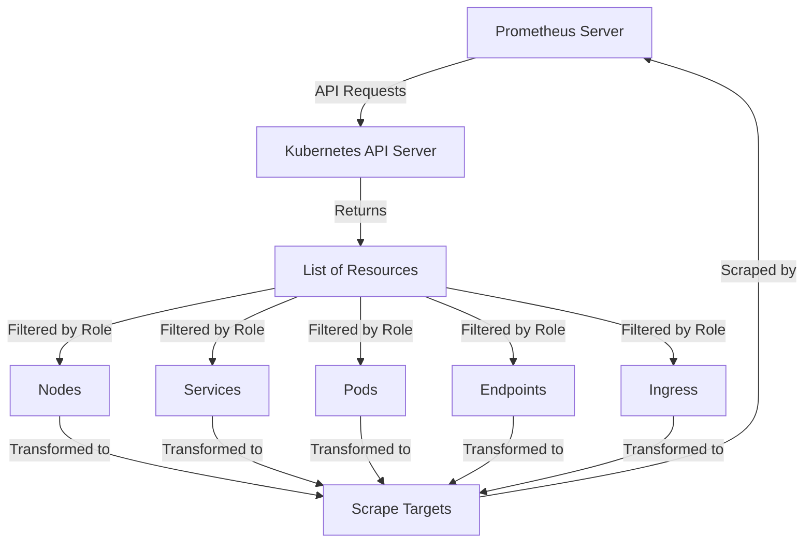

# Kubernetes Service Discovery

## Introduction

Kubernetes Service Discovery is a powerful mechanism that allows Prometheus to automatically find and monitor targets in Kubernetes clusters. As containerized applications scale up and down, pods are created and destroyed dynamically, making manual configuration impractical. Kubernetes service discovery solves this problem by enabling Prometheus to adapt to these changes automatically, ensuring consistent monitoring of your infrastructure.

In this guide, we'll explore how Prometheus uses Kubernetes' API to discover services, pods, endpoints, and other resources that need monitoring, making it an essential component for anyone building observability systems in Kubernetes environments.

## Understanding Kubernetes Service Discovery

### What is Service Discovery?

Service discovery is the process of automatically detecting devices and services on a network. In the context of Prometheus and Kubernetes, it's how Prometheus finds targets to scrape metrics from.

### Why is it Important?

In dynamic environments like Kubernetes:
- Pods and services are constantly being created, destroyed, and moved
- IP addresses change frequently
- Manual configuration doesn't scale
- Applications need to find each other without hardcoded addresses

Service discovery solves these challenges by providing a way for Prometheus to automatically adapt to changes in your cluster.

## How Prometheus Discovers Kubernetes Resources

Prometheus uses the Kubernetes API to discover targets in your cluster. It can discover and monitor various Kubernetes resource types:

- `node`: Discovers one target per cluster node with the node's address
- `service`: Discovers a target for each service port for each service
- `pod`: Discovers all pods and exposes their containers as targets
- `endpoints`: Discovers targets from endpoint objects
- `ingress`: Discovers a target for each ingress path

Let's visualize this discovery process:



## Configuring Kubernetes Service Discovery in Prometheus

To configure Prometheus to discover targets in your Kubernetes cluster, you'll need to add a `kubernetes_sd_config` section to your scrape configuration. Here's a basic example:

```yaml
scrape_configs:
  - job_name: 'kubernetes-pods'
    kubernetes_sd_configs:
      - role: pod
    relabel_configs:
      - source_labels: [__meta_kubernetes_pod_annotation_prometheus_io_scrape]
        action: keep
        regex: true
      - source_labels: [__meta_kubernetes_pod_annotation_prometheus_io_path]
        action: replace
        target_label: __metrics_path__
        regex: (.+)
      - source_labels: [__address__, __meta_kubernetes_pod_annotation_prometheus_io_port]
        action: replace
        regex: ([^:]+)(?::\d+)?;(\d+)
        replacement: $1:$2
        target_label: __address__
      - action: labelmap
        regex: __meta_kubernetes_pod_label_(.+)
      - source_labels: [__meta_kubernetes_namespace]
        action: replace
        target_label: kubernetes_namespace
      - source_labels: [__meta_kubernetes_pod_name]
        action: replace
        target_label: kubernetes_pod_name
```

Let's break down this configuration:

1. `job_name`: Identifier for this scrape configuration
2. `kubernetes_sd_configs`: Specifies that we're using Kubernetes service discovery
3. `role: pod`: Tells Prometheus to discover pods
4. `relabel_configs`: Rules to transform the discovered targets:
   - Keep only pods with a specific annotation
   - Use a custom metrics path if specified
   - Set the correct scrape address including port
   - Transform Kubernetes labels into Prometheus labels
   - Add namespace and pod name as labels

## Different Resource Roles

Depending on what you want to monitor, you can configure different roles:

### Node Role

The `node` role discovers one target per cluster node.

```yaml
scrape_configs:
  - job_name: 'kubernetes-nodes'
    kubernetes_sd_configs:
      - role: node
    relabel_configs:
      - action: labelmap
        regex: __meta_kubernetes_node_label_(.+)
      - source_labels: [__meta_kubernetes_node_name]
        action: replace
        target_label: kubernetes_node_name
```

### Service Role

The `service` role discovers a target for each service port for each service.

```yaml
scrape_configs:
  - job_name: 'kubernetes-services'
    kubernetes_sd_configs:
      - role: service
    relabel_configs:
      - action: labelmap
        regex: __meta_kubernetes_service_label_(.+)
      - source_labels: [__meta_kubernetes_namespace]
        action: replace
        target_label: kubernetes_namespace
      - source_labels: [__meta_kubernetes_service_name]
        action: replace
        target_label: kubernetes_service_name
```

### Pod Role

The `pod` role discovers all pods and exposes their containers as targets.

```yaml
scrape_configs:
  - job_name: 'kubernetes-pods'
    kubernetes_sd_configs:
      - role: pod
    relabel_configs:
      - action: labelmap
        regex: __meta_kubernetes_pod_label_(.+)
      - source_labels: [__meta_kubernetes_namespace]
        action: replace
        target_label: kubernetes_namespace
      - source_labels: [__meta_kubernetes_pod_name]
        action: replace
        target_label: kubernetes_pod_name
```

### Endpoints Role

The `endpoints` role discovers targets from endpoint objects.

```yaml
scrape_configs:
  - job_name: 'kubernetes-endpoints'
    kubernetes_sd_configs:
      - role: endpoints
    relabel_configs:
      - action: labelmap
        regex: __meta_kubernetes_service_label_(.+)
      - source_labels: [__meta_kubernetes_namespace]
        action: replace
        target_label: kubernetes_namespace
      - source_labels: [__meta_kubernetes_service_name]
        action: replace
        target_label: kubernetes_service_name
```

## Metadata Labels

Prometheus adds several metadata labels to discovered targets that you can use in relabeling:

### Common Metadata

- `__meta_kubernetes_namespace`: The namespace of the object
- `__meta_kubernetes_labels`: All labels from the Kubernetes object

### Pod-specific Metadata

- `__meta_kubernetes_pod_name`: The name of the pod
- `__meta_kubernetes_pod_ip`: The pod IP
- `__meta_kubernetes_pod_container_name`: Name of the container
- `__meta_kubernetes_pod_container_port_name`: Name of the container port
- `__meta_kubernetes_pod_container_port_number`: Number of the container port
- `__meta_kubernetes_pod_annotation_<annotation>`: Each pod annotation

## Practical Examples

### Example 1: Monitoring Node Exporters

Let's say you're running the Node Exporter as a DaemonSet to collect system metrics from each node.

```yaml
scrape_configs:
  - job_name: 'node-exporter'
    kubernetes_sd_configs:
      - role: pod
    relabel_configs:
      - source_labels: [__meta_kubernetes_pod_label_app]
        action: keep
        regex: node-exporter
      - source_labels: [__address__]
        action: replace
        regex: ([^:]+)(?::\d+)?
        replacement: $1:9100
        target_label: __address__
      - action: labelmap
        regex: __meta_kubernetes_pod_label_(.+)
      - source_labels: [__meta_kubernetes_namespace]
        action: replace
        target_label: kubernetes_namespace
      - source_labels: [__meta_kubernetes_pod_node_name]
        action: replace
        target_label: node
```

### Example 2: Automatic Discovery of Annotated Pods

This configuration automatically discovers and scrapes any pods with appropriate annotations:

```yaml
scrape_configs:
  - job_name: 'kubernetes-pods'
    kubernetes_sd_configs:
      - role: pod
    relabel_configs:
      - source_labels: [__meta_kubernetes_pod_annotation_prometheus_io_scrape]
        action: keep
        regex: true
      - source_labels: [__meta_kubernetes_pod_annotation_prometheus_io_path]
        action: replace
        target_label: __metrics_path__
        regex: (.+)
      - source_labels: [__address__, __meta_kubernetes_pod_annotation_prometheus_io_port]
        action: replace
        regex: ([^:]+)(?::\d+)?;(\d+)
        replacement: $1:$2
        target_label: __address__
      - action: labelmap
        regex: __meta_kubernetes_pod_label_(.+)
      - source_labels: [__meta_kubernetes_namespace]
        action: replace
        target_label: namespace
      - source_labels: [__meta_kubernetes_pod_name]
        action: replace
        target_label: pod
```

To use this configuration, add these annotations to your application pod:

```yaml
apiVersion: v1
kind: Pod
metadata:
  name: my-app
  annotations:
    prometheus.io/scrape: "true"
    prometheus.io/port: "8080"
    prometheus.io/path: "/metrics"
spec:
  containers:
  - name: my-app
    image: my-app:latest
    ports:
    - containerPort: 8080
```

### Example 3: Service Endpoints Discovery

This configuration discovers and scrapes service endpoints:

```yaml
scrape_configs:
  - job_name: 'kubernetes-service-endpoints'
    kubernetes_sd_configs:
      - role: endpoints
    relabel_configs:
      - source_labels: [__meta_kubernetes_service_annotation_prometheus_io_scrape]
        action: keep
        regex: true
      - source_labels: [__meta_kubernetes_service_annotation_prometheus_io_scheme]
        action: replace
        target_label: __scheme__
        regex: (https?)
      - source_labels: [__meta_kubernetes_service_annotation_prometheus_io_path]
        action: replace
        target_label: __metrics_path__
        regex: (.+)
      - source_labels: [__address__, __meta_kubernetes_service_annotation_prometheus_io_port]
        action: replace
        target_label: __address__
        regex: ([^:]+)(?::\d+)?;(\d+)
        replacement: $1:$2
      - action: labelmap
        regex: __meta_kubernetes_service_label_(.+)
      - source_labels: [__meta_kubernetes_namespace]
        action: replace
        target_label: kubernetes_namespace
      - source_labels: [__meta_kubernetes_service_name]
        action: replace
        target_label: kubernetes_service_name
```

## Best Practices

1. **Use annotations to control scraping**: Annotate your services and pods to control which ones should be scraped.

   ```yaml
   prometheus.io/scrape: "true"
   prometheus.io/port: "8080"
   prometheus.io/path: "/metrics"
   ```

2. **Establish consistent labeling**: Use relabeling to ensure consistent labels across all your targets.

3. **Filter unnecessary targets**: Use `keep` and `drop` actions in relabel_configs to filter out targets you don't need to scrape.

4. **Use separate jobs for different resource types**: Create separate jobs for nodes, pods, services, etc., to keep your configuration organized.

5. **Use namespaces for isolation**: Consider having separate scrape configurations for different namespaces.

## Common Challenges and Solutions

### Challenge 1: High Cardinality

If you're discovering too many targets, it can lead to high cardinality issues in Prometheus.

**Solution**: Use more specific filters in your relabel configurations.

```yaml
relabel_configs:
  - source_labels: [__meta_kubernetes_pod_label_app]
    action: keep
    regex: important-app
```

### Challenge 2: Authentication

Accessing the Kubernetes API requires authentication.

**Solution**: When running Prometheus in Kubernetes, use a ServiceAccount with appropriate RBAC permissions.

```yaml
apiVersion: v1
kind: ServiceAccount
metadata:
  name: prometheus
---
apiVersion: rbac.authorization.k8s.io/v1
kind: ClusterRole
metadata:
  name: prometheus
rules:
- apiGroups: [""]
  resources:
  - nodes
  - nodes/proxy
  - services
  - endpoints
  - pods
  verbs: ["get", "list", "watch"]
---
apiVersion: rbac.authorization.k8s.io/v1
kind: ClusterRoleBinding
metadata:
  name: prometheus
roleRef:
  apiGroup: rbac.authorization.k8s.io
  kind: ClusterRole
  name: prometheus
subjects:
- kind: ServiceAccount
  name: prometheus
  namespace: monitoring
```

## Summary

Kubernetes Service Discovery enables Prometheus to automatically find and monitor targets in your Kubernetes cluster, adapting to the dynamic nature of containerized environments. By leveraging Kubernetes' API, Prometheus can discover various resources like nodes, services, pods, and endpoints, making your monitoring setup more robust and maintainable.

We've covered:
- The fundamentals of Kubernetes service discovery
- Different resource roles you can use
- Configuration examples for various scenarios
- Best practices for effective service discovery
- Common challenges and their solutions

With this knowledge, you can now set up efficient service discovery for your Prometheus monitoring system in Kubernetes environments.

## Further Resources

1. Prometheus Official Documentation on Kubernetes Service Discovery: [Prometheus Kubernetes SD](https://prometheus.io/docs/prometheus/latest/configuration/configuration/#kubernetes_sd_config)
2. Kubernetes Labels and Annotations: [Kubernetes Docs](https://kubernetes.io/docs/concepts/overview/working-with-objects/labels/)
3. Prometheus Operator: A more advanced way to manage Prometheus in Kubernetes

## Exercises

1. Set up a simple Kubernetes cluster (or use Minikube) and deploy Prometheus with a configuration that discovers and scrapes node exporters.
2. Create an application that exposes metrics and deploy it to Kubernetes with the appropriate annotations for automatic discovery.
3. Experiment with different relabeling configurations to see how they affect the discovered targets.
4. Try combining different service discovery roles in a single Prometheus configuration to monitor various aspects of your cluster.