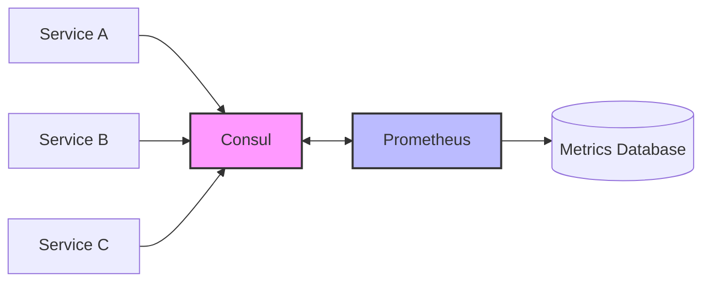

# Consul Service Discovery

## Introduction

Consul Service Discovery is a powerful mechanism in Prometheus that allows you to automatically discover and monitor services registered in HashiCorp Consul. Instead of manually configuring static targets in Prometheus, Consul Service Discovery enables Prometheus to dynamically update its target list based on services registered in a Consul cluster.

HashiCorp Consul is a service mesh solution that provides service discovery, configuration, and segmentation functionality. When combined with Prometheus, it creates a robust monitoring system that automatically adapts to your changing infrastructure.

## How Consul Service Discovery Works

When using Consul Service Discovery, Prometheus periodically queries the Consul API to discover services and their instances. This creates a dynamic monitoring environment where:

1. Services register themselves with Consul
2. Prometheus discovers these services via the Consul API
3. Prometheus automatically starts monitoring new services and stops monitoring decommissioned ones



## Configuring Consul Service Discovery in Prometheus

To configure Prometheus to use Consul for service discovery, you need to modify your `prometheus.yml` configuration file. Here's a basic example:

```yaml
scrape_configs:
  - job_name: 'consul-services'
    consul_sd_configs:
      - server: 'localhost:8500'
        services: []  # Empty array means all services
```

This configuration tells Prometheus to:
- Connect to the Consul server at `localhost:8500`
- Discover all services registered in Consul

### Advanced Configuration Options

For more advanced use cases, Consul Service Discovery offers several configuration options:

```yaml
scrape_configs:
  - job_name: 'consul-services'
    consul_sd_configs:
      - server: 'consul.example.com:8500'
        token: 'optional-consul-acl-token'
        datacenter: 'dc1'
        scheme: 'https'
        services: ['service1', 'service2']  # Only discover specific services
        tags: ['prod']  # Only discover services with specific tags
        node_meta:
          team: 'infra'
        allow_stale: true
        refresh_interval: 30s
```

## Relabeling in Consul Service Discovery

When Prometheus discovers targets via Consul, it attaches several labels based on the Consul metadata. You can use relabeling to customize how these targets appear in Prometheus:

```yaml
scrape_configs:
  - job_name: 'consul-services'
    consul_sd_configs:
      - server: 'localhost:8500'
        services: []
    relabel_configs:
      - source_labels: ['__meta_consul_service']
        target_label: 'job'
      - source_labels: ['__meta_consul_node']
        target_label: 'instance'
      - source_labels: ['__meta_consul_tags']
        regex: '(.*)production(.*)'
        action: 'keep'  # Only keep services with 'production' tag
```

### Available Metadata Labels

Prometheus exposes the following metadata labels for each discovered target via Consul:

- `__meta_consul_address`: The address of the target
- `__meta_consul_dc`: The datacenter of the target
- `__meta_consul_node`: The node name of the target
- `__meta_consul_service`: The name of the service the target belongs to
- `__meta_consul_service_id`: The ID of the service instance
- `__meta_consul_service_port`: The port of the service instance
- `__meta_consul_tags`: Comma-separated list of tags of the service instance
- `__meta_consul_metadata_<key>`: Each node metadata key-value pair

## Practical Example: Monitoring Web Services

Let's walk through a practical example of using Consul Service Discovery to monitor web services.

### 1. Register Services in Consul

First, register your services in Consul. This can be done using the Consul API or through Consul configuration:

```json
{
  "service": {
    "name": "web-app",
    "tags": ["production", "v1.2.3"],
    "port": 8080,
    "meta": {
      "environment": "production",
      "team": "frontend"
    },
    "check": {
      "http": "http://localhost:8080/health",
      "interval": "10s"
    }
  }
}
```

### 2. Configure Prometheus to Discover Web Services

Next, configure Prometheus to discover and monitor these web services:

```yaml
scrape_configs:
  - job_name: 'web-services'
    consul_sd_configs:
      - server: 'localhost:8500'
        services: ['web-app']
    relabel_configs:
      - source_labels: ['__meta_consul_service']
        target_label: 'service'
      - source_labels: ['__meta_consul_service_id']
        target_label: 'instance_id'
      - source_labels: ['__meta_consul_tags']
        target_label: 'tags'
      - source_labels: ['__meta_consul_metadata_environment']
        target_label: 'environment'
      - source_labels: ['__meta_consul_metadata_team']
        target_label: 'team'
```

### 3. Query and Alert on the Metrics

With the services now being monitored, you can create PromQL queries to analyze the data:

```promql
# Query for HTTP request rate by service
sum by (service) (rate(http_requests_total[5m]))

# Query for 95th percentile response time by environment
histogram_quantile(0.95, sum by (le, environment) (rate(http_request_duration_seconds_bucket[5m])))
```

And set up alerts for service health:

```yaml
groups:
  - name: web-app-alerts
    rules:
      - alert: HighErrorRate
        expr: sum(rate(http_requests_total{status_code=~"5.."}[5m])) by (service) / sum(rate(http_requests_total[5m])) by (service) > 0.05
        for: 5m
        labels:
          severity: critical
        annotations:
          summary: "High error rate on {{ $labels.service }}"
          description: "Service {{ $labels.service }} has error rate above 5% (current value: {{ $value | humanizePercentage }})"
```

## Best Practices for Consul Service Discovery

To get the most out of Consul Service Discovery with Prometheus, follow these best practices:

1. **Consistent Service Registration**: Ensure all services register with Consul consistently, including appropriate tags and metadata.

2. **Meaningful Tags and Metadata**: Use tags and metadata in Consul to provide context that can be used for filtering and grouping in Prometheus.

3. **Optimize Refresh Interval**: Set an appropriate `refresh_interval` based on how frequently your services change. Too frequent updates may cause unnecessary load on Consul.

4. **Use Relabeling**: Leverage relabeling to create meaningful labels from Consul metadata, making your metrics more useful for querying and alerting.

5. **ACL Tokens**: In production environments, use ACL tokens with minimal required permissions for security.

6. **High Availability**: For critical environments, consider configuring multiple Consul servers in the `consul_sd_configs` section for redundancy.

## Troubleshooting Consul Service Discovery

If you're experiencing issues with Consul Service Discovery, check these common problems:

### Services Not Being Discovered

- Verify Consul server is running and accessible from Prometheus
- Check if services are properly registered in Consul
- Verify ACL token permissions if using Consul ACLs
- Examine Prometheus logs for connection errors

### Incorrect or Missing Labels

- Use the Prometheus targets page (http://prometheus:9090/targets) to view discovered targets and their labels
- Verify service registration in Consul includes expected metadata
- Check relabeling configuration for syntax errors

## Summary

Consul Service Discovery provides a powerful way to dynamically monitor services registered in Consul using Prometheus. By leveraging Consul's service registry capabilities and Prometheus's flexible configuration, you can create a monitoring system that automatically adapts to your changing infrastructure.

The key benefits include:
- Automatic discovery of new services
- Removal of decommissioned services from monitoring
- Rich metadata from Consul for better metrics organization
- Infrastructure as code approach to monitoring configuration

With proper configuration and following best practices, Consul Service Discovery can significantly reduce the operational overhead of maintaining your monitoring targets while improving the reliability and coverage of your monitoring system.

## Additional Resources

- [Prometheus Documentation: Consul SD Config](https://prometheus.io/docs/prometheus/latest/configuration/configuration/#consul_sd_config)
- [HashiCorp Consul Documentation](https://www.consul.io/docs)
- [Service Discovery in Microservices Architecture](https://microservices.io/patterns/service-registry.html)

## Exercises

1. Set up a local Consul server and register at least two different services with different tags and metadata.

2. Configure Prometheus to discover these services and use relabeling to create meaningful labels.

3. Create a PromQL query that filters metrics based on Consul tags.

4. Implement an alert that triggers when a service registered in Consul stops responding.

5. Extend your configuration to discover services in multiple Consul datacenters.