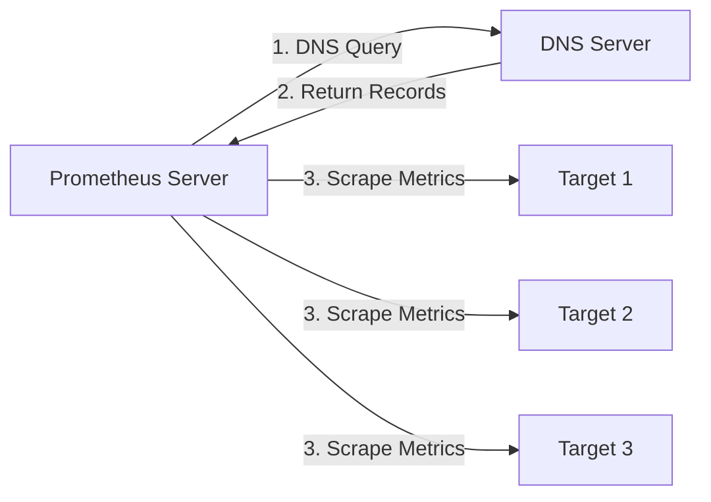

# DNS Service Discovery

## Introduction

DNS Service Discovery is a powerful mechanism in Prometheus that allows you to use DNS records to dynamically discover and monitor targets. Instead of manually configuring each target, Prometheus can query DNS records (like A, AAAA, SRV) to automatically find and monitor services across your infrastructure.

This approach is particularly useful in dynamic environments where services might change their location or when you're working with service-oriented architectures. By leveraging DNS, which is already a fundamental component of most networks, you can create a flexible and scalable monitoring setup.

## How DNS Service Discovery Works

When Prometheus is configured to use DNS Service Discovery, it periodically queries DNS servers for records matching specified patterns. Based on the returned records, Prometheus dynamically updates its list of targets to scrape.



## Configuring DNS Service Discovery

To use DNS Service Discovery in Prometheus, you'll need to configure it in your `prometheus.yml` file. Here's a basic example:

```yaml
scrape_configs:
  - job_name: 'dns-service-discovery'
    dns_sd_configs:
      - names:
        - 'services.example.com'
        type: 'A'
        port: 9090
```

### Configuration Parameters

DNS Service Discovery provides several parameters to customize how Prometheus discovers and monitors targets:

| Parameter | Description | Default |
|-----------|-------------|---------|
| `names` | List of DNS domain names to query | (required) |
| `type` | Record type to query (A, AAAA, SRV, MX) | `'A'` |
| `port` | Target port to use for discovered targets | `0` |
| `refresh_interval` | How often to query DNS | `30s` |
| `resolve_timeout` | Maximum time allowed for DNS lookup | `10s` |

## Supported DNS Record Types

Prometheus supports different DNS record types for service discovery:

### A/AAAA Records

These records map domain names to IPv4 (A) or IPv6 (AAAA) addresses. When using A/AAAA records, you'll need to specify a `port` in the configuration.

Example configuration:

```yaml
dns_sd_configs:
  - names:
    - 'api.example.com'
    type: 'A'
    port: 8080
```

When Prometheus queries for `api.example.com` and gets back IP addresses like `192.168.1.1` and `192.168.1.2`, it will monitor both `http://192.168.1.1:8080/metrics` and `http://192.168.1.2:8080/metrics`.

### SRV Records

SRV records are more detailed, specifying both the hostname and port for services. They're ideal for service discovery because they contain all the necessary information to connect to a service.

Example configuration:

```yaml
dns_sd_configs:
  - names:
    - '_prometheus._tcp.example.com'
    type: 'SRV'
```

If the SRV record returns:
```
_prometheus._tcp.example.com. 300 IN SRV 10 20 9090 node1.example.com.
_prometheus._tcp.example.com. 300 IN SRV 10 20 9090 node2.example.com.
```

Prometheus will scrape:
- `http://node1.example.com:9090/metrics`
- `http://node2.example.com:9090/metrics`

### Combining with Relabeling

For more advanced configurations, you can combine DNS SD with Prometheus's relabeling functionality:

```yaml
scrape_configs:
  - job_name: 'dns-discovered-services'
    dns_sd_configs:
      - names:
        - 'services.example.com'
        type: 'A'
        port: 9090
    relabel_configs:
      - source_labels: [__meta_dns_name]
        target_label: instance_name
```

This configuration adds an `instance_name` label to each target with the value of the DNS name that was queried.

## Real-World Examples

### Monitoring Kubernetes Services

Kubernetes exposes services via DNS names. You can use DNS SD to discover and monitor these services:

```yaml
scrape_configs:
  - job_name: 'kubernetes-services'
    dns_sd_configs:
      - names:
        - 'kube-dns.kube-system.svc.cluster.local'
        - 'prometheus-operator.monitoring.svc.cluster.local'
        type: 'A'
        port: 9153
```

### Monitoring Services in Multiple Regions

If you have services deployed across different regions, you can use DNS to discover them all:

```yaml
scrape_configs:
  - job_name: 'global-api-services'
    dns_sd_configs:
      - names:
        - 'api.us-east.example.com'
        - 'api.eu-west.example.com'
        - 'api.ap-south.example.com'
        type: 'A'
        port: 8080
    metrics_path: '/metrics'
```

### Consul Service Discovery via DNS

Consul provides DNS-based service discovery that works well with Prometheus:

```yaml
scrape_configs:
  - job_name: 'consul-services'
    dns_sd_configs:
      - names:
        - 'web.service.consul'
        - 'api.service.consul'
        - 'db.service.consul'
        type: 'A'
        port: 9090
```

## Common Challenges and Solutions

### Challenge: DNS Record TTL and Caching

**Problem**: DNS records have Time-To-Live (TTL) values, and caching might delay the discovery of new services.

**Solution**: Adjust the `refresh_interval` to be shorter than or equal to your DNS TTL:

```yaml
dns_sd_configs:
  - names:
    - 'services.example.com'
    type: 'A'
    port: 9090
    refresh_interval: 15s  # If your DNS TTL is 15s
```

### Challenge: Filtering Discovered Targets

**Problem**: You need to monitor only a subset of the services discovered via DNS.

**Solution**: Use relabeling to keep or drop targets based on specific criteria:

```yaml
scrape_configs:
  - job_name: 'filtered-services'
    dns_sd_configs:
      - names:
        - 'all-services.example.com'
        type: 'A'
        port: 9090
    relabel_configs:
      - source_labels: [__address__]
        regex: '10\.0\.0\..*'
        action: keep  # Only keep IPs in the 10.0.0.x range
```

## Summary

DNS Service Discovery in Prometheus provides a flexible and dynamic way to discover monitoring targets using standard DNS infrastructure. It supports different record types (A, AAAA, SRV) to accommodate various service discovery needs.

Key advantages include:
- Leveraging existing DNS infrastructure
- Dynamic discovery without manual configuration
- Scalability in large or changing environments
- Integration with various DNS-based service discovery tools

By combining DNS Service Discovery with Prometheus's powerful relabeling capabilities, you can create a robust and adaptable monitoring solution that automatically adjusts to changes in your infrastructure.

## Additional Resources

- [Prometheus Documentation on DNS-based SD](https://prometheus.io/docs/prometheus/latest/configuration/configuration/#dns_sd_config)
- [DNS Protocol RFC 1035](https://tools.ietf.org/html/rfc1035)
- [SRV Records RFC 2782](https://tools.ietf.org/html/rfc2782)

## Exercises

1. **Basic DNS SD Setup**: Configure Prometheus to discover and monitor a service using A records.
2. **SRV Record Discovery**: Set up a DNS server with SRV records and configure Prometheus to discover services using these records.
3. **Filtering Challenge**: Create a configuration that discovers services via DNS but only monitors ones matching specific criteria using relabeling.
4. **Multi-Environment Monitoring**: Design a Prometheus configuration that uses DNS SD to monitor services across development, staging, and production environments.