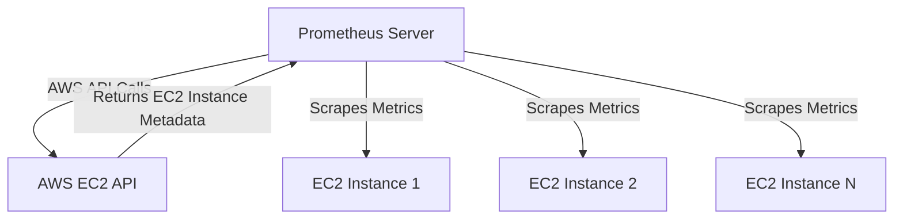

# EC2 Service Discovery

## Introduction

When monitoring applications running on Amazon EC2 instances with Prometheus, you need a way to automatically discover and scrape metrics from these instances as they are created, terminated, or changed. This is where EC2 service discovery comes in.

EC2 service discovery allows Prometheus to automatically find and monitor your EC2 instances without manual configuration for each instance. This is especially useful in dynamic cloud environments where instances can be frequently added or removed through auto-scaling.

In this guide, we'll explore how to set up and use EC2 service discovery with Prometheus, understand its configuration options, and see real-world examples of its application.

## Prerequisites

Before setting up EC2 service discovery, ensure you have:

1. A running Prometheus server
2. AWS credentials with appropriate permissions
3. EC2 instances with exporters or applications exposing metrics on an HTTP endpoint

## How EC2 Service Discovery Works

Prometheus uses the AWS API to discover EC2 instances in your account. Here's how the process works:



The discovery process follows these steps:

1. Prometheus makes API calls to AWS EC2 using configured credentials
2. AWS returns metadata about your EC2 instances
3. Prometheus filters instances based on your configuration
4. Prometheus automatically updates its scrape targets when instances are added or removed

## Configuring EC2 Service Discovery

### IAM Permissions

First, Prometheus needs AWS credentials with sufficient permissions to discover EC2 instances. Create an IAM user or role with the following permissions:

```json
{
  "Version": "2012-10-17",
  "Statement": [
    {
      "Effect": "Allow",
      "Action": [
        "ec2:DescribeInstances"
      ],
      "Resource": "*"
    }
  ]
}
```

### Prometheus Configuration

To configure EC2 service discovery in Prometheus, you'll need to add an `ec2_sd_config` section in your `prometheus.yml` file:

```yaml
scrape_configs:
  - job_name: 'ec2-instances'
    ec2_sd_configs:
      - region: us-east-1
        access_key: YOUR_ACCESS_KEY  # Optional, can use instance profile instead
        secret_key: YOUR_SECRET_KEY  # Optional, can use instance profile instead
        port: 9100  # Default port for node_exporter
        filters:
          - name: instance-state-name
            values: ['running']
          - name: tag:Environment
            values: ['production']
    relabel_configs:
      - source_labels: [__meta_ec2_tag_Name]
        target_label: instance
      - source_labels: [__meta_ec2_availability_zone]
        target_label: zone
      - source_labels: [__meta_ec2_instance_type]
        target_label: instance_type
```

### Security Best Practices

When configuring EC2 service discovery, follow these security best practices:

1. **Use IAM roles** instead of hardcoding access keys when possible
2. **Limit permissions** to only what Prometheus needs
3. **Use filters** to limit discovery to only relevant instances
4. **Use private IPs** for scraping when possible to avoid public internet traffic

## Available Metadata Labels

EC2 service discovery provides the following metadata labels that you can use for relabeling:

| Metadata Label | Description |
|----------------|-------------|
| `__meta_ec2_ami` | The AMI ID of the instance |
| `__meta_ec2_architecture` | The architecture of the instance |
| `__meta_ec2_availability_zone` | The availability zone of the instance |
| `__meta_ec2_instance_id` | The ID of the instance |
| `__meta_ec2_instance_state` | The state of the instance |
| `__meta_ec2_instance_type` | The type of the instance |
| `__meta_ec2_private_dns_name` | The private DNS name of the instance |
| `__meta_ec2_private_ip` | The private IP address of the instance |
| `__meta_ec2_public_dns_name` | The public DNS name of the instance |
| `__meta_ec2_public_ip` | The public IP address of the instance |
| `__meta_ec2_subnet_id` | The subnet ID of the instance |
| `__meta_ec2_tag_<tagkey>` | Each tag value of the instance |
| `__meta_ec2_vpc_id` | The VPC ID of the instance |

## Advanced Filtering

You can filter EC2 instances using the same filters that the AWS EC2 API supports:

```yaml
ec2_sd_configs:
  - region: us-west-2
    filters:
      - name: tag:Purpose
        values: ['monitoring']
      - name: instance-type
        values: ['t2.micro', 't3.micro']
```

This will only discover EC2 instances that have a tag `Purpose=monitoring` and are of type `t2.micro` or `t3.micro`.

## Practical Example: Multi-Region Monitoring

Here's a real-world example of monitoring EC2 instances across multiple AWS regions:

```yaml
scrape_configs:
  - job_name: 'ec2-node-exporter'
    ec2_sd_configs:
      - region: us-east-1
        port: 9100
        filters:
          - name: tag:Monitoring
            values: ['enabled']
      - region: eu-west-1
        port: 9100
        filters:
          - name: tag:Monitoring
            values: ['enabled']
    relabel_configs:
      - source_labels: [__meta_ec2_tag_Name]
        regex: (.+)
        target_label: instance
        replacement: '${1}'
      - source_labels: [__meta_ec2_tag_Application]
        target_label: app
      - source_labels: [__meta_ec2_region]
        target_label: region
```

This configuration:
- Discovers instances in two different regions (`us-east-1` and `eu-west-1`)
- Only includes instances with the tag `Monitoring=enabled`
- Uses the `Name` tag value as the instance label
- Adds the `Application` tag and region as labels

## Handling Dynamic Ports

If your applications expose metrics on different ports, you can use EC2 tags to specify the port:

```yaml
scrape_configs:
  - job_name: 'ec2-custom-ports'
    ec2_sd_configs:
      - region: us-east-1
        filters:
          - name: tag:Service
            values: ['api']
    relabel_configs:
      - source_labels: [__meta_ec2_tag_PrometheusPort]
        regex: (.+)
        replacement: '${1}'
        target_label: __metrics_path__
        action: replace
      - source_labels: [__meta_ec2_private_ip, __meta_ec2_tag_PrometheusPort]
        regex: '([^;]+);([^;]+)'
        replacement: '${1}:${2}'
        target_label: __address__
        action: replace
```

In this example, each EC2 instance can specify its metrics port using the `PrometheusPort` tag.

## Common Challenges and Solutions

### Problem: High API Costs
**Solution**: Increase the scrape interval to reduce API calls
```yaml
ec2_sd_configs:
  - region: us-east-1
    refresh_interval: 5m  # Default is 60s
```

### Problem: Missing Instances
**Solution**: Check your IAM permissions and filters

### Problem: Slow Discovery
**Solution**: Use more specific filters to reduce the number of instances processed

## Summary

EC2 service discovery is a powerful feature of Prometheus that allows for automatic monitoring of your AWS EC2 instances. By configuring it properly, you can:

- Automatically discover and monitor new instances as they're created
- Target specific instances using AWS filters
- Add valuable metadata as labels for better querying and alerting
- Create a dynamic monitoring system that adapts to your infrastructure changes

This approach is much more maintainable than manually updating configuration files when your infrastructure changes.

## Additional Resources

- [Prometheus Documentation on EC2 Service Discovery](https://prometheus.io/docs/prometheus/latest/configuration/configuration/#ec2_sd_config)
- [AWS EC2 API Documentation](https://docs.aws.amazon.com/AWSEC2/latest/APIReference/API_Operations.html)

## Exercises

1. Set up EC2 service discovery to monitor instances in a specific VPC
2. Configure relabeling to include instance tags as labels in your metrics
3. Create a dashboard in Grafana showing CPU usage across different instance types
4. Implement an alert that fires when an instance is not reporting metrics but should be (based on its tags)
5. Extend your configuration to discover instances across all regions in your AWS account