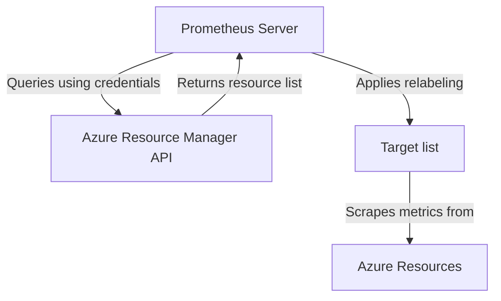

# Azure Service Discovery

## Introduction

Service discovery is a critical component of modern monitoring systems, especially in dynamic cloud environments where resources frequently come and go. Prometheus, a powerful open-source monitoring and alerting toolkit, provides built-in integration with various cloud platforms, including Microsoft Azure.

Azure Service Discovery enables Prometheus to automatically find and monitor your Azure resources without manual configuration. This automatic discovery ensures your monitoring system stays up-to-date as you scale your infrastructure up or down in the Azure cloud.

In this guide, we'll explore how Prometheus discovers Azure resources, how to configure Azure Service Discovery, and walk through practical examples to implement it in your own monitoring setup.

## Prerequisites

Before configuring Azure Service Discovery with Prometheus, you'll need:

- A Prometheus server (v2.26.0 or later recommended)
- An Azure subscription
- An Azure service principal with appropriate permissions
- Basic familiarity with Prometheus and Azure concepts

## How Azure Service Discovery Works

Prometheus uses Azure's Resource Manager API to query and discover resources within your Azure subscription. The discovery process works as follows:



When configured properly, Prometheus will:

1. Authenticate with Azure using provided credentials
2. Query for resources matching your configuration
3. Apply relabeling rules to organize the discovered targets
4. Begin scraping metrics from the discovered Azure resources

## Configuration Options

Azure Service Discovery in Prometheus supports several configuration options to filter and select which Azure resources you want to monitor. These options are defined in the `azure_sd_config` section of your Prometheus configuration.

### Key Configuration Parameters

| Parameter | Description |
|-----------|-------------|
| `subscription_id` | Your Azure subscription ID |
| `tenant_id` | Azure Active Directory tenant ID |
| `client_id` | Service principal application (client) ID |
| `client_secret` | Service principal secret |
| `environment` | Azure environment (default: "AzurePublicCloud") |
| `port` | Default port to use for targets (default: 80) |
| `refresh_interval` | Interval at which to refresh the list of targets (default: 300s) |
| `resource_group` | Optional filter to limit discovery to a specific resource group |

## Authentication Setup

To allow Prometheus to discover resources in your Azure environment, you need to create a service principal:

1. Create a service principal in Azure Active Directory:

```bash
az ad sp create-for-rbac --name PrometheusDiscovery --role Reader
```

2. Note the `appId` (client_id), `password` (client_secret), and `tenant` values from the output.

3. Ensure your service principal has at least "Reader" access to the resources you want to monitor.

## Basic Configuration Example

Here's a basic example of configuring Azure Service Discovery in your `prometheus.yml` file:

```yaml
scrape_configs:
  - job_name: 'azure-vms'
    azure_sd_configs:
      - subscription_id: 'your-subscription-id'
        tenant_id: 'your-tenant-id'
        client_id: 'your-client-id'
        client_secret: 'your-client-secret'
        port: 9100  # Node exporter default port
        refresh_interval: 2m
    relabel_configs:
      - source_labels: [__meta_azure_machine_name]
        target_label: instance
      - source_labels: [__meta_azure_machine_location]
        target_label: location
```

This configuration:
- Discovers all Azure VMs in your subscription
- Sets the scrape port to 9100 (typically used for node_exporter)
- Refreshes the target list every 2 minutes
- Adds labels for the VM name and location to the metrics

## Filtering Resources

You may want to discover only specific resources. Prometheus provides several approaches:

### Filter by Resource Group

```yaml
azure_sd_configs:
  - subscription_id: 'your-subscription-id'
    tenant_id: 'your-tenant-id'
    client_id: 'your-client-id'
    client_secret: 'your-client-secret'
    resource_group: 'production-rg'
```

### Filter by Resource Type Using Relabeling

```yaml
azure_sd_configs:
  - subscription_id: 'your-subscription-id'
    tenant_id: 'your-tenant-id'
    client_id: 'your-client-id'
    client_secret: 'your-client-secret'
relabel_configs:
  - source_labels: [__meta_azure_resource_type]
    regex: 'Microsoft.Compute/virtualMachines'
    action: keep
```

## Available Meta Labels

Azure Service Discovery provides many meta labels that you can use for relabeling. Some of the most useful ones include:

- `__meta_azure_machine_id`: The Azure resource ID
- `__meta_azure_machine_name`: The VM name
- `__meta_azure_machine_location`: The region/location
- `__meta_azure_machine_private_ip`: The private IP address
- `__meta_azure_machine_public_ip`: The public IP address (if available)
- `__meta_azure_machine_size`: The VM size
- `__meta_azure_subscription_id`: The subscription ID
- `__meta_azure_resource_group`: The resource group name
- `__meta_azure_resource_type`: The Azure resource type
- `__meta_azure_tag_<tagname>`: Custom Azure tags

You can use these labels in your `relabel_configs` to organize and filter your metrics.

## Practical Example: Monitoring Azure VMs with Node Exporter

Let's walk through a complete example of setting up Prometheus to discover and monitor Azure VMs running the Node Exporter.

### 1. Ensure Node Exporter is installed on your VMs

First, make sure Node Exporter is installed and running on your Azure VMs. You can do this through a startup script, custom extension, or as part of your VM image.

### 2. Tag your VMs for easier discovery

Add tags to your VMs to help organize your monitoring:

```bash
az vm update --resource-group myResourceGroup --name myVM --set tags.environment=production tags.monitoring=enabled
```

### 3. Configure Prometheus

Update your `prometheus.yml` configuration:

```yaml
scrape_configs:
  - job_name: 'azure-node-exporter'
    scrape_interval: 30s
    
    azure_sd_configs:
      - subscription_id: 'your-subscription-id'
        tenant_id: 'your-tenant-id'
        client_id: 'your-client-id'
        client_secret: 'your-client-secret'
        port: 9100  # Node exporter port
        refresh_interval: 5m
    
    relabel_configs:
      # Keep only VMs with the 'monitoring: enabled' tag
      - source_labels: [__meta_azure_tag_monitoring]
        regex: 'enabled'
        action: keep
      
      # Use VM name as instance label
      - source_labels: [__meta_azure_machine_name]
        target_label: instance
      
      # Add environment label from VM tags
      - source_labels: [__meta_azure_tag_environment]
        target_label: environment
      
      # Add location as a label
      - source_labels: [__meta_azure_machine_location]
        target_label: region
      
      # Add VM size as a label
      - source_labels: [__meta_azure_machine_size]
        target_label: vm_size
```

### 4. Restart Prometheus

Restart your Prometheus server to apply the new configuration:

```bash
sudo systemctl restart prometheus
```

### 5. Verify discovery

Check that Prometheus has discovered your Azure VMs by navigating to the Prometheus web UI (typically at `http://your-prometheus-server:9090/targets`).

## Monitoring Azure App Services

In addition to VMs, you might want to monitor Azure App Services. Here's how to configure that:

```yaml
scrape_configs:
  - job_name: 'azure-app-services'
    
    azure_sd_configs:
      - subscription_id: 'your-subscription-id'
        tenant_id: 'your-tenant-id'
        client_id: 'your-client-id'
        client_secret: 'your-client-secret'
    
    relabel_configs:
      # Keep only App Service resources
      - source_labels: [__meta_azure_resource_type]
        regex: 'Microsoft.Web/sites'
        action: keep
      
      # Set a custom port and path for the metrics endpoint
      - target_label: __metrics_path__
        replacement: /metrics
      - target_label: __scheme__
        replacement: https
      - target_label: __address__
        source_labels: [__meta_azure_machine_fqdn]
        replacement: '${1}:443'
      
      # Add app service name as instance label
      - source_labels: [__meta_azure_machine_name]
        target_label: instance
```

## Securing Your Configuration

Storing Azure credentials directly in your Prometheus configuration file presents a security risk. Consider these alternatives:

1. **Use environment variables**:

```yaml
azure_sd_configs:
  - subscription_id: ${AZURE_SUBSCRIPTION_ID}
    tenant_id: ${AZURE_TENANT_ID}
    client_id: ${AZURE_CLIENT_ID}
    client_secret: ${AZURE_CLIENT_SECRET}
```

2. **Use Prometheus file-based secret management**:

```yaml
azure_sd_configs:
  - subscription_id: 'your-subscription-id'
    tenant_id: 'your-tenant-id'
    client_id: 'your-client-id'
    client_secret_file: '/path/to/secret/file'
```

3. **Use a secret management tool** like HashiCorp Vault or Azure Key Vault with appropriate integration.

## Troubleshooting Common Issues

If you're having trouble with Azure Service Discovery, check these common issues:

### No targets discovered

1. Verify your Azure credentials are correct
2. Ensure the service principal has appropriate permissions
3. Check for typos in subscription ID or tenant ID
4. Verify resources exist in the specified subscription

### Authentication errors

1. Ensure the service principal hasn't expired
2. Verify the client secret is correct
3. Check that the service principal still exists in Azure AD

### Missing labels or metadata

1. Verify that your relabeling configurations are correct
2. Check for typos in label names or regex patterns
3. Ensure the Azure resources have the expected tags or properties

## Summary

Azure Service Discovery simplifies monitoring your Azure infrastructure with Prometheus by automatically discovering and monitoring resources as they are created or removed. By properly configuring authentication, filtering, and relabeling, you can create a dynamic monitoring system that adapts to changes in your Azure environment.

The key benefits of using Azure Service Discovery include:

- **Automation**: No need to manually update your monitoring configuration
- **Scalability**: Automatically discover new resources as you scale
- **Flexibility**: Fine-grained control over which resources to monitor
- **Rich metadata**: Utilize Azure resource properties as Prometheus labels

## Additional Resources

For more information about Azure Service Discovery with Prometheus, check out these resources:

- [Prometheus Configuration Documentation](https://prometheus.io/docs/prometheus/latest/configuration/configuration/#azure_sd_config)
- [Azure Resource Manager API Documentation](https://docs.microsoft.com/en-us/rest/api/resources/)
- [Prometheus Relabeling Documentation](https://prometheus.io/docs/prometheus/latest/configuration/configuration/#relabel_config)

## Exercises

To reinforce your understanding of Azure Service Discovery, try these exercises:

1. Configure Prometheus to discover only Azure VMs in a specific resource group.
2. Set up discovery for multiple Azure resource types (VMs, App Services, and Databases) with different job configurations.
3. Create a dashboard in Grafana that shows metrics from your discovered Azure resources.
4. Set up alerts based on metrics from automatically discovered resources.
5. Implement a more secure way to store Azure credentials for your Prometheus configuration.