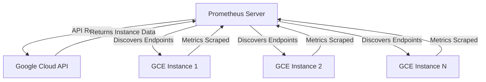

# GCE Service Discovery

## Introduction

When monitoring applications deployed on Google Cloud Platform (GCP), manually maintaining a list of targets to scrape can become unwieldy as your infrastructure scales. Prometheus offers a powerful solution with its Google Compute Engine (GCE) service discovery mechanism, which automatically discovers and monitors your GCE instances.

This service discovery integration allows Prometheus to:
- Automatically discover GCE instances in your projects
- Apply filtering based on metadata and other attributes
- Dynamically update monitoring targets as instances are created or terminated
- Extract labels from GCE metadata for better organization of metrics

In this guide, we'll explore how to configure and use GCE service discovery with Prometheus, providing practical examples to help you integrate this capability into your monitoring infrastructure.

## Prerequisites

Before setting up GCE service discovery, you'll need:

1. A Google Cloud Platform (GCP) account with access to Google Compute Engine
2. Prometheus installed (either on GCE or with network access to your GCE instances)
3. Proper IAM permissions to allow Prometheus to access GCE API
4. Basic understanding of Prometheus configuration

## How GCE Service Discovery Works

Prometheus uses the GCP API to discover instances across your GCE projects. Here's how the process works:



The discovery process involves:
1. Prometheus making API calls to Google Cloud
2. Retrieving metadata about running instances
3. Creating target endpoints based on discovered instances
4. Applying relabeling rules to organize and filter targets
5. Scraping metrics from the discovered endpoints

## Configuring GCE Service Discovery

Let's look at how to configure Prometheus to discover and scrape GCE instances:

### Authentication Setup

First, Prometheus needs to authenticate with Google Cloud. There are several methods:

1. **Using Google Application Default Credentials**:
   - When Prometheus runs on GCE, it can use the instance's service account
   - Configure the service account with appropriate IAM roles (`compute.viewer` at minimum)

2. **Using a Service Account Key File**:
   - Create a service account with the necessary permissions
   - Download the key file and reference it in your Prometheus config

### Basic Configuration

Add the following to your `prometheus.yml` file to enable GCE service discovery:

```yaml
scrape_configs:
  - job_name: 'gce-instances'
    gce_sd_configs:
      - project: 'your-gcp-project-id'
        zone: 'us-central1-a'
        port: 9100  # Default port for node_exporter
```

This configuration will:
- Discover all GCE instances in the specified project and zone
- Assume each instance has a metrics endpoint on port 9100 (typical for node_exporter)

### Multi-Zone and Multi-Project Configuration

To monitor instances across multiple zones or projects:

```yaml
scrape_configs:
  - job_name: 'gce-instances'
    gce_sd_configs:
      - project: 'project-1'
        zones: 
          - 'us-central1-a'
          - 'us-central1-b'
        port: 9100
      - project: 'project-2'
        zones:
          - 'us-west1-a'
        port: 9100
```

### Authentication with a Key File

If you're running Prometheus outside of GCP or need to use a specific service account:

```yaml
scrape_configs:
  - job_name: 'gce-instances'
    gce_sd_configs:
      - project: 'your-gcp-project-id'
        zone: 'us-central1-a'
        port: 9100
        credentials_file: '/path/to/service-account-key.json'
```

## Available Labels and Relabeling

GCE service discovery automatically attaches several metadata labels to discovered targets. These include:

- `__meta_gce_instance_id`: The numeric instance ID
- `__meta_gce_instance_name`: The user-defined instance name
- `__meta_gce_machine_type`: The machine type of the instance
- `__meta_gce_metadata_NAME`: Each metadata item becomes a label
- `__meta_gce_network`: The network of the instance
- `__meta_gce_private_ip`: The private IP address
- `__meta_gce_project`: The GCP project
- `__meta_gce_public_ip`: The public IP address (if available)
- `__meta_gce_tags`: Instance tags (comma-separated)
- `__meta_gce_zone`: The zone of the instance

### Using Relabeling to Filter Instances

You can use relabeling to filter which instances Prometheus monitors:

```yaml
scrape_configs:
  - job_name: 'gce-web-servers'
    gce_sd_configs:
      - project: 'your-gcp-project-id'
        zone: 'us-central1-a'
        port: 9100
    relabel_configs:
      - source_labels: [__meta_gce_tags]
        regex: '.*,web-server,.*'
        action: keep
```

This configuration will only keep targets that have the `web-server` tag.

### Creating Meaningful Labels from Metadata

You can transform GCE metadata into Prometheus labels:

```yaml
scrape_configs:
  - job_name: 'gce-instances'
    gce_sd_configs:
      - project: 'your-gcp-project-id'
        zone: 'us-central1-a'
        port: 9100
    relabel_configs:
      - source_labels: [__meta_gce_instance_name]
        target_label: instance
      - source_labels: [__meta_gce_metadata_environment]
        target_label: environment
      - source_labels: [__meta_gce_zone]
        target_label: zone
```

This configuration extracts the instance name, a custom metadata field called "environment", and the zone into Prometheus labels.

## Practical Example: Complete Configuration

Here's a more comprehensive example that:
1. Discovers instances across multiple zones
2. Filters based on an "app" metadata property
3. Applies custom labeling
4. Adjusts the scrape interval for these targets

```yaml
scrape_configs:
  - job_name: 'gce-app-monitoring'
    scrape_interval: 30s
    gce_sd_configs:
      - project: 'production-apps'
        zones:
          - 'us-central1-a'
          - 'us-central1-b'
          - 'us-central1-c'
        port: 9100
    relabel_configs:
      # Keep only instances with app=prometheus-monitored metadata
      - source_labels: [__meta_gce_metadata_app]
        regex: 'prometheus-monitored'
        action: keep
      
      # Create an app_component label from a metadata field
      - source_labels: [__meta_gce_metadata_component]
        target_label: app_component
      
      # Create an instance label from instance name
      - source_labels: [__meta_gce_instance_name]
        target_label: instance
      
      # Create a zone label
      - source_labels: [__meta_gce_zone]
        target_label: zone
        
      # If the instance has a custom metrics port defined in metadata, use it
      - source_labels: [__meta_gce_metadata_metrics_port]
        regex: (.+)
        target_label: __address__
        replacement: ${1}:${__meta_gce_metadata_metrics_port}
```

## Best Practices

When using GCE service discovery with Prometheus, consider the following best practices:

1. **Use Metadata for Configuration**: 
   - Add metadata to your instances to control monitoring behavior
   - Example: Add `prometheus_port: 9100` as metadata to specify custom ports

2. **Create Instance Groups by Purpose**:
   - Group similar instances with common tags or metadata
   - Makes filtering and relabeling more consistent

3. **Consider API Quotas**:
   - GCP has API request quotas
   - Set appropriate scrape intervals to avoid excessive API calls

4. **Use GCE Private IPs When Possible**:
   - More secure and avoids public internet traffic
   - Use VPC peering or similar if Prometheus is in a different network

5. **Include Zones in Labels**:
   - Allows you to analyze metrics by zone
   - Helpful for identifying zone-specific issues

## Troubleshooting GCE Service Discovery

If you're experiencing issues with GCE service discovery, check the following:

### 1. Authentication Problems

If Prometheus can't discover GCE instances, check:
- IAM permissions on the service account
- Validity of the credentials file
- API access to compute.googleapis.com

### 2. No Targets Found

If no targets are being discovered:
- Verify the project ID and zone are correct
- Check if your relabeling rules might be filtering out all targets
- Examine Prometheus logs for API errors

### 3. Service Discovery Works But No Metrics

If instances are discovered but no metrics are collected:
- Verify the port configuration
- Check if firewalls allow traffic to the metrics port
- Ensure the monitoring agent is running on the instances

## Example: Setting Up a Complete Monitoring Stack

Let's look at a complete example of setting up a monitoring stack on GCE with auto-discovery:

1. **Create a VM Template with node_exporter**:

```bash
# Install node_exporter on your instances
wget https://github.com/prometheus/node_exporter/releases/download/v1.3.1/node_exporter-1.3.1.linux-amd64.tar.gz
tar xvfz node_exporter-1.3.1.linux-amd64.tar.gz
sudo cp node_exporter-1.3.1.linux-amd64/node_exporter /usr/local/bin/
sudo useradd -rs /bin/false node_exporter

# Create a systemd service
sudo tee /etc/systemd/system/node_exporter.service > /dev/null <<EOF
[Unit]
Description=Node Exporter
After=network.target

[Service]
User=node_exporter
Group=node_exporter
Type=simple
ExecStart=/usr/local/bin/node_exporter

[Install]
WantedBy=multi-user.target
EOF

# Start and enable the service
sudo systemctl daemon-reload
sudo systemctl start node_exporter
sudo systemctl enable node_exporter
```

2. **Add Custom Metadata to Instances**:

Add these metadata items to your instances:
- `prometheus-monitored: true`
- `app: web-server` (or whatever describes your application)
- `environment: production` (or staging, development, etc.)

3. **Configure Prometheus**:

```yaml
global:
  scrape_interval: 15s
  evaluation_interval: 15s

scrape_configs:
  - job_name: 'gce-node-exporters'
    gce_sd_configs:
      - project: 'your-gcp-project-id'
        zones:
          - 'us-central1-a'
          - 'us-central1-b'
        port: 9100
    relabel_configs:
      - source_labels: [__meta_gce_metadata_prometheus_monitored]
        regex: 'true'
        action: keep
      - source_labels: [__meta_gce_metadata_app]
        target_label: app
      - source_labels: [__meta_gce_metadata_environment]
        target_label: environment
      - source_labels: [__meta_gce_instance_name]
        target_label: instance
```

4. **Create Prometheus Alerts Based on Labels**:

```yaml
groups:
- name: GCE Instance Alerts
  rules:
  - alert: HighCPUUsage
    expr: (1 - avg by(instance, app, environment) (irate(node_cpu_seconds_total{mode="idle"}[5m]))) * 100 > 80
    for: 5m
    labels:
      severity: warning
    annotations:
      summary: "High CPU usage on {{ $labels.instance }}"
      description: "CPU usage is above 80% for 5 minutes on {{ $labels.instance }} (app: {{ $labels.app }}, environment: {{ $labels.environment }})"
```

## Summary

GCE service discovery is a powerful feature of Prometheus that enables automatic discovery and monitoring of your Google Cloud infrastructure. By leveraging this capability, you can:

- Eliminate manual configuration of target endpoints
- Automatically adapt your monitoring as instances are created or terminated
- Apply sophisticated filtering based on metadata, tags, and other attributes
- Extract meaningful labels from GCE metadata
- Create a more maintainable and scalable monitoring system

As your Google Cloud infrastructure grows, GCE service discovery becomes increasingly valuable, allowing your monitoring to scale automatically with your environment.

## Additional Resources

To deepen your understanding of GCE service discovery with Prometheus, consider exploring these resources:

- [Official Prometheus Documentation on GCE SD](https://prometheus.io/docs/prometheus/latest/configuration/configuration/#gce_sd_config)
- [Google Cloud Monitoring Best Practices](https://cloud.google.com/solutions/monitoring-solution-best-practices)
- [Setting up IAM for Prometheus](https://cloud.google.com/iam/docs/granting-changing-revoking-access)

## Exercises

To reinforce your learning, try these practical exercises:

1. Set up Prometheus with GCE service discovery to monitor your own GCE instances
2. Create a relabeling configuration that categorizes instances by both zone and machine type
3. Develop a Grafana dashboard that visualizes metrics grouped by the discovered GCE metadata labels
4. Configure different scrape intervals for different types of instances based on metadata
5. Implement a multi-project discovery setup and compare resource usage across projects