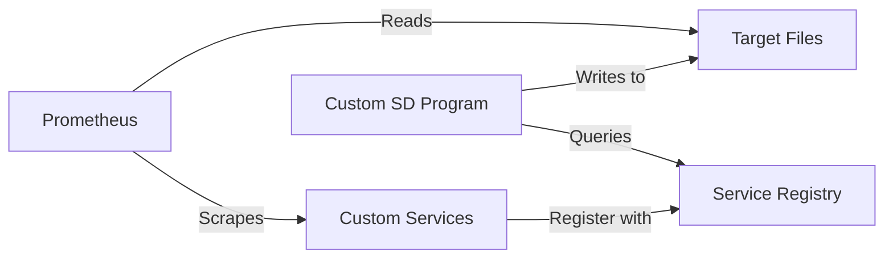

# Custom Service Discovery in Prometheus

## Introduction

Service discovery is one of Prometheus' most powerful features, allowing it to automatically find and monitor targets in dynamic environments. While Prometheus ships with many built-in service discovery mechanisms for popular platforms like Kubernetes, AWS, and Docker, there are scenarios where you might need to integrate with custom infrastructure or implement specialized discovery logic.

Custom service discovery enables you to extend Prometheus' capabilities by creating your own mechanisms to discover and monitor targets. This is particularly useful when:

- Working with proprietary or custom infrastructure not supported by built-in mechanisms
- Implementing unique discovery logic specific to your organization
- Integrating with legacy systems or custom service registries
- Creating specialized monitoring workflows for specific applications

In this guide, we'll explore how to implement custom service discovery in Prometheus, understand the available methods, and walk through practical examples.

## Methods for Custom Service Discovery

Prometheus offers several approaches for implementing custom service discovery:

1. **File-based Service Discovery**: The simplest approach, where target information is provided in files that Prometheus reads
2. **Custom HTTP Service Discovery**: An HTTP endpoint that Prometheus queries for target information
3. **Custom Service Discovery Programs**: External programs that generate target files for Prometheus

Let's explore each method in detail.

## File-based Service Discovery

The simplest way to implement custom service discovery is through file-based SD. In this approach, you write a program that generates files containing target information in a format Prometheus can understand.

### How it Works

1. You create a program that discovers your services
2. The program writes target information to files in JSON or YAML format
3. Prometheus periodically reads these files to update its targets

### Configuration

To configure file-based service discovery in Prometheus, use the `file_sd_configs` section in your `prometheus.yml`:

```yaml
scrape_configs:
  - job_name: 'custom-file-sd'
    file_sd_configs:
      - files:
        - '/path/to/targets/*.json'
        refresh_interval: 30s
```

### File Format

The files should contain an array of target groups, each with its own set of labels:

```json
[
  {
    "targets": ["host1:9100", "host2:9100"],
    "labels": {
      "env": "production",
      "service": "api"
    }
  },
  {
    "targets": ["host3:9100"],
    "labels": {
      "env": "staging",
      "service": "backend"
    }
  }
]
```

### Example Implementation

Let's create a simple Python script that discovers services in a custom environment and writes them to a file for Prometheus:

```python
#!/usr/bin/env python3
import json
import os
import time
import requests

OUTPUT_FILE = '/path/to/targets/custom_targets.json'
DISCOVERY_ENDPOINT = 'https://my-service-registry/api/services'
REFRESH_INTERVAL = 60  # seconds

def discover_services():
    # In a real implementation, this would query your service registry
    try:
        response = requests.get(DISCOVERY_ENDPOINT)
        services = response.json()
        
        # Transform the services into Prometheus target format
        target_groups = []
        for service in services:
            target_groups.append({
                "targets": [f"{service['host']}:{service['port']}"],
                "labels": {
                    "service": service['name'],
                    "env": service['environment'],
                    "team": service['team']
                }
            })
        
        # Ensure directory exists
        os.makedirs(os.path.dirname(OUTPUT_FILE), exist_ok=True)
        
        # Write to temporary file and rename to ensure atomic updates
        temp_file = OUTPUT_FILE + '.temp'
        with open(temp_file, 'w') as f:
            json.dump(target_groups, f)
        
        os.rename(temp_file, OUTPUT_FILE)
        print(f"Updated {OUTPUT_FILE} with {len(target_groups)} target groups")
        
    except Exception as e:
        print(f"Error discovering services: {e}")

def main():
    while True:
        discover_services()
        time.sleep(REFRESH_INTERVAL)

if __name__ == "__main__":
    main()
```

Run this script as a service to continuously update the targets file.

## HTTP Service Discovery

Prometheus can also query an HTTP endpoint to discover targets. This approach requires you to implement an HTTP server that returns target information.

### How it Works

1. You implement an HTTP server with an endpoint that returns target information
2. Prometheus periodically calls this endpoint to refresh its targets
3. The endpoint returns target information in JSON format

### Configuration

Configure HTTP service discovery using the `http_sd_configs` section:

```yaml
scrape_configs:
  - job_name: 'custom-http-sd'
    http_sd_configs:
      - url: 'http://service-discovery:8080/targets'
        refresh_interval: 30s
```

### Response Format

The HTTP endpoint must return JSON in the same format as file-based SD:

```json
[
  {
    "targets": ["app1.example.com:9090", "app2.example.com:9090"],
    "labels": {
      "env": "production",
      "job": "api-service"
    }
  }
]
```

### Example Implementation

Here's a simple Flask application that serves as a custom HTTP service discovery endpoint:

```python
from flask import Flask, jsonify
import requests

app = Flask(__name__)

# In a real implementation, this would query your service registry
def get_services():
    service_registry_url = "https://my-service-registry/api/services"
    try:
        response = requests.get(service_registry_url)
        return response.json()
    except Exception as e:
        app.logger.error(f"Error fetching services: {e}")
        return []

@app.route('/targets')
def targets():
    services = get_services()
    
    # Transform to Prometheus target format
    target_groups = []
    for service in services:
        target_groups.append({
            "targets": [f"{service['host']}:{service['port']}"],
            "labels": {
                "service": service['name'],
                "env": service['environment']
            }
        })
    
    return jsonify(target_groups)

if __name__ == '__main__':
    app.run(host='0.0.0.0', port=8080)
```

## Custom Service Discovery Programs

For more complex scenarios, Prometheus supports custom service discovery programs. These are external programs that Prometheus runs to discover targets.

### How it Works

1. Prometheus executes the specified program when it starts
2. The program outputs target information to its standard output
3. Prometheus reads this output to configure its targets

### Configuration

Configure a custom SD program in your `prometheus.yml`:

```yaml
scrape_configs:
  - job_name: 'custom-program-sd'
    file_sd_configs:
      - files:
        - custom_sd_targets.json
    relabel_configs:
      - source_labels: [__meta_custom_environment]
        target_label: env
```

Then set up a separate service that runs your custom SD program and writes to the specified file.

### Example Implementation

Here's an example in Go that implements a custom service discovery program:

```go
package main

import (
	"encoding/json"
	"log"
	"os"
	"time"
)

type Target struct {
	Targets []string          `json:"targets"`
	Labels  map[string]string `json:"labels"`
}

func discoverServices() ([]Target, error) {
	// In a real implementation, this would discover your services
	// For this example, we'll return static targets
	
	targets := []Target{
		{
			Targets: []string{"service1:9090", "service2:9090"},
			Labels: map[string]string{
				"__meta_custom_environment": "production",
				"__meta_custom_team": "backend",
			},
		},
		{
			Targets: []string{"service3:9090"},
			Labels: map[string]string{
				"__meta_custom_environment": "staging",
				"__meta_custom_team": "data",
			},
		},
	}
	
	return targets, nil
}

func main() {
	outputFile := "custom_sd_targets.json"
	
	for {
		targets, err := discoverServices()
		if err != nil {
			log.Printf("Error discovering services: %v", err)
			time.Sleep(30 * time.Second)
			continue
		}
		
		data, err := json.MarshalIndent(targets, "", "  ")
		if err != nil {
			log.Printf("Error marshaling targets: %v", err)
			time.Sleep(30 * time.Second)
			continue
		}
		
		tempFile := outputFile + ".tmp"
		err = os.WriteFile(tempFile, data, 0644)
		if err != nil {
			log.Printf("Error writing to temp file: %v", err)
			time.Sleep(30 * time.Second)
			continue
		}
		
		err = os.Rename(tempFile, outputFile)
		if err != nil {
			log.Printf("Error renaming temp file: %v", err)
			time.Sleep(30 * time.Second)
			continue
		}
		
		log.Printf("Updated %s with %d target groups", outputFile, len(targets))
		time.Sleep(30 * time.Second)
	}
}
```

## Creating a Complete Custom Service Discovery Solution

Let's tie everything together with a more comprehensive example that discovers services from a custom API and provides them to Prometheus.

### Architecture



### Implementation

Our solution will include:

1. A service registry with a REST API
2. A custom SD adapter that queries the registry and formats targets for Prometheus
3. Prometheus configuration to read these targets

### Service Registry Mock

We'll simulate a service registry API with a simple HTTP server:

```python
from flask import Flask, jsonify, request
import threading
import time

app = Flask(__name__)

# In-memory storage for services
services = []

@app.route('/services', methods=['GET'])
def get_services():
    return jsonify(services)

@app.route('/services', methods=['POST'])
def register_service():
    service = request.json
    # Simple validation
    if not all(k in service for k in ['name', 'host', 'port']):
        return jsonify({"error": "Missing required fields"}), 400
    
    # Remove existing service with same name if exists
    global services
    services = [s for s in services if s['name'] != service['name']]
    services.append(service)
    return jsonify({"status": "registered"}), 201

def cleanup_services():
    """Remove services that haven't sent heartbeats"""
    while True:
        time.sleep(60)
        global services
        current_time = time.time()
        services = [s for s in services if current_time - s.get('last_seen', 0) < 120]

# Start cleanup thread
threading.Thread(target=cleanup_services, daemon=True).start()

if __name__ == '__main__':
    app.run(host='0.0.0.0', port=8081)
```

### Custom Service Discovery Adapter

This program will query our service registry and format the results for Prometheus:

```python
#!/usr/bin/env python3
import json
import os
import time
import requests
import logging

# Configure logging
logging.basicConfig(
    level=logging.INFO,
    format='%(asctime)s - %(name)s - %(levelname)s - %(message)s'
)
logger = logging.getLogger('prometheus-sd-adapter')

# Configuration
OUTPUT_DIR = '/etc/prometheus/sd'
OUTPUT_FILE = os.path.join(OUTPUT_DIR, 'custom_targets.json')
SERVICE_REGISTRY_URL = 'http://service-registry:8081/services'
REFRESH_INTERVAL = 30  # seconds

def discover_services():
    """Query the service registry and format services for Prometheus"""
    try:
        response = requests.get(SERVICE_REGISTRY_URL, timeout=10)
        response.raise_for_status()
        services = response.json()
        
        logger.info(f"Discovered {len(services)} services from registry")
        
        # Transform to Prometheus target format
        target_groups = []
        for service in services:
            # Skip services that don't have required fields
            if not all(k in service for k in ['name', 'host', 'port']):
                logger.warning(f"Skipping service with missing fields: {service}")
                continue
                
            # Create target group
            target = {
                "targets": [f"{service['host']}:{service['port']}"],
                "labels": {
                    "service": service['name']
                }
            }
            
            # Add optional labels if present
            for label in ['environment', 'team', 'version', 'datacenter']:
                if label in service:
                    target['labels'][label] = service[label]
            
            target_groups.append(target)
        
        # Ensure output directory exists
        os.makedirs(OUTPUT_DIR, exist_ok=True)
        
        # Write to temporary file and rename for atomic update
        temp_file = OUTPUT_FILE + '.temp'
        with open(temp_file, 'w') as f:
            json.dump(target_groups, f, indent=2)
        
        os.rename(temp_file, OUTPUT_FILE)
        logger.info(f"Updated {OUTPUT_FILE} with {len(target_groups)} target groups")
        
    except requests.exceptions.RequestException as e:
        logger.error(f"Error querying service registry: {e}")
    except json.JSONDecodeError as e:
        logger.error(f"Error parsing response from service registry: {e}")
    except Exception as e:
        logger.error(f"Unexpected error in service discovery: {e}")

def main():
    """Main loop to periodically discover services"""
    logger.info("Starting Prometheus Service Discovery adapter")
    
    while True:
        discover_services()
        time.sleep(REFRESH_INTERVAL)

if __name__ == "__main__":
    main()
```

### Prometheus Configuration

Configure Prometheus to use our custom service discovery:

```yaml
global:
  scrape_interval: 15s
  evaluation_interval: 15s

scrape_configs:
  - job_name: 'custom-services'
    file_sd_configs:
      - files:
        - '/etc/prometheus/sd/custom_targets.json'
        refresh_interval: 5s
    relabel_configs:
      - source_labels: [service]
        target_label: job
```

### Using Docker Compose

Here's a complete setup using Docker Compose:

```yaml
version: '3'
services:
  # Service registry
  service-registry:
    build: ./service-registry
    ports:
      - "8081:8081"
  
  # Custom service discovery adapter
  sd-adapter:
    build: ./sd-adapter
    volumes:
      - prometheus_data:/etc/prometheus/sd
    environment:
      - SERVICE_REGISTRY_URL=http://service-registry:8081/services
      - OUTPUT_FILE=/etc/prometheus/sd/custom_targets.json
      - REFRESH_INTERVAL=30
    depends_on:
      - service-registry
  
  # Prometheus server
  prometheus:
    image: prom/prometheus:latest
    ports:
      - "9090:9090"
    volumes:
      - ./prometheus.yml:/etc/prometheus/prometheus.yml
      - prometheus_data:/etc/prometheus/sd
    depends_on:
      - sd-adapter

volumes:
  prometheus_data:
```

## Best Practices for Custom Service Discovery

When implementing custom service discovery for Prometheus, follow these best practices:

1. **Resilience**: Make your SD mechanism resilient to failures, with proper error handling and retries
2. **Performance**: Optimize for performance, especially in large environments
3. **Atomic Updates**: Use atomic file operations (write to temp file, then rename) to prevent Prometheus from reading partial files
4. **Labeling**: Add meaningful labels to targets for better querying and visualization
5. **Caching**: Implement caching to reduce load on your service registry
6. **Logging**: Include comprehensive logging for troubleshooting
7. **Security**: Secure your service registry and discovery mechanism with proper authentication and authorization

## Common Pitfalls and How to Avoid Them

When implementing custom service discovery, watch out for these common issues:

1. **Stale Targets**: Implement proper cleanup of stale services
2. **High Cardinality**: Avoid adding too many unique label values
3. **Too Frequent Updates**: Balance refresh intervals to avoid overloading systems
4. **Missing Metadata**: Ensure all necessary metadata is included with each target
5. **Inconsistent Naming**: Use consistent naming conventions for services and labels

## Summary

Custom service discovery extends Prometheus' capabilities to monitor dynamic environments beyond what's covered by built-in service discovery mechanisms. In this guide, we've explored:

- Different methods for implementing custom service discovery (file-based, HTTP, and custom programs)
- How to implement each method with practical examples
- A complete end-to-end solution that integrates with a custom service registry
- Best practices and common pitfalls to avoid

By creating your own service discovery mechanisms, you can adapt Prometheus to monitor any environment, regardless of its complexity or proprietary nature.

## Additional Resources

- [Prometheus Service Discovery Documentation](https://prometheus.io/docs/prometheus/latest/configuration/configuration/#scrape_config)
- [File-Based Service Discovery](https://prometheus.io/docs/prometheus/latest/configuration/configuration/#file_sd_config)
- [HTTP-Based Service Discovery](https://prometheus.io/docs/prometheus/latest/configuration/configuration/#http_sd_config)

## Exercises

1. Implement a simple file-based service discovery mechanism that discovers services running on your local machine
2. Create an HTTP service discovery endpoint that integrates with your organization's service registry
3. Extend the examples in this guide to add health checking to the discovered services
4. Implement custom relabeling rules to transform service metadata into meaningful Prometheus labels
5. Design a service discovery solution for a distributed microservice architecture spanning multiple data centers