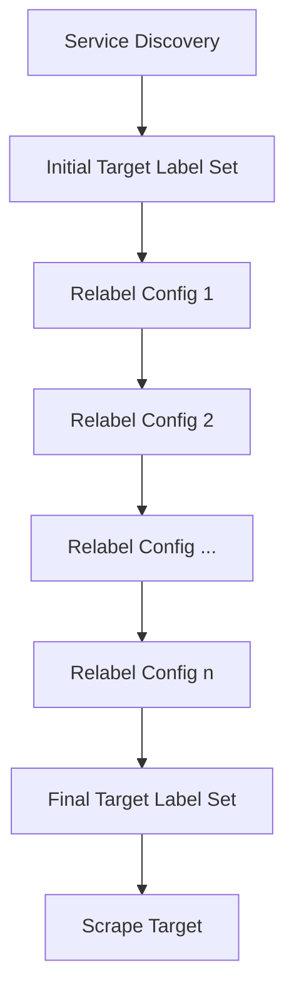

# Service Discovery Relabeling

Service discovery relabeling is a powerful feature in Prometheus that allows you to manipulate, filter, and transform target labels before scraping. It gives you fine-grained control over what targets Prometheus monitors and how those targets are labeled.

## Introduction

When Prometheus discovers targets through its service discovery mechanisms, it initially generates a set of labels for each target. These labels contain metadata about the target, such as its address, name, and other attributes specific to the service discovery method. 

However, these raw labels might not always be in the format you need. This is where relabeling comes in — it allows you to:

- Filter targets (keeping only those that match certain criteria)
- Modify label names and values
- Create new labels based on existing ones
- Drop unnecessary labels
- Standardize label naming across different service discovery mechanisms

Relabeling happens during the service discovery process, before Prometheus attempts to scrape metrics from targets.

## Understanding Relabeling Configurations

Relabeling is configured using a sequence of `relabel_configs` entries in your Prometheus configuration. Each entry specifies a relabeling operation to perform.

### Basic Structure

A basic relabeling configuration looks like this:

```yaml
scrape_configs:
  - job_name: 'my-job'
    # Service discovery configuration here...
    relabel_configs:
      - source_labels: [<label_name>, ...]
        separator: <separator_string>
        regex: <regex_pattern>
        target_label: <label_to_modify>
        replacement: <replacement_string>
        action: <relabeling_action>
```

Let's examine each field:

- `source_labels`: The list of labels to consider as input
- `separator`: The string used to join values from multiple source labels (default: `;`)
- `regex`: A regular expression to match against the concatenated source labels
- `target_label`: The label to modify (for some actions)
- `replacement`: The replacement value (for some actions)
- `action`: The relabeling action to perform (default: `replace`)

## Relabeling Actions

Prometheus supports several relabeling actions:

### 1. `replace` (Default)

Matches the `regex` against the concatenated `source_labels`. If it matches, sets `target_label` to `replacement`, with matches from the regex expanded.

Example:

```yaml
relabel_configs:
  - source_labels: [__meta_kubernetes_pod_label_app]
    regex: '(.*)'
    target_label: application
    replacement: '$1'
    action: replace
```

This extracts the Kubernetes pod label `app` and stores it in a label called `application`.

### 2. `keep`

Drops targets for which the concatenated `source_labels` do not match the `regex`.

Example:

```yaml
relabel_configs:
  - source_labels: [__meta_kubernetes_namespace]
    regex: 'production|staging'
    action: keep
```

This keeps only targets in the `production` or `staging` Kubernetes namespaces.

### 3. `drop`

Drops targets for which the concatenated `source_labels` match the `regex`.

Example:

```yaml
relabel_configs:
  - source_labels: [__meta_kubernetes_namespace]
    regex: 'testing|development'
    action: drop
```

This drops all targets in the `testing` or `development` Kubernetes namespaces.

### 4. `labelmap`

Matches `regex` against all label names. Then copies the values of the matching labels to label names given by `replacement` with captures expanded.

Example:

```yaml
relabel_configs:
  - regex: '__meta_kubernetes_pod_label_(.+)'
    action: labelmap
    replacement: 'pod_$1'
```

This transforms all Kubernetes pod labels to Prometheus labels with the prefix `pod_`.

### 5. `labeldrop`

Matches `regex` against all label names. Any label that matches will be removed from the label set.

Example:

```yaml
relabel_configs:
  - regex: 'node_.*'
    action: labeldrop
```

This removes all labels that start with `node_`.

### 6. `labelkeep`

Matches `regex` against all label names. Any label that does not match will be removed from the label set.

Example:

```yaml
relabel_configs:
  - regex: '(job|instance|application)'
    action: labelkeep
```

This keeps only the `job`, `instance`, and `application` labels.

### 7. `hashmod`

Sets `target_label` to the `modulus` of a hash of the concatenated `source_labels`.

Example:

```yaml
relabel_configs:
  - source_labels: [__address__]
    target_label: __tmp_hash
    action: hashmod
    modulus: 8
```

This is useful for implementing sharding.

### 8. `lowercase`

Writes the concatenated `source_labels` in lowercase to `target_label`.

Example:

```yaml
relabel_configs:
  - source_labels: [__meta_kubernetes_pod_label_app]
    target_label: app
    action: lowercase
```

This ensures that the `app` label is always lowercase.

### 9. `uppercase`

Writes the concatenated `source_labels` in uppercase to `target_label`.

Example:

```yaml
relabel_configs:
  - source_labels: [__meta_kubernetes_pod_label_app]
    target_label: app
    action: uppercase
```

This ensures that the `app` label is always uppercase.

## Special Target Labels

Some labels are treated specially in Prometheus:

- `__address__`: The `<host>:<port>` address of the target
- `__scheme__`: The scheme (http, https) to use
- `__metrics_path__`: The metrics path on the target
- `__param_<name>`: The HTTP URL parameter `<name>`
- `__scrape_interval__`: The scrape interval to use
- `__scrape_timeout__`: The scrape timeout to use

You can manipulate these labels using relabeling to change how Prometheus scrapes a target.

## Relabeling Pipeline

Relabeling operations are applied in sequence. The output of one relabeling step becomes the input for the next. This means the order of your relabeling rules is important.



## Practical Examples

Let's look at some real-world examples of service discovery relabeling.

### Example 1: Filtering Kubernetes Pods by Label

```yaml
scrape_configs:
  - job_name: 'kubernetes-pods'
    kubernetes_sd_configs:
      - role: pod
    relabel_configs:
      # Keep only pods with the label "prometheus.io/scrape=true"
      - source_labels: [__meta_kubernetes_pod_annotation_prometheus_io_scrape]
        action: keep
        regex: true
      
      # Use custom scrape path if specified
      - source_labels: [__meta_kubernetes_pod_annotation_prometheus_io_path]
        action: replace
        target_label: __metrics_path__
        regex: (.+)
      
      # Set application label based on pod app label
      - source_labels: [__meta_kubernetes_pod_label_app]
        action: replace
        target_label: app
      
      # Set namespace label
      - source_labels: [__meta_kubernetes_namespace]
        action: replace
        target_label: kubernetes_namespace
```

This configuration:
1. Discovers all Kubernetes pods
2. Keeps only those with the annotation `prometheus.io/scrape=true`
3. Uses a custom metrics path if specified
4. Adds appropriate labels for app and namespace

### Example 2: Monitoring Multiple Environments with Consistent Labels

```yaml
scrape_configs:
  - job_name: 'production-services'
    consul_sd_configs:
      - server: 'prod-consul:8500'
    relabel_configs:
      - source_labels: [__meta_consul_tags]
        regex: '.*,production,.*'
        action: keep
      - source_labels: [__meta_consul_service]
        target_label: service
      - target_label: environment
        replacement: 'production'
  
  - job_name: 'staging-services'
    consul_sd_configs:
      - server: 'staging-consul:8500'
    relabel_configs:
      - source_labels: [__meta_consul_service]
        target_label: service
      - target_label: environment
        replacement: 'staging'
```

This configuration:
1. Sets up two job configurations, one for production and one for staging
2. In production, it keeps only targets tagged with "production"
3. In both environments, it standardizes the `service` label
4. It adds an `environment` label to distinguish metrics from different environments

### Example 3: Using hashmod for Sharding

```yaml
scrape_configs:
  - job_name: 'sharded-service'
    ec2_sd_configs:
      - region: us-east-1
        port: 9100
    relabel_configs:
      # Extract the instance ID
      - source_labels: [__meta_ec2_instance_id]
        target_label: instance_id
      
      # Shard targets based on instance ID
      - source_labels: [__meta_ec2_instance_id]
        target_label: __tmp_hash
        action: hashmod
        modulus: 4
      
      # This Prometheus server only scrapes targets with shard 0
      - source_labels: [__tmp_hash]
        regex: ^0$
        action: keep
```

This configuration:
1. Discovers EC2 instances in us-east-1
2. Assigns each instance to one of 4 shards using the `hashmod` action
3. Keeps only instances assigned to shard 0 (to be used on one of 4 Prometheus servers)

## Debugging Relabeling

Relabeling rules can be complex, and it's not always obvious why a target is being included or excluded. 

You can use Prometheus's targets page (accessible from the web UI at `/targets`) to see the labels for each target after relabeling. For dropped targets, you need to temporarily change `keep` or `drop` actions to `replace` (with a dummy target label) to see them in the web UI.

For more detailed debugging, you can also use the API endpoint:

```
GET /api/v1/targets
```

This returns all targets, including their original and relabeled labels.

## Best Practices

Here are some best practices for service discovery relabeling:

1. **Filter Early**: Place `keep` and `drop` actions at the beginning of your relabeling configurations to avoid unnecessary processing.

2. **Be Careful with Regular Expressions**: Complex regular expressions can impact performance. Keep them simple and efficient.

3. **Standardize Labels**: Use relabeling to ensure consistent label names across different service discovery mechanisms.

4. **Document Your Relabeling**: Add comments to explain what each relabeling step does.

5. **Test on a Small Scale**: When implementing complex relabeling, test it on a small subset of targets first.

6. **Use Meaningful Label Names**: Choose label names that clearly indicate their purpose.

7. **Avoid Label Explosion**: Be cautious about creating too many unique label values, as this can impact Prometheus performance.

## Summary

Service discovery relabeling is a powerful feature in Prometheus that gives you control over which targets are scraped and how they are labeled. By using different relabeling actions like `replace`, `keep`, `drop`, and `labelmap`, you can:

- Filter targets based on metadata
- Transform and normalize labels
- Add additional context to your metrics
- Implement advanced patterns like sharding

Mastering relabeling configurations allows you to build flexible, dynamic monitoring systems that automatically adapt to changes in your infrastructure.

## Additional Resources

- [Official Prometheus Documentation on Relabeling](https://prometheus.io/docs/prometheus/latest/configuration/configuration/#relabel_config)
- [Life of a Label - Blog Post](https://www.robustperception.io/life-of-a-label/)
- [Common Relabeling Patterns](https://prometheus.io/docs/guides/basic-auth/)

## Exercises

1. Create a relabeling configuration that keeps only targets with a specific tag and rename that tag to a standardized label name.

2. Design a relabeling configuration for Kubernetes that:
   - Only scrapes pods with the annotation `prometheus.io/scrape=true`
   - Uses the pod's annotation `prometheus.io/port` if available
   - Adds the pod's namespace, deployment name, and container name as labels

3. Create a relabeling configuration that implements sharding across multiple Prometheus servers using the `hashmod` action.