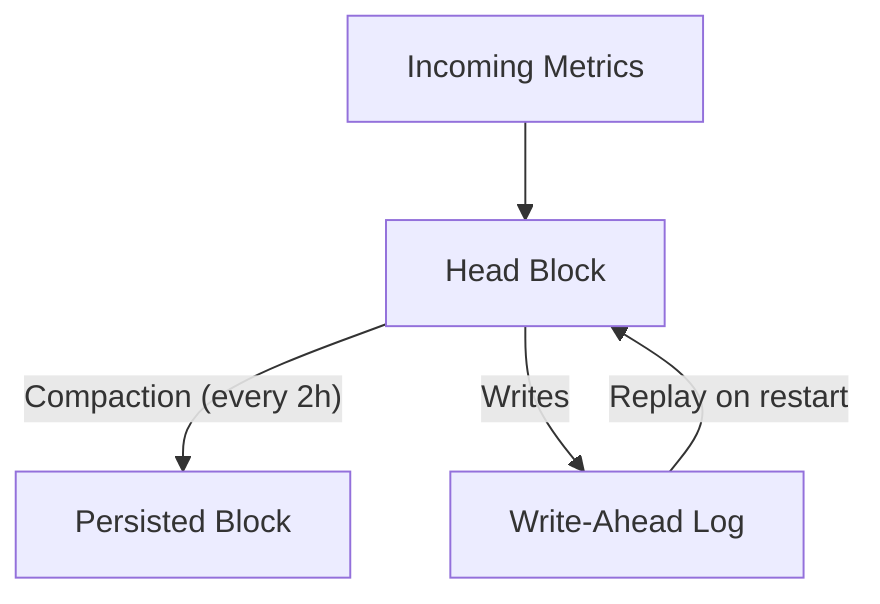
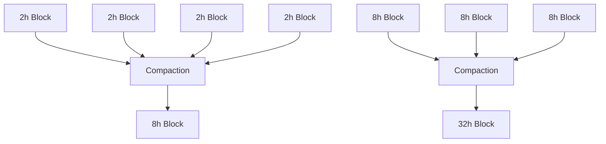
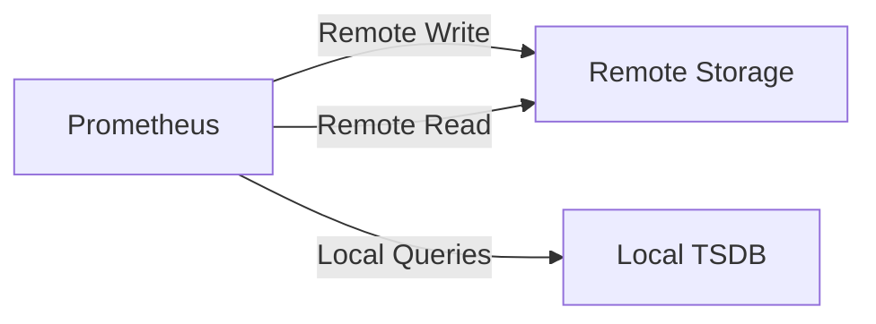

# Prometheus Storage Architecture

## Introduction

Prometheus is a powerful open-source monitoring and alerting system that collects and stores time series data as metrics. One of the core components that makes Prometheus efficient is its storage architecture. In this guide, we'll explore how Prometheus organizes, compresses, and manages metrics data on disk, providing insights into its performance characteristics and operational considerations.

The storage architecture is fundamental to understanding how Prometheus balances speed and efficiency when dealing with potentially millions of time series.

## Core Storage Components

Prometheus's storage architecture consists of several key components:

### Time Series Database (TSDB)

At its heart, Prometheus uses a custom-built Time Series Database (TSDB) optimized for the specific workloads of metrics collection. This TSDB is designed to:

- Handle high volumes of time series data with minimal overhead
- Provide fast query performance for common monitoring patterns
- Efficiently compress data to reduce disk usage
- Support Prometheus's retention and downsampling requirements

The TSDB was completely rewritten in Prometheus 2.0, significantly improving performance and resource usage compared to the earlier versions.

### Data Organization

Prometheus organizes data in time blocks, with each block containing data for a specific time range:

- **Head Block**: The most recent, in-memory, mutable block where new samples are written
- **Persisted Blocks**: Immutable blocks on disk containing older data
- **WAL (Write-Ahead Log)**: Ensures data durability even in case of crashes

Let's explore each of these in detail.

## The Head Block

The head block is where all incoming samples are initially stored. It's kept in memory for fast access and has several important characteristics:

- Accepts new data points (samples) for currently active time series
- Maintains a memory-mapped chunk file for durability
- Is periodically compacted and written to disk as an immutable persisted block
- Typically represents the most recent 2 hours of data (configurable)

Here's a simple diagram illustrating the head block's role:



### Memory Management

The head block's memory usage is primarily determined by:

1. The number of active time series
2. The number of labels per series
3. The churn rate (creation of new series)

It's important to monitor Prometheus's memory usage, as a sudden increase in active series can lead to memory pressure.

## Persisted Blocks

Once the head block reaches a certain age (2 hours by default), it's compacted and written to disk as a persisted block. These blocks have the following properties:

- Immutable (never change once written)
- Highly compressed to save disk space
- Organized by time ranges (e.g., 2-hour blocks)
- Include metadata, index, and chunk files

Each persisted block contains:

- **Index**: Fast lookup of series by labels
- **Chunks**: The actual compressed time series data
- **Tombstones**: Markers for deleted series
- **Metadata**: Information about the block

Let's look at how data is stored on disk:

```
data/
  ├── 01BKGV7JC0RY8A6MACW02A2PJD/
  │   ├── chunks/
  │   │   ├── 000001
  │   │   ├── 000002
  │   │   └── ...
  │   ├── index
  │   ├── meta.json
  │   └── tombstones
  ├── 01BKGTZQ1SYQJTR4PB43C8PD98/
  │   ├── chunks/
  ���   │   ├── 000001
  │   │   ├── 000002
  │   │   └── ...
  │   ├── index
  │   ├── meta.json
  │   └── tombstones
  ├── chunks_head/
  └── wal/
      ├── 000000001
      ├── 000000002
      └── ...
```

The directory name (e.g., `01BKGV7JC0RY8A6MACW02A2PJD`) is a unique identifier for each block.

## The Write-Ahead Log (WAL)

The WAL is critical for data durability. It works as follows:

1. Before new samples are added to the head block, they're first written to the WAL
2. In case of a crash, Prometheus can recover the in-memory state by replaying the WAL
3. WAL segments are deleted once their corresponding data has been successfully persisted to disk

This ensures that no data is lost due to unexpected shutdowns or crashes.

## Compaction Process

To manage disk space and improve query performance, Prometheus regularly compacts blocks. This process:

1. Merges smaller blocks into larger ones
2. Applies retention policies (removing old data)
3. Optimizes indexes and deduplicate data
4. Handles tombstones (series marked for deletion)

The compaction process occurs in the background and is controlled by several configuration parameters.

Here's a visualization of the compaction process:



## Data Compression

One of the key features of Prometheus's storage is its efficient compression algorithms:

1. **Delta encoding**: Stores differences between timestamps instead of absolute values
2. **XOR compression**: Efficiently encodes differences between sample values
3. **Variable bit-length encoding**: Uses fewer bits for smaller numbers
4. **Dictionary compression**: For label values and metric names

These techniques allow Prometheus to achieve very high compression ratios, often 10:1 or better compared to raw data.

## Practical Example: Configuring Storage

Let's look at a practical example of configuring Prometheus storage settings:

```yaml
global:
  scrape_interval: 15s

storage:
  tsdb:
    path: /path/to/data
    retention.time: 15d
    retention.size: 30GB
    wal_compression: true

  # Configuration for remote write
  remote_write:
    - url: "http://remote-storage:8080/write"
      queue_config:
        capacity: 10000
        max_shards: 200
```

In this configuration:
- Data is stored in `/path/to/data`
- Retention is set to 15 days or 30GB, whichever comes first
- WAL compression is enabled
- Remote write is configured to send data to an external storage system

## Performance Considerations

When running Prometheus in production, consider these storage-related factors:

### Disk I/O

Prometheus is I/O intensive, especially during:
- Writing new blocks
- Compaction processes
- High query loads

Using SSDs instead of HDDs can significantly improve performance.

### Memory Usage

Memory requirements grow with:
1. Number of active time series
2. Cardinality of labels
3. Query complexity

A common rule of thumb is to allocate 1-2GB of RAM per million active time series.

### Example Memory Calculation

```
Memory (bytes) ≈ (active_series * 3KB) + headblock_overhead
```

For 1 million series: 1,000,000 * 3KB ≈ 3GB plus overhead

### Optimizing Storage Performance

Here are some tips to improve Prometheus storage performance:

1. **Reduce cardinality**: Limit high-cardinality labels that create too many time series
2. **Use appropriate retention**: Only keep data as long as needed
3. **Monitor disk usage**: Set alerts for approaching storage limits
4. **Consider remote storage**: For long-term data retention

## Example: Checking Storage Status

You can check the status of your Prometheus storage using API endpoints or the expression browser.

Using the API:

```bash
curl -s http://localhost:9090/api/v1/status/tsdb | jq .
```

Example output:

```json
{
  "status": "success",
  "data": {
    "headStats": {
      "numSeries": 845429,
      "numLabelPairs": 8312023,
      "chunkCount": 2391233,
      "minTime": 1628079300000,
      "maxTime": 1628086500000
    },
    "seriesCountByMetricName": [
      {
        "name": "up",
        "value": 942
      },
      {
        "name": "node_cpu_seconds_total",
        "value": 23520
      }
    ],
    "labelValueCountByLabelName": [
      {
        "name": "instance",
        "value": 132
      },
      {
        "name": "job",
        "value": 22
      }
    ]
  }
}
```

This output provides insights into:
- The number of active series in the head block
- Series counts by metric name
- Label cardinality information

## Advanced Topic: Local vs Remote Storage

While Prometheus's local storage is highly optimized, it has limitations:
- Not designed for long-term historical data
- Limited by single-node scalability
- No high availability without federation

For these reasons, Prometheus supports integration with remote storage systems through:
- **Remote Write**: Sends samples to a compatible remote storage
- **Remote Read**: Queries data from remote storage when not available locally



Popular remote storage options include:
- Thanos
- Cortex
- Victoria Metrics
- Prometheus's own long-term storage solutions

## Summary

Prometheus's storage architecture is a carefully designed system that balances performance, efficiency, and reliability:

- Uses a custom TSDB optimized for time series metrics
- Organizes data in head blocks (in-memory) and persisted blocks (on disk)
- Implements WAL for crash recovery
- Uses sophisticated compression to minimize disk usage
- Provides configurable retention and compaction
- Offers remote storage options for long-term data and scalability

Understanding the storage architecture helps you:
1. Better configure and optimize Prometheus for your environment
2. Troubleshoot performance issues
3. Make informed decisions about scaling and long-term storage needs
4. Plan for resource requirements as your monitoring needs grow

## Additional Resources

For more in-depth learning:

- Prometheus documentation on [Storage](https://prometheus.io/docs/prometheus/latest/storage/)
- The [TSDB format](https://github.com/prometheus/prometheus/blob/main/tsdb/docs/format/README.md) documentation
- Blog post: [Prometheus 2.0 Storage Layer](https://prometheus.io/blog/2017/11/08/announcing-prometheus-2-0/)

## Exercises

1. Configure a Prometheus instance with different retention settings and observe the impact on disk usage.
2. Use Prometheus's API to examine the details of your storage blocks.
3. Experiment with remote write to an external storage system.
4. Create a dashboard that monitors Prometheus's own storage metrics.
5. Simulate high cardinality and observe its impact on storage performance.