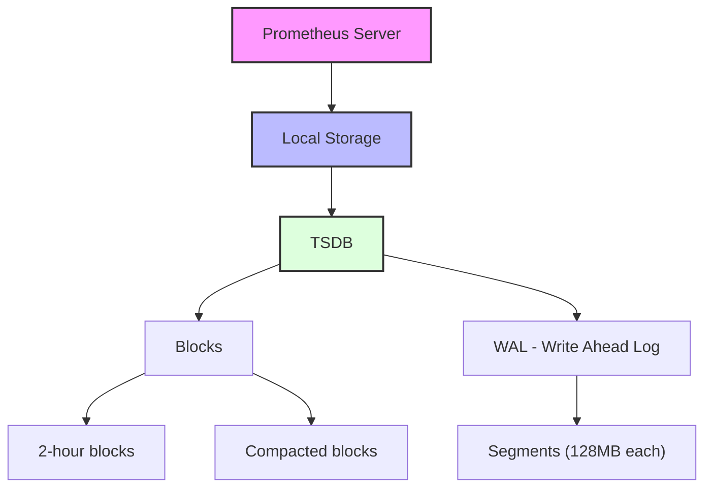

# Local Storage Configuration

## Introduction

Prometheus stores all its time series data in a local time series database (TSDB) on disk. This data storage is a critical component of Prometheus's architecture, as it enables both real-time monitoring and historical data analysis. Properly configuring local storage ensures optimal performance, efficient disk usage, and appropriate data retention based on your monitoring needs.

In this guide, we'll explore how to configure Prometheus's local storage, understand the storage directory structure, and optimize storage parameters for different use cases.

## Understanding Prometheus's Storage Architecture

Before diving into configuration, let's understand how Prometheus organizes data on disk:



Prometheus uses a custom time series database (TSDB) that organizes data into:

1. **Write-Ahead Log (WAL)**: Recent data is first written to the WAL to ensure durability in case of crashes.
2. **Blocks**: Data is then compacted into 2-hour blocks, which are later compacted into larger blocks.

## Basic Storage Configuration

You configure Prometheus's storage through command-line flags or the configuration file. Here are the most important storage-related options:

### Setting the Storage Directory

The most basic configuration is specifying where Prometheus should store its data:

```yaml
# prometheus.yml
storage:
  tsdb:
    path: "/path/to/data"
```

Or via command-line:

```bash
./prometheus --storage.tsdb.path="/path/to/data"
```

The default path is `./data` (relative to Prometheus's working directory), but in production environments, you should specify an absolute path on a suitable storage volume.

### Configuring Retention

Retention settings control how long Prometheus keeps data before deleting it:

```yaml
# prometheus.yml
storage:
  tsdb:
    path: "/path/to/data"
    retention:
      time: 15d
      size: 300GB
```

Or via command-line:

```bash
./prometheus --storage.tsdb.path="/path/to/data" --storage.tsdb.retention.time=15d --storage.tsdb.retention.size=300GB
```

Retention can be controlled by:

- **Time-based retention** (`retention.time`): How long to keep data (e.g., `15d` for 15 days)
- **Size-based retention** (`retention.size`): Maximum disk space to use (e.g., `300GB`)

Prometheus will apply whichever limit is reached first.

## Advanced Storage Configuration

### WAL Configuration

The Write-Ahead Log (WAL) ensures Prometheus can recover from crashes without data loss. You can configure its behavior:

```yaml
# prometheus.yml
storage:
  tsdb:
    wal-compression: true
```

Or via command-line:

```bash
./prometheus --storage.tsdb.wal-compression
```

With WAL compression enabled, the WAL segments are compressed, reducing disk space usage at the cost of some CPU overhead.

### Block Configuration

For fine-tuning block behavior:

```yaml
# prometheus.yml
storage:
  tsdb:
    min-block-duration: 2h
    max-block-duration: 36h
```

These settings control how quickly blocks are compacted and their maximum size.

### Out-of-Order Samples

By default, Prometheus rejects samples that arrive out of order. You can configure a tolerance window:

```yaml
# prometheus.yml
storage:
  tsdb:
    out-of-order-time-window: 30m
```

This allows ingesting samples that are up to 30 minutes out of order, useful in distributed setups where clock synchronization might not be perfect.

## Practical Examples

### Example 1: Basic Development Setup

For a development environment where disk space might be limited:

```yaml
# prometheus.yml
storage:
  tsdb:
    path: "./prometheus-data"
    retention:
      time: 2d
      size: 5GB
```

This configuration keeps data for 2 days or until it reaches 5GB, whichever comes first.

### Example 2: Production Monitoring System

For a production system monitoring critical infrastructure:

```yaml
# prometheus.yml
storage:
  tsdb:
    path: "/mnt/prometheus-data"
    retention:
      time: 90d
      size: 2TB
    wal-compression: true
    out-of-order-time-window: 10m
```

This setup:
- Stores data in a dedicated mount point
- Retains data for 90 days or until 2TB is reached
- Compresses the WAL to save space
- Allows for minor time synchronization issues

### Example 3: High-Cardinality Environment

When dealing with high-cardinality data (many time series):

```yaml
# prometheus.yml
storage:
  tsdb:
    path: "/mnt/prometheus-data"
    retention:
      time: 30d
    max-block-duration: 24h
    wal-compression: true
```

In high-cardinality environments, managing block sizes becomes important for query performance.

## Checking Storage Status

You can check the status of your storage through the Prometheus UI by accessing the `/tsdb-status` endpoint (e.g., http://localhost:9090/tsdb-status).

This page provides valuable metrics about:
- The number of time series
- Block counts and sizes
- Compaction activity
- Head chunks and WAL statistics

## Storage Optimization Tips

1. **Match retention to actual needs**: Longer retention requires more disk space and can slow down queries. Only keep what you need.

2. **Use dedicated volumes**: For production, use dedicated volumes with good I/O performance.

3. **Monitor the monitor**: Set up alerting on Prometheus's own metrics, especially:
   - `prometheus_tsdb_storage_blocks_bytes`
   - `prometheus_tsdb_head_series`
   - `prometheus_tsdb_wal_corruptions_total`

4. **Consider filesystem type**: XFS or ext4 are recommended for Prometheus data.

5. **Vertical scaling matters**: Prometheus performs better with more memory, as it keeps a significant portion of recent data in memory.

## Common Issues and Solutions

### Issue: High Disk Usage

If you're experiencing higher-than-expected disk usage:

```yaml
# prometheus.yml
storage:
  tsdb:
    wal-compression: true
    retention:
      time: 15d  # Reduce from default 30d
```

### Issue: Slow Queries

For performance issues with historical queries:

```yaml
# prometheus.yml
storage:
  tsdb:
    max-block-duration: 24h  # Smaller blocks can speed up queries
```

### Issue: Data Loss After Restarts

If you're experiencing data loss after restarts, check WAL configuration:

```yaml
# prometheus.yml
storage:
  tsdb:
    path: "/path/to/data"  # Ensure this points to a persistent location
```

## Summary

Proper configuration of Prometheus's local storage is essential for building a reliable and performant monitoring system. The key takeaways from this guide are:

- Prometheus stores time series data locally in blocks and a write-ahead log
- Configure retention based on your specific monitoring requirements
- Use compression and other optimizations for efficient storage usage
- Advanced options allow fine-tuning for specific environments
- Regular monitoring of your Prometheus storage helps prevent issues

By understanding and correctly configuring local storage, you'll ensure that your Prometheus installation can efficiently collect, store, and query the metrics you need while maintaining appropriate historical data.

## Additional Resources

- [Prometheus TSDB Documentation](https://prometheus.io/docs/prometheus/latest/storage/)
- [Prometheus Time Series Compression Algorithm Paper](https://fabxc.org/tsdb/)
- [Prometheus Storage PromCon Talks](https://prometheus.io/community/)

## Exercises

1. Configure a local Prometheus instance with different retention settings and observe how it affects disk usage over time.

2. Set up multiple Prometheus instances with different storage configurations and compare their performance under identical query loads.

3. Create a monitoring dashboard for your Prometheus instance that tracks its storage metrics, and set up alerts for potential storage issues.