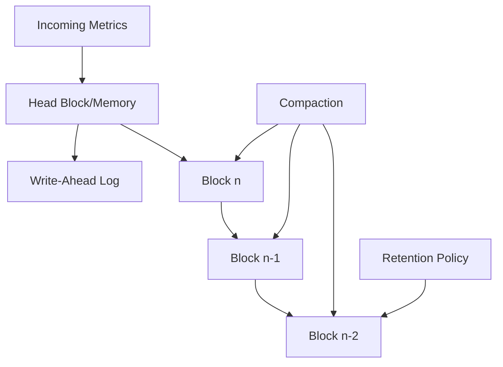

# Storage Performance Tuning

## Introduction

Prometheus stores all its time-series data in a custom-built database called the Time Series Database (TSDB). While Prometheus is designed to be efficient out of the box, understanding how to tune its storage can dramatically improve performance, reduce resource consumption, and ensure your monitoring system scales with your infrastructure.

In this guide, we'll explore various techniques to optimize Prometheus storage performance, from basic configuration changes to advanced strategies. Whether you're running Prometheus in a small environment or at enterprise scale, these optimizations will help you maintain a responsive and reliable monitoring system.

## Understanding Prometheus Storage Architecture

Before diving into tuning, let's understand how Prometheus stores data:

1. **Time Series Database (TSDB)**: Prometheus uses a custom time-series database optimized for high-cardinality time-series data.
2. **Blocks**: Data is stored in 2-hour blocks by default.
3. **Compaction**: Older blocks are compacted into larger blocks to improve query efficiency.
4. **Head Block**: Recent samples are kept in memory in the "head" block before being persisted to disk.
5. **Write-Ahead Log (WAL)**: Ensures data durability in case of crashes.

<br />



## Basic Storage Configuration Parameters

Let's start with the fundamental configuration options that affect storage performance:

### Storage Path

```yaml
storage:
  tsdb:
    path: "/path/to/prometheus/data"
```

The `path` parameter defines where Prometheus stores its data. Choose a location with:
- Fast disk I/O (SSDs preferred)
- Sufficient free space
- Proper filesystem permissions

### Retention Settings

```yaml
storage:
  tsdb:
    retention.time: 15d
    retention.size: 100GB
```

- `retention.time`: How long to keep data (default: 15 days)
- `retention.size`: Maximum storage size (optional)

Shorter retention periods reduce storage requirements and can improve query performance, especially for large deployments.

## Advanced Performance Tuning Options

### Block Duration

```yaml
storage:
  tsdb:
    # Default is 2h
    min-block-duration: "2h"
    max-block-duration: "24h"
```

Block duration affects:
- Write amplification
- Query performance
- Memory usage

**Recommendations**:
- For small to medium deployments, the default settings work well
- For large deployments with lots of historical queries, increasing max-block-duration can improve query performance

### Memory Management

```yaml
storage:
  tsdb:
    # Default is 1/3 of physical memory
    wal-segment-size: 100MB
    # Controls head block size
    max-block-chunks: 500000
```

- `wal-segment-size`: Smaller values reduce memory spikes but increase I/O operations
- `max-block-chunks`: Controls memory usage for the head block

### TSDB Compaction Tuning

```yaml
storage:
  tsdb:
    # Default: 20% of available space
    min-compact-size: "20MB"
    # Default: 30% of available space
    max-compact-size: "500MB"
```

Compaction settings affect:
- Disk I/O patterns
- Query latency
- Space amplification

## Real-World Tuning Scenarios

### Scenario 1: High-Cardinality Environment

If you're experiencing memory pressure due to high cardinality (many unique time series):

```yaml
storage:
  tsdb:
    max-block-chunks: 300000  # Reduce from default
    out-of-order-time-window: 10m  # Allow slight out-of-order samples
```

Additionally, consider:
1. Reviewing your relabeling configuration to reduce unnecessary labels
2. Using recording rules to pre-aggregate high-cardinality metrics
3. Implementing dedicated Prometheus instances for different workloads

### Scenario 2: Query Performance Optimization

If query performance is sluggish:

```yaml
storage:
  tsdb:
    max-block-duration: "6h"  # Increase for better query performance
query:
  max-samples: 100000000  # Increase max samples per query if needed
```

Additionally:
1. Use recording rules for frequently executed queries
2. Implement query federation for complex queries
3. Consider using Thanos or Cortex for larger setups

### Scenario 3: Limited Disk I/O

For environments with limited disk I/O:

```yaml
storage:
  tsdb:
    wal-compression: true
    wal-segment-size: 50MB  # Smaller WAL segments
```

This reduces I/O pressure at the cost of slightly higher CPU usage.

## Monitoring Storage Performance

To effectively tune storage, you need to monitor key metrics:

```yaml
# Example Prometheus scrape config to monitor itself
scrape_configs:
  - job_name: 'prometheus'
    static_configs:
      - targets: ['localhost:9090']
```

Key metrics to watch:
- `prometheus_tsdb_head_series`: Number of active time series
- `prometheus_tsdb_head_chunks`: Number of chunks in the head block
- `prometheus_tsdb_compaction_duration_seconds`: Time spent compacting blocks
- `prometheus_tsdb_storage_blocks_bytes`: Size of persisted blocks
- `prometheus_tsdb_wal_fsync_duration_seconds`: WAL sync latency

## Step-by-Step Tuning Process

Follow this process to tune your Prometheus storage:

1. **Establish a baseline**:
   ```bash
   # Check current storage usage
   du -sh /path/to/prometheus/data
   
   # Check current memory usage
   ps aux | grep prometheus
   ```

2. **Monitor impact of changes**:
   Create a dashboard with key storage metrics before making any changes.

3. **Tune in small increments**:
   Change one parameter at a time and observe the impact for at least 24 hours.

4. **Validate improvements**:
   Compare query performance and resource usage against your baseline.

## Real-World Example: E-commerce Monitoring

Let's look at a real-world example for an e-commerce site with spiky traffic patterns:

```yaml
global:
  scrape_interval: 15s
  evaluation_interval: 15s

storage:
  tsdb:
    path: "/prometheus-data"
    retention.time: 30d
    max-block-duration: "6h"
    wal-compression: true
    out-of-order-time-window: 5m

query:
  max-samples: 50000000

scrape_configs:
  # Various scrape configs here
```

This configuration:
- Extends retention to 30 days for month-over-month comparisons
- Uses WAL compression to reduce I/O
- Increases block duration for better query performance
- Allows slight out-of-order samples for more resilient ingestion

## Common Pitfalls and How to Avoid Them

### Pitfall 1: Excessive Retention

Keeping data for too long leads to:
- Increased storage requirements
- Slower queries
- Higher compaction overhead

**Solution**: Set retention based on actual usage patterns, not hypothetical needs.

### Pitfall 2: Ignoring Cardinality

High cardinality can lead to:
- Memory exhaustion
- Slow queries
- OOM crashes

**Solution**: Monitor `prometheus_tsdb_head_series` and implement cardinality limits.

### Pitfall 3: Disk Speed Bottlenecks

Slow disks cause:
- Sample ingestion delays
- WAL fsync issues
- Compaction backlogs

**Solution**: Use SSDs for Prometheus storage and monitor disk latency.

## Summary

Proper storage performance tuning is essential for a scalable and responsive Prometheus deployment. Key takeaways:

- Start with understanding your workload characteristics
- Monitor key metrics to identify bottlenecks
- Make incremental changes and validate results
- Balance retention needs with performance requirements
- Consider architectural changes for large-scale deployments

By applying these techniques, you'll ensure your Prometheus deployment remains efficient as your monitoring needs grow.

## Additional Resources

- [Official Prometheus Storage Documentation](https://prometheus.io/docs/prometheus/latest/storage/)
- [TSDB Format Documentation](https://github.com/prometheus/prometheus/blob/main/tsdb/docs/format/README.md)
- [Prometheus Query Optimization](https://prometheus.io/docs/prometheus/latest/querying/optimization/)

## Exercises

1. Setup a test Prometheus instance and experiment with different retention settings. Observe the impact on disk usage.
2. Create a dashboard to monitor the key storage metrics mentioned in this guide.
3. Implement a recording rule for a complex query and measure the performance difference.
4. Deliberately create a high-cardinality metric and observe its impact on Prometheus performance.
5. Compare the performance of Prometheus on HDD vs. SSD storage.