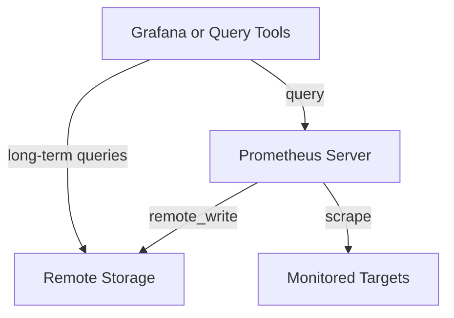

# Storage Backup and Recovery

## Introduction

Data durability is a critical aspect of any monitoring system. While Prometheus is primarily designed for real-time monitoring rather than long-term data storage, there are scenarios where preserving historical metrics becomes essential - whether for compliance, capacity planning, or post-incident analysis.

This guide explores the strategies and techniques for backing up and recovering Prometheus data, helping you implement robust data protection practices in your monitoring infrastructure.

## Understanding Prometheus Storage

Before diving into backup strategies, let's understand how Prometheus stores data:

Prometheus uses a custom time-series database called TSDB (Time Series Database) that stores metrics data on disk. By default, this data is stored in the `/data` directory, which contains:

- The actual time-series data organized in 2-hour blocks
- Write-ahead logs (WAL) that protect against data loss during crashes
- Various index files for efficient querying

The standard retention period is 15 days, but this can be configured using the `--storage.tsdb.retention.time` flag.

## Why Back Up Prometheus Data?

While Prometheus is designed with a focus on operational monitoring rather than long-term storage, there are several reasons to implement a backup strategy:

1. **Disaster Recovery**: Protect against hardware failures, accidental deletions, or corruption
2. **Historical Analysis**: Preserve important metrics for long-term trend analysis
3. **Compliance Requirements**: Meet regulatory requirements for data retention
4. **Migration**: Facilitate smooth transitions between Prometheus instances

## Backup Strategies

### 1. Snapshot-based Backups

Prometheus provides a built-in HTTP API endpoint that triggers a snapshot of the current data storage:

```bash
# Create a snapshot of Prometheus data
curl -XPOST http://prometheus-server:9090/api/v1/admin/tsdb/snapshot
```

This creates a snapshot in the `data/snapshots` directory with minimal disruption to the running Prometheus instance.

You can then copy this snapshot to a secure location:

```bash
# Copy the latest snapshot to backup location
cp -r /path/to/prometheus/data/snapshots/<snapshot-id> /backup/location/
```

### 2. File System Backup

For a more traditional approach, you can use standard file system backup tools to copy the Prometheus data directory. However, this method requires careful handling:

```bash
# First, create a consistent backup using the HTTP API
curl -XPOST http://prometheus-server:9090/api/v1/admin/tsdb/snapshot

# Then use rsync to copy the snapshot to backup location
rsync -av /path/to/prometheus/data/snapshots/<snapshot-id>/ /backup/location/
```

:::caution
Never directly copy the active Prometheus data directory without using snapshots, as this can lead to inconsistent backups due to ongoing writes.
:::

### 3. Remote Storage Integration

Prometheus can be configured to send a copy of all samples to a remote storage system, which serves as both a backup and a solution for long-term storage:

```yaml
# prometheus.yml
remote_write:
  - url: "http://remote-storage-server/write"
    
remote_read:
  - url: "http://remote-storage-server/read"
```

Popular remote storage options include:
- Thanos
- Cortex
- M3DB
- VictoriaMetrics
- Prometheus itself (federated setup)

Let's visualize the remote storage workflow:



## Recovery Procedures

### Recovering from Snapshots

To recover Prometheus data from a snapshot:

1. Stop the Prometheus service:
   ```bash
   systemctl stop prometheus
   ```

2. Move the current data directory to a backup location:
   ```bash
   mv /path/to/prometheus/data /path/to/prometheus/data.bak
   ```

3. Create a new data directory:
   ```bash
   mkdir -p /path/to/prometheus/data
   ```

4. Copy the snapshot data to the new data directory:
   ```bash
   cp -r /backup/location/<snapshot-id>/* /path/to/prometheus/data/
   ```

5. Set appropriate permissions:
   ```bash
   chown -R prometheus:prometheus /path/to/prometheus/data
   ```

6. Restart Prometheus:
   ```bash
   systemctl start prometheus
   ```

### Recovering from Remote Storage

If you've been writing to remote storage, you can recover by:

1. Configure a new Prometheus instance to read from the remote storage
2. Use the `--storage.tsdb.retention.time` flag to control how much local data to keep
3. Start backfilling data as needed using remote_read

## Best Practices

1. **Automate Backups**: Schedule regular snapshots and offsite transfers
   ```bash
   # Example cron job for daily snapshots
   0 2 * * * curl -XPOST http://prometheus-server:9090/api/v1/admin/tsdb/snapshot && rsync -av /path/to/prometheus/data/snapshots/$(ls -t /path/to/prometheus/data/snapshots/ | head -n1) /backup/location/
   ```

2. **Test Recovery Procedures**: Regularly verify that backups can be successfully restored

3. **Implement Monitoring for Backups**: Monitor the backup process itself with Prometheus
   ```yaml
   # Example alert rule
   - alert: PrometheusBackupMissing
     expr: time() - prometheus_backup_last_successful_time_seconds > 86400
     for: 1h
     labels:
       severity: warning
     annotations:
       summary: "Prometheus backup missing"
       description: "No successful Prometheus backup in the last 24 hours"
   ```

4. **Document Recovery Procedures**: Ensure all team members understand how to perform recovery

5. **Use Version Control for Configuration**: Keep your Prometheus configuration files in version control

## Implementing a Complete Backup Solution

Let's create a simple shell script that handles the snapshot creation and backup process:

```bash
#!/bin/bash
# prometheus-backup.sh

# Configuration
PROMETHEUS_URL="http://localhost:9090"
BACKUP_DIR="/backup/prometheus"
RETENTION_DAYS=30

# Create timestamp
TIMESTAMP=$(date +%Y%m%d-%H%M%S)

# Create snapshot
echo "Creating Prometheus snapshot..."
SNAPSHOT_ID=$(curl -s -XPOST ${PROMETHEUS_URL}/api/v1/admin/tsdb/snapshot | jq -r '.data.name')

if [ -z "$SNAPSHOT_ID" ]; then
  echo "Failed to create snapshot!"
  exit 1
fi

echo "Created snapshot: $SNAPSHOT_ID"

# Wait for snapshot to complete
sleep 5

# Copy snapshot to backup location
SNAPSHOT_PATH="/var/lib/prometheus/data/snapshots/$SNAPSHOT_ID"
BACKUP_PATH="$BACKUP_DIR/$TIMESTAMP"

echo "Copying snapshot to $BACKUP_PATH..."
mkdir -p $BACKUP_PATH
cp -r $SNAPSHOT_PATH/* $BACKUP_PATH/

# Set appropriate permissions
chmod -R 755 $BACKUP_PATH

# Clean up old backups
find $BACKUP_DIR -type d -mtime +$RETENTION_DAYS -exec rm -rf {} \; 2>/dev/null || true

echo "Backup completed successfully!"
```

## Using Thanos for Long-term Storage

For more advanced setups, Thanos offers a comprehensive solution for long-term storage and high availability:

```yaml
# prometheus.yml with Thanos sidecar
global:
  external_labels:
    monitor: 'prometheus-server'

storage:
  tsdb:
    path: /data
    retention.time: 15d
  
# No changes needed to scrape configs
```

The Thanos sidecar can be run alongside Prometheus:

```bash
thanos sidecar \
  --tsdb.path /data \
  --prometheus.url http://localhost:9090 \
  --objstore.config-file bucket.yml
```

Where `bucket.yml` contains the object storage configuration:

```yaml
type: S3
config:
  bucket: "prometheus-backups"
  endpoint: "s3.amazonaws.com"
  access_key: "ACCESS_KEY"
  secret_key: "SECRET_KEY"
  insecure: false
```

## Summary

Implementing a robust backup and recovery strategy for Prometheus is essential for ensuring data durability and system reliability. In this guide, we've covered:

- Understanding Prometheus's storage architecture
- Different backup strategies including snapshots and remote storage
- Step-by-step recovery procedures
- Best practices for managing backups
- Advanced solutions using Thanos

Remember that while Prometheus itself is designed for operational monitoring rather than long-term storage, these backup strategies can help you preserve critical metrics data for compliance, analysis, and disaster recovery purposes.

## Additional Resources

- [Prometheus Storage Documentation](https://prometheus.io/docs/prometheus/latest/storage/)
- [Thanos Project](https://thanos.io/) for distributed Prometheus with long-term storage
- [Cortex Project](https://cortexmetrics.io/) for horizontally scalable Prometheus
- [VictoriaMetrics](https://victoriametrics.com/) for long-term storage and high performance

## Exercises

1. Set up a daily snapshot backup for your Prometheus instance and verify that snapshots are being created correctly.
2. Create a recovery plan for your Prometheus deployment and practice restoring from a backup.
3. Configure Prometheus with remote write to a secondary Prometheus instance and test the failover process.
4. Experiment with Thanos to implement a long-term storage solution for your metrics data.
5. Create alert rules to monitor the health and success of your backup procedures.