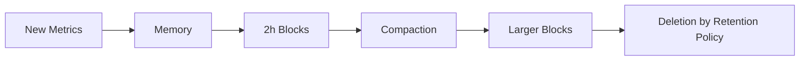

# Retention Policies

## Introduction

When monitoring systems with Prometheus, you'll quickly encounter an important consideration: how long should your time series data be stored? Prometheus collects metrics continuously, which can accumulate into significant volumes of data over time. Retention policies define how Prometheus manages this data, determining what to keep and for how long before it gets discarded.

Understanding retention policies is crucial for any Prometheus deployment because they help you balance between:
- Having sufficient historical data for analysis and troubleshooting
- Managing storage resources efficiently
- Optimizing query performance on your monitoring data

In this guide, we'll explore how Prometheus handles data retention, configuring retention settings, and best practices for managing your time series data effectively.

## Default Retention Behavior

By default, Prometheus retains time series data for **15 days**. This means that without any specific configuration, metrics older than 15 days will be automatically removed.

Let's understand what this means in practice:

- If you deployed Prometheus on January 1st
- By January 16th, your metrics from January 1st would be deleted
- Only the most recent 15 days of data would be available for querying

This default behavior is reasonable for many basic monitoring setups but may need adjustment based on your specific requirements.

## Configuring Retention Settings

Prometheus offers two primary ways to configure data retention:

1. **Time-based retention** - Keep data for a specified time period
2. **Storage-based retention** - Limit the total storage used by Prometheus

Let's look at how to configure these options:

### Time-Based Retention

To modify the default 15-day retention period, use the `--storage.tsdb.retention.time` flag when starting Prometheus:

```bash
# Retain data for 30 days
prometheus --storage.tsdb.retention.time=30d
```

The value can be specified in:
- Hours (h)
- Days (d)
- Weeks (w)
- Years (y)

For example:

```bash
prometheus --storage.tsdb.retention.time=24h    # 24 hours
prometheus --storage.tsdb.retention.time=7d     # 7 days
prometheus --storage.tsdb.retention.time=4w     # 4 weeks
prometheus --storage.tsdb.retention.time=1y     # 1 year
```

### Storage-Based Retention

Instead of configuring by time, you can limit retention by the total size of the data:

```bash
# Limit storage to 100 GiB
prometheus --storage.tsdb.retention.size=100GB
```

The value can be specified in:
- Bytes (B)
- Kilobytes (KB)
- Megabytes (MB)
- Gigabytes (GB)
- Terabytes (TB)
- Pebibytes (PB)

For example:

```bash
prometheus --storage.tsdb.retention.size=500MB  # 500 Megabytes
prometheus --storage.tsdb.retention.size=5GB    # 5 Gigabytes
prometheus --storage.tsdb.retention.size=1TB    # 1 Terabyte
```

### Using Both Time and Size Limits

You can specify both time and size limits simultaneously:

```bash
prometheus --storage.tsdb.retention.time=30d --storage.tsdb.retention.size=10GB
```

In this configuration, data will be deleted when it either:
- Becomes older than 30 days, OR
- The total storage exceeds 10GB

Prometheus will apply **whichever condition is met first**.

## Configuration in prometheus.yml

While command line flags are common for configuring retention, you can also set these parameters in your `prometheus.yml` configuration file using the `storage` section:

```yaml
storage:
  tsdb:
    path: /path/to/data
    retention:
      time: 45d
      size: 5GB
```

This approach is often preferred as it keeps all configuration in one place.

## Understanding How Prometheus Stores Data

To better manage retention, it helps to understand how Prometheus stores data:

1. Prometheus uses a time series database (TSDB) for storage
2. Data is organized into blocks (typically 2-hour chunks)
3. Periodically, these blocks are compacted into larger blocks
4. Old blocks are deleted based on retention policy



This block-based approach allows Prometheus to efficiently manage the lifecycle of time series data.

## Monitoring Your Retention Policy

You can monitor the effectiveness of your retention policy using Prometheus's own metrics:

```promql
# Total storage size (bytes)
prometheus_tsdb_storage_blocks_bytes

# Oldest timestamp stored
prometheus_tsdb_lowest_timestamp_seconds

# Newest timestamp stored
prometheus_tsdb_head_max_time_seconds
```

These metrics help you validate that your retention policy is working as expected.

## Practical Examples

Let's explore some common scenarios and how to configure retention for them:

### Example 1: Development Environment

For a development environment where historical data is less critical:

```bash
prometheus --storage.tsdb.retention.time=7d --storage.tsdb.retention.size=2GB
```

This configuration:
- Keeps data for one week
- Prevents storage from exceeding 2GB
- Is suitable for testing and development purposes

### Example 2: Production Monitoring

For a production system where longer-term trends are important:

```yaml
# In prometheus.yml
storage:
  tsdb:
    path: /prometheus-data
    retention:
      time: 90d
      size: 50GB
```

This configuration:
- Retains data for 90 days (about 3 months)
- Limits total storage to 50GB
- Allows for quarterly trend analysis
- Provides sufficient history for troubleshooting

### Example 3: High-Cardinality Environment

For environments with high-cardinality metrics (many unique time series):

```bash
prometheus --storage.tsdb.retention.time=15d --storage.tsdb.retention.size=100GB
```

This configuration:
- Uses the default 15-day retention
- Allocates a larger storage limit to accommodate many unique series
- Helps prevent premature data deletion due to space constraints

## Best Practices

When setting up your retention policies, consider the following best practices:

1. **Start conservative** - Begin with smaller retention periods and increase as needed
2. **Monitor your storage growth** - Track how quickly your TSDB is growing
3. **Consider query patterns** - Align retention with how far back users typically query
4. **Account for seasonality** - Retain enough data to cover weekly, monthly, or seasonal patterns
5. **Use remote storage** for long-term storage if needed
6. **Test impact on query performance** - Longer retention may slow down queries

## Long-term Storage Solutions

If you need to retain data longer than what's practical for Prometheus itself, consider these approaches:

1. **Prometheus Federation** - Use a separate Prometheus instance with different retention settings
2. **Remote Write** - Configure Prometheus to send data to long-term storage solutions
3. **Thanos or Cortex** - Use these projects to extend Prometheus with long-term storage capabilities

For example, a basic remote write configuration:

```yaml
# In prometheus.yml
remote_write:
  - url: "http://remote-storage-adapter:9201/write"
```

## Summary

Prometheus retention policies allow you to control how long your monitoring data is stored and how much disk space it consumes. By properly configuring retention settings, you can balance your need for historical data against resource constraints.

Key takeaways:
- Default retention is 15 days
- Configure time-based retention with `--storage.tsdb.retention.time`
- Configure storage-based retention with `--storage.tsdb.retention.size`
- You can use both time and size limits together
- Consider your specific use cases when setting retention policies
- For very long-term storage, consider external solutions

## Additional Resources

Here are some exercises to reinforce your understanding:

1. Calculate the average daily storage growth of your Prometheus instance
2. Experiment with different retention settings and observe the impact on query performance
3. Set up a basic federation to see how it can be used for longer-term storage
4. Practice creating PromQL queries to monitor your Prometheus storage metrics

For further information, you might explore:
- Time Series Database concepts
- Remote storage integrations for Prometheus
- Thanos and Cortex for scalable, long-term storage
- Data compression and aggregation techniques