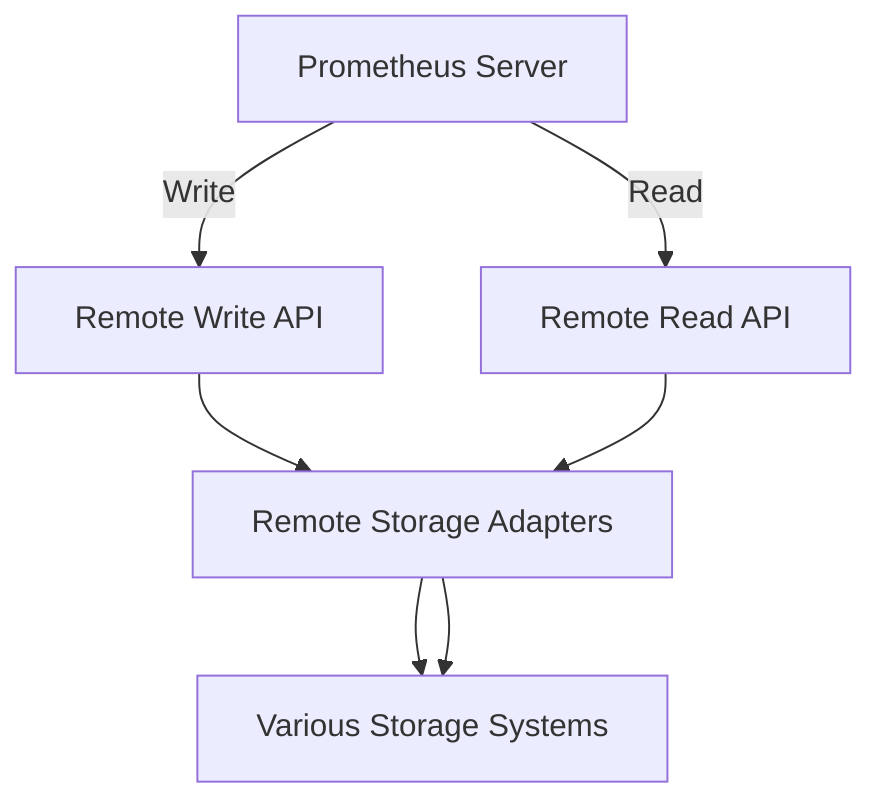

# Remote Storage Integration

## Introduction

Prometheus is designed as a self-contained monitoring system that stores time-series data locally by default. While this local storage is efficient for short-term metrics, it has limitations when it comes to long-term storage, high availability, and scalability. This is where remote storage integration becomes essential.

Remote storage integration allows Prometheus to send metrics to external storage systems and, in some cases, read metrics back from these systems. This capability extends Prometheus beyond its local storage limitations while maintaining its powerful querying and alerting features.

## Understanding the Need for Remote Storage

Before diving into implementation, let's understand why you might need remote storage:

1. **Extended retention periods**: Prometheus local storage is optimized for performance rather than long-term retention. Remote storage lets you keep metrics for months or years.

2. **High availability**: Remote storage systems often provide built-in replication and redundancy that Prometheus local storage doesn't offer.

3. **Scalability**: As your metrics volume grows, remote storage solutions can scale horizontally more effectively than local storage.

4. **Federation**: Remote storage can act as a central repository for metrics from multiple Prometheus servers.

## How Remote Storage Integration Works

Prometheus uses a simple architecture for remote storage integration:



Prometheus implements two APIs for remote storage integration:

1. **Remote Write**: Sends samples to a remote storage endpoint as they're ingested.
2. **Remote Read**: Reads samples from remote storage for query processing.

These APIs allow Prometheus to offload storage while maintaining its powerful query capabilities.

## Configuring Remote Storage Integration

### Basic Configuration

To enable remote storage integration, you need to add settings to your Prometheus configuration file (`prometheus.yml`):

```yaml
remote_write:
  - url: "http://remote-storage-adapter:9201/write"

remote_read:
  - url: "http://remote-storage-adapter:9201/read"
```

This simple configuration points Prometheus to the remote storage adapter endpoints.

### Advanced Configuration Options

For production use, you'll likely need more advanced settings:

```yaml
remote_write:
  - url: "http://remote-storage-adapter:9201/write"
    name: "remote_storage_example"
    remote_timeout: 30s
    write_relabel_configs:
      - source_labels: [__name__]
        regex: expensive_metric.*
        action: drop
    queue_config:
      capacity: 10000
      max_shards: 200
      min_shards: 50
      max_samples_per_send: 500
      batch_send_deadline: 5s
      min_backoff: 50ms
      max_backoff: 5s
```

This configuration:
- Names the remote storage endpoint
- Sets a timeout of 30 seconds
- Uses relabeling to filter expensive metrics
- Configures queue parameters for reliable transmission

## Common Remote Storage Solutions

Several storage systems can be integrated with Prometheus. Here are some popular options:

### 1. Thanos

Thanos extends Prometheus with long-term storage capabilities while maintaining the Prometheus query API.

```yaml
remote_write:
  - url: "http://thanos-receive:19291/api/v1/receive"
```

### 2. Cortex

Cortex provides a horizontally scalable, multi-tenant Prometheus-compatible monitoring system.

```yaml
remote_write:
  - url: "http://cortex-distributor:9009/api/v1/push"
```

### 3. VictoriaMetrics

A fast time-series database that's compatible with Prometheus remote write API.

```yaml
remote_write:
  - url: "http://victoria-metrics:8428/api/v1/write"
```

### 4. InfluxDB

A purpose-built time-series database.

```yaml
remote_write:
  - url: "http://influxdb:8086/api/v1/prom/write?db=prometheus"
```

## Implementation Example: Setting Up Prometheus with Remote Storage

Let's walk through a complete example of setting up Prometheus with VictoriaMetrics as remote storage.

### Step 1: Start VictoriaMetrics

VictoriaMetrics can be started as a Docker container:

```bash
docker run -it --rm -p 8428:8428 victoriametrics/victoria-metrics
```

### Step 2: Configure Prometheus

Update your `prometheus.yml` configuration:

```yaml
global:
  scrape_interval: 15s
  evaluation_interval: 15s

scrape_configs:
  - job_name: "prometheus"
    static_configs:
      - targets: ["localhost:9090"]

remote_write:
  - url: "http://localhost:8428/api/v1/write"
```

### Step 3: Start Prometheus

Start Prometheus with the updated configuration:

```bash
docker run -p 9090:9090 -v /path/to/prometheus.yml:/etc/prometheus/prometheus.yml prom/prometheus
```

### Step 4: Verify the Integration

1. Open the Prometheus web interface at `http://localhost:9090`
2. Navigate to Status > Configuration to verify remote_write is configured
3. Check the VictoriaMetrics interface at `http://localhost:8428/metrics` to see if data is being received

## Performance Considerations

Remote storage integration introduces additional considerations:

1. **Network bandwidth**: Sending all metrics to remote storage requires sufficient bandwidth
2. **Disk buffering**: Configure appropriate queue settings to handle network interruptions
3. **Resource usage**: Remote write pipelines consume CPU and memory resources

Here's a recommended configuration for production use:

```yaml
remote_write:
  - url: "http://remote-storage:9201/write"
    queue_config:
      # Maximum number of samples to buffer per shard
      capacity: 100000
      # Number of shards, increase for higher throughput
      max_shards: 50
      # Max number of samples per send
      max_samples_per_send: 10000
      # Timeout for batch sends
      batch_send_deadline: 5s
      # Retry backoff
      min_backoff: 30ms
      max_backoff: 5s
      # Maximum number of retries
      max_retries: 10
```

## Troubleshooting Common Issues

### Issue 1: Sample Drops Due to Queue Overflow

If you see metrics like `prometheus_remote_storage_samples_dropped_total` increasing:

1. Increase queue capacity
2. Increase max_shards to parallelize sending
3. Check if the remote storage endpoint is keeping up

### Issue 2: High Latency and Timeouts

If `prometheus_remote_storage_failed_samples_total` is increasing:

1. Check network connectivity
2. Increase remote_timeout value
3. Ensure remote storage has sufficient resources

### Issue 3: Excessive Resource Usage

If Prometheus is using too many resources after enabling remote write:

1. Be selective with metrics to send (use write_relabel_configs)
2. Optimize queue_config settings
3. Consider running a dedicated Prometheus instance for remote writing

## Best Practices

1. **Be selective**: Use relabeling to send only important metrics to remote storage
2. **Monitor the remote storage pipeline**: Set alerts for `prometheus_remote_storage_*` metrics
3. **Use compression**: Enable compression to reduce network bandwidth
4. **Failover setup**: Configure multiple remote_write endpoints for redundancy
5. **Separation of concerns**: Use different Prometheus instances for local alerting and remote storage

Example of selective sending:

```yaml
remote_write:
  - url: "http://remote-storage:9201/write"
    write_relabel_configs:
      # Keep only metrics with specific prefixes
      - source_labels: [__name__]
        regex: 'important_metric_.*|critical_.*'
        action: keep
      # Drop high-cardinality metrics
      - source_labels: [__name__]
        regex: '.*_bucket'
        action: drop
```

## Practical Example: High Availability Setup

Let's create a high-availability setup using Thanos:

```yaml
# prometheus-1.yml
global:
  external_labels:
    replica: "1"
remote_write:
  - url: "http://thanos-receive:10908/api/v1/receive"

# prometheus-2.yml
global:
  external_labels:
    replica: "2"
remote_write:
  - url: "http://thanos-receive:10908/api/v1/receive"
```

This configuration sends data from two Prometheus replicas to a Thanos receiver, which can deduplicate samples and store them for long-term retention.

## Summary

Remote storage integration extends Prometheus beyond its local storage limitations. It allows for long-term retention, high availability, and scalability by sending metrics to external specialized storage systems.

Key takeaways:
- Use remote_write to send metrics to external storage
- Configure queue settings for reliability
- Be selective about what metrics to send
- Monitor the remote storage pipeline itself
- Consider the tradeoffs between local and remote storage

With proper configuration, remote storage integration makes Prometheus suitable for enterprise-scale monitoring while maintaining its powerful querying and alerting capabilities.

## Additional Resources

- [Prometheus Remote Storage Documentation](https://prometheus.io/docs/operating/integrations/#remote-endpoints-and-storage)
- [VictoriaMetrics Documentation](https://docs.victoriametrics.com/)
- [Thanos Documentation](https://thanos.io/tip/components/receive.md/)
- [Cortex Documentation](https://cortexmetrics.io/docs/)

## Exercises

1. Set up Prometheus with VictoriaMetrics as remote storage and observe how metrics are stored.
2. Configure write_relabel_configs to selectively send only critical metrics to remote storage.
3. Experiment with different queue_config settings and observe their impact on performance.
4. Set up a Grafana dashboard to monitor your remote storage pipeline using Prometheus's remote_storage metrics.
5. Create a high-availability setup with two Prometheus instances writing to the same remote storage.