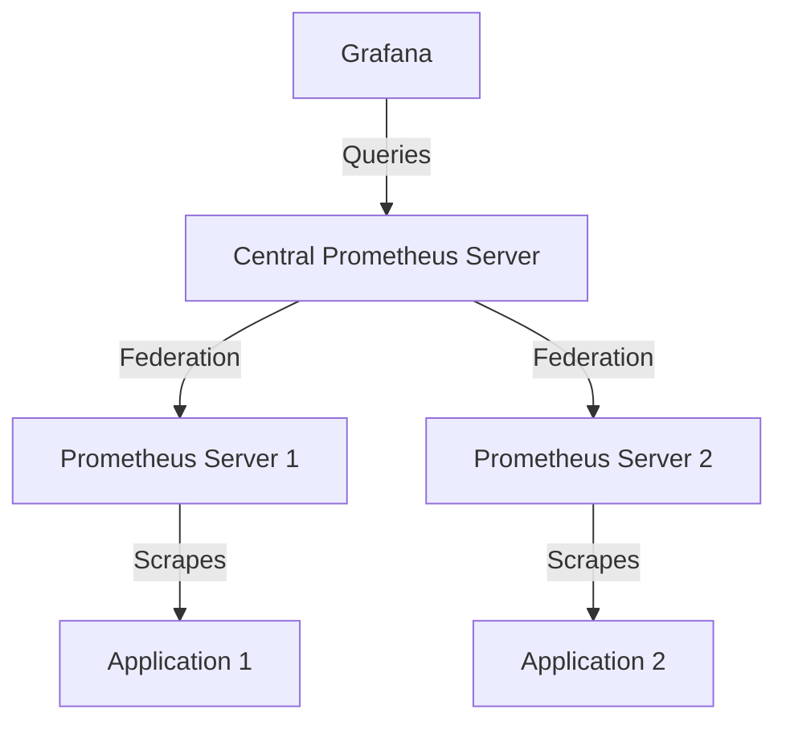
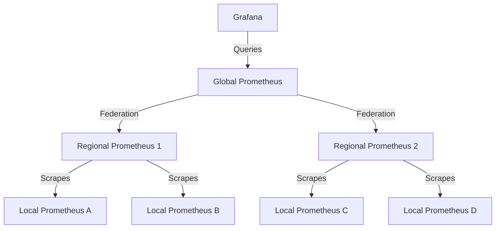

# Prometheus Federation

## Introduction

Prometheus Federation is a powerful technique that allows you to create scalable, hierarchical monitoring systems by enabling one Prometheus server to scrape selected time series from another Prometheus server. This approach is particularly useful when you need to monitor large infrastructures or when you want to create a centralized view of metrics collected by multiple distributed Prometheus instances.

Federation helps solve several challenges that emerge when monitoring grows beyond a single Prometheus server:

- **Scalability**: Distribute the load across multiple Prometheus servers
- **Organizational boundaries**: Collect metrics across different teams or departments
- **Hierarchical views**: Create aggregated dashboards while maintaining detailed local monitoring
- **Geographic distribution**: Handle metrics collection across different data centers or regions

## How Federation Works

At its core, federation allows a Prometheus server (the "federated" server) to scrape selected metrics from other Prometheus servers. This is achieved through a special federation endpoint that exposes metrics in a format that can be scraped.



## Setting Up Federation

### The `/federate` Endpoint

Prometheus exposes a special endpoint at `/federate` that allows other Prometheus servers to scrape selected time series. This endpoint requires a `match[]` parameter to specify which metrics should be included in the federation.

### Basic Federation Configuration

To set up federation, you'll need to add a scrape configuration to your central Prometheus server's configuration file (`prometheus.yml`):

```yaml
scrape_configs:
  - job_name: 'federate'
    scrape_interval: 15s
    honor_labels: true
    metrics_path: '/federate'
    params:
      'match[]':
        - '{job="prometheus"}'
        - '{__name__=~"job:.*"}'
    static_configs:
      - targets:
        - 'prometheus-1:9090'
        - 'prometheus-2:9090'
```

Let's break down this configuration:

- `job_name`: A name for this federation job
- `scrape_interval`: How often to scrape the federated metrics
- `honor_labels`: When true, this retains the original labels from the source Prometheus
- `metrics_path`: The federation endpoint
- `params`: Contains the match parameters that filter which metrics to federate
- `static_configs`: Defines the Prometheus servers to scrape metrics from

### Match Selectors

The `match[]` parameter is crucial as it determines which metrics will be federated. You can use Prometheus's powerful label matching syntax:

- `{job="prometheus"}`: Select all metrics associated with the "prometheus" job
- `{__name__=~"job:.*"}`: Select all metrics with names starting with "job:"
- `{instance=~".*"}`: Select all metrics from all instances
- `{__name__=~"node_.*", environment="production"}`: Select all node metrics from the production environment

## Hierarchical Federation Patterns

### Two-Level Federation

The most common pattern is a two-level hierarchy with multiple Prometheus servers at the first level monitoring different parts of your infrastructure, and a single Prometheus server at the second level federating selected metrics.

```yaml
# Example configuration for central Prometheus server
scrape_configs:
  - job_name: 'federate'
    scrape_interval: 15s
    honor_labels: true
    metrics_path: '/federate'
    params:
      'match[]':
        - '{job="critical-services"}'  # Only federate important metrics
        - 'up'                         # Always include service availability
        - 'instance:node_cpu_utilization:avg5m'  # Include pre-aggregated metrics
    static_configs:
      - targets:
        - 'team-a-prometheus:9090'
        - 'team-b-prometheus:9090'
      - labels:
          datacenter: 'east'
```

### Multi-Level Federation

For larger deployments, you might need more than two levels:



In this setup:
- Local Prometheus servers monitor specific applications
- Regional Prometheus servers federate from local servers
- Global Prometheus federates from regional servers

## Federation Best Practices

### 1. Federate Aggregated Metrics

It's generally not a good idea to federate all raw metrics, as this can lead to performance issues. Instead, create recording rules in your source Prometheus servers to pre-aggregate metrics, and then federate these aggregated metrics:

```yaml
# recording rules in source Prometheus
groups:
  - name: aggregate
    rules:
      - record: instance:node_cpu_utilization:avg5m
        expr: avg by (instance)(rate(node_cpu_seconds_total{mode!="idle"}[5m]))
```

Then federate the aggregated metrics:

```yaml
# in federated Prometheus
params:
  'match[]':
    - 'instance:node_cpu_utilization:avg5m'
```

### 2. Use Label Rewriting

Use `honor_labels: true` to preserve original labels, but be careful about label collisions. For more control, you can use relabeling:

```yaml
scrape_configs:
  - job_name: 'federate'
    honor_labels: true
    metrics_path: '/federate'
    params:
      'match[]':
        - '{job="node"}'
    relabel_configs:
      - source_labels: [__address__]
        target_label: __param_target
      - source_labels: [__param_target]
        target_label: instance
      - target_label: region
        replacement: 'us-west'
```

### 3. Be Selective About What You Federate

Avoid federating high-cardinality metrics. Focus on:
- Service-level indicators (SLIs)
- Critical alerts
- Key business metrics
- Pre-aggregated metrics

### 4. Consider Federation Scrape Intervals

Use longer scrape intervals for federation than for direct scraping. This reduces load while still providing useful data for longer-term trends.

## Practical Example: Multi-Datacenter Monitoring

Let's walk through a complete example of setting up federation for monitoring multiple datacenters:

1. **Local Prometheus servers** in each datacenter collect detailed metrics:

```yaml
# prometheus-dc1.yml
global:
  scrape_interval: 15s

scrape_configs:
  - job_name: 'node'
    static_configs:
      - targets:
        - 'node-exporter-1:9100'
        - 'node-exporter-2:9100'
  
  - job_name: 'api-service'
    static_configs:
      - targets:
        - 'api-service-1:8080'
        - 'api-service-2:8080'

# Recording rules for aggregation
rule_files:
  - 'recording-rules.yml'
```

2. **Recording rules** to pre-aggregate the metrics:

```yaml
# recording-rules.yml
groups:
  - name: aggregation
    rules:
      - record: dc:node_cpu_utilization:avg5m
        expr: avg by (job)(rate(node_cpu_seconds_total{mode!="idle"}[5m]))
      
      - record: dc:api_request_duration_seconds:p95
        expr: histogram_quantile(0.95, sum(rate(api_request_duration_seconds_bucket[5m])) by (le, job))
```

3. **Central Prometheus** federates from each datacenter:

```yaml
# central-prometheus.yml
global:
  scrape_interval: 30s  # Longer interval for federation

scrape_configs:
  - job_name: 'federate'
    honor_labels: true
    metrics_path: '/federate'
    params:
      'match[]':
        - 'up'  # Service availability
        - 'dc:node_cpu_utilization:avg5m'  # Aggregated CPU usage
        - 'dc:api_request_duration_seconds:p95'  # API p95 latency
    static_configs:
      - targets: ['prometheus-dc1:9090']
        labels:
          datacenter: 'us-east'
      - targets: ['prometheus-dc2:9090']
        labels:
          datacenter: 'us-west'
```

4. **Querying federated metrics** in Grafana:

With this setup, you could create a Grafana dashboard that shows datacenter-level metrics with PromQL queries like:

```
sum by (datacenter)(dc:node_cpu_utilization:avg5m)
```

This would show the average CPU utilization for each datacenter, allowing you to compare their performance at a glance.

## Troubleshooting Federation

### Common Issues

1. **Metrics not appearing in federated Prometheus**
   - Check your match[] selectors
   - Verify connectivity between Prometheus servers
   - Check for label collisions if honor_labels is false

2. **High cardinality issues**
   - Federate fewer metrics or use more specific selectors
   - Use recording rules to aggregate metrics before federation

3. **High load on source Prometheus**
   - Increase the federation scrape interval
   - Be more selective with what you're federating

### Debugging Federation

To debug federation issues, check the following:

1. Manually test the federate endpoint:
   ```
   curl "http://source-prometheus:9090/federate?match[]={job='node'}"
   ```

2. Check the target status in the federated Prometheus web UI

3. Look for scrape errors in the federated Prometheus logs

## Summary

Prometheus Federation is a powerful feature for building scalable monitoring systems. By creating hierarchical monitoring setups, you can effectively monitor large, distributed infrastructures while maintaining a centralized view of important metrics.

Key takeaways:
- Federation allows one Prometheus server to scrape metrics from other Prometheus servers
- Use selective matching to federate only the metrics you need
- Pre-aggregate metrics using recording rules before federation
- Consider hierarchical patterns for large-scale deployments
- Be mindful of performance implications and follow best practices

## Exercises

1. Set up a basic two-Prometheus federation on your local machine using Docker Compose
2. Create recording rules to aggregate CPU and memory usage, then federate only these aggregated metrics
3. Experiment with different match[] selectors to understand how they filter metrics
4. Add a third level to your federation hierarchy and observe how metrics flow through the system
5. Design a federation setup for a hypothetical company with three datacenters and multiple application teams

## Additional Resources

- [Prometheus Federation Documentation](https://prometheus.io/docs/prometheus/latest/federation/)
- [Scaling Prometheus Blog Series](https://prometheus.io/blog/2016/07/23/pull-does-not-scale-or-does-it/)
- [Recording Rules Documentation](https://prometheus.io/docs/prometheus/latest/configuration/recording_rules/)
- [Practical Prometheus Federation (GitHub Repository)](https://github.com/prometheus/prometheus/tree/main/documentation/examples)