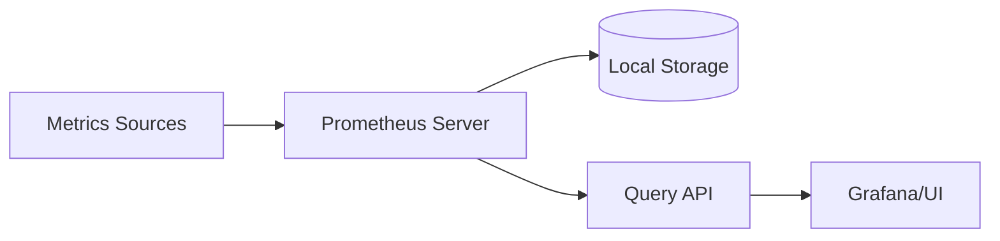
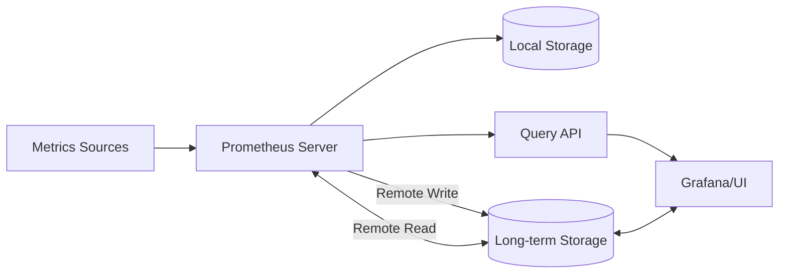
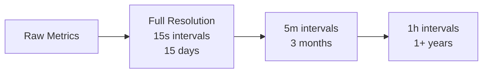

# Long-term Storage Solutions

## Introduction

Prometheus is designed primarily as a real-time monitoring system with a focus on operational metrics and alerting. By default, Prometheus stores time-series data on local disk, which works well for short-term storage and immediate querying. However, this approach presents challenges for long-term storage:

- Limited scalability for large volumes of historical data
- Potential data loss during server failures
- Difficulties with long-term data analysis and trend observation

This guide explores solutions for extending Prometheus' capabilities to store metrics data for longer periods, enabling historical analysis while maintaining performance.

## Understanding Prometheus Storage Limitations

Before diving into long-term storage solutions, let's understand the default storage approach in Prometheus:



By default, Prometheus:

- Uses a custom time-series database format (TSDB) on local disk
- Offers configurable retention periods (default is 15 days)
- Provides good query performance for recent data
- Is not optimized for long-term storage or querying historical data

Let's examine the standard configuration for retention in Prometheus:

```yaml
# prometheus.yml
storage:
  tsdb:
    path: /path/to/data
    retention:
      time: 15d      # Data retention period (15 days)
      size: 50GB     # Maximum storage size (50GB)
```

## Remote Storage Solutions

The recommended approach for long-term storage is using Prometheus' remote write and remote read APIs to integrate with external storage systems.

### How Remote Storage Works



Prometheus can be configured to:
- Continue storing recent data locally for fast queries
- Forward data to remote storage systems for long-term retention
- Query remote systems when historical data is requested

### Popular Remote Storage Options

#### 1. Thanos

Thanos extends Prometheus for unlimited storage capacity and global query view.

```yaml
# prometheus.yml with Thanos Sidecar
storage:
  tsdb:
    path: /path/to/data
    retention:
      time: 2d
remote_write:
  - url: http://thanos-receive:19291/api/v1/receive
```

Key features:
- Global query view across multiple Prometheus instances
- Unlimited retention through object storage (S3, GCS, etc.)
- Downsampling for efficient long-term storage
- High availability setup

#### 2. Cortex

Cortex provides a horizontally scalable, highly available, multi-tenant Prometheus solution.

```yaml
# prometheus.yml with Cortex
remote_write:
  - url: http://cortex:9009/api/v1/push
    basic_auth:
      username: "user"
      password: "password"
remote_read:
  - url: http://cortex:9009/api/v1/read
    basic_auth:
      username: "user"
      password: "password"
```

Key features:
- Multi-tenancy support
- Horizontal scalability
- Query caching
- Compatible with Prometheus PromQL

#### 3. VictoriaMetrics

VictoriaMetrics is a fast, cost-effective time-series database optimized for monitoring.

```yaml
# prometheus.yml with VictoriaMetrics
remote_write:
  - url: http://victoria-metrics:8428/api/v1/write
remote_read:
  - url: http://victoria-metrics:8428/api/v1/read
```

Key features:
- High performance
- Lower resource requirements
- High data compression ratio
- Supports both single-node and cluster versions

#### 4. TimescaleDB

TimescaleDB extends PostgreSQL for time-series data.

```yaml
# prometheus.yml with TimescaleDB adapter
remote_write:
  - url: http://prometheus-timescaledb-adapter:9201/write
remote_read:
  - url: http://prometheus-timescaledb-adapter:9201/read
```

Key features:
- SQL-based querying
- Automatic data partitioning
- Mature backup solutions
- Integrates with existing PostgreSQL infrastructure

## Implementing a Remote Storage Solution

Let's walk through setting up Thanos as a remote storage solution for Prometheus:

### Step 1: Set up Prometheus with Thanos Sidecar

First, configure Prometheus to retain data for a shorter period and add a volume for Thanos:

```yaml
# prometheus.yml
global:
  scrape_interval: 15s
  evaluation_interval: 15s
  external_labels:
    cluster: 'production'
    replica: 'replica-1'

storage:
  tsdb:
    path: /prometheus
    retention:
      time: 2d

# Standard scrape configs...
```

### Step 2: Run Prometheus with Thanos Sidecar

```bash
# Start Prometheus with Thanos Sidecar
docker run -d --name prometheus \
  -p 9090:9090 \
  -v $(pwd)/prometheus.yml:/etc/prometheus/prometheus.yml \
  -v prometheus-data:/prometheus \
  prom/prometheus:latest \
  --config.file=/etc/prometheus/prometheus.yml \
  --storage.tsdb.path=/prometheus \
  --storage.tsdb.retention.time=2d \
  --web.enable-lifecycle

# Run Thanos Sidecar
docker run -d --name thanos-sidecar \
  --network=host \
  -v prometheus-data:/prometheus \
  quay.io/thanos/thanos:latest \
  sidecar \
  --tsdb.path=/prometheus \
  --prometheus.url=http://localhost:9090 \
  --objstore.config-file=/etc/thanos/storage.yml
```

### Step 3: Set up Object Storage for Thanos

Create a storage configuration file for your cloud provider. For example, using AWS S3:

```yaml
# storage.yml
type: S3
config:
  bucket: "thanos-metrics"
  endpoint: "s3.amazonaws.com"
  access_key: "${AWS_ACCESS_KEY_ID}"
  secret_key: "${AWS_SECRET_ACCESS_KEY}"
  insecure: false
```

### Step 4: Configure Querier and Store Components

Finally, set up the Thanos Query and Store components:

```bash
# Run Thanos Store
docker run -d --name thanos-store \
  -p 19091:19091 \
  -v $(pwd)/storage.yml:/etc/thanos/storage.yml \
  quay.io/thanos/thanos:latest \
  store \
  --objstore.config-file=/etc/thanos/storage.yml \
  --http-address=0.0.0.0:19091

# Run Thanos Querier
docker run -d --name thanos-query \
  -p 19192:19192 \
  quay.io/thanos/thanos:latest \
  query \
  --http-address=0.0.0.0:19192 \
  --store=localhost:19091 \
  --store=localhost:10901
```

## Data Retention Strategies

When implementing long-term storage, consider these retention strategies:

### 1. Tiered Storage Architecture

Implement a multi-tiered approach:
- **Hot tier**: Recent data in Prometheus (e.g., 15 days)
- **Warm tier**: Medium-term data at full resolution (e.g., 3 months)
- **Cold tier**: Long-term data with downsampling (e.g., 1+ years)

### 2. Downsampling for Efficiency

Downsampling reduces storage requirements by aggregating older data:



### 3. Metric Selection

Not all metrics need long-term storage. Categorize your metrics:

- **Critical business metrics**: Retain at high resolution for longer periods
- **Operational metrics**: Medium retention with downsampling
- **Debug metrics**: Short retention period only

## Best Practices for Long-term Storage

### Optimize Storage Usage

1. **Use recording rules** to pre-aggregate data:

```yaml
# prometheus.yml
rule_files:
  - 'recording_rules.yml'

# recording_rules.yml
groups:
  - name: cpu_aggregation
    interval: 1m
    rules:
      - record: job:cpu_usage:avg_5m
        expr: avg by (job) (rate(node_cpu_seconds_total{mode!="idle"}[5m]))
```

2. **Set appropriate retention windows** based on data importance

3. **Use external labels** to identify data sources:

```yaml
global:
  external_labels:
    region: us-west
    env: production
```

### Query Optimization

1. **Limit time ranges** for complex queries on historical data
2. **Use aggregation** for long-term trend analysis
3. **Implement query caching** with tools like Thanos Query Frontend

### Backup and Recovery

Even with long-term storage, implement backup strategies:

1. **Regular snapshots** of your time-series database
2. **Cross-region replication** for cloud-based solutions
3. **Retention policy documentation** for compliance purposes

## Real-world Example: E-commerce Monitoring

Let's consider how an e-commerce company might implement long-term storage:

1. **Local Prometheus**: 7 days of data at 15s resolution for operational monitoring
2. **Thanos with S3**: Data stored indefinitely with downsampling
   - 5-minute resolution for 30 days
   - 1-hour resolution for 1 year
   - 1-day resolution for 5+ years

3. **Key metrics tracked long-term**:
   - Conversion rates
   - Page load times
   - Order values
   - Inventory levels

4. **Dashboards with long-term views**:
   - Year-over-year sales comparison
   - Seasonal performance patterns
   - Long-term system reliability

```yaml
# prometheus.yml
global:
  scrape_interval: 15s
  evaluation_interval: 15s
  external_labels:
    env: 'production'
    region: 'us-east'

storage:
  tsdb:
    path: /prometheus
    retention:
      time: 7d

remote_write:
  - url: http://thanos-receive:19291/api/v1/receive

# ... scrape configs ...
```

## Summary

Long-term storage solutions extend Prometheus' capabilities beyond its local storage limitations:

- **Remote storage options** like Thanos, Cortex, VictoriaMetrics, and TimescaleDB provide scalable solutions
- **Data retention strategies** including tiered storage and downsampling optimize storage efficiency
- **Best practices** for storage optimization, query performance, and backup ensure system reliability

By implementing these solutions, you can maintain historical metrics for trend analysis, capacity planning, and compliance requirements while preserving Prometheus' core strengths in real-time monitoring.

## Additional Resources

- **Official documentation**:
  - [Prometheus Remote Storage Integration](https://prometheus.io/docs/operating/integrations/#remote-endpoints-and-storage)
  - [Thanos Documentation](https://thanos.io/tip/thanos/getting-started.md/)
  - [Cortex Documentation](https://cortexmetrics.io/docs/)

- **Exercises**:
  1. Set up a basic Prometheus server with local storage and configure retention settings
  2. Implement a simple remote write setup with VictoriaMetrics
  3. Create a Thanos deployment with object storage for long-term metrics retention
  4. Design a retention strategy for different types of metrics in your environment