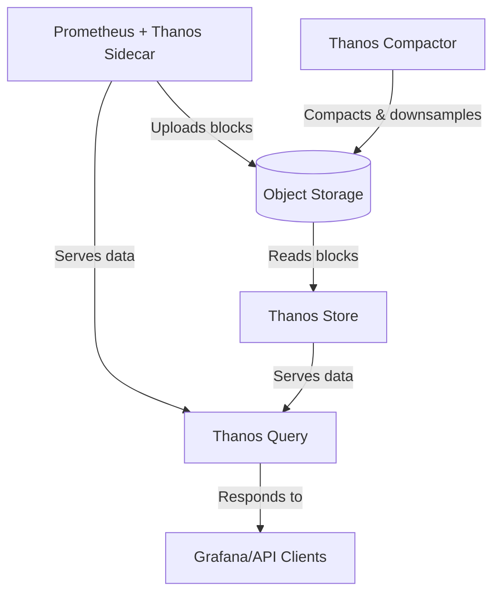

# Thanos Integration

## Introduction

Prometheus excels at real-time monitoring and alerting, but it faces challenges when it comes to long-term metrics storage, high availability, and global querying across multiple Prometheus instances. This is where Thanos comes in.

Thanos (named after the Marvel character) is an open-source project that extends Prometheus capabilities with:

- **Long-term storage**: Store metrics data in object storage (like S3, GCS, Azure Blob) for years
- **Global query view**: Query metrics from multiple Prometheus servers through a single endpoint
- **High availability**: Deduplicate metrics from redundant Prometheus servers
- **Downsampling**: Efficiently store historical data by reducing its resolution

In this guide, we'll explore how to integrate Thanos with your existing Prometheus setup to overcome these limitations.

## Prerequisites

Before diving into Thanos integration, make sure you have:

- A working Prometheus installation
- Basic understanding of Prometheus concepts (metrics, PromQL, etc.)
- Access to object storage (like AWS S3, Google Cloud Storage, or MinIO)
- Docker and Docker Compose (for our examples)

## Thanos Architecture

Thanos consists of several components that work together to extend Prometheus:



Key components:

1. **Thanos Sidecar**: Runs alongside Prometheus, uploading metrics to object storage and exposing Prometheus data to Thanos Query
2. **Thanos Store**: Retrieves metrics from object storage for long-term querying
3. **Thanos Query**: Aggregates metrics from multiple Prometheus instances and Thanos Stores
4. **Thanos Compactor**: Downsamples data and compacts blocks in object storage
5. **Object Storage**: The central repository for long-term metrics storage

## Setting Up Thanos with Prometheus

Let's walk through a basic Thanos integration with Prometheus:

### Step 1: Configure Prometheus for Thanos

First, we need to modify our Prometheus configuration to work with Thanos:

```yaml
global:
  scrape_interval: 15s
  evaluation_interval: 15s
  external_labels:
    cluster: prod-us-east
    replica: 0

storage:
  tsdb:
    path: /prometheus
    retention: 6h  # Reduced local retention since we'll use object storage
    min_block_duration: 2h
    max_block_duration: 2h

# Rest of your Prometheus config...
```

The key changes are:
- Adding `external_labels` to identify this Prometheus instance
- Setting shorter retention since long-term storage will be in object storage
- Configuring block duration for optimal uploads

### Step 2: Configure Thanos Sidecar

Create a configuration for the object storage. Here's an example for S3:

```yaml
type: S3
config:
  bucket: "thanos-metrics"
  endpoint: "s3.amazonaws.com"
  access_key: "YOUR_ACCESS_KEY"
  secret_key: "YOUR_SECRET_KEY"
  insecure: false
```

Save this as `objstore.yml`.

### Step 3: Deploy Prometheus with Thanos Sidecar

Here's a Docker Compose example:

```yaml
version: '3.7'

services:
  prometheus:
    image: prom/prometheus:v2.40.0
    volumes:
      - ./prometheus.yml:/etc/prometheus/prometheus.yml
      - prometheus_data:/prometheus
    command:
      - '--config.file=/etc/prometheus/prometheus.yml'
      - '--storage.tsdb.path=/prometheus'
      - '--storage.tsdb.min-block-duration=2h'
      - '--storage.tsdb.max-block-duration=2h'
      - '--web.enable-lifecycle'
      - '--web.enable-admin-api'
    ports:
      - "9090:9090"

  thanos-sidecar:
    image: quay.io/thanos/thanos:v0.30.2
    volumes:
      - ./objstore.yml:/etc/thanos/objstore.yml
      - prometheus_data:/prometheus
    command:
      - 'sidecar'
      - '--tsdb.path=/prometheus'
      - '--prometheus.url=http://prometheus:9090'
      - '--objstore.config-file=/etc/thanos/objstore.yml'
    ports:
      - "19090:19090"
    depends_on:
      - prometheus

volumes:
  prometheus_data:
```

### Step 4: Add Thanos Query

Add the Thanos Query component to our setup:

```yaml
thanos-query:
  image: quay.io/thanos/thanos:v0.30.2
  command:
    - 'query'
    - '--grpc-address=0.0.0.0:10901'
    - '--http-address=0.0.0.0:9091'
    - '--store=thanos-sidecar:19090'
  ports:
    - "9091:9091"
  depends_on:
    - thanos-sidecar
```

### Step 5: Add Thanos Store (for long-term storage)

```yaml
thanos-store:
  image: quay.io/thanos/thanos:v0.30.2
  volumes:
    - ./objstore.yml:/etc/thanos/objstore.yml
  command:
    - 'store'
    - '--data-dir=/data'
    - '--objstore.config-file=/etc/thanos/objstore.yml'
    - '--http-address=0.0.0.0:19191'
    - '--grpc-address=0.0.0.0:19090'
  ports:
    - "19191:19191"
```

### Step 6: Add Thanos Compactor

```yaml
thanos-compactor:
  image: quay.io/thanos/thanos:v0.30.2
  volumes:
    - ./objstore.yml:/etc/thanos/objstore.yml
    - compactor_data:/data
  command:
    - 'compact'
    - '--data-dir=/data'
    - '--objstore.config-file=/etc/thanos/objstore.yml'
    - '--wait'
    - '--retention.resolution-raw=30d'
    - '--retention.resolution-5m=90d'
    - '--retention.resolution-1h=1y'
  volumes:
    compactor_data:
```

Now, let's update our Thanos Query to include the Store:

```yaml
thanos-query:
  image: quay.io/thanos/thanos:v0.30.2
  command:
    - 'query'
    - '--grpc-address=0.0.0.0:10901'
    - '--http-address=0.0.0.0:9091'
    - '--store=thanos-sidecar:19090'
    - '--store=thanos-store:19090'
  ports:
    - "9091:9091"
  depends_on:
    - thanos-sidecar
    - thanos-store
```

## Querying with Thanos

Once your setup is running, you can access:

1. Prometheus UI at `http://localhost:9090`
2. Thanos Query UI at `http://localhost:9091`

Thanos Query UI looks similar to Prometheus but can query across multiple sources. You can run PromQL queries just like in Prometheus, but now you have access to:

- Historical data beyond Prometheus retention
- Metrics from multiple Prometheus instances (if configured)

Example PromQL query:

```
sum(rate(http_requests_total[5m])) by (service)
```

In Thanos Query, this will fetch results from all configured stores, including historical data from object storage.

## Scaling to Multiple Prometheus Instances

One of Thanos' key features is its ability to handle multiple Prometheus instances. Here's how to scale our setup:

### Step 1: Add another Prometheus instance

```yaml
prometheus-replica:
  image: prom/prometheus:v2.40.0
  volumes:
    - ./prometheus-replica.yml:/etc/prometheus/prometheus.yml
    - prometheus_replica_data:/prometheus
  command:
    - '--config.file=/etc/prometheus/prometheus.yml'
    - '--storage.tsdb.path=/prometheus'
    - '--storage.tsdb.min-block-duration=2h'
    - '--storage.tsdb.max-block-duration=2h'
    - '--web.enable-lifecycle'
    - '--web.enable-admin-api'
  ports:
    - "9092:9090"

thanos-sidecar-replica:
  image: quay.io/thanos/thanos:v0.30.2
  volumes:
    - ./objstore.yml:/etc/thanos/objstore.yml
    - prometheus_replica_data:/prometheus
  command:
    - 'sidecar'
    - '--tsdb.path=/prometheus'
    - '--prometheus.url=http://prometheus-replica:9090'
    - '--objstore.config-file=/etc/thanos/objstore.yml'
  ports:
    - "19092:19090"
  depends_on:
    - prometheus-replica

volumes:
  prometheus_replica_data:
```

### Step 2: Update Thanos Query to use both instances

```yaml
thanos-query:
  image: quay.io/thanos/thanos:v0.30.2
  command:
    - 'query'
    - '--grpc-address=0.0.0.0:10901'
    - '--http-address=0.0.0.0:9091'
    - '--store=thanos-sidecar:19090'
    - '--store=thanos-sidecar-replica:19090'
    - '--store=thanos-store:19090'
    - '--query.replica-label=replica'
  ports:
    - "9091:9091"
```

The `--query.replica-label=replica` option enables deduplication, so if both Prometheus instances have the same metrics, Thanos will only show them once.

## Handling High Availability

Thanos makes your monitoring system highly available. Let's configure two identical Prometheus instances that scrape the same targets:

In `prometheus.yml`:
```yaml
external_labels:
  cluster: prod-us-east
  replica: 0
```

In `prometheus-replica.yml`:
```yaml
external_labels:
  cluster: prod-us-east
  replica: 1
```

Now, if one Prometheus instance goes down, queries through Thanos Query will still work using the other instance. When both are available, Thanos deduplicates the metrics based on the `replica` label.

## Best Practices

1. **Security**: Never expose raw credentials in your `objstore.yml`. Use secret management solutions like Kubernetes secrets or environment variables.

2. **Resource Management**: Monitor the resource usage of Thanos components, especially Store and Compactor, as they can be resource-intensive with large amounts of data.

3. **Block Structure**: Optimize block duration based on your specific needs:
   ```yaml
   storage:
     tsdb:
       min_block_duration: 2h
       max_block_duration: 2h
   ```

4. **Retention Policies**: Configure appropriate retention periods for different resolutions:
   ```
   --retention.resolution-raw=30d
   --retention.resolution-5m=90d
   --retention.resolution-1h=1y
   ```

5. **Monitoring Thanos**: Set up monitoring for Thanos itself using Prometheus. Thanos components expose metrics on their HTTP endpoints.

## Troubleshooting

Here are some common issues and solutions when working with Thanos:

1. **Data not appearing in Thanos Query**:
   - Check if Thanos Sidecar is connected to Prometheus
   - Verify object storage configuration
   - Ensure the Store gateway is running and properly connected

2. **High memory usage**:
   - Adjust query timeouts and limits
   - Implement proper retention policies
   - Consider scaling horizontally

3. **Slow queries**:
   - Add indexes to object storage
   - Ensure proper downsampling is configured
   - Check for query optimizations

## Summary

Thanos extends Prometheus capabilities by providing:
- Long-term storage using object storage systems
- Global query view across multiple Prometheus instances
- High availability through redundant setups
- Efficient historical data storage through downsampling

Through the integration of components like Sidecar, Query, Store, and Compactor, Thanos creates a scalable monitoring system that can handle metrics from multiple clusters, retain data for years, and provide a unified query interface.

## Additional Resources

- [Thanos GitHub Repository](https://github.com/thanos-io/thanos)
- [Thanos Documentation](https://thanos.io/tip/thanos/getting-started.md/)
- [Prometheus Documentation](https://prometheus.io/docs/introduction/overview/)

## Exercises

1. Set up a basic Thanos integration with MinIO as the object storage.
2. Configure two Prometheus instances with Thanos for high availability.
3. Create a Grafana dashboard that queries metrics through Thanos Query.
4. Implement a retention policy that keeps raw data for 30 days, 5-minute downsampled data for 90 days, and 1-hour downsampled data for 1 year.
5. Explore the Thanos metrics and create alerts for potential issues.