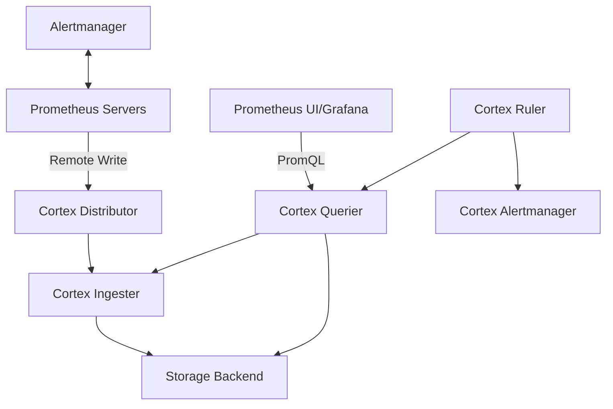

# Cortex Integration

## Introduction

Prometheus, while powerful for monitoring, faces challenges when scaling to handle large volumes of metrics data. This is where Cortex comes in. Cortex extends Prometheus' capabilities by providing a horizontally scalable, highly available, multi-tenant storage solution that integrates seamlessly with existing Prometheus deployments.

In this guide, you'll learn how Cortex complements Prometheus, the architecture of Cortex integration, and how to set up a basic Cortex deployment to enhance your Prometheus monitoring stack.

## What is Cortex?

Cortex is an open-source project that provides horizontally scalable, highly available, multi-tenant, long-term storage for Prometheus metrics. It allows you to run Prometheus as a service, supporting multiple users and larger metric volumes than a single Prometheus instance could handle.

### Key Features of Cortex

- **Horizontal Scalability**: Scale across multiple machines to handle high volumes of metrics
- **Multi-tenancy**: Isolate different users' data and queries
- **Long-term Storage**: Retain metrics data beyond Prometheus' typical retention periods
- **Query Federation**: Run PromQL queries across multiple Prometheus instances
- **High Availability**: Ensure reliable metric storage and querying
- **Cloud Native**: Designed to run well in containerized environments like Kubernetes

## Cortex Architecture

Before diving into integration, let's understand Cortex's architecture:



Cortex components include:

- **Distributor**: Receives metrics from Prometheus servers and distributes them across ingesters
- **Ingester**: Validates, compresses, and stores incoming metrics in memory before flushing to long-term storage
- **Querier**: Handles PromQL queries by fetching data from ingesters and storage
- **Ruler**: Evaluates recording and alerting rules
- **Store Gateway**: Optimizes queries against object storage
- **Compactor**: Compacts stored data for efficient querying

## Setting Up Cortex Integration

Now, let's explore how to integrate Cortex with your existing Prometheus setup.

### Prerequisites

- Running Prometheus instance(s)
- Docker and Docker Compose or Kubernetes cluster
- Basic understanding of Prometheus configuration

### Step 1: Deploy Cortex

First, create a Docker Compose file for a simple Cortex deployment:

```yaml
version: '3'
services:
  cortex:
    image: cortexproject/cortex:v1.14.0
    command:
      - "-config.file=/etc/cortex/config.yaml"
    volumes:
      - ./cortex-config.yaml:/etc/cortex/config.yaml
    ports:
      - "9009:9009"  # API
      - "9095:9095"  # Distributor
    networks:
      - monitoring

networks:
  monitoring:
    driver: bridge
```

### Step 2: Create Cortex Configuration

Create a `cortex-config.yaml` file:

```yaml
auth_enabled: false

server:
  http_listen_port: 9009

distributor:
  shard_by_all_labels: true
  pool:
    health_check_ingesters: true

ingester:
  lifecycler:
    ring:
      kvstore:
        store: inmemory
      replication_factor: 1
    final_sleep: 0s
  chunk_idle_period: 5m
  chunk_retain_period: 30s

storage:
  engine: blocks

blocks_storage:
  backend: filesystem
  filesystem:
    dir: /tmp/cortex/blocks
  bucket_store:
    sync_dir: /tmp/cortex/sync
  tsdb:
    dir: /tmp/cortex/tsdb

compactor:
  data_dir: /tmp/cortex/compactor
  sharding_enabled: false

frontend:
  compress_responses: true
```

This is a minimal configuration using local filesystem storage. In production, you would use cloud storage like S3, GCS, or Azure Blob Storage.

### Step 3: Configure Prometheus Remote Write

Update your Prometheus configuration to send metrics to Cortex:

```yaml
global:
  scrape_interval: 15s
  evaluation_interval: 15s

scrape_configs:
  # Your existing scrape configs here

remote_write:
  - url: "http://cortex:9009/api/v1/push"
    queue_config:
      capacity: 2500
      max_shards: 200
      max_samples_per_send: 500
```

### Step 4: Start Services

Launch both Prometheus and Cortex:

```bash
docker-compose up -d
```

### Step 5: Query Cortex

You can now query your metrics through Cortex. Point Grafana to Cortex as a Prometheus data source:

- URL: `http://cortex:9009/api/v1/query`
- Access: `Server` or `Browser` depending on your setup

## Scaling Strategies

As your monitoring needs grow, consider these scaling approaches:

### Horizontal Scaling

Cortex components can be scaled independently:

```yaml
# kubernetes deployment example
apiVersion: apps/v1
kind: Deployment
metadata:
  name: cortex-distributor
spec:
  replicas: 3  # Scale distributors
  template:
    spec:
      containers:
      - name: distributor
        image: cortexproject/cortex:v1.14.0
        args:
        - "-target=distributor"
        - "-config.file=/etc/cortex/config.yaml"
```

### Storage Configuration

For production, use object storage:

```yaml
storage:
  engine: blocks

blocks_storage:
  backend: s3  # or gcs, azure
  s3:
    bucket_name: cortex-metrics
    endpoint: s3.amazonaws.com
    region: us-west-2
    access_key_id: ${AWS_ACCESS_KEY_ID}
    secret_access_key: ${AWS_SECRET_ACCESS_KEY}
```

## Real-World Cortex Integration Example

Let's explore a practical scenario where a company needs to scale their monitoring system.

### Scenario: E-commerce Platform

An e-commerce company has:
- 50+ microservices
- 3 geographic regions
- Metrics retention requirement of 1 year
- Multiple development teams needing isolated monitoring

### Solution with Cortex

1. **Multi-tenant setup**:

```yaml
auth_enabled: true

limits:
  per_user_series_limit: 100000
  per_user_series_limit_period: 60s
```

2. **Regional deployment**:

```yaml
distributor:
  zone_awareness_enabled: true

ingester:
  lifecycler:
    availability_zone: us-west-2a
```

3. **Query federation across regions**:

```yaml
query_frontend:
  align_queries_with_step: true
  cache_results: true
  results_cache:
    cache:
      memcached:
        addresses: memcached:11211
```

### Benefits Achieved

- Scaled from 100K to 10M+ active series
- Reduced storage costs by 60% with efficient compression
- Achieved 99.99% query availability
- Enabled team-specific dashboards with tenant isolation

## Troubleshooting Common Issues

### High Memory Usage

If ingesters consume too much memory:

```yaml
ingester:
  max_transfer_retries: 3
  chunk_target_size: 1048576
  chunk_idle_period: 1h
```

### Slow Queries

For better query performance:

```yaml
querier:
  timeout: 2m
  max_concurrent: 20
  
query_frontend:
  compress_responses: true
  split_queries_by_interval: 24h
```

### Ingestion Failures

If you see ingestion errors:

```yaml
distributor:
  ha_tracker:
    enable_ha_tracker: true
    max_clusters: 1000
    update_timeout: 30s
```

## Summary

Cortex integration provides a powerful way to scale your Prometheus monitoring system beyond the capabilities of a single Prometheus instance. By adding horizontally scalable storage, multi-tenancy, and high availability, Cortex makes Prometheus suitable for enterprise-scale deployments.

Key benefits of Cortex integration include:
- Long-term storage of metrics
- The ability to scale to millions of active series
- Multi-tenant isolation for team environments
- Continued use of familiar PromQL and Grafana dashboards
- High availability for mission-critical monitoring

## Additional Resources

- [Cortex Documentation](https://cortexmetrics.io/docs/)
- [Prometheus Remote Write Protocol](https://prometheus.io/docs/concepts/remote_write_spec/)
- [Grafana + Cortex Setup Guide](https://grafana.com/docs/grafana/latest/datasources/prometheus/)

## Exercises

1. Set up a basic Cortex deployment with Prometheus remote write integration.
2. Compare query performance between direct Prometheus queries and queries through Cortex.
3. Configure multi-tenancy in Cortex and test isolation between different tenant IDs.
4. Experiment with different storage backends (filesystem, S3, GCS) for your Cortex deployment.
5. Set up alerting rules in Cortex and compare with Prometheus native alerting.