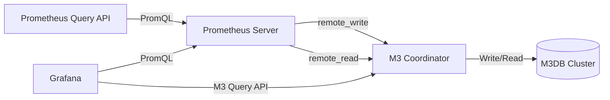

# M3DB Integration

## Introduction

When running Prometheus in production environments, storage capacity and retention often become significant challenges. By default, Prometheus stores time-series data on local disk, which works well for small to medium deployments but faces limitations when:

- You need to store metrics for extended periods
- Your metrics volume exceeds local storage capacity
- You require high availability across multiple Prometheus instances
- You want to query historical data without keeping it in Prometheus itself

M3DB is a distributed time-series database developed by Uber that addresses these challenges by providing a scalable, replicated solution for long-term Prometheus metrics storage. In this guide, we'll explore how to integrate Prometheus with M3DB to enhance your metrics storage capabilities.

## What is M3DB?

M3DB is part of the M3 stack, which includes:

- **M3DB**: The distributed time-series database engine
- **M3Coordinator**: A service that handles reads/writes and provides a Prometheus-compatible API
- **M3Aggregator**: An optional component for real-time aggregation of metrics

The architecture offers several advantages for Prometheus users:

1. Horizontal scalability (add more nodes as your metrics volume grows)
2. High availability through data replication
3. Multi-tenancy support
4. Native compression designed for time-series data
5. Configurable retention and downsampling policies

Let's see how Prometheus integrates with this powerful storage solution.

## Integration Architecture

Before diving into implementation details, let's understand how Prometheus and M3DB work together:



In this architecture:

1. Prometheus collects metrics as usual
2. Using the `remote_write` feature, Prometheus forwards data to M3Coordinator
3. M3Coordinator handles writing the data to the M3DB cluster
4. For queries that need historical data, Prometheus uses `remote_read` to fetch data from M3DB

Now, let's implement this integration step by step.

## Prerequisites

Before starting the integration, ensure you have:

- A running Prometheus instance
- Docker or Kubernetes environment for M3DB deployment
- Basic understanding of time-series databases
- Sufficient storage resources for M3DB

## Step 1: Deploy M3DB

While a full M3DB deployment guide is beyond this tutorial's scope, we'll outline the basic approach using Docker Compose for testing purposes.

Create a file named `m3db-docker-compose.yml`:

```yaml
version: '3.5'
services:
  m3db_seed:
    image: quay.io/m3db/m3dbnode:v1.0.0
    container_name: m3db_seed
    volumes:
      - ./m3db_config.yml:/etc/m3dbnode/m3dbnode.yml
      - m3db_data:/var/lib/m3db
    networks:
      - m3db
    ports:
      - "9000-9004:9000-9004"
    environment:
      - DBNODE_ENVIRONMENT=development
      - M3DB_HOST_ID=m3db_seed
      - PLACEMENT_ENVIRONMENT=default_env
      - PLACEMENT_NAMESPACE=default_ns
      - ETCD_ENDPOINTS=etcd:2379

  etcd:
    image: quay.io/coreos/etcd:v3.4.9
    container_name: etcd
    ports:
      - "2379:2379"
      - "2380:2380"
    networks:
      - m3db
    environment:
      - ETCD_LISTEN_CLIENT_URLS=http://0.0.0.0:2379
      - ETCD_ADVERTISE_CLIENT_URLS=http://etcd:2379

  m3coordinator:
    image: quay.io/m3db/m3coordinator:v1.0.0
    container_name: m3coordinator
    networks:
      - m3db
    ports:
      - "7201:7201"
      - "7203:7203"
    environment:
      - ETCD_ENDPOINTS=etcd:2379
      - M3COORDINATOR_ENVIRONMENT=development
    depends_on:
      - etcd
      - m3db_seed
    command: -f /etc/m3coordinator/m3coordinator.yml

networks:
  m3db:

volumes:
  m3db_data:
```

You'll also need basic configuration files for M3DB, but for a production environment, you should refer to the [official M3DB documentation](https://m3db.io/docs) for proper setup and sizing.

Start the services:

```bash
docker-compose -f m3db-docker-compose.yml up -d
```

## Step 2: Configure Prometheus for Remote Storage

Next, update your Prometheus configuration to use M3DB as a remote storage backend. Add the following to your `prometheus.yml` file:

```yaml
remote_write:
  - url: "http://localhost:7201/api/v1/prom/remote/write"
    # Optional: queue configuration
    queue_config:
      capacity: 10000
      max_shards: 200
      max_samples_per_send: 500

remote_read:
  - url: "http://localhost:7201/api/v1/prom/remote/read"
    read_recent: true
```

This configuration tells Prometheus to:
- Write all samples to M3DB via the coordinator's API endpoint
- Read from M3DB when querying data that isn't available in local storage

Restart Prometheus to apply these changes:

```bash
# If running Prometheus directly
systemctl restart prometheus

# Or if using Docker
docker restart prometheus
```

## Step 3: Verify the Integration

Once configured, you can verify the integration is working by:

1. Checking Prometheus logs for successful remote write operations:

```bash
grep "remote_storage" /var/log/prometheus/prometheus.log
```

2. Examining M3Coordinator metrics to see incoming writes:

```bash
curl http://localhost:7201/api/v1/metrics | grep "m3coordinator"
```

3. Querying historical data through Prometheus that should be stored in M3DB.

If everything is set up correctly, Prometheus should be writing metrics to M3DB, and you can query them just as you would with local storage.

## Step 4: Configuring Retention Policies

One of the significant advantages of M3DB is fine-grained control over data retention. You can configure different retention policies for different metrics or aggregation levels.

Here's an example of setting up a namespace with a 30-day retention period in M3DB:

```bash
curl -X POST http://localhost:7201/api/v1/database/create -d '{
  "namespaceName": "prometheus_metrics",
  "retentionTime": "720h",
  "resolution": "15s"
}'
```

For production use cases, you might want to define multiple namespaces with different retention and aggregation settings:

```bash
# Create a namespace for high-resolution data (15s) with 7-day retention
curl -X POST http://localhost:7201/api/v1/database/create -d '{
  "namespaceName": "metrics_short_term",
  "retentionTime": "168h",
  "resolution": "15s"
}'

# Create a namespace for aggregated data (5m) with 30-day retention
curl -X POST http://localhost:7201/api/v1/database/create -d '{
  "namespaceName": "metrics_medium_term",
  "retentionTime": "720h",
  "resolution": "300s"
}'

# Create a namespace for heavily aggregated data (1h) with 1-year retention
curl -X POST http://localhost:7201/api/v1/database/create -d '{
  "namespaceName": "metrics_long_term",
  "retentionTime": "8760h",
  "resolution": "3600s"
}'
```

## Step 5: Configuring Aggregation Rules

To make the most of M3DB's multi-resolution storage, you can define aggregation rules that downsample data at different intervals. This significantly reduces storage requirements for long-term data while maintaining query performance.

M3 uses a configuration similar to Prometheus recording rules:

```yaml
rules:
  - id: cpu_high_resolution_to_5m
    name: cpu_usage_5m
    filter:
      - name: __name__
        value: node_cpu_seconds_total
    aggregations:
      - type: sum
        dimensions: [mode, cpu]
    storagePolicies:
      - resolution: 5m
        retention: 30d
```

These rules can be applied through the M3Coordinator API:

```bash
curl -X POST http://localhost:7201/api/v1/rules -d @aggregation_rules.yml
```

## Real-World Example: Scaling Prometheus for a Large Kubernetes Cluster

Let's consider a real-world scenario where you're monitoring a Kubernetes cluster with hundreds of nodes and thousands of pods. The default Prometheus storage would struggle with this volume of data, especially if you need to retain it for compliance reasons.

Here's how you might architect this solution:

1. Deploy multiple Prometheus instances for high availability and load distribution
2. Configure each Prometheus with shorter local retention (e.g., 24 hours)
3. Set up M3DB cluster with appropriate storage resources
4. Configure remote_write from all Prometheus instances to M3DB
5. Set up aggregation rules in M3DB to downsample data at different intervals

Your updated Prometheus configuration:

```yaml
global:
  scrape_interval: 15s
  evaluation_interval: 15s
  # Reduce local storage to just recent data
  retention: 24h

# Standard scrape configs...
scrape_configs:
  - job_name: 'kubernetes-nodes'
    kubernetes_sd_configs:
      - role: node
    # Other config...

# Remote write all samples to M3DB
remote_write:
  - url: "http://m3coordinator:7201/api/v1/prom/remote/write"
    queue_config:
      max_samples_per_send: 1000
      capacity: 50000
      max_shards: 300

# Read historical data from M3DB
remote_read:
  - url: "http://m3coordinator:7201/api/v1/prom/remote/read"
    read_recent: false
```

With this setup, you can:

- Keep high-resolution metrics for short periods in Prometheus
- Store downsampled metrics in M3DB for much longer periods
- Scale your storage horizontally as your cluster grows
- Maintain query performance even with large historical datasets

## Performance Considerations

When integrating Prometheus with M3DB, consider these performance factors:

1. **Network bandwidth**: Remote write generates additional network traffic. Ensure your network can handle the throughput, especially in high-volume environments.

2. **Resource allocation**: M3DB requires significant memory and disk resources. Start with at least:
   - 8GB RAM per M3DB node
   - SSD storage for optimal performance
   - Multiple nodes for replication

3. **Queue configuration**: Tune the remote_write queue parameters based on your metric volume:

```yaml
remote_write:
  - url: "http://m3coordinator:7201/api/v1/prom/remote/write"
    queue_config:
      # Increase for high-volume environments
      capacity: 50000
      # Adjust based on available cores
      max_shards: 300
      # Batch size for each send
      max_samples_per_send: 1000
      # How long to wait before resending failed samples
      min_backoff: 500ms
      max_backoff: 30s
```

4. **CPU usage**: Remote storage operations can increase CPU usage. Monitor your Prometheus server's resource utilization and adjust as needed.

## Troubleshooting Common Issues

### Remote Write Timeouts

If you see errors like `error sending samples to remote storage: 503 Service Unavailable`, it could indicate:

- M3Coordinator is overloaded
- Network issues between Prometheus and M3Coordinator
- Insufficient resources on the M3DB nodes

Solutions:
- Increase resources allocated to M3DB cluster
- Adjust queue parameters to reduce pressure (smaller batches, more backoff)
- Check network connectivity and latency

### Missing Historical Data

If queries for older data return no results:

- Verify remote_read is properly configured
- Check if data has exceeded retention periods in M3DB
- Examine M3DB logs for ingestion errors

Solution:
```bash
# Check if M3DB has the data
curl -X POST http://localhost:7201/api/v1/query -d '{
  "query": "up",
  "start": "2023-01-01T00:00:00Z",
  "end": "2023-01-02T00:00:00Z"
}'
```

### High Cardinality Issues

Time-series databases like M3DB can struggle with metrics that have very high cardinality (too many label combinations).

Solution: Review and refine your labels to reduce unnecessary cardinality:

```yaml
# Before: High cardinality due to request_id label
http_requests_total{service="api", endpoint="/users", method="GET", request_id="12345"} 1

# After: Better approach without the unique request_id
http_requests_total{service="api", endpoint="/users", method="GET"} 1
```

## Summary

Integrating Prometheus with M3DB provides a powerful solution for scaling your metrics storage and extending retention periods. This combination gives you the best of both worlds: Prometheus's flexible data collection and querying capabilities with M3DB's scalable, distributed storage.

Key takeaways:
- M3DB enables horizontal scaling of Prometheus metrics storage
- The integration uses Prometheus's remote_write and remote_read features
- Multi-resolution storage in M3DB enables efficient long-term retention
- Proper configuration of retention policies and aggregation rules is essential for performance

By following this guide, you should now understand how to integrate Prometheus with M3DB, configure retention policies, and troubleshoot common issues.

## Additional Resources

- [Official M3DB Documentation](https://m3db.io/docs)
- [Prometheus Remote Storage Documentation](https://prometheus.io/docs/prometheus/latest/storage/#remote-storage-integrations)
- [M3DB GitHub Repository](https://github.com/m3db/m3)

## Exercises

1. Set up a local M3DB instance using Docker Compose and configure Prometheus to write metrics to it.
2. Create multiple retention policies in M3DB for different types of metrics.
3. Configure aggregation rules to downsample high-resolution metrics for long-term storage.
4. Benchmark query performance between local Prometheus storage and M3DB for a large dataset.
5. Create a Grafana dashboard that visualizes metrics from both recent data (Prometheus) and historical data (M3DB).