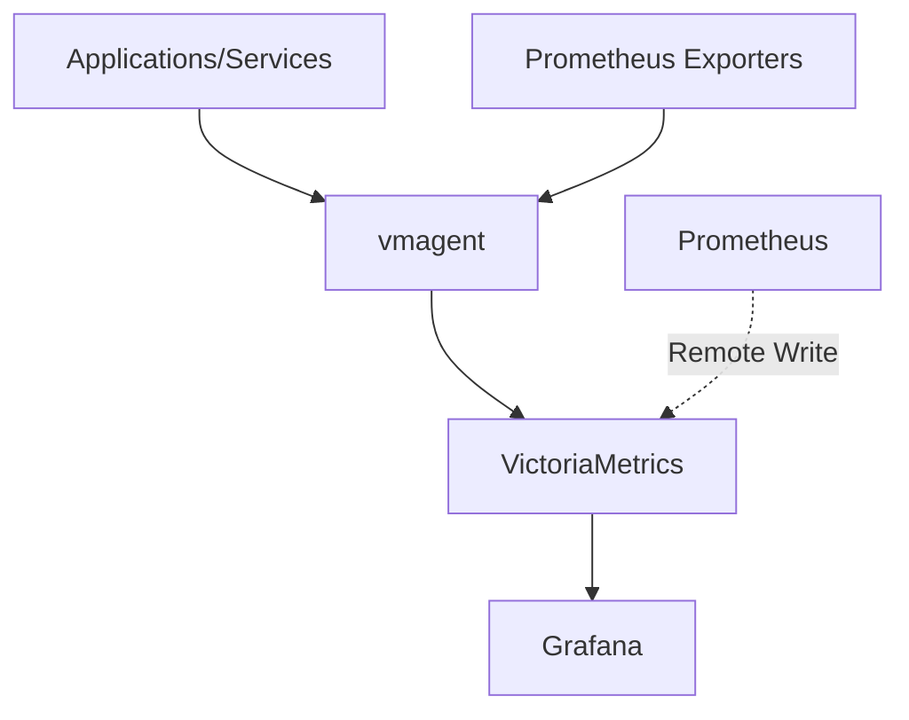

# VictoriaMetrics Integration

## Introduction

VictoriaMetrics is a fast, cost-effective, and scalable time series database and monitoring solution that offers an alternative storage backend for Prometheus. As your monitoring infrastructure grows, you may face challenges with Prometheus's native storage related to scalability, long-term data retention, and resource consumption. VictoriaMetrics addresses these limitations while maintaining compatibility with the Prometheus ecosystem.

In this guide, we'll explore how to integrate VictoriaMetrics with Prometheus, understand its benefits, and implement practical configurations to enhance your monitoring capabilities.

## Understanding VictoriaMetrics

VictoriaMetrics is designed as a drop-in replacement for Prometheus's storage component, offering several advantages:

- **High performance**: Can ingest and query data at high rates with lower resource usage
- **Better compression**: Stores time series data more efficiently, reducing disk space requirements
- **Scalability**: Supports both single-node and cluster deployments for horizontal scaling
- **Long-term storage**: Efficiently stores metrics for extended periods
- **Prometheus compatibility**: Works with existing Prometheus query language (PromQL) and ecosystem tools

## Deployment Options

There are two primary ways to integrate VictoriaMetrics with Prometheus:

1. **Remote Write Integration**: Configure Prometheus to send metrics to VictoriaMetrics while maintaining its local storage
2. **Full Replacement**: Use VictoriaMetrics as the primary storage and querying system, potentially with vmagent to replace Prometheus entirely

Let's explore each approach.

## Remote Write Integration

The simplest way to integrate VictoriaMetrics is through Prometheus's remote write functionality. This allows you to send metrics to VictoriaMetrics while continuing to use Prometheus for scraping and querying.

### Step 1: Set up VictoriaMetrics

First, let's deploy a single-node VictoriaMetrics instance:

```bash
# Download VictoriaMetrics
wget https://github.com/VictoriaMetrics/VictoriaMetrics/releases/download/v1.95.1/victoria-metrics-linux-amd64-v1.95.1.tar.gz

# Extract the archive
tar -xzf victoria-metrics-linux-amd64-v1.95.1.tar.gz

# Run VictoriaMetrics with default settings
./victoria-metrics-prod
```

By default, VictoriaMetrics listens on port 8428 and stores data in the `victoria-metrics-data` directory.

### Step 2: Configure Prometheus Remote Write

Edit your `prometheus.yml` configuration file to add the remote write endpoint:

```yaml
global:
  scrape_interval: 15s
  evaluation_interval: 15s

# Existing scrape configs...

remote_write:
  - url: "http://localhost:8428/api/v1/write"
    queue_config:
      capacity: 10000
      max_shards: 30
      max_samples_per_send: 1000
```

Restart Prometheus to apply the changes, and it will begin sending metrics to VictoriaMetrics.

### Step 3: Verify the Setup

Check that metrics are being written to VictoriaMetrics by accessing its web interface at `http://localhost:8428/`. You can run queries directly against VictoriaMetrics using the same PromQL syntax:

```
http://localhost:8428/api/v1/query?query=up
```

## Using Docker Compose

For a more production-ready setup, here's a Docker Compose example:

```yaml
version: '3.8'

services:
  prometheus:
    image: prom/prometheus:v2.45.0
    volumes:
      - ./prometheus.yml:/etc/prometheus/prometheus.yml
    command:
      - '--config.file=/etc/prometheus/prometheus.yml'
      - '--storage.tsdb.path=/prometheus'
      - '--web.console.libraries=/usr/share/prometheus/console_libraries'
      - '--web.console.templates=/usr/share/prometheus/consoles'
    ports:
      - "9090:9090"

  victoriametrics:
    image: victoriametrics/victoria-metrics:v1.95.1
    ports:
      - "8428:8428"
    volumes:
      - vm-data:/victoria-metrics-data
    command:
      - '--storageDataPath=/victoria-metrics-data'
      - '--retentionPeriod=1y'

volumes:
  vm-data:
```

And the corresponding `prometheus.yml`:

```yaml
global:
  scrape_interval: 15s
  evaluation_interval: 15s

scrape_configs:
  - job_name: 'prometheus'
    static_configs:
      - targets: ['localhost:9090']

remote_write:
  - url: "http://victoriametrics:8428/api/v1/write"
```

## Full VictoriaMetrics Replacement

For larger deployments, you might consider using VictoriaMetrics as a complete replacement with vmagent for metric collection.

### Architecture Overview

Here's a diagram showing a typical architecture:



### Step 1: Deploy vmagent

vmagent is a lightweight agent that mimics Prometheus's scraping capabilities:

```yaml
version: '3.8'

services:
  vmagent:
    image: victoriametrics/vmagent:v1.95.1
    ports:
      - "8429:8429"
    volumes:
      - ./prometheus.yml:/etc/prometheus/prometheus.yml
    command:
      - '--promscrape.config=/etc/prometheus/prometheus.yml'
      - '--remoteWrite.url=http://victoriametrics:8428/api/v1/write'
      - '--httpListenAddr=:8429'

  victoriametrics:
    image: victoriametrics/victoria-metrics:v1.95.1
    ports:
      - "8428:8428"
    volumes:
      - vm-data:/victoria-metrics-data
    command:
      - '--storageDataPath=/victoria-metrics-data'
      - '--retentionPeriod=1y'

volumes:
  vm-data:
```

### Step 2: Configure Grafana

Update your Grafana data source to point to VictoriaMetrics:

1. Add a new Prometheus data source
2. Set the URL to `http://victoriametrics:8428`
3. Keep the data source type as "Prometheus" since VictoriaMetrics is compatible

## Advanced Configuration Options

Let's explore some important configuration options for production deployments:

### Data Retention

One of VictoriaMetrics's strengths is efficient long-term storage. Configure retention periods with:

```bash
./victoria-metrics-prod --retentionPeriod=3m
```

The retention period supports the following suffixes:
- `h` - hours
- `d` - days
- `w` - weeks
- `y` - years

For example, `--retentionPeriod=1y` retains data for one year.

### Deduplication

VictoriaMetrics can deduplicate identical samples when using multiple Prometheus instances for high availability:

```bash
./victoria-metrics-prod --dedup.minScrapeInterval=30s
```

### Storage Path

Specify a custom storage path:

```bash
./victoria-metrics-prod --storageDataPath=/path/to/victoria-metrics-data
```

### Memory Management

Control memory usage with:

```bash
./victoria-metrics-prod --memory.allowedPercent=70
```

## Performance Tuning

Here are some best practices for optimizing your VictoriaMetrics deployment:

1. **Disk Selection**: Use fast SSDs for better performance
2. **Monitoring VictoriaMetrics**: Configure monitoring for VictoriaMetrics itself
3. **Resource Limits**: Set appropriate memory and CPU limits in containerized environments
4. **Query Optimization**: Optimize PromQL queries to avoid excessive resource usage

## Real-World Example: High-Availability Setup

Let's implement a practical high-availability setup for a production environment:

```yaml
version: '3.8'

services:
  prometheus-1:
    image: prom/prometheus:v2.45.0
    volumes:
      - ./prometheus-1.yml:/etc/prometheus/prometheus.yml
    command:
      - '--config.file=/etc/prometheus/prometheus.yml'
    ports:
      - "9091:9090"

  prometheus-2:
    image: prom/prometheus:v2.45.0
    volumes:
      - ./prometheus-2.yml:/etc/prometheus/prometheus.yml
    command:
      - '--config.file=/etc/prometheus/prometheus.yml'
    ports:
      - "9092:9090"

  victoriametrics:
    image: victoriametrics/victoria-metrics:v1.95.1
    ports:
      - "8428:8428"
    volumes:
      - vm-data:/victoria-metrics-data
    command:
      - '--storageDataPath=/victoria-metrics-data'
      - '--retentionPeriod=1y'
      - '--dedup.minScrapeInterval=30s'
      - '--httpListenAddr=:8428'

  grafana:
    image: grafana/grafana:10.1.0
    ports:
      - "3000:3000"
    environment:
      - GF_SECURITY_ADMIN_PASSWORD=admin
    volumes:
      - grafana-data:/var/lib/grafana

volumes:
  vm-data:
  grafana-data:
```

Both Prometheus instances would have similar configurations but scrape different targets or the same targets with different labels:

```yaml
# prometheus-1.yml
global:
  scrape_interval: 15s
  evaluation_interval: 15s
  external_labels:
    replica: "1"

scrape_configs:
  - job_name: 'prometheus'
    static_configs:
      - targets: ['localhost:9090']

remote_write:
  - url: "http://victoriametrics:8428/api/v1/write"
```

```yaml
# prometheus-2.yml
global:
  scrape_interval: 15s
  evaluation_interval: 15s
  external_labels:
    replica: "2"

scrape_configs:
  - job_name: 'prometheus'
    static_configs:
      - targets: ['localhost:9090']

remote_write:
  - url: "http://victoriametrics:8428/api/v1/write"
```

With this setup, both Prometheus instances write to VictoriaMetrics, which handles deduplication.

## Querying Data

VictoriaMetrics supports the standard Prometheus query API:

- **Instant queries**: `/api/v1/query?query=<promql_expression>`
- **Range queries**: `/api/v1/query_range?query=<promql_expression>&start=<start_time>&end=<end_time>&step=<step>`

For example, to get the CPU usage of all instances:

```bash
curl -G 'http://localhost:8428/api/v1/query' --data-urlencode 'query=sum by (instance) (rate(node_cpu_seconds_total{mode!="idle"}[5m]))'
```

## Migrating Existing Data

To migrate historical data from Prometheus to VictoriaMetrics:

1. Use the official migration tool:

```bash
./prometheus-to-victoria-metrica -prometheus-snapshot=path/to/prometheus/data -victoria-metrics-url=http://localhost:8428
```

2. Or export data from Prometheus and import into VictoriaMetrics:

```bash
# Export from Prometheus
promtool tsdb dump /path/to/prometheus/data > metrics_dump.txt

# Import to VictoriaMetrics
cat metrics_dump.txt | curl -X POST -T - http://localhost:8428/api/v1/import
```

## Common Challenges and Solutions

### High Cardinality

VictoriaMetrics handles high cardinality metrics better than Prometheus but should still be monitored:

```yaml
# Set limits to prevent resource exhaustion
./victoria-metrics-prod --maxLabelsPerTimeseries=30
```

### Network Issues

For unreliable networks, configure retry and queuing:

```yaml
remote_write:
  - url: "http://victoriametrics:8428/api/v1/write"
    queue_config:
      max_samples_per_send: 1000
      capacity: 20000
      max_shards: 30
    retry_on_http_429: true
```

### Data Consistency

When using remote write, use Prometheus for short-term queries and VictoriaMetrics for long-term to ensure consistency:

```bash
# Query recent data from Prometheus
curl -G 'http://localhost:9090/api/v1/query' --data-urlencode 'query=up'

# Query historical data from VictoriaMetrics
curl -G 'http://localhost:8428/api/v1/query' --data-urlencode 'query=up[30d]'
```

## Summary

In this guide, we explored how to integrate VictoriaMetrics with Prometheus to enhance your monitoring infrastructure's storage capabilities. We covered:

1. Setting up VictoriaMetrics as a remote storage for Prometheus
2. Configuring a full VictoriaMetrics replacement with vmagent
3. Advanced configuration options and performance tuning
4. Real-world examples for high-availability setups
5. Data migration strategies and common challenges

VictoriaMetrics offers a powerful solution for scaling your monitoring infrastructure while maintaining compatibility with the Prometheus ecosystem. By properly integrating these tools, you can achieve longer data retention, better performance, and increased scalability.

## Additional Resources

- [VictoriaMetrics GitHub Repository](https://github.com/VictoriaMetrics/VictoriaMetrics)
- [VictoriaMetrics Documentation](https://docs.victoriametrics.com/)
- [Prometheus Remote Write Documentation](https://prometheus.io/docs/prometheus/latest/configuration/configuration/#remote_write)

## Exercises

1. Set up a single-node VictoriaMetrics instance and configure Prometheus to write metrics to it.
2. Create a Docker Compose file that deploys Prometheus, VictoriaMetrics, and Grafana together.
3. Configure two Prometheus instances to write to the same VictoriaMetrics instance and test the deduplication feature.
4. Compare query performance between Prometheus and VictoriaMetrics for the same dataset.
5. Configure VictoriaMetrics to retain data for different periods (e.g., raw data for 2 weeks, downsampled data for 1 year).