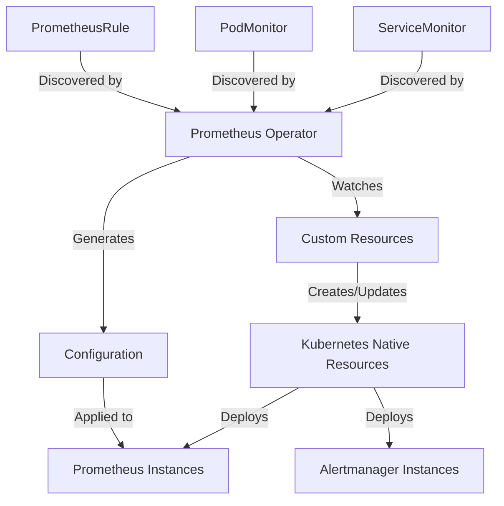

# Prometheus Operator

## Introduction

Prometheus Operator is a Kubernetes native application that simplifies the deployment and management of Prometheus and related monitoring components in Kubernetes clusters. Instead of manually configuring and maintaining Prometheus deployments, the Operator introduces custom resources that automate these processes.

The Operator was created as part of the Kubernetes Operator Framework initiative, designed to encode operational knowledge into software. It follows the "operator pattern" by extending the Kubernetes API with custom resources specifically for Prometheus monitoring.

## Why Prometheus Operator?

Managing Prometheus in Kubernetes environments can be challenging:

- Configuring and maintaining Prometheus deployments
- Keeping scrape configurations updated as applications scale
- Managing alert rules
- Setting up proper service discovery

The Prometheus Operator solves these challenges by providing:

- Declarative configuration through Kubernetes custom resources
- Automated deployment and configuration management
- Simplified scaling and updates
- Integration with Kubernetes service discovery

## Custom Resource Definitions (CRDs)

The Prometheus Operator introduces several custom resources to Kubernetes:

| Custom Resource | Description |
|----------------|-------------|
| `Prometheus` | Defines Prometheus deployments |
| `ServiceMonitor` | Specifies how services should be monitored |
| `PodMonitor` | Specifies how pods should be monitored |
| `PrometheusRule` | Defines alerting and recording rules |
| `Alertmanager` | Manages Alertmanager deployments |

## Getting Started with Prometheus Operator

### Prerequisites

- A Kubernetes cluster (v1.16 or higher)
- kubectl configured to communicate with your cluster
- Helm (optional, for easy installation)

### Installation

There are multiple ways to install Prometheus Operator. Let's look at the most common methods:

#### Using Helm

```bash
# Add the Prometheus community Helm repository
helm repo add prometheus-community https://prometheus-community.github.io/helm-charts
helm repo update

# Install Prometheus Operator with kube-prometheus-stack
helm install prometheus prometheus-community/kube-prometheus-stack
```

#### Using kubectl

```bash
# Clone the kube-prometheus repository
git clone https://github.com/prometheus-operator/kube-prometheus.git
cd kube-prometheus

# Create the namespace and CRDs
kubectl create -f manifests/setup

# Wait for the CRDs to be established
until kubectl get servicemonitors --all-namespaces ; do date; sleep 1; echo ""; done

# Create the monitoring stack
kubectl create -f manifests/
```

### Verifying the Installation

After installation, you should see several resources created in your cluster:

```bash
# Check the pods in the monitoring namespace
kubectl get pods -n monitoring

# Expected output:
NAME                                   READY   STATUS    RESTARTS   AGE
alertmanager-main-0                    2/2     Running   0          5m
prometheus-adapter-69b8496df6-v8h4m    1/1     Running   0          5m
prometheus-k8s-0                       2/2     Running   0          5m
prometheus-operator-7d66c5f458-jdz5w   1/1     Running   0          5m
```

## Understanding Key Components

### The Prometheus Resource

The `Prometheus` custom resource defines a Prometheus server deployment. Here's an example:

```yaml
apiVersion: monitoring.coreos.com/v1
kind: Prometheus
metadata:
  name: example
  namespace: monitoring
spec:
  serviceAccountName: prometheus
  replicas: 2
  version: v2.35.0
  serviceMonitorSelector:
    matchLabels:
      team: frontend
  resources:
    requests:
      memory: 400Mi
  retention: 7d
```

This manifest creates a Prometheus deployment with:
- 2 replicas for high availability
- A specific Prometheus version (v2.35.0)
- Configuration to monitor only services with the label `team: frontend`
- Memory resource request of 400Mi
- Data retention period of 7 days

### ServiceMonitor Resource

The `ServiceMonitor` resource defines how Prometheus should discover and scrape metrics from Kubernetes services:

```yaml
apiVersion: monitoring.coreos.com/v1
kind: ServiceMonitor
metadata:
  name: example-app
  namespace: monitoring
  labels:
    team: frontend
spec:
  selector:
    matchLabels:
      app: example-app
  endpoints:
  - port: web
    interval: 15s
    path: /metrics
```

This ServiceMonitor:
- Targets services with the label `app: example-app`
- Scrapes metrics from the `web` port every 15 seconds
- Uses the `/metrics` path to collect metrics
- Has the `team: frontend` label, which matches our Prometheus configuration

### PodMonitor Resource

Similar to ServiceMonitor, but targets pods directly instead of services:

```yaml
apiVersion: monitoring.coreos.com/v1
kind: PodMonitor
metadata:
  name: example-pod-monitor
  namespace: monitoring
spec:
  selector:
    matchLabels:
      app: example-app
  podMetricsEndpoints:
  - port: metrics
    interval: 30s
```

### PrometheusRule Resource

Defines alerting and recording rules:

```yaml
apiVersion: monitoring.coreos.com/v1
kind: PrometheusRule
metadata:
  name: example-rules
  namespace: monitoring
  labels:
    prometheus: example
spec:
  groups:
  - name: example
    rules:
    - alert: HighRequestLatency
      expr: job:request_latency_seconds:mean5m{job="example-app"} > 0.5
      for: 10m
      labels:
        severity: critical
      annotations:
        summary: High request latency on {{ $labels.instance }}
        description: Request latency is above 0.5 seconds for 10 minutes.
```

## How Prometheus Operator Works

Let's understand the inner workings of the Operator:



The Prometheus Operator:
1. Watches for changes in custom resources
2. Generates the necessary configurations
3. Creates and manages the required Kubernetes resources
4. Automatically updates configurations when changes occur

## Practical Example: Monitoring a Web Application

Let's walk through setting up monitoring for a sample web application:

### 1. Deploy a Sample Application

```yaml
apiVersion: apps/v1
kind: Deployment
metadata:
  name: example-app
  namespace: default
spec:
  replicas: 3
  selector:
    matchLabels:
      app: example-app
  template:
    metadata:
      labels:
        app: example-app
    spec:
      containers:
      - name: example-app
        image: nginx
        ports:
        - name: web
          containerPort: 80
---
apiVersion: v1
kind: Service
metadata:
  name: example-app
  namespace: default
  labels:
    app: example-app
spec:
  ports:
  - name: web
    port: 80
    targetPort: web
  selector:
    app: example-app
```

### 2. Add Prometheus Metrics to the Application

For a real application, you'd instrument your code with a Prometheus client library. For this example, let's assume our application exposes metrics at `/metrics`.

### 3. Create a ServiceMonitor

```yaml
apiVersion: monitoring.coreos.com/v1
kind: ServiceMonitor
metadata:
  name: example-app
  namespace: monitoring
  labels:
    team: frontend
spec:
  selector:
    matchLabels:
      app: example-app
  namespaceSelector:
    matchNames:
      - default
  endpoints:
  - port: web
    path: /metrics
    interval: 15s
```

### 4. Verify Discovery in Prometheus

After applying these manifests, Prometheus should automatically discover and start scraping metrics from your application. You can verify this by:

1. Port-forwarding to the Prometheus UI:

```bash
kubectl port-forward -n monitoring svc/prometheus-operated 9090:9090
```

2. Open `http://localhost:9090/targets` in your browser
3. Look for targets with labels matching your application

## Advanced Features

### Thanos Integration

The Prometheus Operator supports integration with Thanos for long-term storage and high availability:

```yaml
apiVersion: monitoring.coreos.com/v1
kind: Prometheus
metadata:
  name: example
  namespace: monitoring
spec:
  replicas: 2
  thanos:
    version: v0.25.0
    baseImage: quay.io/thanos/thanos
    objectStorageConfig:
      key: thanos.yaml
      name: thanos-objstore-config
```

### Monitoring Multiple Clusters

For monitoring multiple Kubernetes clusters, you can:

1. Deploy Prometheus Operator in each cluster
2. Use Thanos to aggregate metrics from all clusters
3. Set up a central Prometheus instance to collect from all clusters

## Best Practices

1. **Resource Management**: Always set resource limits and requests for Prometheus instances
    ```yaml
    resources:
      requests:
        memory: 1Gi
        cpu: 500m
      limits:
        memory: 2Gi
        cpu: 1000m
    ```

2. **High Availability**: Use multiple replicas for critical environments
    ```yaml
    replicas: 2
    ```

3. **Data Retention**: Set appropriate retention periods based on your needs
    ```yaml
    retention: 15d
    ```

4. **Service Discovery**: Use label selectors efficiently to organize your monitoring targets

5. **Namespaces**: Consider namespace isolation for different teams or applications

## Troubleshooting

### Common Issues

1. **ServiceMonitor not working**
   - Check if the labels match between your ServiceMonitor and Prometheus resource
   - Verify that your service has the expected labels
   - Check Prometheus logs for discovery issues

2. **Configuration not updating**
   - The Operator might be experiencing issues
   - Check the Operator logs: `kubectl logs -n monitoring deployment/prometheus-operator`

3. **High memory usage**
   - Review your retention period
   - Check your scrape interval and target count
   - Consider using recording rules to pre-aggregate data

## Summary

The Prometheus Operator provides a powerful way to manage Prometheus deployments in Kubernetes. By using custom resources, it simplifies the configuration and maintenance of your monitoring infrastructure.

Key benefits include:
- Declarative configuration through Kubernetes-native resources
- Automated deployment and management
- Easy scaling and updates
- Integration with Kubernetes service discovery

With Prometheus Operator, you can focus on defining what you want to monitor, rather than how to set up and maintain Prometheus itself.

## Additional Resources

- [Prometheus Operator GitHub Repository](https://github.com/prometheus-operator/prometheus-operator)
- [kube-prometheus Stack](https://github.com/prometheus-operator/kube-prometheus)
- [Custom Resource Definitions Documentation](https://github.com/prometheus-operator/prometheus-operator/blob/main/Documentation/api.md)

## Exercises

1. Install Prometheus Operator in a test cluster and configure it to monitor the Kubernetes API server.

2. Create a custom ServiceMonitor to scrape metrics from a deployed application.

3. Define a PrometheusRule with an alert that triggers when a pod is restarting frequently.

4. Set up Alertmanager with the Prometheus Operator and configure it to send alerts to a Slack channel.

5. Configure Prometheus to use persistent storage for metrics data.