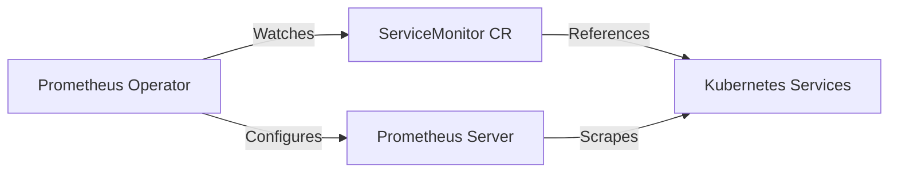

# ServiceMonitor Custom Resources

## Introduction

When running Prometheus in a Kubernetes environment, discovering and monitoring services dynamically becomes crucial as containers are ephemeral and can move between nodes. The Prometheus Operator introduces the `ServiceMonitor` custom resource, which enables declarative service discovery and automatic configuration for Prometheus.

A `ServiceMonitor` custom resource defines how a set of services should be monitored by Prometheus. It allows you to:

- Define which services Prometheus should scrape for metrics
- Specify the endpoints, paths, and protocols for scraping
- Configure scraping intervals and timeouts
- Set relabeling configurations for customizing metrics

In this guide, we'll explore how ServiceMonitor resources work, how to create them, and how they integrate with Prometheus in a Kubernetes environment.

## Prerequisites

Before diving into ServiceMonitors, ensure you have:

- A running Kubernetes cluster
- Prometheus Operator installed (typically via the kube-prometheus stack)
- Basic knowledge of Kubernetes services and Prometheus metrics

## Understanding ServiceMonitor Resources

### The ServiceMonitor Custom Resource Definition

The ServiceMonitor CRD extends the Kubernetes API, allowing you to define monitoring configurations as native Kubernetes objects. The Prometheus Operator watches for these objects and automatically configures Prometheus servers to scrape the services that match the specifications.

Here's the relationship between the components:



### Key Components of a ServiceMonitor

A ServiceMonitor resource includes several important fields:

1. **Selector**: Defines which services this monitor should target
2. **Namespace selector**: Specifies which namespaces to look for services
3. **Endpoints**: Defines the endpoints from which metrics should be scraped
4. **Sample Limit**: Optional limit on the number of samples that can be accepted

## Creating Your First ServiceMonitor

Let's create a basic ServiceMonitor to scrape metrics from a service named `example-app` in the `default` namespace:

```yaml
apiVersion: monitoring.coreos.com/v1
kind: ServiceMonitor
metadata:
  name: example-app-monitor
  namespace: monitoring
spec:
  selector:
    matchLabels:
      app: example-app
  namespaceSelector:
    matchNames:
      - default
  endpoints:
  - port: metrics
    interval: 15s
    path: /metrics
```

In this example:
- The ServiceMonitor looks for services with the label `app: example-app`
- It only checks in the `default` namespace
- It scrapes the endpoint available on the `metrics` port
- It uses a 15-second scraping interval
- It expects metrics to be available at the `/metrics` path

### Corresponding Service Definition

For the ServiceMonitor to work, you would need a Kubernetes service with matching labels:

```yaml
apiVersion: v1
kind: Service
metadata:
  name: example-app
  namespace: default
  labels:
    app: example-app
spec:
  selector:
    app: example-app
  ports:
  - name: metrics
    port: 8080
    targetPort: 8080
    protocol: TCP
```

Notice that the service has the `app: example-app` label that matches our ServiceMonitor selector, and it includes a port named `metrics` which is referenced in the ServiceMonitor's endpoints.

## Advanced ServiceMonitor Configurations

### Monitoring Services Across Multiple Namespaces

If you want to monitor services across multiple specific namespaces:

```yaml
apiVersion: monitoring.coreos.com/v1
kind: ServiceMonitor
metadata:
  name: cross-namespace-monitor
  namespace: monitoring
spec:
  selector:
    matchLabels:
      role: api
  namespaceSelector:
    matchNames:
    - production
    - staging
    - testing
  endpoints:
  - port: http-metrics
    interval: 30s
```

Or to monitor services across all namespaces:

```yaml
apiVersion: monitoring.coreos.com/v1
kind: ServiceMonitor
metadata:
  name: all-namespaces-monitor
  namespace: monitoring
spec:
  selector:
    matchLabels:
      role: api
  namespaceSelector:
    any: true
  endpoints:
  - port: http-metrics
```

### Configuring TLS and Authentication

For endpoints that require TLS or authentication:

```yaml
apiVersion: monitoring.coreos.com/v1
kind: ServiceMonitor
metadata:
  name: secure-app-monitor
  namespace: monitoring
spec:
  selector:
    matchLabels:
      app: secure-app
  endpoints:
  - port: https
    scheme: https
    tlsConfig:
      caFile: /etc/prometheus/certs/ca.crt
      certFile: /etc/prometheus/certs/client.crt
      keyFile: /etc/prometheus/certs/client.key
      insecureSkipVerify: false
    basicAuth:
      username:
        name: basic-auth
        key: username
      password:
        name: basic-auth
        key: password
```

This configuration uses TLS certificates and basic authentication stored in Kubernetes secrets to access a secure endpoint.

### Relabeling Configurations

Relabeling allows you to modify the metadata of scraped metrics:

```yaml
apiVersion: monitoring.coreos.com/v1
kind: ServiceMonitor
metadata:
  name: relabel-example
  namespace: monitoring
spec:
  selector:
    matchLabels:
      app: example-app
  endpoints:
  - port: metrics
    relabelings:
    - sourceLabels: [__meta_kubernetes_pod_name]
      targetLabel: pod_name
    - sourceLabels: [__meta_kubernetes_namespace]
      targetLabel: namespace
    metricRelabelings:
    - sourceLabels: [__name__]
      regex: 'container_memory_usage_bytes'
      action: drop
```

This example:
1. Adds a `pod_name` label containing the pod name
2. Adds a `namespace` label with the namespace name
3. Drops any metrics with the name `container_memory_usage_bytes`

## Verifying Your ServiceMonitor Configuration

After creating a ServiceMonitor, you can verify it's working correctly:

1. **Check if the ServiceMonitor is recognized:**

```bash
kubectl get servicemonitors -n monitoring
```

2. **Verify the Prometheus configuration:**

Access your Prometheus UI (typically available through a port-forward or ingress) and check the "Status" > "Configuration" page. You should see your service listed as a scrape target.

3. **Check if targets are being scraped:**

In the Prometheus UI, go to "Status" > "Targets". Look for your service in the list of targets and verify it shows as "UP".

## Practical Example: Monitoring a Web Application

Let's walk through a complete example of setting up monitoring for a web application:

### 1. Deploy a Sample Application

```yaml
apiVersion: apps/v1
kind: Deployment
metadata:
  name: example-webapp
  namespace: default
spec:
  replicas: 2
  selector:
    matchLabels:
      app: example-webapp
  template:
    metadata:
      labels:
        app: example-webapp
    spec:
      containers:
      - name: webapp
        image: example/webapp:v1
        ports:
        - name: web
          containerPort: 8080
        - name: metrics
          containerPort: 8081
---
apiVersion: v1
kind: Service
metadata:
  name: example-webapp
  namespace: default
  labels:
    app: example-webapp
spec:
  selector:
    app: example-webapp
  ports:
  - name: web
    port: 80
    targetPort: web
  - name: metrics
    port: 8081
    targetPort: metrics
```

### 2. Create a ServiceMonitor for the Application

```yaml
apiVersion: monitoring.coreos.com/v1
kind: ServiceMonitor
metadata:
  name: example-webapp-monitor
  namespace: monitoring
spec:
  selector:
    matchLabels:
      app: example-webapp
  namespaceSelector:
    matchNames:
      - default
  endpoints:
  - port: metrics
    interval: 30s
    path: /metrics
```

### 3. View the Results

After deploying both resources:

1. Check that the ServiceMonitor is created:
```bash
kubectl get servicemonitor example-webapp-monitor -n monitoring
```

2. After a minute or two, check the Prometheus targets to ensure your application is being scraped:
```bash
kubectl port-forward svc/prometheus-operated 9090:9090 -n monitoring
```

Then open `http://localhost:9090/targets` in your browser and look for your targets.

3. Query some metrics from your application:
```
http_requests_total{service="example-webapp"}
```

## Troubleshooting ServiceMonitors

### Common Issues

1. **ServiceMonitor not selecting any services:**
   - Verify that labels match between the ServiceMonitor selector and the Service
   - Check that the namespaces match or are included in the namespaceSelector

2. **Targets show as "DOWN" in Prometheus:**
   - Ensure the port name exists in your service definition
   - Verify the application is exposing metrics on the specified path
   - Check if any network policies are blocking Prometheus

3. **Authentication fails:**
   - Verify that secrets referenced in the ServiceMonitor exist and contain the correct data
   - Check certificate expiration dates

### Debugging Commands

```bash
# Check ServiceMonitor details
kubectl describe servicemonitor <name> -n <namespace>

# Verify endpoints on the service
kubectl get endpoints <service-name> -n <service-namespace>

# Check if Prometheus can reach the service
kubectl exec -it <prometheus-pod> -n <prometheus-namespace> -- wget -O- --timeout=2 http://<service>.<namespace>.svc:8080/metrics
```

## Integration with PrometheusRules

ServiceMonitors work well with PrometheusRules, which define alerting and recording rules:

```yaml
apiVersion: monitoring.coreos.com/v1
kind: PrometheusRule
metadata:
  name: example-webapp-alerts
  namespace: monitoring
  labels:
    prometheus: k8s
    role: alert-rules
spec:
  groups:
  - name: example-webapp
    rules:
    - alert: HighErrorRate
      expr: sum(rate(http_requests_total{job="example-webapp",status=~"5.."}[5m])) / sum(rate(http_requests_total{job="example-webapp"}[5m])) > 0.1
      for: 10m
      labels:
        severity: warning
      annotations:
        summary: "High error rate in example-webapp"
        description: "Error rate is above 10% for more than 10 minutes (current value: {{ $value }})"
```

This rule creates an alert when the error rate for our example-webapp exceeds 10% for more than 10 minutes.

## Best Practices

1. **Use consistent labeling:**
   - Follow a standardized labeling convention for your services
   - Consider using Helm charts to ensure consistency

2. **Organize by namespace:**
   - Group ServiceMonitors in a monitoring namespace
   - Use namespaceSelector thoughtfully to avoid unnecessary scraping

3. **Set appropriate intervals:**
   - Balance between freshness of data and load on Prometheus
   - Consider the cardinality of metrics and storage requirements

4. **Leverage relabeling:**
   - Add useful metadata to metrics using relabeling
   - Drop unnecessary metrics to reduce storage requirements

5. **Monitor your monitors:**
   - Set up alerts for when ServiceMonitors aren't working
   - Create documentation for your monitoring setup

## Summary

ServiceMonitor custom resources provide a powerful, Kubernetes-native way to configure service discovery for Prometheus. By defining which services should be monitored declaratively, you can:

- Automate the discovery and monitoring of services
- Apply consistent monitoring across your applications
- Integrate monitoring into your GitOps workflow
- Scale your monitoring as your application grows

They form an essential part of the Prometheus Operator ecosystem, working alongside other custom resources like Prometheus, Alertmanager, and PrometheusRule to create a comprehensive monitoring solution.

## Additional Resources

- [Prometheus Operator Documentation](https://github.com/prometheus-operator/prometheus-operator/blob/main/Documentation/user-guides/getting-started.md)
- [Kubernetes Service Discovery in Prometheus](https://prometheus.io/docs/prometheus/latest/configuration/configuration/#kubernetes_sd_config)
- [RelabelConfig Documentation](https://prometheus.io/docs/prometheus/latest/configuration/configuration/#relabel_config)

## Exercises

1. Create a ServiceMonitor for a simple application that exposes metrics on a custom path like `/custom-metrics`.

2. Configure a ServiceMonitor that selects services based on multiple label criteria.

3. Set up a ServiceMonitor that monitors services across all namespaces that have a specific label.

4. Create a ServiceMonitor with relabeling configuration that adds pod and node information to metrics.

5. Implement a ServiceMonitor that uses TLS for a secure connection to your metrics endpoint.