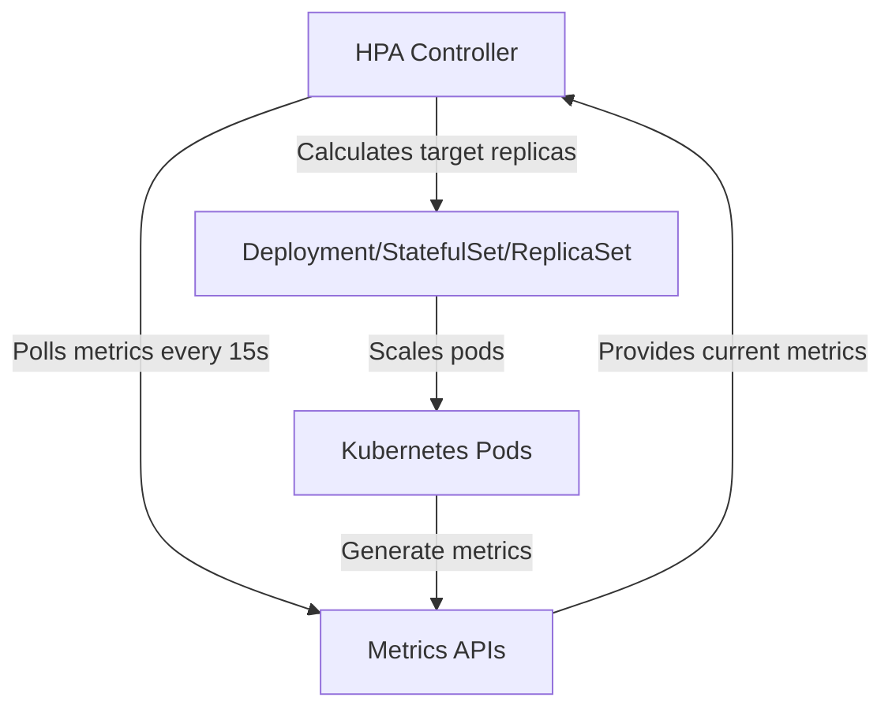

# Horizontal Pod Autoscaler (HPA)

## Introduction

The Horizontal Pod Autoscaler (HPA) is a Kubernetes resource that automatically adjusts the number of pods in a deployment, replica set, or stateful set based on observed metrics. Rather than manually setting a fixed number of replicas, HPA allows your application to scale automatically in response to changes in demand, optimizing resource utilization and ensuring application performance.

In this guide, we'll explore how HPA works with Prometheus metrics to enable intelligent scaling decisions for your Kubernetes workloads.

## How HPA Works

At its core, HPA follows a simple control loop:

1. Collect metrics from pods (CPU, memory, custom metrics)
2. Calculate desired replica count based on metrics and target values
3. Adjust the replica count if needed



The HPA controller operates on a standard reconciliation loop, typically checking metrics every 15 seconds (configurable). It then applies a scaling algorithm to determine if the number of replicas should change.

## Metrics Types Supported by HPA

HPA supports several types of metrics:

- **Resource metrics**: CPU and memory usage
- **Custom metrics**: Application-specific metrics from Prometheus
- **External metrics**: Metrics from external sources
- **Object metrics**: Metrics describing Kubernetes objects

## Basic HPA Configuration

Let's start with a simple HPA that scales based on CPU usage:

```yaml
apiVersion: autoscaling/v2
kind: HorizontalPodAutoscaler
metadata:
  name: example-hpa
spec:
  scaleTargetRef:
    apiVersion: apps/v1
    kind: Deployment
    name: example-app
  minReplicas: 2
  maxReplicas: 10
  metrics:
  - type: Resource
    resource:
      name: cpu
      target:
        type: Utilization
        averageUtilization: 50
```

This HPA will:
- Target a deployment named `example-app`
- Maintain between 2 and 10 replicas
- Scale to keep average CPU utilization at 50%

## Setting Up Prometheus for HPA

To use Prometheus metrics with HPA, you need to set up the **Prometheus Adapter**. This component translates Prometheus metrics into a format that Kubernetes' metrics APIs understand.

### 1. Install Prometheus Adapter

Using Helm:

```bash
helm repo add prometheus-community https://prometheus-community.github.io/helm-charts
helm repo update
helm install prometheus-adapter prometheus-community/prometheus-adapter
```

### 2. Configure the Prometheus Adapter

Create a configuration to tell the adapter which Prometheus metrics to expose:

```yaml
apiVersion: v1
kind: ConfigMap
metadata:
  name: prometheus-adapter-config
data:
  config.yaml: |
    rules:
    - seriesQuery: '{__name__=~"^http_requests_total$",kubernetes_namespace!="",kubernetes_pod_name!=""}'
      resources:
        overrides:
          kubernetes_namespace: {resource: "namespace"}
          kubernetes_pod_name: {resource: "pod"}
      name:
        matches: "^(.*)_total"
        as: "${1}_per_second"
      metricsQuery: 'sum(rate(<<.Series>>{<<.LabelMatchers>>}[2m])) by (<<.GroupBy>>)'
```

This configuration creates a custom metric called `http_requests_per_second` from Prometheus' `http_requests_total` counter.

## Creating an HPA with Prometheus Metrics

Now we can create an HPA that scales based on request rate:

```yaml
apiVersion: autoscaling/v2
kind: HorizontalPodAutoscaler
metadata:
  name: webapp-hpa
spec:
  scaleTargetRef:
    apiVersion: apps/v1
    kind: Deployment
    name: webapp
  minReplicas: 2
  maxReplicas: 20
  metrics:
  - type: Pods
    pods:
      metric:
        name: http_requests_per_second
      target:
        type: AverageValue
        averageValue: 10
```

This HPA will scale the `webapp` deployment to maintain an average of 10 requests per second per pod.

## Practical Example: Multi-Metric HPA

HPA can use multiple metrics for scaling decisions. Here's a real-world example that scales based on both CPU and request rate:

```yaml
apiVersion: autoscaling/v2
kind: HorizontalPodAutoscaler
metadata:
  name: advanced-hpa-example
spec:
  scaleTargetRef:
    apiVersion: apps/v1
    kind: Deployment
    name: api-service
  minReplicas: 3
  maxReplicas: 30
  metrics:
  - type: Resource
    resource:
      name: cpu
      target:
        type: Utilization
        averageUtilization: 70
  - type: Pods
    pods:
      metric:
        name: http_requests_per_second
      target:
        type: AverageValue
        averageValue: 100
  behavior:
    scaleDown:
      stabilizationWindowSeconds: 300
      policies:
      - type: Percent
        value: 50
        periodSeconds: 60
    scaleUp:
      stabilizationWindowSeconds: 60
      policies:
      - type: Percent
        value: 100
        periodSeconds: 60
      - type: Pods
        value: 4
        periodSeconds: 60
      selectPolicy: Max
```

This example includes:
- CPU utilization target of 70%
- HTTP request rate target of 100 requests/second per pod
- Custom scaling behavior with different policies for scaling up and down

## Monitoring HPA with Prometheus

To observe how your HPA is performing, you can use Prometheus to collect HPA metrics:

1. **Create a ServiceMonitor** for the kube-controller-manager:

```yaml
apiVersion: monitoring.coreos.com/v1
kind: ServiceMonitor
metadata:
  name: kube-controller-manager
  namespace: monitoring
spec:
  endpoints:
  - interval: 30s
    port: http-metrics
  namespaceSelector:
    matchNames:
    - kube-system
  selector:
    matchLabels:
      app: kube-controller-manager
```

2. **Useful Prometheus Queries** for HPA monitoring:

```
# Current number of replicas for an HPA
kube_horizontalpodautoscaler_status_current_replicas{name="webapp-hpa"}

# Desired number of replicas calculated by HPA
kube_horizontalpodautoscaler_status_desired_replicas{name="webapp-hpa"}

# Current metric value vs target
kube_horizontalpodautoscaler_status_current_metrics{name="webapp-hpa"}
```

3. **Create a Grafana Dashboard** for HPA:

```json
{
  "panels": [
    {
      "title": "HPA Replicas",
      "type": "graph",
      "targets": [
        {
          "expr": "kube_horizontalpodautoscaler_status_current_replicas{name=\"$hpa\"}",
          "legendFormat": "Current"
        },
        {
          "expr": "kube_horizontalpodautoscaler_status_desired_replicas{name=\"$hpa\"}",
          "legendFormat": "Desired"
        },
        {
          "expr": "kube_horizontalpodautoscaler_spec_min_replicas{name=\"$hpa\"}",
          "legendFormat": "Min"
        },
        {
          "expr": "kube_horizontalpodautoscaler_spec_max_replicas{name=\"$hpa\"}",
          "legendFormat": "Max"
        }
      ]
    }
  ]
}
```

## HPA Best Practices

1. **Set appropriate min and max replicas:**
   - `minReplicas` should be enough to handle minimal load
   - `maxReplicas` should consider resource constraints

2. **Choose the right metrics:**
   - CPU-based scaling works well for compute-intensive applications
   - Request rate is better for I/O or network-bound applications
   - Consider application-specific metrics (queue length, error rate)

3. **Configure scaling behavior carefully:**
   - Use `stabilizationWindowSeconds` to prevent thrashing
   - Configure scaling policies based on your application's needs

4. **Test scaling scenarios:**
   - Perform load testing to validate scaling behavior
   - Monitor both scale-up and scale-down events

5. **Consider scaling limitations:**
   - Database connections may need to be managed during scaling
   - Stateful applications require special consideration

## Common Issues and Troubleshooting

### HPA Not Scaling

If your HPA isn't scaling as expected:

1. Check if metrics are available:

```bash
kubectl get --raw "/apis/metrics.k8s.io/v1beta1/namespaces/default/pods" | jq
```

For custom metrics:

```bash
kubectl get --raw "/apis/custom.metrics.k8s.io/v1beta1" | jq
```

2. Verify HPA status:

```bash
kubectl describe hpa webapp-hpa
```

Look for events and conditions that might explain scaling issues.

3. Check Prometheus adapter logs:

```bash
kubectl logs -n monitoring deployment/prometheus-adapter
```

### HPA Scaling Too Frequently

If your HPA is scaling too frequently (thrashing):

1. Increase the stabilization window:

```yaml
behavior:
  scaleDown:
    stabilizationWindowSeconds: 300
  scaleUp:
    stabilizationWindowSeconds: 120
```

2. Adjust target utilization to be less sensitive

## End-to-End Example: HPA with Prometheus

Let's put everything together in a complete example:

1. **Deploy a sample application with Prometheus metrics:**

```yaml
apiVersion: apps/v1
kind: Deployment
metadata:
  name: sample-app
  labels:
    app: sample-app
spec:
  replicas: 2
  selector:
    matchLabels:
      app: sample-app
  template:
    metadata:
      labels:
        app: sample-app
      annotations:
        prometheus.io/scrape: "true"
        prometheus.io/path: "/metrics"
        prometheus.io/port: "8080"
    spec:
      containers:
      - name: sample-app
        image: sample-app:latest
        ports:
        - containerPort: 8080
        resources:
          requests:
            cpu: 100m
            memory: 128Mi
          limits:
            cpu: 250m
            memory: 256Mi
---
apiVersion: v1
kind: Service
metadata:
  name: sample-app
spec:
  selector:
    app: sample-app
  ports:
  - port: 80
    targetPort: 8080
```

2. **Configure Prometheus Adapter:**

```yaml
apiVersion: v1
kind: ConfigMap
metadata:
  name: prometheus-adapter-config
data:
  config.yaml: |
    rules:
    - seriesQuery: '{__name__=~"^sample_app_requests_total$",kubernetes_namespace!="",kubernetes_pod_name!=""}'
      resources:
        overrides:
          kubernetes_namespace: {resource: "namespace"}
          kubernetes_pod_name: {resource: "pod"}
      name:
        matches: "^(.*)_total"
        as: "${1}_per_second"
      metricsQuery: 'sum(rate(<<.Series>>{<<.LabelMatchers>>}[2m])) by (<<.GroupBy>>)'
```

3. **Create the HPA:**

```yaml
apiVersion: autoscaling/v2
kind: HorizontalPodAutoscaler
metadata:
  name: sample-app-hpa
spec:
  scaleTargetRef:
    apiVersion: apps/v1
    kind: Deployment
    name: sample-app
  minReplicas: 2
  maxReplicas: 10
  metrics:
  - type: Resource
    resource:
      name: cpu
      target:
        type: Utilization
        averageUtilization: 60
  - type: Pods
    pods:
      metric:
        name: sample_app_requests_per_second
      target:
        type: AverageValue
        averageValue: 50
  behavior:
    scaleDown:
      stabilizationWindowSeconds: 300
    scaleUp:
      stabilizationWindowSeconds: 60
```

4. **Generate load for testing:**

```bash
# Install hey load testing tool
go get -u github.com/rakyll/hey

# Send load to the application
hey -z 10m -q 100 -c 10 http://sample-app.default.svc.cluster.local/
```

5. **Observe scaling behavior:**

```bash
# Watch HPA status
kubectl get hpa sample-app-hpa -w

# Check Prometheus metrics
# Query in Prometheus: rate(sample_app_requests_total[2m])
```

## Summary

The Horizontal Pod Autoscaler is a powerful Kubernetes resource that automates scaling decisions based on metrics:

- HPA can scale workloads based on CPU, memory, and custom metrics from Prometheus
- Prometheus Adapter translates Prometheus metrics for use with HPA
- Proper configuration of metrics and scaling behavior is key to effective autoscaling
- HPA can use multiple metrics simultaneously for intelligent scaling decisions
- Monitoring HPA behavior helps fine-tune your autoscaling configuration

By combining HPA with Prometheus metrics, you can create intelligent, responsive scaling systems that efficiently handle varying workloads while maintaining application performance.

## Additional Resources

- [Kubernetes HPA Documentation](https://kubernetes.io/docs/tasks/run-application/horizontal-pod-autoscale/)
- [Prometheus Adapter GitHub Repository](https://github.com/kubernetes-sigs/prometheus-adapter)
- [Kubernetes Metrics Server](https://github.com/kubernetes-sigs/metrics-server)

## Exercises

1. **Basic HPA Setup:** Create an HPA for a deployment that scales based on CPU utilization.
2. **Custom Metrics:** Configure Prometheus Adapter to expose a custom application metric and create an HPA that uses it.
3. **Multi-Metric HPA:** Design an HPA that scales based on both CPU and memory utilization.
4. **Advanced Behavior:** Configure custom scale-up and scale-down behaviors for an HPA to handle bursty traffic patterns.
5. **Monitoring Dashboard:** Create a Prometheus query and Grafana panel to visualize HPA scaling decisions alongside application metrics.