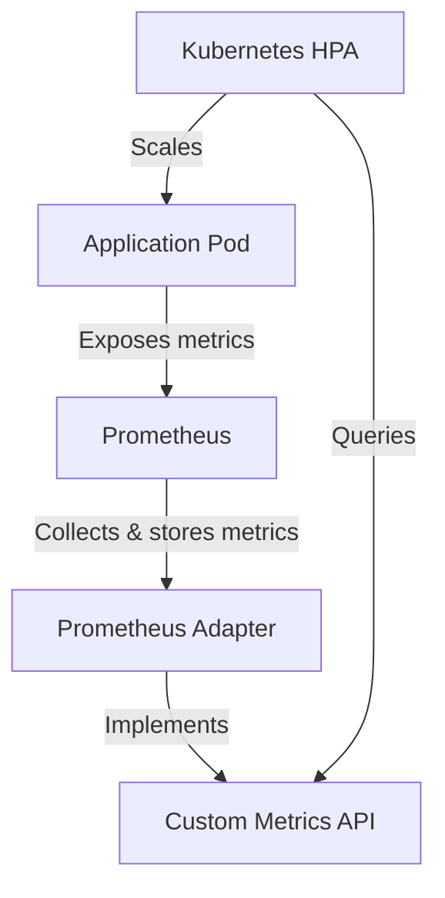

# Custom Metrics API

## Introduction

The Custom Metrics API is a powerful extension to Kubernetes that allows you to expose application-specific metrics to the Kubernetes control plane. This integration is particularly valuable when you need to scale applications based on metrics beyond the standard CPU and memory usage (which are provided by the Resource Metrics API).

In a Prometheus and Kubernetes environment, the Custom Metrics API bridges the gap between your application metrics collected by Prometheus and the Kubernetes autoscaling system. This enables more intelligent scaling decisions based on business-relevant metrics like request latency, queue lengths, or concurrent users.

## Understanding the Custom Metrics API

### What is the Custom Metrics API?

The Custom Metrics API is an extension API that follows Kubernetes' aggregation layer pattern. It allows third-party solutions like Prometheus to expose application-specific metrics to Kubernetes components, particularly the Horizontal Pod Autoscaler (HPA).

By default, Kubernetes can only scale based on CPU and memory usage. With the Custom Metrics API, you can scale based on any metric that makes sense for your application:

- Request count or rate
- Queue length
- Response time
- Error rates
- Business-specific metrics (like active users)

### Architecture Overview



The architecture involves several components working together:

1. **Your application pods** expose metrics via Prometheus exporters
2. **Prometheus** scrapes and stores these metrics
3. **Prometheus Adapter** translates between Prometheus queries and the Kubernetes Custom Metrics API
4. **Kubernetes HPA** queries these metrics and makes scaling decisions

## Setting Up the Custom Metrics API

Let's walk through setting up the Custom Metrics API with Prometheus in your Kubernetes cluster.

### Prerequisites

- A running Kubernetes cluster (v1.16+)
- Prometheus installed in your cluster
- Helm (optional, but recommended for easier installation)

### Installing the Prometheus Adapter

The Prometheus Adapter is the component that implements the Custom Metrics API and makes Prometheus metrics available to Kubernetes.

#### Using Helm (Recommended)

```bash
# Add the Prometheus Community Helm repo
helm repo add prometheus-community https://prometheus-community.github.io/helm-charts
helm repo update

# Install the Prometheus Adapter
helm install prometheus-adapter prometheus-community/prometheus-adapter \
  --namespace monitoring \
  --create-namespace \
  --set prometheus.url=http://prometheus-server.monitoring.svc.cluster.local \
  --set prometheus.port=9090
```

#### Using YAML Manifests

If you prefer to use raw YAML manifests, you can apply the following configuration:

```yaml
apiVersion: apps/v1
kind: Deployment
metadata:
  name: prometheus-adapter
  namespace: monitoring
spec:
  replicas: 1
  selector:
    matchLabels:
      app: prometheus-adapter
  template:
    metadata:
      labels:
        app: prometheus-adapter
    spec:
      containers:
      - name: prometheus-adapter
        image: registry.k8s.io/prometheus-adapter/prometheus-adapter:v0.10.0
        args:
        - --prometheus-url=http://prometheus-server.monitoring.svc.cluster.local:9090
        - --metrics-relist-interval=1m
        - --v=4
        - --secure-port=6443
        ports:
        - containerPort: 6443
---
apiVersion: v1
kind: Service
metadata:
  name: prometheus-adapter
  namespace: monitoring
spec:
  ports:
  - port: 443
    targetPort: 6443
  selector:
    app: prometheus-adapter
```

### Configuring the Prometheus Adapter

The Prometheus Adapter needs configuration to know which Prometheus metrics should be exposed through the Custom Metrics API. Create a ConfigMap with your adapter configuration:

```yaml
apiVersion: v1
kind: ConfigMap
metadata:
  name: adapter-config
  namespace: monitoring
data:
  config.yaml: |
    rules:
    - seriesQuery: '{__name__=~"http_requests_total"}'
      resources:
        overrides:
          kubernetes_namespace:
            resource: namespace
          kubernetes_pod_name:
            resource: pod
      name:
        matches: "http_requests_total"
        as: "http_requests_per_second"
      metricsQuery: 'sum(rate(<<.Series>>{<<.LabelMatchers>>}[2m])) by (<<.GroupBy>>)'
```

This configuration exposes the `http_requests_total` Prometheus metric as `http_requests_per_second` to the Custom Metrics API, calculating a 2-minute rate and allowing Kubernetes to query it per pod or namespace.

## Using Custom Metrics for Autoscaling

Once you have the Custom Metrics API set up, you can create HPAs that use these metrics for scaling decisions.

### Creating an HPA with Custom Metrics

Here's an example of an HPA that scales a service based on HTTP request rate:

```yaml
apiVersion: autoscaling/v2
kind: HorizontalPodAutoscaler
metadata:
  name: sample-app-hpa
spec:
  scaleTargetRef:
    apiVersion: apps/v1
    kind: Deployment
    name: sample-app
  minReplicas: 1
  maxReplicas: 10
  metrics:
  - type: Pods
    pods:
      metric:
        name: http_requests_per_second
      target:
        type: AverageValue
        averageValue: 500m  # 500 milli-requests per second, or 0.5 requests/second
```

### Verifying the Setup

You can verify that your custom metrics are available to Kubernetes using the following commands:

```bash
# Check if the API service is available
kubectl get apiservice v1beta1.custom.metrics.k8s.io

# List available custom metrics
kubectl get --raw "/apis/custom.metrics.k8s.io/v1beta1" | jq .

# Get a specific metric for pods in a namespace
kubectl get --raw "/apis/custom.metrics.k8s.io/v1beta1/namespaces/default/pods/*/http_requests_per_second" | jq .
```

Example output:

```json
{
  "kind": "MetricValueList",
  "apiVersion": "custom.metrics.k8s.io/v1beta1",
  "metadata": {
    "selfLink": "/apis/custom.metrics.k8s.io/v1beta1/namespaces/default/pods/*/http_requests_per_second"
  },
  "items": [
    {
      "describedObject": {
        "kind": "Pod",
        "namespace": "default",
        "name": "sample-app-8446f84d77-2zvxq",
        "apiVersion": "/v1"
      },
      "metricName": "http_requests_per_second",
      "timestamp": "2023-08-15T14:30:22Z",
      "value": "250m"
    }
  ]
}
```

## Practical Example: Scaling a Web Service

Let's walk through a complete practical example of setting up a web service with custom metrics for autoscaling.

### Step 1: Deploy a Sample Application with Prometheus Metrics

Here's a simple web application that exposes Prometheus metrics:

```yaml
apiVersion: apps/v1
kind: Deployment
metadata:
  name: sample-web-app
  labels:
    app: sample-web-app
spec:
  replicas: 1
  selector:
    matchLabels:
      app: sample-web-app
  template:
    metadata:
      labels:
        app: sample-web-app
      annotations:
        prometheus.io/scrape: "true"
        prometheus.io/port: "8080"
        prometheus.io/path: "/metrics"
    spec:
      containers:
      - name: sample-web-app
        image: ghcr.io/stefanprodan/podinfo:latest
        ports:
        - containerPort: 8080
---
apiVersion: v1
kind: Service
metadata:
  name: sample-web-app
spec:
  selector:
    app: sample-web-app
  ports:
  - port: 80
    targetPort: 8080
```

This sample application automatically exposes Prometheus metrics at `/metrics`.

### Step 2: Configure the Prometheus Adapter for the App's Metrics

Update your Prometheus Adapter configuration to recognize the application's metrics:

```yaml
apiVersion: v1
kind: ConfigMap
metadata:
  name: adapter-config
  namespace: monitoring
data:
  config.yaml: |
    rules:
    - seriesQuery: '{__name__=~"http_requests_total",kubernetes_pod_name!=""}'
      resources:
        overrides:
          kubernetes_namespace:
            resource: namespace
          kubernetes_pod_name:
            resource: pod
      name:
        matches: "http_requests_total"
        as: "http_requests_per_second"
      metricsQuery: 'sum(rate(<<.Series>>{<<.LabelMatchers>>}[2m])) by (<<.GroupBy>>)'
```

### Step 3: Create HPA for the Sample Application

```yaml
apiVersion: autoscaling/v2
kind: HorizontalPodAutoscaler
metadata:
  name: sample-web-app-hpa
spec:
  scaleTargetRef:
    apiVersion: apps/v1
    kind: Deployment
    name: sample-web-app
  minReplicas: 1
  maxReplicas: 10
  metrics:
  - type: Pods
    pods:
      metric:
        name: http_requests_per_second
      target:
        type: AverageValue
        averageValue: 10  # Scale when pods average 10 requests per second
```

### Step 4: Generate Traffic to Test the Autoscaling

You can use a tool like `hey` or `siege` to generate traffic to your service:

```bash
# Install hey if needed
go install github.com/rakyll/hey@latest

# Generate traffic
hey -z 5m -q 20 -c 50 http://sample-web-app.default.svc.cluster.local/
```

While traffic is being generated, you can monitor your HPA and observe scaling:

```bash
kubectl get hpa sample-web-app-hpa --watch
```

Example output:

```
NAME                 REFERENCE                    TARGETS      MINPODS   MAXPODS   REPLICAS   AGE
sample-web-app-hpa   Deployment/sample-web-app   8500m/10     1         10        1          45s
sample-web-app-hpa   Deployment/sample-web-app   12500m/10    1         10        1          60s
sample-web-app-hpa   Deployment/sample-web-app   12500m/10    1         10        2          75s
sample-web-app-hpa   Deployment/sample-web-app   8300m/10     1         10        2          90s
```

## Advanced Configurations

### External Metrics API

In addition to Custom Metrics, Kubernetes also offers the External Metrics API, which allows scaling based on metrics not related to Kubernetes objects, such as metrics from external sources like AWS SQS queue length or Cloudwatch metrics.

```yaml
apiVersion: autoscaling/v2
kind: HorizontalPodAutoscaler
metadata:
  name: queue-processor-hpa
spec:
  scaleTargetRef:
    apiVersion: apps/v1
    kind: Deployment
    name: queue-processor
  minReplicas: 1
  maxReplicas: 10
  metrics:
  - type: External
    external:
      metric:
        name: sqs_messages
        selector:
          matchLabels:
            queue_name: processing-queue
      target:
        type: AverageValue
        averageValue: 30
```

### Multi-Metric and Compound Scaling Decisions

You can define multiple metrics in a single HPA, enabling more sophisticated scaling decisions:

```yaml
apiVersion: autoscaling/v2
kind: HorizontalPodAutoscaler
metadata:
  name: complex-app-hpa
spec:
  scaleTargetRef:
    apiVersion: apps/v1
    kind: Deployment
    name: complex-app
  minReplicas: 1
  maxReplicas: 10
  metrics:
  - type: Resource
    resource:
      name: cpu
      target:
        type: Utilization
        averageUtilization: 50
  - type: Pods
    pods:
      metric:
        name: http_requests_per_second
      target:
        type: AverageValue
        averageValue: 1000m
  - type: Pods
    pods:
      metric:
        name: latency_seconds
      target:
        type: AverageValue
        averageValue: 0.5
```

In this example, the HPA will scale based on whichever metric requires the highest number of replicas.

## Troubleshooting

### Common Issues and Solutions

1. **Metrics not appearing in the Custom Metrics API**

    Verify your adapter configuration and make sure the metrics exist in Prometheus:

    ```bash
    # Check if Prometheus is collecting the metrics
    kubectl port-forward -n monitoring svc/prometheus-server 9090:80
    # Then visit http://localhost:9090 and query your metrics
    
    # Check adapter logs
    kubectl logs -n monitoring deployment/prometheus-adapter
    ```

2. **HPA not scaling based on custom metrics**

    Check if the HPA can see the metrics:

    ```bash
    kubectl describe hpa sample-web-app-hpa
    ```

    Look for warnings or errors in the events section.

3. **"Unable to fetch metrics" errors**

    This often indicates connectivity issues between the adapter and Prometheus. Verify the Prometheus URL in the adapter configuration.

## Summary

The Custom Metrics API is a powerful extension to Kubernetes that enables autoscaling based on application-specific metrics collected by Prometheus. By setting up the Prometheus Adapter, you can bridge the gap between your application's business metrics and Kubernetes' scaling mechanisms.

Key points to remember:

- The Custom Metrics API allows Kubernetes to scale based on application-specific metrics beyond CPU and memory
- The Prometheus Adapter implements this API by translating Prometheus metrics into a format Kubernetes understands
- Configuring the adapter requires careful mapping between Prometheus metrics and Kubernetes resources
- HPAs can use these custom metrics for making scaling decisions
- You can combine multiple metrics for more sophisticated scaling behavior

By mastering the Custom Metrics API, you can create more intelligent, business-aware scaling behaviors that better match your application's actual needs.

## Exercises

1. Set up the Custom Metrics API in your Kubernetes cluster using the Prometheus Adapter.
2. Configure the adapter to expose a custom metric from your application.
3. Create an HPA that scales your application based on this custom metric.
4. Test the scaling behavior by generating load on your application.
5. Advanced: Create an HPA that uses multiple metrics (both resource and custom metrics) for scaling decisions.

## Additional Resources

- [Kubernetes HPA Documentation](https://kubernetes.io/docs/tasks/run-application/horizontal-pod-autoscale/)
- [Prometheus Adapter GitHub Repository](https://github.com/kubernetes-sigs/prometheus-adapter)
- [Custom Metrics API Design](https://github.com/kubernetes/design-proposals-archive/blob/main/instrumentation/custom-metrics-api.md)
- [Kubernetes Metrics Server](https://github.com/kubernetes-sigs/metrics-server) (for the core Resource Metrics API)