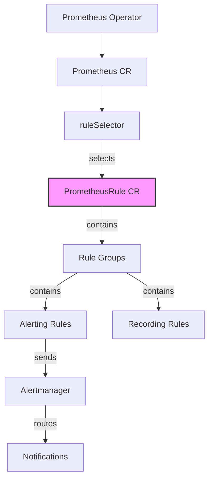

# PrometheusRule Custom Resources

## Introduction

When monitoring applications in Kubernetes with Prometheus, you'll often need to define alerting and recording rules. While Prometheus traditionally uses a file-based approach for rule definitions, the Prometheus Operator introduces a more Kubernetes-native way to manage these rules through **PrometheusRule** custom resources.

PrometheusRule resources allow you to define, organize, and manage Prometheus rules declaratively using Kubernetes objects. This integration brings several benefits:

- **Declarative Configuration**: Define rules as Kubernetes resources
- **Version Control**: Track rule changes in your Git repository alongside other Kubernetes manifests
- **Dynamic Updates**: Rules are automatically reloaded without restarting Prometheus
- **Namespace Organization**: Group rules logically by namespace

In this guide, we'll explore how PrometheusRule custom resources work, how to define them, and how to integrate them with your Prometheus setup in Kubernetes.

## Prerequisites

Before diving into PrometheusRule custom resources, you should have:

- A Kubernetes cluster
- Prometheus Operator installed
- Basic understanding of Prometheus alerting and recording rules
- Basic understanding of Kubernetes Custom Resources

## Understanding PrometheusRule Structure

A PrometheusRule resource is a Kubernetes custom resource that contains groups of Prometheus recording and alerting rules. Let's examine its structure:

```yaml
apiVersion: monitoring.coreos.com/v1
kind: PrometheusRule
metadata:
  name: example-rule
  namespace: monitoring
  labels:
    # These labels are required to be detected by Prometheus
    prometheus: k8s
    role: alert-rules
spec:
  groups:
  - name: example
    rules:
    - alert: HighRequestLatency
      expr: job:request_latency_seconds:mean5m{job="myjob"} > 0.5
      for: 10m
      labels:
        severity: page
      annotations:
        summary: High request latency
        description: Job {{ $labels.job }} has a latency of {{ $value }} seconds.
```

The key components are:

1. **apiVersion and kind**: Identifies this as a PrometheusRule resource
2. **metadata.labels**: Critical for rule discovery (more on this later)
3. **spec.groups**: Contains one or more rule groups
4. **rules**: The actual alerting or recording rules

## Rule Types

PrometheusRule resources can contain two types of rules:

### Recording Rules

Recording rules precompute frequently used or computationally expensive expressions and save their results as new time series. This improves performance for dashboards and queries.

```yaml
- record: job:request_duration_seconds:avg_rate5m
  expr: avg(rate(request_duration_seconds_count[5m])) by (job)
```

### Alerting Rules

Alerting rules define conditions that trigger alerts when they become true:

```yaml
- alert: InstanceDown
  expr: up == 0
  for: 5m
  labels:
    severity: critical
  annotations:
    summary: "Instance {{ $labels.instance }} down"
    description: "{{ $labels.instance }} of job {{ $labels.job }} has been down for more than 5 minutes."
```

## Creating Your First PrometheusRule

Let's walk through creating a basic PrometheusRule resource that monitors CPU usage in your cluster:

```yaml
apiVersion: monitoring.coreos.com/v1
kind: PrometheusRule
metadata:
  name: cpu-alert-rules
  namespace: monitoring
  labels:
    prometheus: k8s
    role: alert-rules
spec:
  groups:
  - name: cpu-alerts
    rules:
    - alert: HighCPUUsage
      expr: 100 - (avg by(instance) (rate(node_cpu_seconds_total{mode="idle"}[5m])) * 100) > 80
      for: 5m
      labels:
        severity: warning
      annotations:
        summary: High CPU usage detected
        description: "CPU usage is above 80% on instance {{ $labels.instance }}"
    - alert: CriticalCPUUsage
      expr: 100 - (avg by(instance) (rate(node_cpu_seconds_total{mode="idle"}[5m])) * 100) > 95
      for: 2m
      labels:
        severity: critical
      annotations:
        summary: Critical CPU usage detected
        description: "CPU usage is above 95% on instance {{ $labels.instance }}"
```

To apply this rule:

```bash
kubectl apply -f cpu-alert-rules.yaml
```

## Rule Discovery in Prometheus Operator

The Prometheus Operator uses label selectors to discover PrometheusRule resources. This selector is defined in your Prometheus custom resource:

```yaml
apiVersion: monitoring.coreos.com/v1
kind: Prometheus
metadata:
  name: prometheus
  namespace: monitoring
spec:
  # ... other settings
  ruleSelector:
    matchLabels:
      prometheus: k8s
      role: alert-rules
  # ... other settings
```

With this configuration, Prometheus will discover all PrometheusRule resources with the labels `prometheus: k8s` and `role: alert-rules` across all namespaces it has permission to access.

## Best Practices for Organizing Rules

As your monitoring needs grow, you'll want to organize your rules effectively:

### Namespacing

Group related rules by namespace. For example:

- `monitoring` namespace for cluster-level rules
- Application-specific rules in their respective namespaces

### Rule Grouping

Within a PrometheusRule, organize related rules into groups:

```yaml
spec:
  groups:
  - name: node-alerts
    rules:
    # Node-related alerts
  - name: kubernetes-apps
    rules:
    # Application-related alerts
```

Rules in the same group are evaluated sequentially, which can be important for recording rules that build on each other.

### Labeling Strategy

Use consistent labels to categorize your rules:

```yaml
metadata:
  labels:
    prometheus: k8s
    role: alert-rules
    tier: infrastructure  # Additional categorization
    component: node       # Further categorization
```

## Advanced Examples

### Application-Specific Monitoring Rules

Here's a PrometheusRule for monitoring a web application:

```yaml
apiVersion: monitoring.coreos.com/v1
kind: PrometheusRule
metadata:
  name: webapp-rules
  namespace: web-app
  labels:
    prometheus: k8s
    role: alert-rules
spec:
  groups:
  - name: webapp-availability
    rules:
    - alert: WebAppDown
      expr: up{job="webapp"} == 0
      for: 2m
      labels:
        severity: critical
        team: frontend
      annotations:
        summary: Web application down
        description: The web application instance {{ $labels.instance }} has been down for more than 2 minutes.
        runbook_url: https://wiki.example.com/runbooks/webapp-down
        
    - alert: HighErrorRate
      expr: sum(rate(http_requests_total{job="webapp",status=~"5.."}[5m])) / sum(rate(http_requests_total{job="webapp"}[5m])) > 0.05
      for: 2m
      labels:
        severity: warning
        team: frontend
      annotations:
        summary: High error rate detected
        description: Error rate is above 5% ({{ $value | humanizePercentage }})
        
  - name: webapp-performance
    rules:
    - record: job:request_latency_p95:5m
      expr: histogram_quantile(0.95, sum(rate(request_duration_seconds_bucket{job="webapp"}[5m])) by (le, instance))
      
    - alert: SlowResponses
      expr: job:request_latency_p95:5m > 2
      for: 10m
      labels:
        severity: warning
        team: frontend
      annotations:
        summary: Slow response times
        description: 95th percentile of request latency is above 2 seconds ({{ $value }} seconds)
```

### Database Monitoring Rules

Here's an example for monitoring a database:

```yaml
apiVersion: monitoring.coreos.com/v1
kind: PrometheusRule
metadata:
  name: database-rules
  namespace: database
  labels:
    prometheus: k8s
    role: alert-rules
spec:
  groups:
  - name: postgres-alerts
    rules:
    - alert: PostgresqlDown
      expr: pg_up{job="postgresql"} == 0
      for: 1m
      labels:
        severity: critical
        team: db-admins
      annotations:
        summary: PostgreSQL instance down
        description: PostgreSQL instance {{ $labels.instance }} is down

    - alert: PostgresqlHighConnections
      expr: sum by (datname) (pg_stat_activity_count{job="postgresql"}) > 150
      for: 5m
      labels:
        severity: warning
        team: db-admins
      annotations:
        summary: Too many connections
        description: Database {{ $labels.datname }} has more than 150 connections
        
    - alert: PostgresqlSlowQueries
      expr: pg_slow_queries{job="postgresql"} > 5
      for: 5m
      labels:
        severity: warning
        team: db-admins
      annotations:
        summary: Slow queries detected
        description: There are {{ $value }} slow queries on instance {{ $labels.instance }}
```

## Visualizing Rule Relationships

Let's visualize how PrometheusRule resources fit into the Prometheus Operator ecosystem:



## Debugging and Testing Rules

### Checking Rule Syntax

You can validate your PrometheusRule resources before applying them:

```bash
kubectl apply --dry-run=client -f my-rule.yaml
```

### Testing Rule Expressions

You can test rule expressions directly in the Prometheus UI:

1. Access your Prometheus UI (typically at `http://<prometheus-host>:9090`)
2. Go to the "Graph" tab
3. Enter your rule expression and click "Execute"

### Checking Rule Status

To see if your rules are being loaded correctly:

1. In the Prometheus UI, go to "Status" > "Rules"
2. Verify your rules appear with the correct evaluation status

## Common Patterns and Anti-Patterns

### Recommended Patterns

✅ **Use templating**: Make use of Helm or Kustomize to template your PrometheusRule resources
✅ **Include runbook links**: Add `runbook_url` annotations to help responders
✅ **Group related rules**: Keep related rules in the same group
✅ **Use meaningful labels**: Label your alerts logically to help with routing

### Anti-Patterns to Avoid

❌ **Noisy alerts**: Avoid alerting on metrics that fluctuate naturally
❌ **Missing "for" duration**: Always include a `for` clause to prevent flapping
❌ **Lack of severity levels**: Always include a severity label
❌ **Hard-coded thresholds**: Consider using variables or configMaps for thresholds

## Integration with AlertManager

Your PrometheusRule alerting rules will send alerts to AlertManager, which can then route and deduplicate them based on the labels you define:

```yaml
# In AlertManagerConfig
spec:
  route:
    groupBy: ['alertname', 'job']
    groupWait: 30s
    groupInterval: 5m
    repeatInterval: 12h
    receiver: 'default-receiver'
    routes:
    - matchers:
      - name: severity
        value: critical
      receiver: 'critical-alerts'
      
  receivers:
  - name: 'default-receiver'
    # receiver configuration...
  - name: 'critical-alerts'
    # receiver configuration...
```

## Summary

PrometheusRule custom resources provide a Kubernetes-native way to manage Prometheus alerting and recording rules. They offer several advantages over the traditional file-based approach:

- Declarative, version-controlled rule definitions
- Dynamic updates without Prometheus restarts
- Logical organization by namespace and labels
- Easy integration with the entire Kubernetes ecosystem

By mastering PrometheusRule resources, you can build comprehensive monitoring systems that detect issues early and provide valuable insights into your applications and infrastructure.

## Additional Resources

- [Prometheus Operator Documentation](https://prometheus-operator.dev/)
- [Prometheus Alerting Rules](https://prometheus.io/docs/prometheus/latest/configuration/alerting_rules/)
- [Prometheus Recording Rules](https://prometheus.io/docs/prometheus/latest/configuration/recording_rules/)
- [AlertManager Configuration](https://prometheus.io/docs/alerting/latest/configuration/)

## Exercises

1. Create a PrometheusRule that monitors memory usage in your cluster.
2. Develop a PrometheusRule for a specific application with both recording and alerting rules.
3. Set up a rule that monitors API server latency and alerts when response times exceed certain thresholds.
4. Create a recording rule that aggregates request count metrics by endpoint and status code.
5. Design an alerting strategy with different severity levels and appropriate timing thresholds.