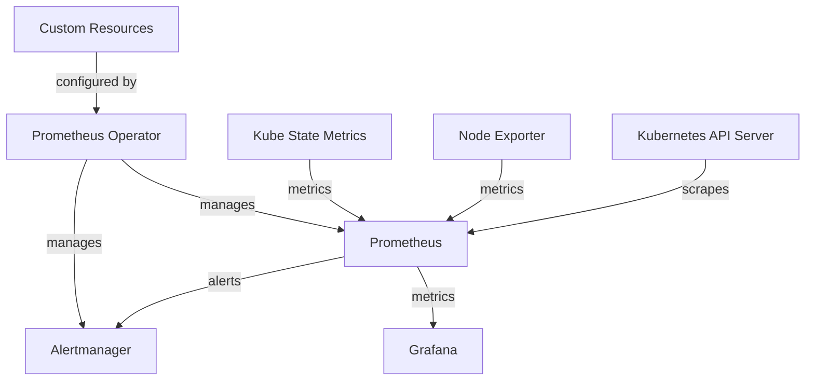

# Kube-Prometheus-Stack

## Introduction

The kube-prometheus-stack is a comprehensive collection of Kubernetes manifests, Grafana dashboards, and Prometheus rules that provides an end-to-end Kubernetes cluster monitoring solution using Prometheus and related monitoring tools. It's essentially a pre-configured package that bundles together several components to make monitoring Kubernetes clusters simpler and more effective.

If you've been following along in our Prometheus Learning Path, you already know about Prometheus as a monitoring and alerting system. The kube-prometheus-stack takes this a step further by integrating Prometheus with other tools specifically optimized for Kubernetes environments.

## What's Included in Kube-Prometheus-Stack?

The kube-prometheus-stack includes:

1. **Prometheus**: The core time-series database and monitoring system
2. **Alertmanager**: Handles alerts sent by Prometheus server
3. **Grafana**: Visualization platform for metrics
4. **Node Exporter**: Collects hardware and OS metrics
5. **Kube State Metrics**: Generates metrics about the state of Kubernetes objects
6. **Prometheus Operator**: Makes Prometheus easier to deploy and manage on Kubernetes
7. **Pre-configured dashboards**: Ready-to-use Grafana dashboards for Kubernetes monitoring
8. **Pre-configured alerts**: Common alerting rules for Kubernetes environments

## Why Use Kube-Prometheus-Stack?

Before diving into implementation, let's understand why you might want to use this stack:

- **Simplified Deployment**: Deploy a complete monitoring solution with a single Helm chart
- **Best Practices Built-in**: Follows monitoring best practices for Kubernetes
- **Production Ready**: Designed to work in production environments out of the box
- **Extensible**: Can be customized to meet specific requirements
- **Community Maintained**: Actively maintained by the Kubernetes community

## Prerequisites

Before installing the kube-prometheus-stack, you'll need:

- A running Kubernetes cluster
- Helm installed (version 3+)
- `kubectl` configured to communicate with your cluster
- Basic understanding of Kubernetes and Prometheus concepts

## Installing Kube-Prometheus-Stack

The recommended way to install kube-prometheus-stack is using Helm, a package manager for Kubernetes.

### Step 1: Add the Prometheus Community Helm Repository

```bash
# Add the prometheus-community Helm repository
helm repo add prometheus-community https://prometheus-community.github.io/helm-charts

# Update your Helm repository cache
helm repo update
```

### Step 2: Create a Namespace

It's a good practice to install the stack in its own namespace:

```bash
kubectl create namespace monitoring
```

### Step 3: Install the Kube-Prometheus-Stack

```bash
helm install prometheus prometheus-community/kube-prometheus-stack --namespace monitoring
```

The output will look something like:

```
NAME: prometheus
LAST DEPLOYED: Wed Mar 27 15:30:22 2025
NAMESPACE: monitoring
STATUS: deployed
REVISION: 1
TEST SUITE: None
NOTES:
kube-prometheus-stack has been installed. Check its status by running:
  kubectl --namespace monitoring get pods -l "release=prometheus"
```

### Step 4: Verify the Installation

Check that all the pods are running:

```bash
kubectl get pods -n monitoring
```

Expected output:

```
NAME                                                     READY   STATUS    RESTARTS   AGE
alertmanager-prometheus-kube-prometheus-alertmanager-0   2/2     Running   0          3m
prometheus-grafana-5f6f977d84-tztzv                      2/2     Running   0          3m
prometheus-kube-prometheus-operator-7bd668d88d-v7v9h     1/1     Running   0          3m
prometheus-kube-state-metrics-6d5d68b8cb-8b9zm           1/1     Running   0          3m
prometheus-prometheus-kube-prometheus-prometheus-0       2/2     Running   0          3m
prometheus-prometheus-node-exporter-k8zwh                1/1     Running   0          3m
```

## Accessing the Deployed Services

The stack deploys several services that are not exposed externally by default. Let's see how to access them.

### Accessing Prometheus UI

You can use port-forwarding to access the Prometheus web interface:

```bash
kubectl port-forward -n monitoring svc/prometheus-kube-prometheus-prometheus 9090:9090
```

Then open your browser and navigate to `http://localhost:9090`.

### Accessing Grafana

For Grafana:

```bash
kubectl port-forward -n monitoring svc/prometheus-grafana 3000:80
```

Visit `http://localhost:3000` in your browser. The default credentials are:
- Username: `admin`
- Password: `prom-operator`

### Accessing Alertmanager

For Alertmanager:

```bash
kubectl port-forward -n monitoring svc/prometheus-kube-prometheus-alertmanager 9093:9093
```

Visit `http://localhost:9093` in your browser.

## Understanding the Architecture

Let's visualize how the components of kube-prometheus-stack work together:



## Exploring Prometheus in the Stack

Once you've accessed the Prometheus UI, you can explore the targets that Prometheus is scraping:

1. Navigate to `Status` > `Targets` in the Prometheus UI
2. You'll see various Kubernetes components being monitored:
   - apiserver
   - kubelet
   - node-exporter
   - kube-state-metrics
   - and more

Try running a simple query to see CPU usage across your nodes:

```
sum(rate(node_cpu_seconds_total{mode!="idle"}[1m])) by (instance)
```

## Exploring the Pre-configured Grafana Dashboards

The kube-prometheus-stack comes with several pre-configured Grafana dashboards:

1. Kubernetes Cluster Overview
2. Node Exporter dashboards
3. Kubernetes resource usage dashboards
4. And many more

To explore these:
1. Log in to Grafana
2. Click on "Dashboards" in the left sidebar
3. Navigate to "Browse" to see all available dashboards

Let's look at how we can use the "Kubernetes / Compute Resources / Namespace (Pods)" dashboard to monitor pod resource usage:

1. Find and open this dashboard
2. Select your namespace of interest
3. You'll see CPU and memory usage for all pods in that namespace
4. This helps identify resource hogs or pods that might need more resources

## Configuring Alertmanager

The kube-prometheus-stack comes with pre-configured alerts, but you might want to set up notifications. Let's configure a simple email alerting:

1. Create a file named `alertmanager-config.yaml`:

```yaml
apiVersion: v1
kind: Secret
metadata:
  name: alertmanager-prometheus-kube-prometheus-alertmanager
  namespace: monitoring
stringData:
  alertmanager.yaml: |
    global:
      smtp_smarthost: 'smtp.example.com:587'
      smtp_from: 'alertmanager@example.com'
      smtp_auth_username: 'alertmanager'
      smtp_auth_password: 'password'
    route:
      group_by: ['job', 'alertname', 'severity']
      group_wait: 30s
      group_interval: 5m
      repeat_interval: 12h
      receiver: 'email'
      routes:
      - match:
          severity: critical
        receiver: 'email'
    receivers:
    - name: 'email'
      email_configs:
      - to: 'alerts@example.com'
        send_resolved: true
type: Opaque
```

2. Apply the configuration:

```bash
kubectl apply -f alertmanager-config.yaml
```

3. Reload Alertmanager:

```bash
kubectl rollout restart statefulset -n monitoring alertmanager-prometheus-kube-prometheus-alertmanager
```

## Customizing the Stack

One of the strengths of the kube-prometheus-stack is its flexibility. Let's see some common customizations:

### Adding Custom Prometheus Scrape Configs

If you have additional services to monitor, you can add custom scrape configurations:

1. Create a `values.yaml` file:

```yaml
prometheus:
  prometheusSpec:
    additionalScrapeConfigs:
      - job_name: 'custom-endpoint'
        static_configs:
          - targets: ['custom-service.custom-namespace:8080']
```

2. Update the Helm release:

```bash
helm upgrade prometheus prometheus-community/kube-prometheus-stack \
  --namespace monitoring \
  -f values.yaml
```

### Adding Custom Grafana Dashboards

You can add your own Grafana dashboards:

1. Create a ConfigMap with your dashboard JSON:

```yaml
apiVersion: v1
kind: ConfigMap
metadata:
  name: custom-dashboard
  namespace: monitoring
  labels:
    grafana_dashboard: "1"
data:
  custom-dashboard.json: |
    {
      "annotations": {
        "list": [...]
      },
      "editable": true,
      "gnetId": null,
      "graphTooltip": 0,
      "id": null,
      "links": [],
      "panels": [...],
      "refresh": "10s",
      "schemaVersion": 16,
      "style": "dark",
      "tags": [],
      "templating": {
        "list": []
      },
      "time": {
        "from": "now-6h",
        "to": "now"
      },
      "timepicker": {...},
      "timezone": "",
      "title": "Custom Dashboard",
      "uid": "custom",
      "version": 0
    }
```

2. Apply the ConfigMap:

```bash
kubectl apply -f custom-dashboard-configmap.yaml
```

## Common Issues and Troubleshooting

### Issue 1: Pods in CrashLoopBackOff

If you see pods in `CrashLoopBackOff` status, check the logs:

```bash
kubectl logs -n monitoring <pod-name>
```

Common causes include:
- Insufficient resources (CPU/memory)
- Permission issues
- Configuration errors

### Issue 2: Prometheus Can't Scrape Targets

If Prometheus can't scrape some targets:
1. Check if the service is running
2. Verify network policies allow Prometheus to access the target
3. Check service endpoints are correctly defined

```bash
kubectl get endpoints -n <target-namespace> <service-name>
```

### Issue 3: PersistentVolumeClaim Issues

By default, the stack uses persistent volumes. If your cluster doesn't support them:

```yaml
# In your values.yaml
prometheus:
  prometheusSpec:
    storageSpec: null

alertmanager:
  alertmanagerSpec:
    storage: null

grafana:
  persistence:
    enabled: false
```

Then update your Helm release:

```bash
helm upgrade prometheus prometheus-community/kube-prometheus-stack \
  --namespace monitoring \
  -f values.yaml
```

## Real-world Application: Monitoring a Web Application

Let's walk through a practical example of monitoring a web application using kube-prometheus-stack:

1. Deploy a sample web application:

```bash
kubectl create namespace sample-app
kubectl create deployment web-app --image=nginx -n sample-app
kubectl expose deployment web-app --port=80 -n sample-app
```

2. Create a ServiceMonitor to scrape metrics:

```yaml
apiVersion: monitoring.coreos.com/v1
kind: ServiceMonitor
metadata:
  name: web-app-monitor
  namespace: monitoring
spec:
  selector:
    matchLabels:
      app: web-app
  namespaceSelector:
    matchNames:
      - sample-app
  endpoints:
  - port: http
    interval: 15s
    path: /metrics
```

Save this as `service-monitor.yaml` and apply:

```bash
kubectl apply -f service-monitor.yaml
```

If your application doesn't expose Prometheus metrics yet, you can use the Prometheus client libraries to instrument your code. Here's a simple example using Python:

```python
from prometheus_client import start_http_server, Counter
import time

# Create a counter metric
REQUEST_COUNT = Counter('app_requests_total', 'Total app requests')

# Start server to expose metrics
start_http_server(8000)

# Simulate requests and increment counter
while True:
    REQUEST_COUNT.inc()
    time.sleep(1)
```

Once instrumented, you can create dashboards to visualize your application metrics alongside your infrastructure metrics.

## Summary

In this lesson, we've covered:

1. **What is kube-prometheus-stack**: A comprehensive monitoring solution for Kubernetes
2. **Installation**: How to deploy it using Helm
3. **Components**: Prometheus, Alertmanager, Grafana, and more
4. **Access**: How to access the various UIs
5. **Configuration**: How to customize alerts and add custom scrape configs
6. **Troubleshooting**: Common issues and their solutions
7. **Real-world application**: Monitoring a web application

The kube-prometheus-stack provides a powerful, production-ready monitoring solution for Kubernetes environments. By leveraging this stack, you can quickly set up comprehensive monitoring for your clusters without having to configure each component separately.

## Additional Resources

- [Official kube-prometheus-stack GitHub repository](https://github.com/prometheus-community/helm-charts/tree/main/charts/kube-prometheus-stack)
- [Prometheus Operator documentation](https://prometheus-operator.dev/)
- [Grafana documentation](https://grafana.com/docs/)
- [Prometheus documentation](https://prometheus.io/docs/introduction/overview/)

## Exercises

1. Install kube-prometheus-stack on a test Kubernetes cluster
2. Create a custom dashboard in Grafana to monitor a specific application
3. Configure Alertmanager to send notifications to a Slack channel
4. Add custom recording rules to calculate aggregated metrics
5. Explore the use of Prometheus Operator CRDs (CustomResourceDefinitions) like PrometheusRule and ServiceMonitor