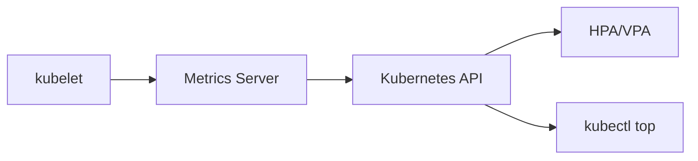
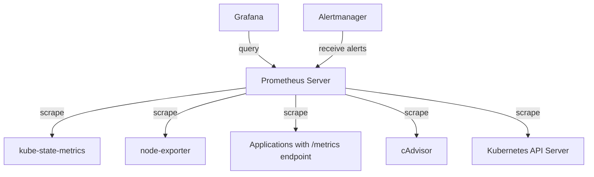

# Kubernetes Metrics

## Introduction

When operating Kubernetes clusters, understanding what's happening inside your applications and infrastructure is essential. Metrics provide numerical data points that help you monitor the health, performance, and resource utilization of your Kubernetes environment. 

In this guide, we'll explore the various metrics available in Kubernetes, how Prometheus collects these metrics, and how you can use them to ensure your applications run smoothly. Whether you're troubleshooting performance issues or planning for capacity, understanding Kubernetes metrics is a crucial skill for anyone working with container orchestration.

## Types of Kubernetes Metrics

Kubernetes metrics can be categorized into several types:

### 1. Node Metrics

These metrics provide information about the underlying infrastructure (nodes) where your containers run.

Key node metrics include:

- CPU usage
- Memory usage
- Disk I/O
- Network traffic
- Node status

### 2. Pod Metrics

Pod metrics tell you about the resource consumption and health of your pods:

- CPU and memory usage per pod
- Network activity
- Disk operations
- Pod status and state

### 3. Container Metrics

These metrics show resource usage at the container level:

- CPU usage
- Memory usage
- Filesystem usage
- Network usage

### 4. Kubernetes API Server Metrics

Metrics about the Kubernetes control plane itself:

- API request latency
- API request rate
- etcd operations
- Controller manager operations
- Scheduler operations

## Core Metrics Pipeline in Kubernetes

Kubernetes uses a metrics pipeline to collect and expose metrics:



The core components in this pipeline:

1. **Kubelet**: Collects metrics from pods and nodes
2. **Metrics Server**: Collects metrics from kubelets and aggregates them
3. **Kubernetes API**: Exposes metrics through the Metrics API
4. **Horizontal/Vertical Pod Autoscaler**: Uses metrics for scaling decisions
5. **kubectl top**: Command line tool for viewing current resource usage

## Prometheus and Kubernetes Metrics

While the Metrics Server provides basic CPU and memory usage, Prometheus offers a much more comprehensive approach to metrics collection in Kubernetes.

### The Prometheus Architecture for Kubernetes Metrics



### Key Prometheus Exporters for Kubernetes

#### 1. kube-state-metrics

This exporter focuses on generating metrics about the state of Kubernetes objects:

- Number of pods/deployments/services
- Pod status (running, pending, failed)
- Deployment status and strategy
- Resource quota utilization
- PersistentVolume status

Let's look at how to install kube-state-metrics:

```bash
# Clone the kube-state-metrics repository
git clone https://github.com/kubernetes/kube-state-metrics.git

# Apply the standard deployment
kubectl apply -f kube-state-metrics/examples/standard
```

Example metrics from kube-state-metrics:

```
# HELP kube_pod_status_phase The current phase of the pod.
# TYPE kube_pod_status_phase gauge
kube_pod_status_phase{namespace="default",pod="nginx-deployment-6b474476c4-bh2jc",phase="Running"} 1
```

#### 2. node-exporter

Node-exporter collects hardware and OS-level metrics from nodes:

- CPU usage and load
- Memory usage
- Disk I/O and space usage
- Network statistics
- System uptime

Example node-exporter metrics:

```
# HELP node_cpu_seconds_total Seconds the CPUs spent in each mode.
# TYPE node_cpu_seconds_total counter
node_cpu_seconds_total{cpu="0",mode="idle"} 3.55522386e+06
node_cpu_seconds_total{cpu="0",mode="user"} 6893.55
```

#### 3. cAdvisor

Integrated into kubelet, cAdvisor provides container-level metrics:

- CPU usage per container
- Memory usage per container
- Network statistics
- Filesystem usage

Example cAdvisor metrics:

```
# HELP container_cpu_usage_seconds_total Cumulative cpu time consumed
# TYPE container_cpu_usage_seconds_total counter
container_cpu_usage_seconds_total{container="nginx",pod="nginx-deployment-6b474476c4-bh2jc"} 12.137521432
```

## Configuring Prometheus to Collect Kubernetes Metrics

Let's look at how to configure Prometheus to scrape Kubernetes metrics:

### 1. Service Discovery

Prometheus has built-in Kubernetes service discovery mechanisms. Here's an example configuration:

```yaml
scrape_configs:
  - job_name: 'kubernetes-pods'
    kubernetes_sd_configs:
      - role: pod
    relabel_configs:
      - source_labels: [__meta_kubernetes_pod_annotation_prometheus_io_scrape]
        action: keep
        regex: true
      - source_labels: [__meta_kubernetes_pod_annotation_prometheus_io_path]
        action: replace
        target_label: __metrics_path__
        regex: (.+)
      - source_labels: [__address__, __meta_kubernetes_pod_annotation_prometheus_io_port]
        action: replace
        regex: ([^:]+)(?::\d+)?;(\d+)
        replacement: $1:$2
        target_label: __address__
      - action: labelmap
        regex: __meta_kubernetes_pod_label_(.+)
      - source_labels: [__meta_kubernetes_namespace]
        action: replace
        target_label: kubernetes_namespace
      - source_labels: [__meta_kubernetes_pod_name]
        action: replace
        target_label: kubernetes_pod_name
```

This configuration tells Prometheus to:
1. Discover all pods in the cluster
2. Only scrape pods with the `prometheus.io/scrape: "true"` annotation
3. Use the path specified in the `prometheus.io/path` annotation (defaulting to `/metrics`)
4. Use the port specified in the `prometheus.io/port` annotation
5. Add labels for namespace and pod name

### 2. Authenticating to the Kubernetes API

To scrape the Kubernetes API server itself, Prometheus needs authentication:

```yaml
scrape_configs:
  - job_name: 'kubernetes-apiservers'
    kubernetes_sd_configs:
      - role: endpoints
    scheme: https
    tls_config:
      ca_file: /var/run/secrets/kubernetes.io/serviceaccount/ca.crt
    bearer_token_file: /var/run/secrets/kubernetes.io/serviceaccount/token
    relabel_configs:
      - source_labels: [__meta_kubernetes_namespace, __meta_kubernetes_service_name, __meta_kubernetes_endpoint_port_name]
        action: keep
        regex: default;kubernetes;https
```

## Important Kubernetes Metrics to Monitor

### 1. Node Resource Usage

```promql
# CPU utilization per node
sum by (node) (rate(node_cpu_seconds_total{mode!="idle"}[5m]))

# Memory usage per node
node_memory_MemTotal_bytes - node_memory_MemAvailable_bytes

# Disk space usage
node_filesystem_avail_bytes / node_filesystem_size_bytes
```

### 2. Pod Resource Usage

```promql
# CPU usage per pod
sum by (pod, namespace) (rate(container_cpu_usage_seconds_total[5m]))

# Memory usage per pod
sum by (pod, namespace) (container_memory_usage_bytes)
```

### 3. Kubernetes Resource Status

```promql
# Count of pods not in Running state
sum by (namespace) (kube_pod_status_phase{phase!="Running"})

# Deployment replica status
kube_deployment_status_replicas - kube_deployment_status_replicas_available

# Pod restarts
sum by (pod, namespace) (kube_pod_container_status_restarts_total)
```

### 4. API Server Performance

```promql
# API server request latency
histogram_quantile(0.95, sum by (le, verb) (rate(apiserver_request_duration_seconds_bucket[5m])))

# API server request rate
sum by (code, verb) (rate(apiserver_request_total[5m]))
```

### 5. etcd Performance

```promql
# etcd leader changes
rate(etcd_server_leader_changes_seen_total[1h])

# etcd disk write latency
histogram_quantile(0.99, rate(etcd_disk_backend_commit_duration_seconds_bucket[5m]))
```

## Real-world Example: Monitoring a Web Application

Let's walk through a practical example of monitoring a web application deployed on Kubernetes with Prometheus.

### 1. Annotate your deployment to be scraped by Prometheus

```yaml
apiVersion: apps/v1
kind: Deployment
metadata:
  name: web-app
spec:
  replicas: 3
  selector:
    matchLabels:
      app: web-app
  template:
    metadata:
      labels:
        app: web-app
      annotations:
        prometheus.io/scrape: "true"
        prometheus.io/port: "8080"
        prometheus.io/path: "/metrics"
    spec:
      containers:
      - name: web-app
        image: your-web-app:latest
        ports:
        - containerPort: 8080
        resources:
          requests:
            cpu: "100m"
            memory: "128Mi"
          limits:
            cpu: "200m"
            memory: "256Mi"
```

### 2. Add metrics to your application

Here's an example of adding Prometheus metrics to a Node.js application:

```javascript
const express = require('express');
const client = require('prom-client');

// Create a Registry to register metrics
const register = new client.Registry();

// Create a counter for HTTP requests
const httpRequestsTotal = new client.Counter({
  name: 'http_requests_total',
  help: 'Total number of HTTP requests',
  labelNames: ['method', 'path', 'status'],
  registers: [register]
});

// Create a histogram for HTTP request duration
const httpRequestDurationSeconds = new client.Histogram({
  name: 'http_request_duration_seconds',
  help: 'HTTP request duration in seconds',
  labelNames: ['method', 'path', 'status'],
  buckets: [0.01, 0.03, 0.1, 0.3, 1, 3, 10],
  registers: [register]
});

const app = express();

// Middleware to track request duration
app.use((req, res, next) => {
  const start = Date.now();
  
  res.on('finish', () => {
    const duration = (Date.now() - start) / 1000;
    httpRequestsTotal.inc({ 
      method: req.method, 
      path: req.path, 
      status: res.statusCode 
    });
    httpRequestDurationSeconds.observe(
      { method: req.method, path: req.path, status: res.statusCode },
      duration
    );
  });
  
  next();
});

// Expose metrics endpoint
app.get('/metrics', async (req, res) => {
  res.set('Content-Type', register.contentType);
  res.end(await register.metrics());
});

// Your application routes
app.get('/', (req, res) => {
  res.send('Hello World!');
});

app.listen(8080, () => {
  console.log('Server running on port 8080');
});
```

### 3. Create PromQL queries to monitor your application

Now you can use PromQL to monitor your application:

```promql
# Request rate
sum by (path) (rate(http_requests_total[5m]))

# Error rate
sum by (path) (rate(http_requests_total{status=~"5.."}[5m]))
/ 
sum by (path) (rate(http_requests_total[5m]))

# 95th percentile response time
histogram_quantile(0.95, sum by (path, le) (rate(http_request_duration_seconds_bucket[5m])))

# Resource usage of application pods
sum by (pod) (rate(container_cpu_usage_seconds_total{namespace="default", pod=~"web-app-.*"}[5m]))
```

## Alerts Based on Kubernetes Metrics

Here are some essential Prometheus alerts for Kubernetes:

```yaml
groups:
- name: kubernetes-alerts
  rules:
  - alert: NodeHighCPUUsage
    expr: sum by (node) (rate(node_cpu_seconds_total{mode!="idle"}[5m])) / count by (node) (node_cpu_seconds_total{mode="idle"}) > 0.8
    for: 5m
    labels:
      severity: warning
    annotations:
      summary: "High CPU usage on {{ $labels.node }}"
      description: "{{ $labels.node }} has high CPU usage ({{ $value | humanizePercentage }}) for 5 minutes."

  - alert: PodCrashLooping
    expr: rate(kube_pod_container_status_restarts_total[15m]) > 0
    for: 15m
    labels:
      severity: critical
    annotations:
      summary: "Pod {{ $labels.pod }} in {{ $labels.namespace }} is crash looping"
      description: "Pod {{ $labels.pod }} in namespace {{ $labels.namespace }} is restarting frequently."

  - alert: PodOutOfMemory
    expr: kube_pod_container_resource_limits_memory_bytes > 0 and (container_memory_usage_bytes / kube_pod_container_resource_limits_memory_bytes > 0.9)
    for: 5m
    labels:
      severity: warning
    annotations:
      summary: "Pod {{ $labels.pod }} in {{ $labels.namespace }} is using too much memory"
      description: "Pod {{ $labels.pod }} in namespace {{ $labels.namespace }} is using more than 90% of its memory limit."
```

## Kubernetes Metrics Dashboards with Grafana

While creating visualizations, you typically want to create dashboards that give you an overview of your Kubernetes cluster. Here's a simple Grafana dashboard in JSON format that you can import:

```json
{
  "title": "Kubernetes Cluster Overview",
  "panels": [
    {
      "title": "Cluster CPU Usage",
      "type": "graph",
      "targets": [
        {
          "expr": "sum(rate(node_cpu_seconds_total{mode!=\"idle\"}[5m])) / count(node_cpu_seconds_total{mode=\"idle\"}) * 100",
          "legendFormat": "CPU %"
        }
      ]
    },
    {
      "title": "Cluster Memory Usage",
      "type": "graph",
      "targets": [
        {
          "expr": "sum(node_memory_MemTotal_bytes - node_memory_MemAvailable_bytes) / sum(node_memory_MemTotal_bytes) * 100",
          "legendFormat": "Memory %"
        }
      ]
    },
    {
      "title": "Pod Status",
      "type": "singlestat",
      "targets": [
        {
          "expr": "sum(kube_pod_status_phase{phase=\"Running\"})"
        }
      ],
      "valueName": "current"
    },
    {
      "title": "Failed Pods",
      "type": "singlestat",
      "targets": [
        {
          "expr": "sum(kube_pod_status_phase{phase=\"Failed\"})"
        }
      ],
      "valueName": "current",
      "thresholds": "1,3",
      "colorValue": true,
      "colors": ["green", "orange", "red"]
    }
  ]
}
```

## Metrics for Custom Resources

When working with Custom Resource Definitions (CRDs), you might need to create custom metrics. The custom controllers for these resources can expose metrics that Prometheus can scrape.

For example, a controller for a database CRD might expose:

```
# HELP database_connection_count Number of active connections to the database
# TYPE database_connection_count gauge
database_connection_count{name="users-db",namespace="default"} 42

# HELP database_replication_lag_seconds Replication lag in seconds
# TYPE database_replication_lag_seconds gauge
database_replication_lag_seconds{name="users-db",namespace="default"} 1.5
```

## Best Practices for Kubernetes Metrics

1. **Set resource requests and limits**: This provides better metrics for planning and scaling.

2. **Use labels consistently**: Consistent labeling helps create meaningful aggregations in queries.

3. **Focus on the four golden signals**:
   - Latency (response time)
   - Traffic (requests per second)
   - Errors (error rate)
   - Saturation (system load)

4. **Keep metrics cardinality under control**: High cardinality metrics (with many label combinations) can overload Prometheus.

5. **Implement custom application metrics**: Don't rely solely on infrastructure metrics; add business-relevant metrics to your applications.

6. **Use recording rules for complex queries**: Precompute complex queries to improve dashboard performance.

7. **Federate metrics for large clusters**: Use federation to scale Prometheus across very large Kubernetes deployments.

## Summary

Kubernetes metrics provide essential visibility into your cluster's health and performance. By using Prometheus to collect and analyze these metrics, you can:

- Detect and troubleshoot issues before they impact users
- Optimize resource allocation and reduce costs
- Make data-driven scaling decisions
- Validate the effectiveness of application changes
- Ensure your applications are running reliably

The combination of Kubernetes and Prometheus creates a powerful monitoring stack that is flexible, scalable, and deeply integrated with your containerized applications.

## Additional Resources

- Prometheus documentation: [https://prometheus.io/docs/](https://prometheus.io/docs/)
- Kubernetes monitoring guide: [https://kubernetes.io/docs/tasks/debug-application-cluster/resource-usage-monitoring/](https://kubernetes.io/docs/tasks/debug-application-cluster/resource-usage-monitoring/)
- kube-state-metrics: [https://github.com/kubernetes/kube-state-metrics](https://github.com/kubernetes/kube-state-metrics)
- Grafana dashboards for Kubernetes: [https://grafana.com/grafana/dashboards/](https://grafana.com/grafana/dashboards/)

## Exercises

1. Install Prometheus and Grafana in your Kubernetes cluster using Helm or the Prometheus Operator.

2. Configure Prometheus to scrape metrics from a simple web application deployed in Kubernetes.

3. Create a custom dashboard in Grafana showing the four golden signals for your application.

4. Set up alerts for when pod resource usage approaches the defined limits.

5. Extend an application with custom metrics and visualize them in Grafana.