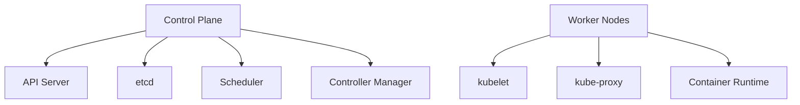

# Monitoring Kubernetes Components

## Introduction

Monitoring Kubernetes components is essential for maintaining the health, performance, and reliability of your cluster. While Kubernetes offers robust self-healing capabilities, proper monitoring ensures you can detect and address issues before they impact your applications.

In this guide, we'll explore how to use Prometheus to monitor critical Kubernetes components, understand key metrics, and set up effective monitoring dashboards. This knowledge is crucial for both preventing outages and diagnosing problems when they occur.

## Core Kubernetes Components to Monitor

Before diving into monitoring, let's understand the key components that make up a Kubernetes cluster:



Each component plays a critical role:

1. **API Server**: The front-end to the control plane, handling all API requests
2. **etcd**: The distributed key-value store that holds all cluster data
3. **Scheduler**: Assigns pods to nodes based on resource requirements
4. **Controller Manager**: Runs controller processes (node, replication, endpoints, etc.)
5. **kubelet**: The agent running on each node that ensures containers are running in a pod
6. **kube-proxy**: Maintains network rules on nodes for pod communication
7. **Container Runtime**: Software responsible for running containers (Docker, containerd, etc.)

## Setting Up Prometheus for Kubernetes Monitoring

### Installing kube-prometheus-stack

The simplest way to set up comprehensive Kubernetes monitoring is using the kube-prometheus-stack Helm chart, which bundles Prometheus, Grafana, and a collection of exporters:

```bash
# Add Prometheus community Helm repository
helm repo add prometheus-community https://prometheus-community.github.io/helm-charts
helm repo update

# Install kube-prometheus-stack
helm install kube-prometheus prometheus-community/kube-prometheus-stack \
  --namespace monitoring \
  --create-namespace
```

This installation provides:

- A Prometheus server configured to scrape all Kubernetes components
- Default alerting rules for common failure scenarios
- Pre-configured Grafana dashboards for Kubernetes monitoring
- ServiceMonitor objects for automatic discovery of monitoring targets

## Key Metrics for Kubernetes Components

Let's explore the essential metrics to monitor for each Kubernetes component:

### API Server Metrics

The API server is your cluster's gateway, making it crucial to monitor:

```bash
# Query example: API server request rate
rate(apiserver_request_total[5m])

# Query example: API server error rate
sum(rate(apiserver_request_total{code=~"5.."}[5m])) / sum(rate(apiserver_request_total[5m]))
```

Key metrics to watch:

- **apiserver_request_total**: Total number of HTTP requests to the API server
- **apiserver_request_duration_seconds**: Latency distribution of API server requests
- **apiserver_request_latencies_summary**: Summary of request latencies
- **apiserver_current_inflight_requests**: Number of currently executing requests
- **etcd_helper_cache_entry_total**: Size of the etcd cache

### etcd Metrics

etcd stores your entire cluster state, making its performance critical:

```bash
# Query example: etcd disk write latency
histogram_quantile(0.99, sum(rate(etcd_disk_wal_fsync_duration_seconds_bucket[5m])) by (instance, le))
```

Important etcd metrics:

- **etcd_server_has_leader**: Indicates if a member has a leader (0 or 1)
- **etcd_server_leader_changes_seen_total**: Number of leader changes seen
- **etcd_server_proposals_failed_total**: Number of failed proposals
- **etcd_disk_backend_commit_duration_seconds**: Latency of backend commits
- **etcd_disk_wal_fsync_duration_seconds**: Latency of WAL fsync operations

### Scheduler Metrics

The scheduler determines where pods run, affecting resource utilization:

```bash
# Query example: Scheduling latency
histogram_quantile(0.99, sum(rate(scheduler_e2e_scheduling_duration_seconds_bucket[5m])) by (le))
```

Critical scheduler metrics:

- **scheduler_e2e_scheduling_duration_seconds**: End-to-end scheduling latency
- **scheduler_pending_pods**: Number of pending pods
- **scheduler_pod_scheduling_duration_seconds**: Pod scheduling attempt duration
- **scheduler_schedule_attempts_total**: Number of attempts to schedule pods

### Controller Manager Metrics

The controller manager ensures your desired state matches reality:

```bash
# Query example: Work queue depth
workqueue_depth{name="deployment"}
```

Important controller manager metrics:

- **workqueue_adds_total**: Total adds to the work queue
- **workqueue_depth**: Current depth of the work queue
- **workqueue_queue_duration_seconds**: How long items stay in the queue
- **workqueue_work_duration_seconds**: How long processing an item takes

### kubelet Metrics

The kubelet runs on every node and manages container execution:

```bash
# Query example: Pod start latency
histogram_quantile(0.99, sum(rate(kubelet_pod_start_duration_seconds_bucket[5m])) by (instance, le))
```

Essential kubelet metrics:

- **kubelet_pod_start_duration_seconds**: Pod start latency
- **kubelet_running_pods**: Number of pods currently running
- **kubelet_runtime_operations_total**: Runtime operations by type
- **kubelet_runtime_operations_errors_total**: Runtime operation errors
- **kubelet_cgroup_manager_duration_seconds**: Time spent in cgroup management

### kube-proxy Metrics

kube-proxy maintains network rules for service connectivity:

```bash
# Query example: Sync proxy rules latency
histogram_quantile(0.95, sum(rate(kubeproxy_sync_proxy_rules_duration_seconds_bucket[5m])) by (instance, le))
```

Key kube-proxy metrics:

- **kubeproxy_sync_proxy_rules_duration_seconds**: Time to sync proxy rules
- **kubeproxy_network_programming_duration_seconds**: Time to program network
- **kubeproxy_proxier_sync_period_seconds**: Proxy sync period

### Node-level Metrics

Beyond Kubernetes components, monitor node resources:

```bash
# Query example: Node CPU utilization
(1 - sum by(instance) (irate(node_cpu_seconds_total{mode="idle"}[5m]))) * 100
```

Key node metrics:

- **node_cpu_seconds_total**: CPU time consumed by mode
- **node_memory_MemAvailable_bytes**: Available memory
- **node_filesystem_avail_bytes**: Filesystem space available
- **node_disk_io_time_seconds_total**: Time spent doing I/Os
- **node_network_transmit_bytes_total**: Network traffic transmitted
- **node_network_receive_bytes_total**: Network traffic received

## Practical Monitoring Examples

Let's walk through practical examples of setting up monitoring for Kubernetes components:

### Example 1: Creating a ServiceMonitor for etcd

```yaml
apiVersion: monitoring.coreos.com/v1
kind: ServiceMonitor
metadata:
  name: etcd-monitor
  namespace: monitoring
spec:
  endpoints:
  - interval: 30s
    port: metrics
    scheme: https
    tlsConfig:
      caFile: /etc/prometheus/secrets/etcd-client-cert/ca.crt
      certFile: /etc/prometheus/secrets/etcd-client-cert/client.crt
      keyFile: /etc/prometheus/secrets/etcd-client-cert/client.key
      insecureSkipVerify: false
  selector:
    matchLabels:
      k8s-app: etcd
```

### Example 2: Setting up API Server Alerts

```yaml
apiVersion: monitoring.coreos.com/v1
kind: PrometheusRule
metadata:
  name: kubernetes-api-alerts
  namespace: monitoring
spec:
  groups:
  - name: kubernetes-api
    rules:
    - alert: KubernetesApiServerDown
      expr: absent(up{job="apiserver"} == 1)
      for: 5m
      labels:
        severity: critical
      annotations:
        summary: "Kubernetes API server is down"
        description: "Kubernetes API server has been down for more than 5 minutes."
    - alert: KubernetesApiServerLatency
      expr: histogram_quantile(0.99, sum(rate(apiserver_request_duration_seconds_bucket{verb!="WATCH"}[5m])) by (verb, resource, le)) > 1
      for: 10m
      labels:
        severity: warning
      annotations:
        summary: "Kubernetes API server high latency"
        description: "Kubernetes API server has a 99th percentile latency of {{ $value }} seconds for {{ $labels.verb }} {{ $labels.resource }}."
```

### Example 3: Creating a Grafana Dashboard

While Grafana dashboards are typically defined in JSON, here's a simple explanation of what a Kubernetes component dashboard might include:

1. **Top section**: Cluster overview showing node count, pod count, and control plane status
2. **Control Plane section**: Metrics for API server, etcd, controller manager, and scheduler
3. **Node section**: Node-level metrics like CPU, memory, and disk usage
4. **Alerts section**: Recent and pending alerts

The pre-configured dashboards in kube-prometheus-stack provide excellent starting points.

## Best Practices for Kubernetes Monitoring

Follow these best practices for effective Kubernetes monitoring:

1. **Focus on SLIs/SLOs**: Define Service Level Indicators and Objectives
2. **Implement the USE method**: Monitor Utilization, Saturation, and Errors
3. **Implement the RED method**: Monitor Rate, Errors, and Duration
4. **Use labels effectively**: Add meaningful labels to metrics
5. **Set up meaningful alerts**: Alert on symptoms, not causes
6. **Keep retention policies appropriate**: Balance storage with history needs
7. **Implement high availability**: Make your monitoring stack resilient
8. **Automate remediation when possible**: Use tools like Kubernetes Event-driven Autoscaling (KEDA)

## Troubleshooting Common Issues

Here are some common issues and how to diagnose them using metrics:

### Cluster Unreachable

```bash
# Check API server availability
up{job="apiserver"}

# Check etcd leader status
etcd_server_has_leader
```

### High API Latency

```bash
# Check API server latency
histogram_quantile(0.99, sum(rate(apiserver_request_duration_seconds_bucket[5m])) by (resource, verb, le))

# Check etcd performance
histogram_quantile(0.99, sum(rate(etcd_request_duration_seconds_bucket[5m])) by (operation, le))
```

### Node Issues

```bash
# Check node conditions
kube_node_status_condition{condition="Ready", status="true"} == 0

# Check resource pressure
kube_node_status_condition{condition=~"MemoryPressure|DiskPressure|PIDPressure", status="true"} == 1
```

## Summary

Monitoring Kubernetes components is essential for maintaining a healthy and performant cluster. By using Prometheus to collect metrics from all components, setting appropriate alerts, and visualizing metrics in Grafana, you can detect and address issues before they affect your applications.

Remember these key points:

- Monitor all Kubernetes components: API server, etcd, scheduler, controller manager, kubelet, and kube-proxy
- Focus on latency, error rates, and resource utilization metrics
- Set up meaningful alerts based on symptoms, not causes
- Use the USE and RED methods to guide your monitoring strategy
- Automate remediation when possible

## Additional Resources

- [Kubernetes Components Documentation](https://kubernetes.io/docs/concepts/overview/components/)
- [Prometheus Operator Documentation](https://prometheus-operator.dev/)
- [kube-prometheus-stack GitHub Repository](https://github.com/prometheus-community/helm-charts/tree/main/charts/kube-prometheus-stack)
- [SRE Books](https://sre.google/books/)

## Exercises

1. Install kube-prometheus-stack and explore the default dashboards for Kubernetes components.
2. Create a custom alert for when the API server error rate exceeds 5% over 5 minutes.
3. Build a custom Grafana dashboard showing the most important metrics from all Kubernetes components.
4. Simulate a failure (e.g., kill an etcd pod) and observe how the metrics change.
5. Use PromQL to identify the top 5 API requests by volume and latency.