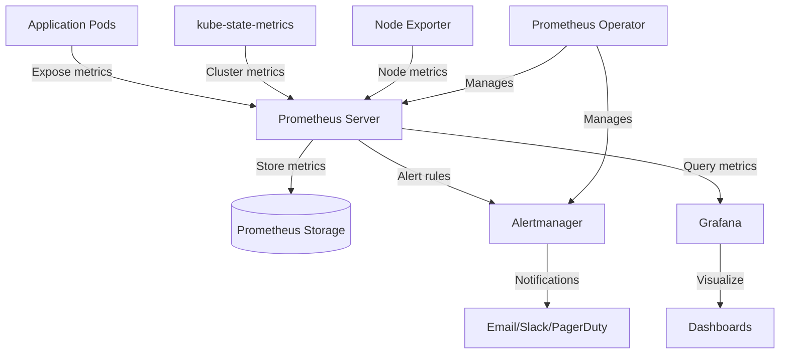

# Monitoring Applications in Kubernetes

## Introduction

Monitoring applications in Kubernetes is crucial for ensuring the health, performance, and reliability of your containerized workloads. Kubernetes provides a powerful platform for deploying and scaling applications, but without proper monitoring, you might face unexpected failures, performance bottlenecks, or resource constraints.

In this guide, we'll explore how to set up comprehensive monitoring for your applications running in Kubernetes using Prometheus and related tools. By the end of this tutorial, you'll understand how to collect metrics from your applications, visualize them, and set up alerts to be notified of potential issues before they affect your users.

## Why Monitor Kubernetes Applications?

Before diving into the technical implementation, let's understand why application monitoring in Kubernetes is essential:

1. **Detect issues early**: Identify problems before they impact your users
2. **Optimize resource usage**: Ensure your applications use resources efficiently
3. **Understand application behavior**: Gain insights into how your applications perform under various conditions
4. **Make data-driven decisions**: Use metrics to guide scaling and improvement decisions
5. **Ensure reliability**: Maintain high availability and performance for your services

## Monitoring Architecture in Kubernetes

Let's first understand how monitoring typically works in a Kubernetes environment:



## Prerequisites

Before we begin, ensure you have:

1. A running Kubernetes cluster
2. `kubectl` configured to communicate with your cluster
3. Basic understanding of Kubernetes concepts (Pods, Services, Deployments)
4. Helm installed (optional, but recommended)

## Setting Up Prometheus in Kubernetes

### Method 1: Using Prometheus Operator with kube-prometheus-stack

The easiest way to set up Prometheus in Kubernetes is using the kube-prometheus-stack Helm chart, which includes Prometheus, Grafana, Alertmanager, and exporters.

```bash
# Add the Prometheus community Helm repository
helm repo add prometheus-community https://prometheus-community.github.io/helm-charts
helm repo update

# Install kube-prometheus-stack
helm install prometheus prometheus-community/kube-prometheus-stack --namespace monitoring --create-namespace
```

This command installs the complete monitoring stack in the "monitoring" namespace.

### Method 2: Manual Installation

If you prefer more control over your installation, you can deploy Prometheus components manually:

1. Create a namespace for monitoring:

```bash
kubectl create namespace monitoring
```

2. Deploy Prometheus:

```yaml
# prometheus-configmap.yaml
apiVersion: v1
kind: ConfigMap
metadata:
  name: prometheus-config
  namespace: monitoring
data:
  prometheus.yml: |
    global:
      scrape_interval: 15s
    
    scrape_configs:
      - job_name: 'kubernetes-apiservers'
        kubernetes_sd_configs:
        - role: endpoints
        scheme: https
        tls_config:
          ca_file: /var/run/secrets/kubernetes.io/serviceaccount/ca.crt
        bearer_token_file: /var/run/secrets/kubernetes.io/serviceaccount/token
        relabel_configs:
        - source_labels: [__meta_kubernetes_namespace, __meta_kubernetes_service_name, __meta_kubernetes_endpoint_port_name]
          action: keep
          regex: default;kubernetes;https
      
      - job_name: 'kubernetes-pods'
        kubernetes_sd_configs:
        - role: pod
        relabel_configs:
        - source_labels: [__meta_kubernetes_pod_annotation_prometheus_io_scrape]
          action: keep
          regex: true
        - source_labels: [__meta_kubernetes_pod_annotation_prometheus_io_path]
          action: replace
          target_label: __metrics_path__
          regex: (.+)
        - source_labels: [__address__, __meta_kubernetes_pod_annotation_prometheus_io_port]
          action: replace
          regex: ([^:]+)(?::\d+)?;(\d+)
          replacement: $1:$2
          target_label: __address__
        - action: labelmap
          regex: __meta_kubernetes_pod_label_(.+)
        - source_labels: [__meta_kubernetes_namespace]
          action: replace
          target_label: kubernetes_namespace
        - source_labels: [__meta_kubernetes_pod_name]
          action: replace
          target_label: kubernetes_pod_name
```

Apply the ConfigMap and deploy Prometheus:

```bash
kubectl apply -f prometheus-configmap.yaml

# Create RBAC roles for Prometheus
kubectl create clusterrolebinding prometheus --clusterrole=view --serviceaccount=monitoring:default

# Deploy Prometheus
kubectl apply -f - <<EOF
apiVersion: apps/v1
kind: Deployment
metadata:
  name: prometheus
  namespace: monitoring
spec:
  replicas: 1
  selector:
    matchLabels:
      app: prometheus
  template:
    metadata:
      labels:
        app: prometheus
    spec:
      containers:
      - name: prometheus
        image: prom/prometheus:v2.42.0
        args:
        - "--config.file=/etc/prometheus/prometheus.yml"
        - "--storage.tsdb.path=/prometheus"
        ports:
        - containerPort: 9090
        volumeMounts:
        - name: config-volume
          mountPath: /etc/prometheus
        - name: prometheus-storage
          mountPath: /prometheus
      volumes:
      - name: config-volume
        configMap:
          name: prometheus-config
      - name: prometheus-storage
        emptyDir: {}
---
apiVersion: v1
kind: Service
metadata:
  name: prometheus
  namespace: monitoring
spec:
  selector:
    app: prometheus
  ports:
  - port: 9090
    targetPort: 9090
  type: ClusterIP
EOF
```

## Instrumenting Your Applications

To monitor your applications in Kubernetes, you need to expose metrics that Prometheus can scrape. Let's look at how to do this for different types of applications:

### 1. Native Prometheus Integration

Many applications and frameworks support Prometheus metrics out of the box:

- Spring Boot with Micrometer
- Go applications with the Prometheus client library
- Node.js applications with prom-client

Here's an example of a Go application that exposes Prometheus metrics:

```go
package main

import (
	"net/http"
	"time"

	"github.com/prometheus/client_golang/prometheus"
	"github.com/prometheus/client_golang/prometheus/promauto"
	"github.com/prometheus/client_golang/prometheus/promhttp"
)

var (
	requestsProcessed = promauto.NewCounter(prometheus.CounterOpts{
		Name: "myapp_processed_requests_total",
		Help: "The total number of processed requests",
	})
	
	requestDuration = promauto.NewHistogram(prometheus.HistogramOpts{
		Name: "myapp_request_duration_seconds",
		Help: "The duration of requests in seconds",
		Buckets: prometheus.DefBuckets,
	})
)

func recordMetrics() {
	go func() {
		for {
			requestsProcessed.Inc()
			time.Sleep(2 * time.Second)
		}
	}()
}

func handleRequest(w http.ResponseWriter, r *http.Request) {
	start := time.Now()
	
	// Simulate work
	time.Sleep(100 * time.Millisecond)
	
	w.WriteHeader(http.StatusOK)
	w.Write([]byte("Hello, world!"))
	
	// Record request duration
	duration := time.Since(start).Seconds()
	requestDuration.Observe(duration)
}

func main() {
	recordMetrics()
	
	http.HandleFunc("/", handleRequest)
	http.Handle("/metrics", promhttp.Handler())
	
	http.ListenAndServe(":8080", nil)
}
```

Deploy this application to Kubernetes:

```yaml
apiVersion: apps/v1
kind: Deployment
metadata:
  name: sample-app
spec:
  replicas: 3
  selector:
    matchLabels:
      app: sample-app
  template:
    metadata:
      labels:
        app: sample-app
      annotations:
        prometheus.io/scrape: "true"
        prometheus.io/port: "8080"
    spec:
      containers:
      - name: sample-app
        image: your-sample-app:latest
        ports:
        - containerPort: 8080
---
apiVersion: v1
kind: Service
metadata:
  name: sample-app
spec:
  selector:
    app: sample-app
  ports:
  - port: 80
    targetPort: 8080
```

The key part here is the annotations on the pod template:
- `prometheus.io/scrape: "true"` - Tells Prometheus to scrape this pod
- `prometheus.io/port: "8080"` - Specifies which port to scrape

### 2. Using the Prometheus Operator

If you're using the Prometheus Operator, you can define a ServiceMonitor to scrape your application:

```yaml
apiVersion: monitoring.coreos.com/v1
kind: ServiceMonitor
metadata:
  name: sample-app-monitor
  namespace: monitoring
spec:
  selector:
    matchLabels:
      app: sample-app
  endpoints:
  - port: web  # This should match the name of the port in your Service
    interval: 15s
```

### 3. Using Exporters for Applications Without Native Support

For applications that don't expose Prometheus metrics natively, you can use exporters. For example, for a Redis deployment:

```yaml
apiVersion: apps/v1
kind: Deployment
metadata:
  name: redis-exporter
spec:
  replicas: 1
  selector:
    matchLabels:
      app: redis-exporter
  template:
    metadata:
      labels:
        app: redis-exporter
      annotations:
        prometheus.io/scrape: "true"
        prometheus.io/port: "9121"
    spec:
      containers:
      - name: redis-exporter
        image: oliver006/redis_exporter:latest
        ports:
        - containerPort: 9121
        env:
        - name: REDIS_ADDR
          value: "redis:6379"
```

## Important Metrics to Monitor

When monitoring applications in Kubernetes, focus on these key metrics:

### 1. Application Specific Metrics

- Request count/rate
- Error rate
- Response time (latency)
- Business-specific metrics (e.g., orders processed, user registrations)

### 2. Container Metrics

- CPU usage
- Memory usage
- File system usage
- Network I/O

### 3. Kubernetes Resource Metrics

- Pod status (ready, not ready, etc.)
- Deployment/StatefulSet status
- Resource utilization vs. requests/limits
- HPA (Horizontal Pod Autoscaler) metrics

## Visualizing Metrics with Grafana

Prometheus is excellent at collecting and storing metrics, but Grafana provides powerful visualization capabilities:

1. Port-forward to access Grafana (if you installed kube-prometheus-stack):

```bash
kubectl port-forward -n monitoring svc/prometheus-grafana 3000:80
```

2. Access Grafana at http://localhost:3000 (default credentials are usually admin/prom-operator)

3. Create dashboards for your applications:

Here's a sample Grafana dashboard for monitoring our sample application:

```json
{
  "annotations": {
    "list": [
      {
        "builtIn": 1,
        "datasource": "-- Grafana --",
        "enable": true,
        "hide": true,
        "iconColor": "rgba(0, 211, 255, 1)",
        "name": "Annotations & Alerts",
        "type": "dashboard"
      }
    ]
  },
  "editable": true,
  "gnetId": null,
  "graphTooltip": 0,
  "id": 1,
  "links": [],
  "panels": [
    {
      "aliasColors": {},
      "bars": false,
      "dashLength": 10,
      "dashes": false,
      "datasource": null,
      "fieldConfig": {
        "defaults": {},
        "overrides": []
      },
      "fill": 1,
      "fillGradient": 0,
      "gridPos": {
        "h": 8,
        "w": 12,
        "x": 0,
        "y": 0
      },
      "hiddenSeries": false,
      "id": 2,
      "legend": {
        "avg": false,
        "current": false,
        "max": false,
        "min": false,
        "show": true,
        "total": false,
        "values": false
      },
      "lines": true,
      "linewidth": 1,
      "nullPointMode": "null",
      "options": {
        "alertThreshold": true
      },
      "percentage": false,
      "pluginVersion": "7.5.7",
      "pointradius": 2,
      "points": false,
      "renderer": "flot",
      "seriesOverrides": [],
      "spaceLength": 10,
      "stack": false,
      "steppedLine": false,
      "targets": [
        {
          "expr": "rate(myapp_processed_requests_total[5m])",
          "interval": "",
          "legendFormat": "{{kubernetes_pod_name}}",
          "refId": "A"
        }
      ],
      "thresholds": [],
      "timeFrom": null,
      "timeRegions": [],
      "timeShift": null,
      "title": "Request Rate",
      "tooltip": {
        "shared": true,
        "sort": 0,
        "value_type": "individual"
      },
      "type": "graph",
      "xaxis": {
        "buckets": null,
        "mode": "time",
        "name": null,
        "show": true,
        "values": []
      },
      "yaxes": [
        {
          "format": "short",
          "label": "Requests/sec",
          "logBase": 1,
          "max": null,
          "min": null,
          "show": true
        },
        {
          "format": "short",
          "label": null,
          "logBase": 1,
          "max": null,
          "min": null,
          "show": true
        }
      ],
      "yaxis": {
        "align": false,
        "alignLevel": null
      }
    },
    {
      "aliasColors": {},
      "bars": false,
      "dashLength": 10,
      "dashes": false,
      "datasource": null,
      "fieldConfig": {
        "defaults": {},
        "overrides": []
      },
      "fill": 1,
      "fillGradient": 0,
      "gridPos": {
        "h": 8,
        "w": 12,
        "x": 12,
        "y": 0
      },
      "hiddenSeries": false,
      "id": 4,
      "legend": {
        "avg": false,
        "current": false,
        "max": false,
        "min": false,
        "show": true,
        "total": false,
        "values": false
      },
      "lines": true,
      "linewidth": 1,
      "nullPointMode": "null",
      "options": {
        "alertThreshold": true
      },
      "percentage": false,
      "pluginVersion": "7.5.7",
      "pointradius": 2,
      "points": false,
      "renderer": "flot",
      "seriesOverrides": [],
      "spaceLength": 10,
      "stack": false,
      "steppedLine": false,
      "targets": [
        {
          "expr": "histogram_quantile(0.95, sum(rate(myapp_request_duration_seconds_bucket[5m])) by (le))",
          "interval": "",
          "legendFormat": "95th Percentile",
          "refId": "A"
        },
        {
          "expr": "histogram_quantile(0.50, sum(rate(myapp_request_duration_seconds_bucket[5m])) by (le))",
          "interval": "",
          "legendFormat": "50th Percentile",
          "refId": "B"
        }
      ],
      "thresholds": [],
      "timeFrom": null,
      "timeRegions": [],
      "timeShift": null,
      "title": "Request Latency",
      "tooltip": {
        "shared": true,
        "sort": 0,
        "value_type": "individual"
      },
      "type": "graph",
      "xaxis": {
        "buckets": null,
        "mode": "time",
        "name": null,
        "show": true,
        "values": []
      },
      "yaxes": [
        {
          "format": "s",
          "label": "Duration",
          "logBase": 1,
          "max": null,
          "min": null,
          "show": true
        },
        {
          "format": "short",
          "label": null,
          "logBase": 1,
          "max": null,
          "min": null,
          "show": true
        }
      ],
      "yaxis": {
        "align": false,
        "alignLevel": null
      }
    }
  ],
  "refresh": "10s",
  "schemaVersion": 27,
  "style": "dark",
  "tags": [],
  "templating": {
    "list": []
  },
  "time": {
    "from": "now-1h",
    "to": "now"
  },
  "timepicker": {},
  "timezone": "",
  "title": "Sample Application Dashboard",
  "uid": "sample-app",
  "version": 1
}
```

## Setting Up Alerts

Monitoring is not complete without alerting. Let's set up alerts for our sample application:

### Using Prometheus AlertManager

1. Create alert rules:

```yaml
apiVersion: monitoring.coreos.com/v1
kind: PrometheusRule
metadata:
  name: sample-app-alerts
  namespace: monitoring
  labels:
    prometheus: k8s
    role: alert-rules
spec:
  groups:
  - name: sample-app
    rules:
    - alert: HighRequestLatency
      expr: histogram_quantile(0.95, sum(rate(myapp_request_duration_seconds_bucket[5m])) by (le)) > 0.5
      for: 5m
      labels:
        severity: warning
      annotations:
        summary: "High request latency on {{ $labels.instance }}"
        description: "95th percentile of request latency is above 500ms (current value: {{ $value }}s)"
    
    - alert: HighErrorRate
      expr: rate(http_requests_total{status=~"5.."}[5m]) / rate(http_requests_total[5m]) > 0.05
      for: 5m
      labels:
        severity: critical
      annotations:
        summary: "High error rate on {{ $labels.instance }}"
        description: "Error rate is above 5% (current value: {{ $value }})"
```

2. Configure AlertManager (if using kube-prometheus-stack, edit the alertmanager-main Secret):

```yaml
apiVersion: v1
kind: Secret
metadata:
  name: alertmanager-main
  namespace: monitoring
stringData:
  alertmanager.yaml: |
    global:
      resolve_timeout: 5m
      slack_api_url: 'https://hooks.slack.com/services/YOUR_SLACK_WEBHOOK_URL'

    route:
      receiver: 'slack-notifications'
      group_by: ['alertname', 'job']
      group_wait: 30s
      group_interval: 5m
      repeat_interval: 12h

    receivers:
    - name: 'slack-notifications'
      slack_configs:
      - channel: '#alerts'
        send_resolved: true
        title: |-
          [{{ .Status | toUpper }}{{ if eq .Status "firing" }}:{{ .Alerts.Firing | len }}{{ end }}] {{ .CommonLabels.alertname }}
        text: >-
          {{ range .Alerts -}}
          *Alert:* {{ .Annotations.summary }}
          *Description:* {{ .Annotations.description }}
          *Severity:* {{ .Labels.severity }}
          {{ end }}
```

## Best Practices for Kubernetes Application Monitoring

1. **Use Labels Effectively**: Design a consistent labeling strategy for your applications to make querying and filtering easier.

2. **Monitor the Four Golden Signals**:
   - Latency: How long does it take to service a request?
   - Traffic: How much demand is being placed on your system?
   - Errors: What is the rate of failed requests?
   - Saturation: How "full" is your service?

3. **Implement RED Method for Microservices**:
   - Rate: Requests per second
   - Errors: Number of failed requests
   - Duration: Distribution of request latencies

4. **Set Resource Requests and Limits**: This helps Kubernetes schedule your pods effectively and prevents resource starvation.

5. **Use Horizontal Pod Autoscaling**: Automatically scale your applications based on metrics:

```yaml
apiVersion: autoscaling/v2
kind: HorizontalPodAutoscaler
metadata:
  name: sample-app-hpa
spec:
  scaleTargetRef:
    apiVersion: apps/v1
    kind: Deployment
    name: sample-app
  minReplicas: 2
  maxReplicas: 10
  metrics:
  - type: Resource
    resource:
      name: cpu
      target:
        type: Utilization
        averageUtilization: 50
  - type: Pods
    pods:
      metric:
        name: myapp_processed_requests_total
      target:
        type: AverageValue
        averageValue: 100
```

6. **Set Up Dashboards for Different Audiences**: Create different dashboards for developers, operations, and business stakeholders.

7. **Implement Health Checks**: Use liveness and readiness probes:

```yaml
livenessProbe:
  httpGet:
    path: /health
    port: 8080
  initialDelaySeconds: 30
  periodSeconds: 10
readinessProbe:
  httpGet:
    path: /ready
    port: 8080
  initialDelaySeconds: 5
  periodSeconds: 5
```

## Real-World Example: E-commerce Application Monitoring

Let's look at a practical example of monitoring an e-commerce application in Kubernetes:

```yaml
apiVersion: apps/v1
kind: Deployment
metadata:
  name: ecommerce-api
spec:
  replicas: 3
  selector:
    matchLabels:
      app: ecommerce-api
  template:
    metadata:
      labels:
        app: ecommerce-api
      annotations:
        prometheus.io/scrape: "true"
        prometheus.io/port: "8080"
        prometheus.io/path: "/actuator/prometheus"
    spec:
      containers:
      - name: ecommerce-api
        image: example/ecommerce-api:latest
        ports:
        - containerPort: 8080
        env:
        - name: SPRING_PROFILES_ACTIVE
          value: "production"
        resources:
          requests:
            cpu: 500m
            memory: 512Mi
          limits:
            cpu: 1
            memory: 1Gi
        livenessProbe:
          httpGet:
            path: /actuator/health/liveness
            port: 8080
          initialDelaySeconds: 30
          periodSeconds: 10
        readinessProbe:
          httpGet:
            path: /actuator/health/readiness
            port: 8080
          initialDelaySeconds: 5
          periodSeconds: 5
```

Key metrics to monitor for this e-commerce application:

1. **Business Metrics**:
   - Order rate
   - Checkout success/failure rate
   - Average order value
   
2. **Technical Metrics**:
   - API response times
   - Database query times
   - Payment processing times
   - Error rates by endpoint

## Troubleshooting Common Issues

### Issue 1: Prometheus Is Not Scraping Your Application

**Possible causes and solutions**:

1. Check if the annotations are correct:
   ```bash
   kubectl get pods -l app=your-app -o jsonpath='{.items[0].metadata.annotations}'
   ```

2. Check if the metrics endpoint is accessible:
   ```bash
   kubectl port-forward pod/your-app-pod-name 8080:8080
   curl http://localhost:8080/metrics
   ```

3. Check Prometheus targets in the UI:
   ```bash
   kubectl port-forward -n monitoring svc/prometheus-operated 9090:9090
   ```
   Then open http://localhost:9090/targets

### Issue 2: High Memory Usage in Prometheus

1. Adjust retention period:
   ```yaml
   prometheus:
     retention: 7d
     resources:
       requests:
         memory: 2Gi
       limits:
         memory: 4Gi
   ```

2. Optimize scrape intervals and sample retention.

### Issue 3: Missing Metrics

1. Check if the application is exposing the metrics correctly.
2. Verify the metric names in your Prometheus queries.
3. Check for label changes that might affect your queries.

## Summary

Monitoring applications in Kubernetes using Prometheus provides deep insights into the health and performance of your workloads. By following the steps outlined in this guide, you've learned:

1. How to set up Prometheus in your Kubernetes cluster
2. How to instrument your applications to expose metrics
3. How to visualize metrics using Grafana dashboards
4. How to set up alerts to proactively respond to issues
5. Best practices for effective Kubernetes monitoring

Remember, monitoring is an ongoing process that should evolve with your applications. Regularly review your metrics, dashboards, and alerts to ensure they continue to provide valuable insights as your applications grow and change.

## Additional Resources

- [Prometheus Documentation](https://prometheus.io/docs/introduction/overview/)
- [Kubernetes Monitoring with Prometheus](https://kubernetes.io/docs/tasks/debug/debug-cluster/resource-metrics-pipeline/)
- [Grafana Documentation](https://grafana.com/docs/grafana/latest/)
- [Prometheus Operator](https://github.com/prometheus-operator/prometheus-operator)
- [RED Method](https://grafana.com/blog/2018/08/02/the-red-method-how-to-instrument-your-services/)

## Exercises

1. Set up Prometheus and Grafana in your Kubernetes cluster and monitor a simple application.
2. Create custom metrics for your application and visualize them in Grafana.
3. Configure alerts for high latency and error rates.
4. Implement a custom exporter for a third-party application that doesn't natively support Prometheus.
5. Use ServiceMonitors (if using Prometheus Operator) to configure scraping for different applications.