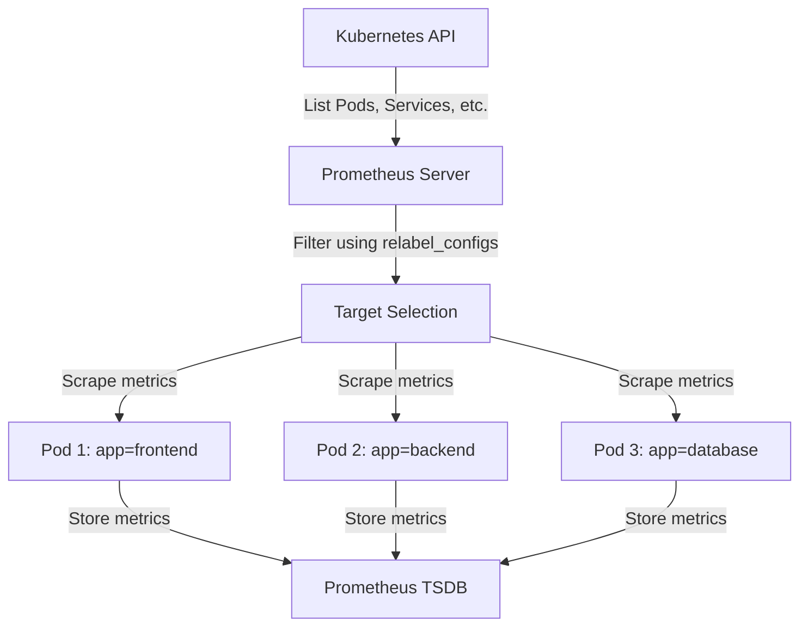

# Kubernetes Service Discovery

## Introduction

When running applications in Kubernetes, one of the most powerful features is **service discovery** - the ability for applications to find and communicate with each other without knowing exact locations in advance. For monitoring tools like Prometheus, service discovery is essential because it enables automatic detection of targets to monitor as pods come and go in a dynamic environment.

In this guide, we'll explore how Kubernetes service discovery works and how Prometheus leverages this mechanism to automatically find and monitor your applications.

## Understanding Service Discovery in Kubernetes

### What is Service Discovery?

Service discovery is a mechanism that allows applications to locate each other on a network. In traditional environments, you might configure fixed IP addresses or hostnames, but this approach doesn't work well in containerized environments where:

- Containers are ephemeral and can be restarted, rescheduled, or scaled at any time
- IP addresses change frequently
- Applications need to find each other without manual configuration

Kubernetes solves this problem through its built-in service discovery mechanisms.

### Core Kubernetes Service Discovery Mechanisms

Kubernetes provides several ways for resources to discover each other:

1. **Services**: The primary way to expose applications
2. **DNS**: Kubernetes DNS allows services to be discovered by name
3. **Environment Variables**: Services inject connection information into pods
4. **Endpoints API**: Direct access to endpoint information

Let's examine each of these mechanisms in more detail.

## Kubernetes Services

A Service in Kubernetes is an abstraction that defines a logical set of pods and a policy to access them.

```yaml
apiVersion: v1
kind: Service
metadata:
  name: my-app
spec:
  selector:
    app: my-app
  ports:
  - port: 80
    targetPort: 8080
```

When you create this service, Kubernetes:

1. Assigns it a stable virtual IP address (ClusterIP)
2. Creates DNS entries for the service name
3. Continuously updates the service to point to all pods with the matching label (`app: my-app`)
4. Load balances requests across all matching pods

### Service Types

Kubernetes offers several service types for different exposure needs:

- **ClusterIP**: Exposes the service on a cluster-internal IP (default)
- **NodePort**: Exposes the service on each node's IP at a static port
- **LoadBalancer**: Provisions an external load balancer
- **ExternalName**: Maps the service to a DNS name

## How Prometheus Uses Kubernetes Service Discovery

Prometheus has built-in support for Kubernetes service discovery, allowing it to automatically find targets to monitor based on Kubernetes resources.

### Configuring Prometheus for Kubernetes Service Discovery

Here's a basic example of configuring Prometheus to discover and scrape metrics from pods:

```yaml
scrape_configs:
  - job_name: 'kubernetes-pods'
    kubernetes_sd_configs:
      - role: pod
    relabel_configs:
      - source_labels: [__meta_kubernetes_pod_annotation_prometheus_io_scrape]
        action: keep
        regex: true
      - source_labels: [__meta_kubernetes_pod_annotation_prometheus_io_path]
        action: replace
        target_label: __metrics_path__
        regex: (.+)
      - source_labels: [__address__, __meta_kubernetes_pod_annotation_prometheus_io_port]
        action: replace
        regex: ([^:]+)(?::\d+)?;(\d+)
        replacement: $1:$2
        target_label: __address__
      - action: labelmap
        regex: __meta_kubernetes_pod_label_(.+)
      - source_labels: [__meta_kubernetes_namespace]
        action: replace
        target_label: kubernetes_namespace
      - source_labels: [__meta_kubernetes_pod_name]
        action: replace
        target_label: kubernetes_pod_name
```

### Discovery Roles in Prometheus

Prometheus supports discovering different types of Kubernetes resources:

- `node`: Discovers Kubernetes nodes
- `service`: Discovers Kubernetes services
- `pod`: Discovers Kubernetes pods
- `endpoints`: Discovers Kubernetes endpoints
- `ingress`: Discovers Kubernetes ingresses

Let's examine the `pod` role more closely.

### Pod Service Discovery Example

When using the `pod` role, Prometheus discovers all pods in the cluster and attaches metadata as labels. Using relabeling, we can:

1. **Filter pods**: Keep only pods with the annotation `prometheus.io/scrape: "true"`
2. **Set scrape path**: Use a custom metrics path from the annotation `prometheus.io/path`
3. **Set port**: Use a specific port from the annotation `prometheus.io/port`
4. **Add metadata**: Add Kubernetes labels, namespace, and pod name as Prometheus labels

### Practical Example: Monitoring a Spring Boot Application

Let's see a complete example of a Spring Boot application deployed in Kubernetes and discovered by Prometheus:

1. First, deploy your Spring Boot application with Prometheus annotations:

```yaml
apiVersion: apps/v1
kind: Deployment
metadata:
  name: spring-app
spec:
  replicas: 3
  selector:
    matchLabels:
      app: spring-app
  template:
    metadata:
      labels:
        app: spring-app
      annotations:
        prometheus.io/scrape: "true"
        prometheus.io/port: "8080"
        prometheus.io/path: "/actuator/prometheus"
    spec:
      containers:
      - name: spring-app
        image: spring-boot-app:latest
        ports:
        - containerPort: 8080
```

2. Configure your Spring Boot application to expose metrics (in `application.properties`):

```properties
management.endpoints.web.exposure.include=prometheus
management.endpoint.prometheus.enabled=true
```

3. Once deployed, Prometheus will automatically:
   - Discover all pods with the `prometheus.io/scrape: "true"` annotation
   - Scrape metrics from `/actuator/prometheus` on port `8080`
   - Label the metrics with Kubernetes metadata

### Service Discovery in Action

Let's visualize the flow of service discovery from Kubernetes to Prometheus:



## Advanced Service Discovery Techniques

### Multi-Cluster Service Discovery

For environments with multiple Kubernetes clusters, Prometheus can be configured to discover services across clusters:

```yaml
scrape_configs:
  - job_name: 'cluster-1-pods'
    kubernetes_sd_configs:
      - role: pod
        api_server: https://cluster-1-api-server:6443
        tls_config:
          ca_file: /path/to/cluster-1-ca
          cert_file: /path/to/cluster-1-cert
          key_file: /path/to/cluster-1-key
        
  - job_name: 'cluster-2-pods'
    kubernetes_sd_configs:
      - role: pod
        api_server: https://cluster-2-api-server:6443
        tls_config:
          ca_file: /path/to/cluster-2-ca
          cert_file: /path/to/cluster-2-cert
          key_file: /path/to/cluster-2-key
```

### Federation and Hierarchical Service Discovery

For large deployments, a hierarchical approach can be used:

```yaml
scrape_configs:
  - job_name: 'federate'
    scrape_interval: 15s
    honor_labels: true
    metrics_path: '/federate'
    params:
      'match[]':
        - '{job="kubernetes-pods"}'
    static_configs:
      - targets:
        - 'prometheus-shard-1:9090'
        - 'prometheus-shard-2:9090'
```

## Troubleshooting Service Discovery

When working with Kubernetes service discovery, common issues include:

### 1. Targets not being discovered

Check the following:

- Ensure the Prometheus pod has proper RBAC permissions to query the Kubernetes API
- Verify that the annotations/labels match your relabel_configs
- Check for typos in annotation names

Example RBAC configuration:

```yaml
apiVersion: rbac.authorization.k8s.io/v1
kind: ClusterRole
metadata:
  name: prometheus
rules:
- apiGroups: [""]
  resources:
  - nodes
  - nodes/proxy
  - services
  - endpoints
  - pods
  verbs: ["get", "list", "watch"]
```

### 2. Debugging Service Discovery

To debug service discovery issues, use the Prometheus UI's "Service Discovery" page, which shows:

- All discovered targets
- The source labels before relabeling
- The final labels after relabeling
- Why targets were dropped

You can also examine the Prometheus logs for more information about service discovery problems.

## Best Practices for Kubernetes Service Discovery

### 1. Use Consistent Annotations

Establish and follow annotation conventions:

```yaml
prometheus.io/scrape: "true"      # Enable scraping
prometheus.io/port: "8080"        # Port to scrape
prometheus.io/path: "/metrics"    # Metrics path
prometheus.io/scheme: "https"     # Protocol scheme (http or https)
```

### 2. Add Meaningful Labels

Use labels to make metrics more queryable:

```yaml
metadata:
  labels:
    app: payment-service
    environment: production
    team: marketplace
```

### 3. Consider Resource Usage

Service discovery increases with cluster size. To optimize:

- Use more specific selectors in your `kubernetes_sd_configs`
- Increase scrape intervals for less critical services
- Consider sharding Prometheus instances by namespace or team

## Summary

Kubernetes service discovery provides a powerful mechanism for applications to find each other in a dynamic environment. Prometheus leverages this capability to automatically discover and monitor applications as they come and go, making it an ideal monitoring solution for Kubernetes environments.

Key takeaways:

- Kubernetes services abstract pod locations and provide stable networking
- Prometheus can automatically discover Kubernetes resources using different roles
- Relabeling allows customization of what and how to scrape
- Annotations and labels provide a flexible way to configure scraping behavior
- Proper RBAC configuration is essential for service discovery to work

## Additional Resources

- [Prometheus Kubernetes SD Configuration](https://prometheus.io/docs/prometheus/latest/configuration/configuration/#kubernetes_sd_config)
- [Kubernetes Services Documentation](https://kubernetes.io/docs/concepts/services-networking/service/)
- [Prometheus Operator](https://github.com/prometheus-operator/prometheus-operator) - A more automated way to manage Prometheus in Kubernetes

## Exercises

1. Deploy a simple application with Prometheus annotations and verify it's discovered automatically.
2. Experiment with different relabeling configurations to filter and transform your metrics.
3. Set up service discovery for different resource types (services, nodes, endpoints) and compare the results.
4. Create a custom metric in your application and configure Prometheus to discover and scrape it.