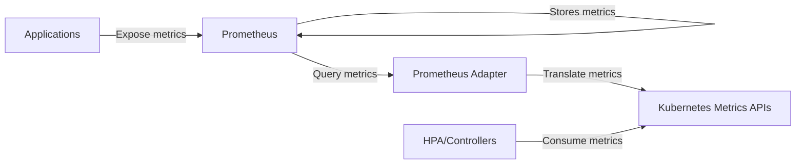

# Prometheus Adapter for Kubernetes

## Introduction

The Prometheus Adapter is a crucial component that bridges the gap between Prometheus metrics and the Kubernetes metrics system. In a Kubernetes environment, having access to custom metrics is essential for implementing advanced autoscaling, monitoring, and resource management strategies. However, Kubernetes doesn't natively understand Prometheus metrics.

This is where the Prometheus Adapter comes into play. It acts as a translator, converting Prometheus metrics into a format that the Kubernetes Custom Metrics API and External Metrics API can understand. This enables Kubernetes components like the Horizontal Pod Autoscaler (HPA) to make scaling decisions based on application-specific metrics collected by Prometheus.

## Why Do We Need the Prometheus Adapter?

Kubernetes has several built-in APIs for metrics:

1. **Resource Metrics API** - Provides CPU and memory usage for nodes and pods
2. **Custom Metrics API** - Allows for Kubernetes object-related metrics
3. **External Metrics API** - Enables metrics that aren't related to any Kubernetes object

While Kubernetes has a basic metrics server that supplies the Resource Metrics API with CPU and memory data, it doesn't provide custom or external metrics. The Prometheus Adapter fills this gap by implementing the Custom Metrics API and External Metrics API backed by Prometheus data.

## How the Prometheus Adapter Works

At a high level, the Prometheus Adapter works as follows:



1. Your applications expose Prometheus metrics
2. Prometheus scrapes and stores these metrics
3. The Prometheus Adapter queries Prometheus for these metrics
4. The adapter translates the metrics into Kubernetes Custom/External Metrics API format
5. Kubernetes components like HPA can now use these metrics for decision-making

## Installing the Prometheus Adapter

Let's go through the steps to install the Prometheus Adapter using Helm, which is the recommended approach for most Kubernetes environments.

### Prerequisites

- A Kubernetes cluster
- Prometheus installed and collecting metrics
- Helm installed

### Installation Steps

First, add the Prometheus Community Helm repository:

```bash
helm repo add prometheus-community https://prometheus-community.github.io/helm-charts
helm repo update
```

Next, create a configuration file for the Prometheus Adapter. Save this as `values.yaml`:

```yaml
prometheus:
  url: http://prometheus-server.monitoring.svc
  port: 9090

rules:
  default: true
  custom:
  - seriesQuery: '{__name__=~"http_requests_total"}'
    resources:
      overrides:
        namespace:
          resource: namespace
        pod:
          resource: pod
    name:
      matches: "^(.*)_total"
      as: "${1}_per_second"
    metricsQuery: 'sum(rate(<<.Series>>{<<.LabelMatchers>>}[2m])) by (<<.GroupBy>>)'
```

Now, install the Prometheus Adapter using Helm:

```bash
helm install prometheus-adapter prometheus-community/prometheus-adapter -f values.yaml -n monitoring
```

Verify that the adapter is working correctly:

```bash
kubectl get apiservices v1beta1.custom.metrics.k8s.io
```

You should see output similar to:

```
NAME                            SERVICE                                 AVAILABLE   AGE
v1beta1.custom.metrics.k8s.io   monitoring/prometheus-adapter   True        1m
```

## Configuring the Prometheus Adapter

The configuration of the Prometheus Adapter is where most of the complexity lies. Let's understand the key components of the configuration file:

### Rules Configuration

The adapter uses rules to determine:
1. Which Prometheus metrics to expose to Kubernetes
2. How to convert those metrics to Kubernetes metrics
3. How to associate metrics with Kubernetes objects

Here's a breakdown of a rule from our example:

```yaml
- seriesQuery: '{__name__=~"http_requests_total"}'
  resources:
    overrides:
      namespace:
        resource: namespace
      pod:
        resource: pod
  name:
    matches: "^(.*)_total"
    as: "${1}_per_second"
  metricsQuery: 'sum(rate(<<.Series>>{<<.LabelMatchers>>}[2m])) by (<<.GroupBy>>)'
```

Let's examine each part:

- `seriesQuery`: This is a Prometheus query that selects which metrics to expose through the adapter. In this example, we're selecting metrics whose names match "http_requests_total".

- `resources`: This section defines how to map Prometheus labels to Kubernetes resources. The `overrides` subsection allows you to specify explicit mappings.

- `name`: This defines how to transform the metric name. In our example, we're converting counters (ending in `_total`) to rates (ending in `_per_second`).

- `metricsQuery`: This is the Prometheus query template used to fetch the actual metric values. The placeholders (like `<<.Series>>`) are replaced with appropriate values when the query is executed.

## Using Custom Metrics with Horizontal Pod Autoscaler

Once the Prometheus Adapter is properly configured, you can use custom metrics with the Horizontal Pod Autoscaler.

Here's an example HPA that scales based on the number of HTTP requests per second:

```yaml
apiVersion: autoscaling/v2
kind: HorizontalPodAutoscaler
metadata:
  name: example-app-hpa
spec:
  scaleTargetRef:
    apiVersion: apps/v1
    kind: Deployment
    name: example-app
  minReplicas: 1
  maxReplicas: 10
  metrics:
  - type: Pods
    pods:
      metric:
        name: http_requests_per_second
      target:
        type: AverageValue
        averageValue: 100
```

This HPA will scale the `example-app` deployment based on the average number of HTTP requests per second. If the average exceeds 100 requests per second, Kubernetes will add more pods (up to 10).

## Verifying Custom Metrics

To verify that your custom metrics are available to Kubernetes, you can use the following command:

```bash
kubectl get --raw "/apis/custom.metrics.k8s.io/v1beta1" | jq .
```

This should return a list of all available custom metrics.

To check specific metrics for a pod:

```bash
kubectl get --raw "/apis/custom.metrics.k8s.io/v1beta1/namespaces/default/pods/*/http_requests_per_second" | jq .
```

## Practical Example: Autoscaling Based on Queue Length

Let's go through a real-world example of using the Prometheus Adapter to autoscale based on the length of a message queue.

### 1. Configure Prometheus to scrape queue metrics

Assume we have a service exposing a metric called `queue_length` that represents the number of messages in a queue.

### 2. Configure the Prometheus Adapter

Add a rule to your `values.yaml` file:

```yaml
rules:
  custom:
  - seriesQuery: '{__name__="queue_length"}'
    resources:
      overrides:
        namespace:
          resource: namespace
        service:
          resource: service
    name:
      matches: "^(.*)$"
      as: "${1}"
    metricsQuery: 'avg(<<.Series>>{<<.LabelMatchers>>}) by (<<.GroupBy>>)'
```

Update the Prometheus Adapter:

```bash
helm upgrade prometheus-adapter prometheus-community/prometheus-adapter -f values.yaml -n monitoring
```

### 3. Create an HPA for queue-based scaling

```yaml
apiVersion: autoscaling/v2
kind: HorizontalPodAutoscaler
metadata:
  name: queue-processor-hpa
spec:
  scaleTargetRef:
    apiVersion: apps/v1
    kind: Deployment
    name: queue-processor
  minReplicas: 1
  maxReplicas: 20
  metrics:
  - type: Object
    object:
      metric:
        name: queue_length
      describedObject:
        apiVersion: v1
        kind: Service
        name: queue-service
      target:
        type: Value
        value: 10
```

This HPA will scale the `queue-processor` deployment based on the queue length. If the queue has more than 10 messages, Kubernetes will add more pods to process the queue faster.

## Troubleshooting

If you encounter issues with the Prometheus Adapter, here are some common troubleshooting steps:

### Check if the adapter is running

```bash
kubectl get pods -n monitoring | grep prometheus-adapter
```

### Check adapter logs

```bash
kubectl logs -n monitoring $(kubectl get pods -n monitoring | grep prometheus-adapter | awk '{print $1}')
```

### Verify adapter configuration

```bash
kubectl get configmap -n monitoring prometheus-adapter -o yaml
```

### Check available metrics

```bash
kubectl get --raw "/apis/custom.metrics.k8s.io/v1beta1" | jq .
```

### Common Issues and Solutions

1. **No metrics available**: Ensure Prometheus is correctly scraping the metrics and that your series query in the adapter configuration matches existing metrics.

2. **Authentication issues**: If Prometheus is secured, ensure the adapter has the correct credentials.

3. **Incorrect metric transformation**: Check your naming rules and metrics query in the configuration.

4. **Performance issues**: If the adapter is slow or causing high load on Prometheus, consider optimizing your queries or increasing resources for both components.

## Advanced Configuration

### External Metrics API

The Prometheus Adapter can also implement the External Metrics API, which allows HPAs to scale based on metrics not associated with any Kubernetes object (e.g., cloud provider metrics).

Here's an example configuration:

```yaml
rules:
  external:
  - seriesQuery: '{__name__="external_metric_name"}'
    metricsQuery: 'sum(<<.Series>>)'
    name:
      matches: "^(.*)$"
      as: "${1}"
```

### Using PromQL for Complex Metrics

You can use complex PromQL queries in your adapter configuration for advanced use cases:

```yaml
rules:
  custom:
  - seriesQuery: '{__name__="http_requests_total"}'
    resources:
      overrides:
        namespace:
          resource: namespace
        pod:
          resource: pod
    name:
      matches: "^(.*)_total"
      as: "error_rate"
    metricsQuery: 'sum(rate(<<.Series>>{status=~"5.."}[2m])) by (<<.GroupBy>>) / sum(rate(<<.Series>>[2m])) by (<<.GroupBy>>)'
```

This example calculates an error rate based on HTTP status codes.

## Summary

The Prometheus Adapter is a powerful component that bridges the gap between Prometheus and Kubernetes metrics systems. By properly configuring the adapter, you can:

1. Expose application-specific metrics to Kubernetes
2. Use custom metrics for autoscaling with HPA
3. Make data-driven scaling decisions based on business metrics
4. Implement advanced monitoring and alerting

By following the steps and examples in this guide, you should now be able to set up the Prometheus Adapter and configure it to expose the metrics that matter most to your applications.

## Additional Resources

- [Prometheus Adapter GitHub Repository](https://github.com/kubernetes-sigs/prometheus-adapter)
- [Kubernetes Metrics APIs Documentation](https://kubernetes.io/docs/tasks/run-application/horizontal-pod-autoscale/#support-for-custom-metrics)
- [Horizontal Pod Autoscaling Documentation](https://kubernetes.io/docs/tasks/run-application/horizontal-pod-autoscale/)

## Exercises

1. Install the Prometheus Adapter in your Kubernetes cluster and expose a basic custom metric.
2. Configure the adapter to expose a rate-based metric from a counter metric in Prometheus.
3. Create an HPA that scales a deployment based on a custom metric of your choice.
4. Configure the adapter to implement the External Metrics API and use an external metric for autoscaling.
5. Design a complex metric using PromQL that combines multiple metrics and expose it through the adapter.