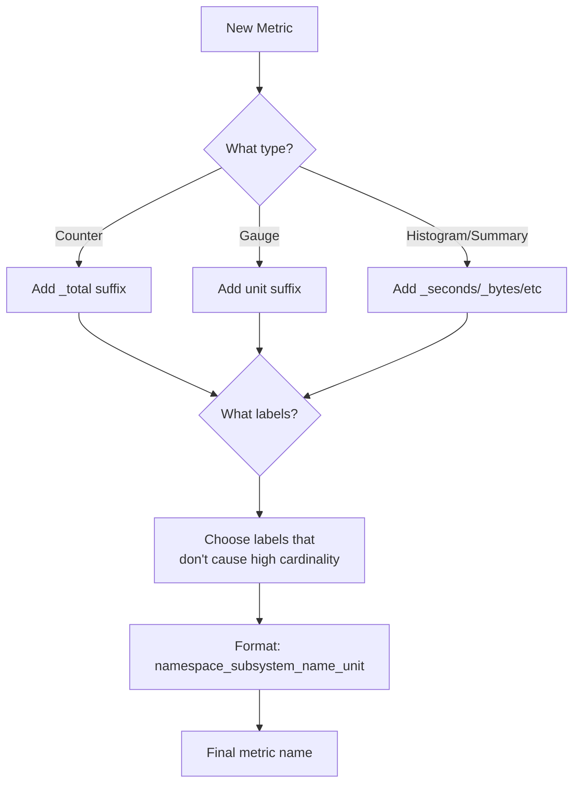

# Metric Naming Conventions

## Introduction

When working with Prometheus, the way you name your metrics is critically important. Well-designed metric names make your monitoring system more usable, maintainable, and understandable. This guide covers best practices for naming metrics in Prometheus to ensure your observability data is useful and accessible to your entire team.

Good metric names act as a form of documentation, allowing engineers to understand what's being measured without having to reference external documentation. They also enable consistent querying patterns and help organize your metrics effectively.

## Prometheus Metric Naming Structure

Prometheus metric names follow a specific pattern:

```
namespace_subsystem_name_unit
```

Let's break down each part:

- **Namespace**: Identifies the domain or application (e.g., `http`, `mysql`, `node`)
- **Subsystem**: Identifies a specific component within that domain (e.g., `connections`, `requests`, `memory`)
- **Name**: Describes what is being measured (e.g., `total`, `duration`, `size`)
- **Unit**: Indicates the unit of measurement (e.g., `bytes`, `seconds`, `count`)

### Example:

```
http_requests_total
```

In this example:
- Namespace: `http`
- Subsystem: `requests`
- Name: `total`
- Unit: implicitly a counter (count)

## Core Naming Conventions

### 1. Use Lowercase with Underscores

Metric names should use lowercase letters, numbers, and underscores only.

```
# Good
http_requests_total

# Avoid
HTTP_Requests_Total
http-requests-total
```

### 2. Include the Unit in the Name

The unit should be a suffix in the metric name to make it clear what's being measured.

```
# Good
http_request_duration_seconds
process_memory_usage_bytes

# Avoid
http_request_duration
process_memory_usage
```

Common unit suffixes include:
- `_total` - for counters (implying a count)
- `_seconds` - for time measurements
- `_bytes` - for memory or storage sizes
- `_ratio` - for ratios or percentages (0-1)
- `_percent` - for percentages (0-100)

### 3. Use Namespaces for Grouping

Group related metrics under a common namespace.

```
# Good - all HTTP metrics share the 'http' prefix
http_requests_total
http_request_duration_seconds
http_response_size_bytes

# Avoid - inconsistent prefixes
web_requests_total
http_latency_seconds
response_bytes
```

### 4. Use Prefixes for Exporters

When creating an exporter, prefix all metrics with the name of the system being monitored.

```
# Good
mysql_connections_active
mysql_buffer_pool_size_bytes

# Avoid
connections_active
buffer_pool_size_bytes
```

## Metric Types and Naming Patterns

Prometheus has four metric types, each with specific naming conventions:

### Counters

Counters should have `_total` as a suffix and usually represent events or occurrences.

```
# Good
http_requests_total
errors_total
```

### Gauges

Gauges should include the unit and represent a snapshot value.

```
# Good
memory_usage_bytes
cpu_utilization_ratio
queue_size
```

### Histograms

Histograms generate multiple metrics and follow a specific pattern:

```
# Base metric name
http_request_duration_seconds

# Generated metrics
http_request_duration_seconds_bucket{le="0.1"} 
http_request_duration_seconds_bucket{le="0.5"}
http_request_duration_seconds_bucket{le="1"}
http_request_duration_seconds_sum
http_request_duration_seconds_count
```

### Summaries

Summaries follow a similar pattern to histograms:

```
# Base metric name
http_request_duration_seconds

# Generated metrics
http_request_duration_seconds{quantile="0.5"}
http_request_duration_seconds{quantile="0.9"}
http_request_duration_seconds{quantile="0.99"}
http_request_duration_seconds_sum
http_request_duration_seconds_count
```

## Practical Examples

Let's look at some real-world examples of metric naming conventions.

### Example 1: HTTP Server Metrics

```
# Request count
http_requests_total{method="GET", endpoint="/api/users", status="200"}

# Request duration
http_request_duration_seconds{method="GET", endpoint="/api/users"}

# Response size
http_response_size_bytes{method="GET", endpoint="/api/users"}
```

### Example 2: Database Metrics

```
# Connection pool metrics
db_connections_active
db_connections_idle
db_connections_max

# Query metrics
db_query_duration_seconds{query="select"}
db_query_errors_total{query="select"}

# Storage metrics
db_table_size_bytes{table="users"}
db_index_size_bytes{index="users_email_idx"}
```

### Example 3: Application-Specific Metrics

```
# Business metrics
app_user_registrations_total
app_purchases_total{product="premium"}
app_subscription_revenue_dollars_total

# Technical metrics
app_job_duration_seconds{job="daily_report"}
app_cache_hit_ratio
app_worker_pool_size
```

## Common Anti-Patterns to Avoid

### 1. Embedding Variable Labels in Metric Names

```
# Bad
api_requests_user_123_total
api_requests_user_456_total

# Good
api_requests_total{user_id="123"}
api_requests_total{user_id="456"}
```

### 2. Inconsistent Naming Across Related Metrics

```
# Bad - inconsistent naming
http_requests
http_request_latency
http_failures

# Good - consistent naming pattern
http_requests_total
http_request_duration_seconds
http_request_errors_total
```

### 3. Omitting Units

```
# Bad - unclear units
memory_usage
request_time

# Good - clear units
memory_usage_bytes
request_duration_seconds
```

### 4. Too Many or Too Few Labels

```
# Too many labels - cardinality explosion
http_requests_total{path="/user/1234", method="GET", status="200", user_agent="..."}

# Too few labels - not enough context
http_requests_total
```

## Metric Naming Decision Flow

Here's a flow chart to help you name your metrics effectively:



## Summary

Effective metric naming in Prometheus is essential for creating a maintainable and useful monitoring system. By following these conventions, you'll make it easier for everyone on your team to discover, understand, and use your metrics effectively.

Key takeaways:
- Use the format `namespace_subsystem_name_unit`
- Include units in metric names
- Follow type-specific conventions (e.g., `_total` for counters)
- Use labels for dimensions that vary
- Maintain consistency across related metrics

## Additional Resources

- [Prometheus Naming Best Practices (official docs)](https://prometheus.io/docs/practices/naming/)
- [OpenMetrics Standard](https://openmetrics.io/)
- [Google's Four Golden Signals](https://sre.google/sre-book/monitoring-distributed-systems/)

## Exercises

1. Rename these poorly named metrics according to best practices:
   - `requests`
   - `latency`
   - `memory`
   - `errors_count`

2. Design a set of metrics for monitoring a web application with:
   - Frontend performance metrics
   - Backend API metrics
   - Database performance metrics

3. Analyze an existing metrics set from an open source project on GitHub and identify instances where naming conventions are followed well or could be improved.