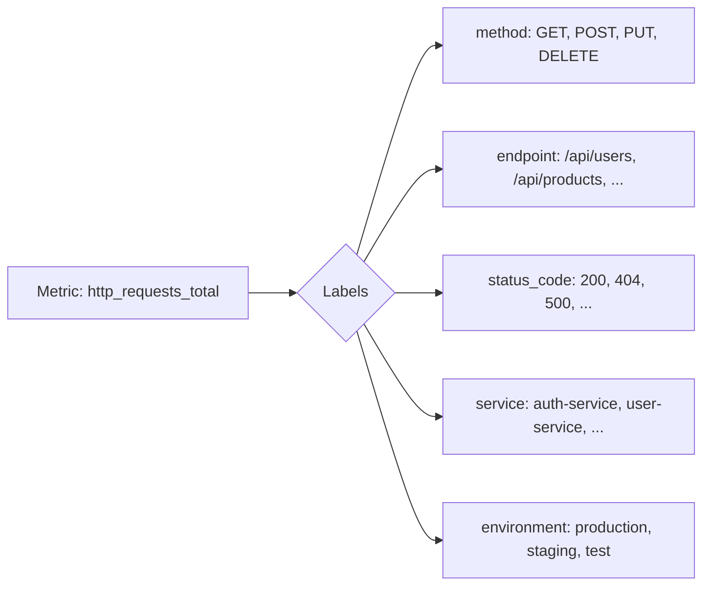

# Label Best Practices

## Introduction

Labels are a fundamental concept in Prometheus that transform simple metrics into powerful, multi-dimensional data points. They allow you to add context to your metrics, enabling flexible querying, filtering, and aggregation. However, with great power comes great responsibility - inefficient labeling can lead to performance issues and "cardinality explosions" that can cripple your monitoring system.

In this guide, we'll explore best practices for designing and using labels in Prometheus to achieve an optimal balance between flexibility and performance.

## Understanding Labels in Prometheus

Labels in Prometheus are key-value pairs associated with metrics that provide additional dimensions of information. For example, a simple `http_requests_total` counter becomes much more useful when labeled with information like `method`, `endpoint`, and `status_code`.

```prometheus
http_requests_total{method="GET", endpoint="/api/users", status_code="200"} 2345
http_requests_total{method="POST", endpoint="/api/users", status_code="201"} 901
http_requests_total{method="GET", endpoint="/api/products", status_code="200"} 3545
```

This labeled data allows you to query metrics with precision:

```promql
# Count of successful GET requests to the users API
http_requests_total{method="GET", endpoint="/api/users", status_code="200"}

# Sum of all 5xx errors across all endpoints
sum(http_requests_total{status_code=~"5.."})
```

## Key Best Practices for Labeling

### 1. Keep Cardinality Under Control

**Cardinality** refers to the number of possible label value combinations for a metric. High cardinality can severely impact Prometheus performance.

❌ **Bad Practice:**
```prometheus
# Using user IDs as label values (potentially millions of values)
http_requests_total{user_id="12345", ...}
http_requests_total{user_id="12346", ...}
```

✅ **Good Practice:**
```prometheus
# Use limited categorization instead
http_requests_total{user_type="free", ...}
http_requests_total{user_type="premium", ...}
```

### 2. Use Meaningful Label Names and Values

Labels should be self-explanatory and follow consistent naming conventions.

❌ **Bad Practice:**
```prometheus
# Ambiguous, inconsistent labels
api_latency_seconds{e="/users", m="g", c="p"}
```

✅ **Good Practice:**
```prometheus
# Clear, consistent labels
api_latency_seconds{endpoint="/users", method="GET", client="mobile"}
```

### 3. Follow the Standard Label Convention

Prometheus has established conventions for certain labels:

✅ **Common Standard Labels:**
```prometheus
# instance: <host>:<port>
# job: the configured job name
# env: environment (production, staging, development)
# service: the service or application name
# team: team responsible for the service
http_requests_total{job="api-server", instance="10.0.0.1:8080", env="production"}
```

### 4. Avoid Using Labels for Application State

Labels should not track rapidly changing information.

❌ **Bad Practice:**
```prometheus
# Using labels for tracking values that change frequently
temperature_celsius{current_reading="22.5", ...}
```

✅ **Good Practice:**
```prometheus
# Use the metric value for the measurement, labels for static dimensions
temperature_celsius{location="server-room", sensor="main", ...} 22.5
```

### 5. Plan Label Aggregation in Advance

Consider how you'll query and aggregate your data when designing labels.

```promql
# Aggregating HTTP requests by endpoint
sum by (endpoint) (rate(http_requests_total[5m]))

# Calculating error rates by service
sum by (service) (rate(http_requests_total{status_code=~"5.."}[5m])) 
  / 
sum by (service) (rate(http_requests_total[5m]))
```

## Real-World Label Examples

Let's examine some practical examples of effective labeling for common scenarios:

### Web Server Metrics

```prometheus
# Request count with useful dimensions
http_requests_total{
  service="user-api",
  method="POST", 
  endpoint="/api/users", 
  status_code="201",
  environment="production"
} 901

# Request latency with consistent labels
http_request_duration_seconds{
  service="user-api",
  method="POST", 
  endpoint="/api/users",
  environment="production"
} 0.42
```

### Service Health Metrics

```prometheus
# Up metric indicating if a service is running
up{job="redis", instance="redis-01:9121", environment="production"} 1

# Database connection pool metrics
db_connections{
  service="payment-service",
  pool="write", 
  state="in_use",
  db_name="users_db"
} 7
```

### Resource Usage Metrics

```prometheus
# CPU usage with meaningful categorization
cpu_usage_percent{
  instance="web-server-03",
  mode="user",
  service="web-frontend"
} 35.7

# Memory usage with consistent labeling
memory_usage_bytes{
  instance="web-server-03",
  type="heap",
  service="web-frontend"
} 1073741824
```

## Visualizing Label Relationships

Labels create a multi-dimensional data model. Here's a simplified visualization of how metrics and labels relate:



## Advanced Label Techniques

### Dynamic Target Labels with Relabeling

Prometheus can dynamically manipulate labels during scraping using relabeling configurations:

```yaml
scrape_configs:
  - job_name: 'kubernetes-pods'
    kubernetes_sd_configs:
      - role: pod
    relabel_configs:
      # Extract app name from Kubernetes pod label
      - source_labels: [__meta_kubernetes_pod_label_app]
        target_label: app
      # Add team label based on namespace
      - source_labels: [__meta_kubernetes_namespace]
        regex: ^(team-a-.*|team-b-.*)$
        replacement: $1
        target_label: team
```

### Using Recording Rules for Label Aggregation

Recording rules can pre-compute aggregate values for commonly queried label combinations:

```yaml
rules:
  - record: job:http_requests_total:rate5m
    expr: sum by (job) (rate(http_requests_total[5m]))
  
  - record: job:http_error_rate:5m
    expr: |
      sum by (job) (rate(http_requests_total{status_code=~"5.."}[5m]))
      /
      sum by (job) (rate(http_requests_total[5m]))
```

## Common Labeling Pitfalls

### 1. Cardinality Explosion

```prometheus
# This will create a new time series for every request ID (BAD)
http_requests_total{request_id="abc-123-xyz", ...}

# This will create a new time series for each IP address (CAUTION)
http_requests_total{client_ip="192.168.1.1", ...}
```

### 2. Inconsistent Label Schemes

```prometheus
# Inconsistent labels across related metrics (BAD)
api_requests_count{api="users", method="POST", ...}
api_response_time{endpoint="/api/users", http_method="POST", ...}
```

### 3. Using Labels for Calculations

```prometheus
# Using label values that should be calculated (BAD)
http_response_size_bytes{size_range="0-1KB", ...}

# Instead, use PromQL for calculations
# Example query to categorize by size:
# sum by (service) (http_response_size_bytes_bucket{le="1024"})
```

## Performance Impact of Labels

Here's a comparison of how different labeling strategies affect Prometheus:

| Labeling Strategy | Cardinality | Memory Usage | Query Performance |
| ----------------- | ----------- | ------------ | ---------------- |
| No labels | Low (1 time series per metric) | Minimal | Very Fast |
| Few labels with limited values | Low-Medium | Low | Fast |
| Many labels with limited values | Medium | Medium | Medium |
| Few labels with high-cardinality values | High | High | Slow |
| Many labels with high-cardinality values | Extreme | Extreme | Very Slow/Fails |

## Migrating and Evolving Label Schemes

When evolving your label scheme:

1. **Add new labels before removing old ones** - This allows for transition periods
2. **Use recording rules to maintain backwards compatibility**
3. **Document label changes and communicate with dashboard users**
4. **Monitor cardinality growth during migrations**

```yaml
# Recording rule for backward compatibility
rules:
  - record: http_requests_total:old_labels
    expr: sum by (old_label1, old_label2) (http_requests_total)
```

## Summary

Effective labeling in Prometheus requires balancing the need for detailed information with performance considerations. Following these best practices will help you create a scalable, maintainable monitoring system:

- Control cardinality by avoiding high-cardinality label values
- Use consistent, meaningful label names and values
- Follow standard label conventions
- Plan for aggregation when designing your label scheme
- Regularly review and monitor the cardinality of your metrics

By applying these principles, you'll be able to build powerful, targeted queries without overwhelming your Prometheus infrastructure.

## Additional Resources

- [Prometheus Documentation: Best Practices](https://prometheus.io/docs/practices/naming/)
- [Cardinality: A Prometheus Survival Guide](https://www.robustperception.io/cardinality-is-key/)
- [PromQL Cheat Sheet](https://promlabs.com/promql-cheat-sheet/)

## Exercises

1. Analyze a metric from your application and identify potential label improvements
2. Design a labeling scheme for a new service with at least 5 different metrics
3. Write PromQL queries that use labels effectively for filtering and aggregation
4. Use the `cardinality()` function in PromQL to identify high-cardinality metrics in your system

```promql
# Exercise: Find metrics with high cardinality
topk(10, count by (__name__) ({__name__!=""}))
```