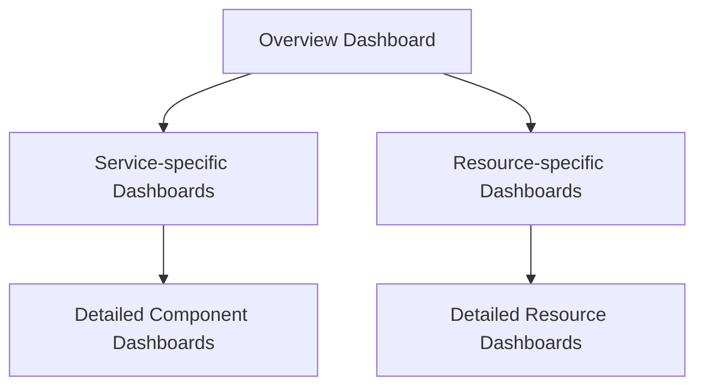

# Dashboard Best Practices

## Introduction

Dashboards are a critical component in Prometheus-based monitoring systems. They transform raw metrics and time-series data into visualizations that help you understand system behavior, identify patterns, troubleshoot issues, and make informed decisions. However, poorly designed dashboards can lead to confusion, missed alerts, and incorrect conclusions.

This guide will walk you through best practices for designing effective Prometheus dashboards, whether you're using Grafana (the most common visualization tool for Prometheus) or other compatible visualization platforms.

## Dashboard Organization Principles

### The USE and RED Methods

Two popular frameworks help structure monitoring dashboards effectively:

#### USE Method (for resources)

- **Utilization**: Percentage of time the resource is busy
- **Saturation**: Amount of work resource has to do (often queue length or load)
- **Errors**: Count of error events

This approach works well for hardware resources like CPU, memory, disk, and network.

#### RED Method (for services)

- **Rate**: Requests per second
- **Errors**: Number of failed requests
- **Duration**: Amount of time to process requests

This approach works well for microservices and user-facing services.

### Dashboard Hierarchy

Organize your dashboards in a hierarchy that allows for efficient navigation:



## Dashboard Design Best Practices

### 1. Start with Clear Objectives

Before creating a dashboard, answer these questions:

- Who is the audience? (Developers, SREs, Management)
- What decisions should this dashboard help make?
- What are the critical metrics that matter most?
- What timeframes are relevant for this data?

### 2. Follow a Consistent Layout

- Organize panels in a logical, scannable order
- Place the most important metrics at the top-left (following reading patterns)
- Group related metrics together
- Maintain consistent time ranges across panels

### 3. Choose the Right Visualizations

| Data Type | Suggested Visualization |
|-----------|-------------------------|
| Single value with threshold | Gauge or Stat panel |
| Values over time | Graph panel |
| Breakdowns or distributions | Pie chart or Bar gauge |
| State changes | State timeline |
| Multi-dimensional data | Heatmap |

### 4. Optimize Readability

- Use clear titles that describe what the panel shows
- Include units of measurement
- Set appropriate Y-axis ranges
- Use consistent color schemes (e.g., red for errors, green for success)
- Avoid unnecessary decorations or "chart junk"

### 5. Include Context

- Add annotations for deployments and important events
- Incorporate relevant thresholds and SLO/SLI targets
- Include links to related dashboards or documentation
- Add descriptive text panels for complex metrics

## Prometheus-Specific Dashboard Practices

### PromQL Best Practices

Writing efficient PromQL queries ensures your dashboards load quickly and don't overload your Prometheus server:

```
# Bad: Calculating rate then filtering
rate(http_requests_total[5m]) > 100

# Good: Filter first then calculate rate
rate(http_requests_total{status="500"}[5m])
```

### Labels and Aggregation

Use labels effectively to create dynamic dashboards:

```
# Show HTTP error rate by endpoint
sum by(endpoint) (rate(http_requests_total{status=~"5.."}[5m])) 
/ 
sum by(endpoint) (rate(http_requests_total[5m]))
```

### Template Variables

In Grafana, use template variables to make dashboards reusable across different services, environments, or instances:

```
rate(http_requests_total{service="$service", environment="$environment"}[5m])
```

## Practical Example: Creating a Service Dashboard

Let's create a practical example of a basic service dashboard using the RED method:

### 1. Traffic Panel (Rate)

```
# Request rate by endpoint
sum by(endpoint) (rate(http_requests_total{service="my-service"}[5m]))
```

### 2. Error Panel

```
# Error percentage by endpoint
sum by(endpoint) (rate(http_requests_total{service="my-service", status=~"5.."}[5m])) 
/ 
sum by(endpoint) (rate(http_requests_total{service="my-service"}[5m])) * 100
```

### 3. Duration Panel

```
# 95th percentile request duration by endpoint
histogram_quantile(0.95, sum by(le, endpoint) (rate(http_request_duration_seconds_bucket{service="my-service"}[5m])))
```

### 4. Resource Utilization

```
# CPU usage 
sum(rate(process_cpu_seconds_total{service="my-service"}[5m])) by (instance)

# Memory usage
process_resident_memory_bytes{service="my-service"} / 1024 / 1024
```

Here's how this might look when implemented:

1. A traffic overview graph showing requests per second
2. An error rate panel with warning thresholds at 1% and critical at 5%
3. A latency panel showing p50, p95, and p99 response times
4. Resource panels showing CPU and memory usage

## Common Dashboard Anti-Patterns

Avoid these common dashboard design mistakes:

1. **Metric Overload**: Too many metrics on one dashboard
2. **Unclear Purpose**: Dashboards that try to serve too many different purposes
3. **Inconsistent Time Ranges**: Different time ranges across related panels
4. **Missing Context**: Graphs without proper titles, labels, or units
5. **Inappropriate Visualizations**: Using the wrong visualization type for the data
6. **Non-actionable Metrics**: Metrics that don't help make decisions

## Performance Considerations

### Query Efficiency

- Use recording rules for complex, frequently used queries
- Limit the use of heavy operations like `topk` and complex regex
- Be mindful of cardinality explosion when using group_by

Example of a recording rule:

```yaml
groups:
  - name: example
    rules:
    - record: job:http_requests_total:rate5m
      expr: sum by(job) (rate(http_requests_total[5m]))
```

### Dashboard Loading Speed

- Limit the number of panels per dashboard (aim for < 20)
- Use appropriate time intervals (avoid unnecessarily small intervals)
- Set reasonable refresh intervals (usually 30s to 5m is sufficient)

## Dashboard Maintenance

### Documentation

Document your dashboards with:
- Purpose and audience
- Description of each panel
- Data sources and queries
- Expected patterns and what deviations mean

### Review and Iteration

- Regularly review dashboards for usefulness
- Remove unused or redundant metrics
- Update dashboards as your system evolves
- Solicit feedback from users

## Grafana-Specific Best Practices

### Dashboard Provisioning

Use Grafana's provisioning to manage dashboards as code:

```yaml
apiVersion: 1
providers:
- name: 'default'
  orgId: 1
  folder: 'Services'
  type: file
  disableDeletion: false
  updateIntervalSeconds: 10
  options:
    path: /var/lib/grafana/dashboards
```

### Alerting Integration

Connect dashboard panels to alerting:

```
# Alert when error rate exceeds 5%
sum(rate(http_requests_total{status=~"5.."}[5m])) / sum(rate(http_requests_total[5m])) > 0.05
```

## Summary

Effective Prometheus dashboards are essential tools for monitoring and troubleshooting. By following these best practices, you can create dashboards that:

- Clearly communicate system state and performance
- Help quickly identify and diagnose issues
- Support informed decision-making
- Provide valuable insights into system behavior

Remember that dashboards should evolve with your system and the needs of your team. Regularly review and refine your dashboards to ensure they remain useful and relevant.

## Additional Resources

- [Grafana Documentation](https://grafana.com/docs/)
- [Prometheus Documentation](https://prometheus.io/docs/)
- ["Art of Monitoring" by James Turnbull](https://artofmonitoring.com/)
- [SRE Book Chapter on Monitoring](https://sre.google/sre-book/monitoring-distributed-systems/)

## Exercises

1. Create a basic RED method dashboard for a service of your choice
2. Design a USE method dashboard for monitoring host resources
3. Take an existing dashboard and refactor it using the best practices from this guide
4. Create a dashboard that uses template variables to monitor multiple services
5. Design an alert based on metrics from your dashboard