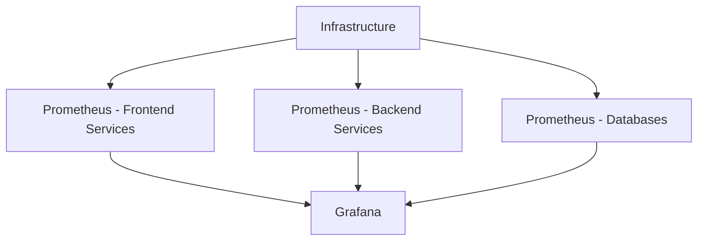
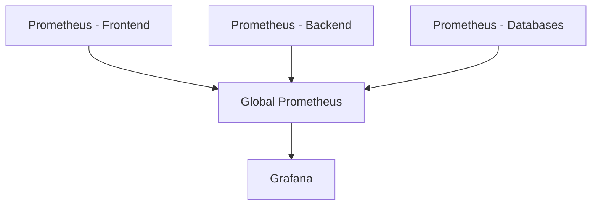
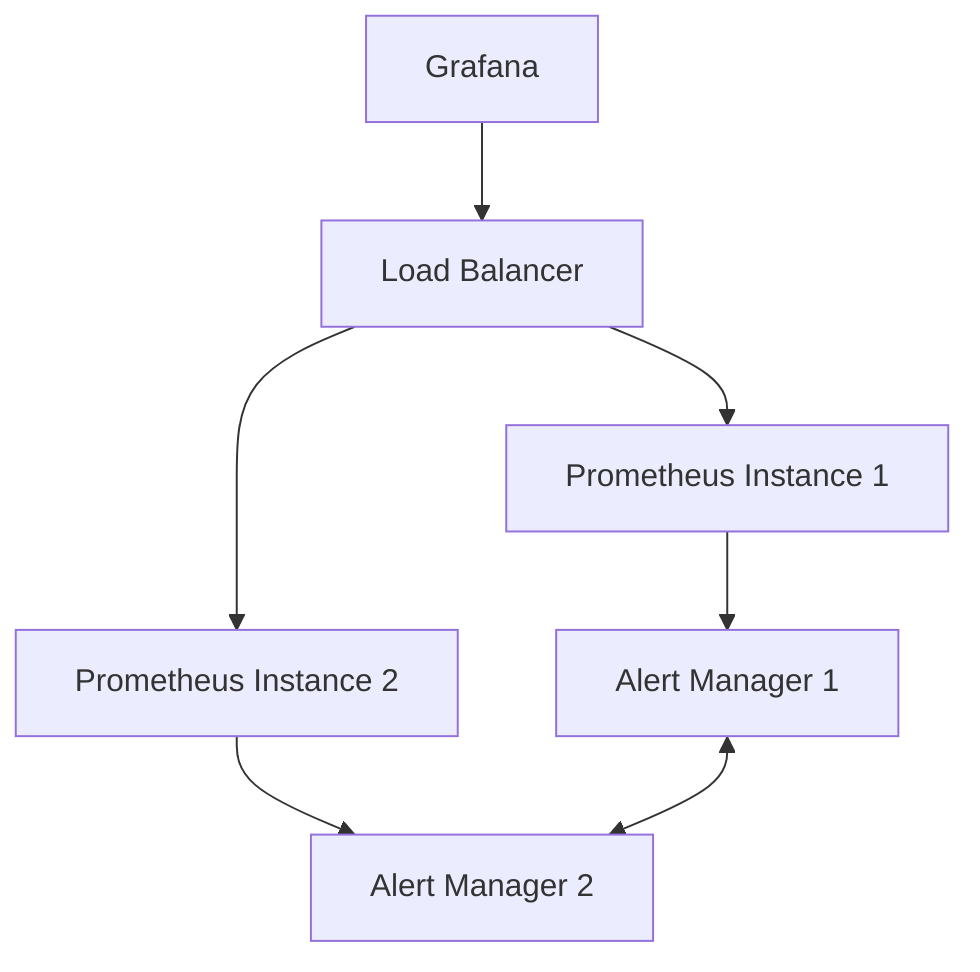
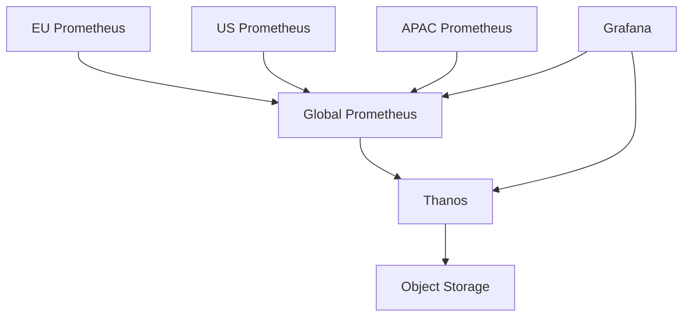

# Scaling Prometheus

## Introduction

As your infrastructure grows, so does the need for robust monitoring. Prometheus excels at monitoring systems and services, but a single Prometheus server can face limitations when dealing with large-scale environments. This guide explores strategies and best practices for scaling Prometheus to accommodate growing monitoring needs while maintaining reliability and performance.

## Why Scaling Matters

A single Prometheus instance can typically handle millions of time series and thousands of targets, but eventually, you might encounter limitations like:

- Increased storage requirements
- Higher CPU and memory utilization
- Longer query response times
- Potential for single points of failure

Let's explore various approaches to overcome these limitations and build a scalable monitoring solution.

## Vertical Scaling

The simplest approach to scaling is vertical scaling (scaling up) - adding more resources to your existing Prometheus server.

### When to Consider Vertical Scaling

- Your metrics volume has increased moderately
- You're experiencing occasional resource constraints
- You want a simple, immediate solution

### Implementation Steps

1. **Increase hardware resources**: Allocate more CPU, memory, and disk space to your Prometheus server.

2. **Optimize storage settings**: Adjust storage retention and block size in your Prometheus configuration.

```yaml
global:
  scrape_interval: 15s

storage:
  tsdb:
    path: /path/to/data
    retention.time: 15d
    retention.size: 100GB
    wal-compression: true
```

3. **Fine-tune the query engine**: Adjust query timeout settings to prevent resource exhaustion.

```yaml
query_engine:
  timeout: 2m
  max_samples: 50000000
```

While vertical scaling is straightforward, it has limitations. Eventually, you'll need to explore horizontal scaling options.

## Functional Sharding

Functional sharding involves running multiple Prometheus instances, each monitoring a specific subset of your infrastructure.



### Implementation Steps

1. **Categorize your targets**: Group your targets logically based on service type, team ownership, or environment.

2. **Configure multiple Prometheus instances**: Set up separate Prometheus servers for each group.

```yaml
# prometheus-frontend.yml
global:
  scrape_interval: 15s
  external_labels:
    shard: "frontend"

scrape_configs:
  - job_name: 'frontend-services'
    static_configs:
      - targets: ['app1:9100', 'app2:9100', 'app3:9100']
```

```yaml
# prometheus-backend.yml
global:
  scrape_interval: 15s
  external_labels:
    shard: "backend"

scrape_configs:
  - job_name: 'backend-services'
    static_configs:
      - targets: ['api1:9100', 'api2:9100', 'api3:9100']
```

3. **Set up a unified view**: Configure Grafana to query multiple Prometheus data sources or implement Prometheus federation.

### Benefits and Limitations

**Benefits:**
- Simplifies management of different monitoring domains
- Reduces the load on individual Prometheus instances
- Allows for domain-specific retention policies

**Limitations:**
- Queries across shards can be complex
- No built-in query aggregation across instances

## Prometheus Federation

Federation allows a Prometheus server to scrape selected time series from another Prometheus server, creating a hierarchical structure.



### Implementation Steps

1. **Set up source Prometheus instances**: Configure multiple Prometheus servers for different parts of your infrastructure.

2. **Configure federation in the global Prometheus**:

```yaml
# global-prometheus.yml
scrape_configs:
  - job_name: 'federate'
    scrape_interval: 30s
    honor_labels: true
    metrics_path: '/federate'
    params:
      'match[]':
        - '{job=~".+"}'  # Adjust to limit which metrics are federated
    static_configs:
      - targets:
        - 'prometheus-frontend:9090'
        - 'prometheus-backend:9090'
        - 'prometheus-databases:9090'
```

3. **Optimize federation queries**: Carefully select which metrics to federate to avoid overloading the system.

### Example: Federate Only Critical Metrics

```yaml
params:
  'match[]':
    - '{__name__=~"job:.+"}' # Job-level aggregations
    - '{__name__=~"up|instance:.*"}' # Availability metrics
    - '{__name__="scrape_duration_seconds"}' # Scrape performance
```

## Remote Storage Integration

Prometheus supports writing samples to remote storage systems, allowing for longer data retention and distributed querying.

### Popular Remote Storage Options

- **Thanos**: For a distributed Prometheus setup with unlimited storage
- **Cortex**: For a multi-tenant, horizontally scalable Prometheus
- **Prometheus TSDB**: Native time series database storage
- **InfluxDB**: Time series database with enhanced query capabilities
- **TimescaleDB**: PostgreSQL-based time series database

### Setting up Remote Storage with Thanos

1. **Configure Prometheus with Thanos sidecar**:

```yaml
# prometheus.yml
global:
  external_labels:
    region: us-east-1
    replica: 1

storage:
  tsdb:
    path: /prometheus
    retention.time: 2d

remote_write:
  - url: "http://thanos-receive:19291/api/v1/receive"
```

2. **Run Thanos components**:

```bash
# Start Thanos sidecar
thanos sidecar \
  --tsdb.path=/prometheus \
  --prometheus.url=http://localhost:9090 \
  --objstore.config-file=bucket.yml
```

3. **Query across all data**:

```bash
# Start Thanos querier
thanos query \
  --store=thanos-store.example.com:19194 \
  --store=thanos-sidecar.example.com:19191
```

## High Availability Setup

For critical environments, you can implement a high-availability (HA) Prometheus setup.



### Implementation Steps

1. **Run redundant Prometheus instances**: Set up identical Prometheus servers scraping the same targets.

2. **Configure external labels**:

```yaml
global:
  external_labels:
    replica: replica1  # Different for each HA instance
```

3. **Set up Alertmanager in HA mode**:

```yaml
# alertmanager.yml
global:
  resolve_timeout: 5m

route:
  group_by: ['alertname', 'job']
  group_wait: 30s
  group_interval: 5m
  repeat_interval: 12h
  receiver: 'team-emails'

receivers:
- name: 'team-emails'
  email_configs:
  - to: 'team@example.org'

cluster:
  peers:
    - alertmanager1:9094
    - alertmanager2:9094
```

4. **Deduplicate alerts**: Ensure your alert receivers can handle duplicate notifications.

## Performance Tuning

As you scale Prometheus, performance tuning becomes increasingly important.

### Key Configuration Parameters

1. **Storage settings**:

```yaml
storage:
  tsdb:
    min_block_duration: 2h  # Default is 2h
    max_block_duration: 2h  # Default is 2h
    retention.time: 15d
    wal-compression: true
```

2. **Query performance**:

```yaml
query_engine:
  timeout: 2m
  max_samples: 50000000
  max_concurrency: 20
```

3. **Scrape configuration**:

```yaml
scrape_configs:
  - job_name: 'large-app'
    scrape_interval: 30s      # Adjust based on needs
    scrape_timeout: 10s       # Keep short to prevent bottlenecks
    sample_limit: 1000        # Limit samples per scrape
```

### Monitoring Prometheus Itself

Always monitor your Prometheus instances using another Prometheus server to track:

- Memory usage
- CPU utilization
- Storage growth
- Query performance
- Scrape durations

## Service Discovery for Dynamic Environments

In cloud and container environments, targets come and go dynamically. Service discovery helps Prometheus adapt to these changes.

### Kubernetes Service Discovery Example

```yaml
scrape_configs:
  - job_name: 'kubernetes-pods'
    kubernetes_sd_configs:
      - role: pod
    relabel_configs:
      - source_labels: [__meta_kubernetes_pod_annotation_prometheus_io_scrape]
        action: keep
        regex: true
      - source_labels: [__meta_kubernetes_pod_annotation_prometheus_io_path]
        action: replace
        target_label: __metrics_path__
        regex: (.+)
      - source_labels: [__address__, __meta_kubernetes_pod_annotation_prometheus_io_port]
        action: replace
        regex: ([^:]+)(?::\d+)?;(\d+)
        replacement: $1:$2
        target_label: __address__
```

## Real-World Example: E-Commerce Platform

Let's look at how a growing e-commerce platform might scale its Prometheus setup:

### Initial Setup (Small Scale)
- Single Prometheus instance
- Basic alerting
- 50-100 targets

### Medium Scale (Regional Expansion)
- Functional sharding:
  - prometheus-frontend: Monitoring web services
  - prometheus-backend: APIs and services
  - prometheus-database: Database clusters
- Basic federation for global views

### Large Scale (Global Operation)
- Hierarchical federation:
  - Regional Prometheus servers
  - Global aggregation Prometheus
- Remote storage with Thanos:
  - Object storage for long-term metrics
  - Global querying across regions
- HA setup for critical monitoring



## Summary

Scaling Prometheus involves a combination of approaches depending on your specific needs:

- **Vertical scaling**: Simple but limited approach
- **Functional sharding**: Divide monitoring by logical domains
- **Federation**: Hierarchical monitoring structure
- **Remote storage**: Long-term storage and distributed querying
- **High availability**: Redundancy for critical environments

As your infrastructure grows, you'll likely implement a combination of these strategies to build a robust, scalable monitoring solution.

## Additional Resources

- [Prometheus Documentation on Federation](https://prometheus.io/docs/prometheus/latest/federation/)
- [Thanos Project](https://thanos.io/)
- [Cortex Project](https://cortexmetrics.io/)
- [Prometheus Operator for Kubernetes](https://github.com/prometheus-operator/prometheus-operator)

## Practice Exercise

Design a scaled Prometheus architecture for a hypothetical company with:
- 3 geographic regions
- 1000+ microservices
- Mix of Kubernetes, VM, and bare-metal infrastructure
- Requirements for 1-year data retention

Consider:
- How you would organize federation
- Which metrics should be globally available vs. locally stored
- Remote storage implementation
- How you would handle alerting