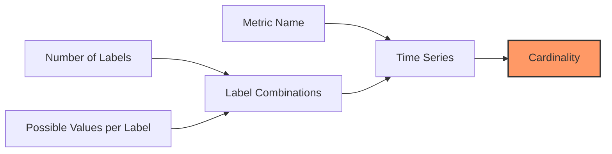

# Cardinality Control

## Introduction

When working with Prometheus, one of the most critical aspects to understand and manage is **cardinality**. Cardinality refers to the number of unique time series that Prometheus has to track. A time series in Prometheus is uniquely identified by its metric name and the combination of its label key-value pairs.

High cardinality is one of the leading causes of performance issues in Prometheus deployments. As the number of unique time series grows, Prometheus requires more memory and processing power, which can eventually lead to system instability or failure.

In this guide, we'll explore what cardinality is, why it matters, and how to effectively control it to maintain a healthy Prometheus installation.

## Understanding Cardinality

### What Is Cardinality?

Cardinality is a measure of the unique elements in a set. In Prometheus terms, it refers to the number of unique time series created by your metrics and their labels.

For example, consider a simple metric:

```prometheus
http_requests_total{path="/api", method="GET", status="200"} 24
```

This represents a single time series. If we add another metric with different label values:

```prometheus
http_requests_total{path="/home", method="GET", status="200"} 12
```

We now have two unique time series. As the number of unique combinations of labels grows, so does the cardinality.

### Why Cardinality Matters

Prometheus stores each time series in memory and on disk. Each unique time series:

1. Consumes memory
2. Requires CPU time for processing
3. Takes up disk space
4. Increases query complexity and duration

A Prometheus server with uncontrolled cardinality can experience:

- Memory exhaustion
- Slow query performance
- Increased scrape intervals
- Eventual system crashes

Let's visualize the relationship between labels and cardinality:



## Common Causes of High Cardinality

### 1. Using High-Variability Labels

Using labels with highly variable values is the most common cause of cardinality explosions:

```prometheus
# BAD: Using a user ID as a label
api_requests_total{user_id="12345"} 1
```

If your system has thousands or millions of users, this creates a new time series for each user!

### 2. Using Timestamps or Continuously Changing Values as Labels

```prometheus
# BAD: Using timestamp in a label
request_processed{timestamp="2023-10-26T15:34:12Z"} 1
```

This creates a new time series for every single data point, defeating the purpose of a time series database.

### 3. Cartesian Explosion with Multiple Labels

When you combine multiple labels, you multiply their possible values:

```prometheus
# 5 services × 10 endpoints × 4 methods × 5 status codes = 1,000 time series
http_requests_total{service="...", endpoint="...", method="...", status="..."}
```

## Best Practices for Controlling Cardinality

### 1. Use Labels Judiciously

Only add labels that you will actually query on:

```prometheus
# Good: Limited, useful labels
http_requests_total{service="payment-api", endpoint="/process", status_code="200"} 42

# Avoid: Unnecessary labels that won't be used for querying
http_requests_total{service="payment-api", endpoint="/process", status_code="200", request_id="abc123", user_agent="Mozilla..."} 42
```

### 2. Limit the Number of Possible Values

For each label, try to keep the set of possible values small and stable:

```prometheus
# Good: Status code grouped into categories
http_requests_total{status="success"} 42
http_requests_total{status="error"} 7

# Instead of:
http_requests_total{status="200"} 30
http_requests_total{status="201"} 12
http_requests_total{status="400"} 5
http_requests_total{status="404"} 1
http_requests_total{status="500"} 1
```

### 3. Use the `label_values()` Function to Monitor Cardinality

You can use Prometheus's query language to monitor the cardinality of your metrics:

```prometheus
# Count unique time series for a metric
count(count by(__name__, job, instance, service, endpoint) (http_requests_total))
```

### 4. Implement Filtering at the Collection Level

Use Prometheus relabeling to filter out unnecessary labels before they enter the database:

```yaml
scrape_configs:
  - job_name: 'my-app'
    static_configs:
      - targets: ['localhost:8080']
    metric_relabel_configs:
      # Drop unnecessary labels
      - source_labels: [__name__, high_cardinality_label]
        regex: 'http_requests_total;.*'
        action: labeldrop
        replacement: high_cardinality_label
```

### 5. Use Histograms and Summaries Appropriately

Histograms and summaries can help reduce cardinality while still providing detailed information about distributions:

```prometheus
# Instead of tracking each exact duration:
request_duration_seconds{path="/api", duration="0.123"} 1
request_duration_seconds{path="/api", duration="0.456"} 1

# Use a histogram with predefined buckets:
request_duration_seconds_bucket{path="/api", le="0.1"} 12
request_duration_seconds_bucket{path="/api", le="0.5"} 45
request_duration_seconds_bucket{path="/api", le="1.0"} 67
```

## Practical Examples

### Example 1: Refactoring High-Cardinality Metrics

Let's look at a real-world example of refactoring metrics to reduce cardinality:

**Before (High Cardinality):**

```prometheus
# Creates a time series for every unique user ID
login_attempts_total{user_id="user-1234", result="success"} 1
login_attempts_total{user_id="user-5678", result="failure"} 1
```

**After (Controlled Cardinality):**

```prometheus
# Only tracks success/failure counts
login_attempts_total{result="success"} 1056
login_attempts_total{result="failure"} 43

# If user-specific tracking is needed, use a separate counter with aggregation
user_login_failures_total 43

# For specific problematic users, track them separately
repeated_login_failures_total{user_id="user-5678"} 12
```

### Example 2: Monitoring Cardinality Growth

Set up alerts to monitor cardinality growth:

```yaml
groups:
- name: CardianlityAlerts
  rules:
  - alert: HighCardinalityMetric
    expr: |
      count by(__name__) ({__name__!=""}) > 10000
    for: 10m
    labels:
      severity: warning
    annotations:
      summary: "High cardinality metric detected"
      description: "The metric {{ $labels.__name__ }} has more than 10,000 time series."
```

### Example 3: Using Recording Rules to Aggregate Data

Recording rules can pre-aggregate high-cardinality data:

```yaml
groups:
- name: aggregation-rules
  interval: 5m
  rules:
  - record: http_requests_by_service_total
    expr: sum by(service) (http_requests_total)
```

## Implementation: A Complete Example

Here's a complete example showing how to refactor a high-cardinality metric system:

1. **Original high-cardinality setup:**

```yaml
# In your application code
const counter = new prometheus.Counter({
  name: 'api_requests_total',
  help: 'Total API requests',
  labelNames: ['endpoint', 'user_id', 'status_code', 'region', 'version']
});

// This creates potentially millions of time series!
counter.inc({ 
  endpoint: '/users', 
  user_id: '12345', 
  status_code: '200',
  region: 'us-east-1',
  version: '1.2.3'
});
```

2. **Refactored low-cardinality approach:**

```yaml
# In your application code
const requestCounter = new prometheus.Counter({
  name: 'api_requests_total',
  help: 'Total API requests',
  labelNames: ['endpoint', 'status_class', 'region'] // Reduced labels
});

const userErrorCounter = new prometheus.Counter({
  name: 'user_api_errors_total',
  help: 'API errors by user',
  labelNames: ['user_id'] // Separate metric for user-specific tracking
});

// Main counter with fewer labels
requestCounter.inc({ 
  endpoint: '/users', 
  status_class: '2xx', // Group status codes
  region: 'us-east'     // Use broader regions
});

// Only track errors by user
if (statusCode >= 400) {
  userErrorCounter.inc({ user_id: '12345' });
}
```

3. **Add monitoring for cardinality:**

```yaml
# Prometheus recording rule
groups:
- name: cardinality
  interval: 5m
  rules:
  - record: metric_cardinality
    expr: count by(__name__) ({__name__!=""})
```

## Summary

Controlling cardinality is essential for maintaining a performant and reliable Prometheus monitoring system. Remember these key points:

- **Be selective with labels**: Only use labels you'll query on
- **Limit unique values**: Group similar values into broader categories
- **Monitor cardinality**: Set up alerts for unexpected growth
- **Use aggregation**: Leverage recording rules to pre-aggregate data
- **Implement filtering**: Use relabeling to drop high-cardinality labels

By following these best practices, you can prevent cardinality explosions and ensure your Prometheus deployment remains scalable and efficient.

## Additional Resources

- [Prometheus Documentation on Cardinality](https://prometheus.io/docs/practices/naming/#labels)
- [Grafana Labs Blog: Cardinality is Key](https://grafana.com/blog/2022/10/20/how-to-manage-high-cardinality-metrics-in-prometheus/)
- [SoundCloud's Blog on Monitoring with Prometheus](https://developers.soundcloud.com/blog/prometheus-monitoring-at-soundcloud)

## Exercises

1. Analyze your current metrics and identify any with potentially high cardinality. Create a plan to refactor them.

2. Write a PromQL query that identifies your top 10 metrics by cardinality.

3. Implement a recording rule that tracks the cardinality growth of your metrics over time.

4. Create a Grafana dashboard that visualizes the cardinality of your Prometheus metrics.

5. Practice refactoring this high-cardinality metric:
   ```prometheus
   api_request_duration_seconds{path="/api/v1/users", method="GET", status="200", user_agent="Mozilla...", client_ip="192.168.1.1"}
   ```