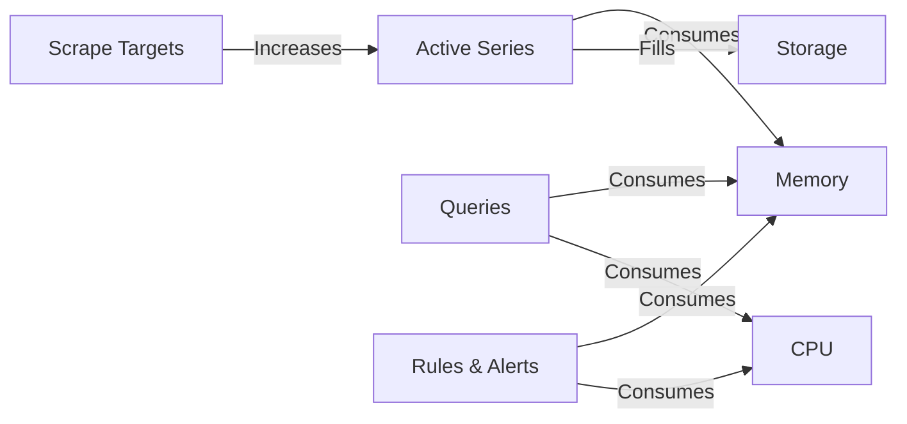

# Resource Utilization

## Introduction

Resource utilization is a critical aspect of running Prometheus effectively in production environments. As your monitoring needs grow, understanding how Prometheus consumes resources and how to optimize them becomes essential for maintaining a reliable monitoring infrastructure. This guide explores how Prometheus utilizes CPU, memory, disk, and network resources, and provides best practices for ensuring your Prometheus deployment scales efficiently with your system.

## Understanding Prometheus Resource Consumption

Prometheus is designed to be lightweight, but its resource needs can grow significantly depending on the scale of your monitoring environment. Let's examine the key resources Prometheus consumes:

### Memory Usage

Memory is typically the most important resource constraint for Prometheus. The primary memory consumers in Prometheus are:

1. **Sample ingestion**: Every time series sample consumes approximately 1-2 bytes of memory
2. **Active time series**: Each active time series requires about 3-4 KiB of memory
3. **Metadata**: Labels and other metadata
4. **Query execution**: Complex queries can temporarily consume significant memory

### Storage Requirements

Prometheus stores time series data locally by default. Storage requirements depend on:

- Number of time series (cardinality)
- Scrape interval
- Retention period

A rough estimate: each sample takes about 1-2 bytes on disk, compressed.

### CPU Usage

CPU consumption in Prometheus is primarily driven by:

- Sample ingestion rate
- Query execution
- Service discovery and relabeling
- Recording rules and alerts evaluation

### Network Bandwidth

Network usage is determined by:

- Scrape traffic (incoming)
- Remote read/write API traffic (if configured)
- Query API traffic

## Monitoring Prometheus Itself

One of the best practices in Prometheus is to "monitor the monitor." Prometheus exposes its own metrics, which can be scraped by another Prometheus instance or by itself.

```yaml
scrape_configs:
  - job_name: 'prometheus'
    static_configs:
      - targets: ['localhost:9090']
```

Key metrics to monitor:

- `prometheus_tsdb_head_series`: Current number of active time series
- `prometheus_tsdb_storage_blocks_bytes`: Size of data blocks on disk
- `prometheus_engine_query_duration_seconds`: Query execution time
- `prometheus_scrape_samples_post_metric_relabeling`: Sample ingestion rate
- `process_resident_memory_bytes`: Memory usage of the Prometheus process
- `process_cpu_seconds_total`: CPU usage of Prometheus

Let's visualize the relationship between these key metrics:



## Optimizing Resource Utilization

### Controlling Cardinality

High cardinality (too many unique time series) is the number one cause of resource issues in Prometheus. To control cardinality:

1. **Limit labels with high variability**
   - Avoid using IDs, timestamps, or unique identifiers as label values
   - Be cautious with high-cardinality dimensions (e.g., customer IDs, request IDs)

2. **Use relabeling to drop unnecessary labels**

```yaml
scrape_configs:
  - job_name: 'high_cardinality_service'
    metric_relabel_configs:
      - source_labels: [__name__]
        regex: 'http_requests_total'
        action: keep
      - regex: 'id|uuid|email|session_id'
        action: labeldrop
```

3. **Monitor cardinality growth**

```promql
rate(prometheus_tsdb_head_series_created_total[5m])
```

### Memory Optimization

1. **Adjust the sample retention period**
   Configure `--storage.tsdb.retention.time` based on your requirements (default is 15 days)

2. **Configure appropriate heap size**
   Set `--storage.tsdb.wal-compression` to reduce memory pressure

3. **Implement federation or sharding for large deployments**
   Use `federate` endpoint to collect specific metrics from multiple Prometheus instances

### Storage Optimization

1. **Compress the Write-Ahead Log (WAL)**

```yaml
# prometheus.yml configuration
storage:
  tsdb:
    wal-compression: true
```

2. **Configure appropriate retention periods**

```bash
# Example command-line flags
prometheus --storage.tsdb.retention.time=30d --storage.tsdb.retention.size=30GB
```

3. **Use external storage solutions for long-term storage**
   - Thanos
   - Cortex
   - Prometheus remote write

### CPU Optimization

1. **Optimize recording rules**
   - Pre-compute expensive queries
   - Reduce the evaluation interval for non-critical rules

```yaml
# Example of recording rules
groups:
  - name: example
    interval: 30s  # Evaluate every 30s instead of the default 15s
    rules:
      - record: job:http_requests:rate5m
        expr: sum(rate(http_requests_total[5m])) by (job)
```

2. **Stagger scrape targets**
   Add jitter to scrape intervals to prevent CPU spikes

```yaml
scrape_configs:
  - job_name: 'service'
    scrape_interval: 15s
    scrape_timeout: 10s
    scrape_offset: 7s  # Offset scrapes to distribute load
```

3. **Optimize queries**
   - Use aggregation
   - Limit time ranges
   - Avoid using `regex` matcher when possible

## Real-World Example: Scaling Prometheus for Microservices

Let's consider a practical example: a microservices architecture with 50 services, each exposing 100 metrics, scraped every 15 seconds.

### Estimating Resource Requirements

**Time Series Calculation:**
- 50 services × 100 metrics × 5 labels per metric (on average) = 25,000 time series
- Memory estimate: 25,000 × 3.5 KiB = ~87.5 MiB for time series alone
- Add overhead for sample ingestion, metadata, and query execution

**Storage Calculation:**
- 25,000 series × 4 samples/minute × 60 minutes × 24 hours × 30 days = ~4.3 billion samples per month
- At 1.5 bytes per sample = ~6.5 GB per month (compressed)

### Implementation Strategy

Based on these calculations, a single Prometheus instance on modest hardware should handle this load. However, as the system grows, consider these scaling strategies:

1. **Functional Sharding**: Split Prometheus instances by function (e.g., one for infrastructure, one for applications)

```yaml
# prometheus-infra.yml
scrape_configs:
  - job_name: 'node'
    file_sd_configs:
      - files: ['targets/infrastructure/*.json']

# prometheus-apps.yml
scrape_configs:
  - job_name: 'applications'
    file_sd_configs:
      - files: ['targets/applications/*.json']
```

2. **Federation**: Use a hierarchical approach with multiple Prometheus servers

```yaml
# Global Prometheus configuration
scrape_configs:
  - job_name: 'federate'
    scrape_interval: 15s
    honor_labels: true
    metrics_path: '/federate'
    params:
      'match[]':
        - '{job="prometheus"}'
        - '{__name__=~"job:.*"}'
    static_configs:
      - targets:
        - 'prometheus-apps:9090'
        - 'prometheus-infra:9090'
```

## Best Practices Checklist

- [ ] Monitor Prometheus itself with a separate Prometheus instance
- [ ] Control label cardinality and use relabeling to limit time series growth
- [ ] Pre-compute expensive queries with recording rules
- [ ] Adjust scrape intervals based on the needs of each target
- [ ] Set appropriate retention periods based on your requirements
- [ ] Consider horizontal scaling for large deployments (sharding, federation)
- [ ] Use remote storage for long-term data retention
- [ ] Regularly review and optimize PromQL queries
- [ ] Allocate sufficient but not excessive resources to Prometheus

## Summary

Resource utilization is a critical aspect of running Prometheus effectively. By understanding how Prometheus uses memory, storage, CPU, and network resources, you can optimize your monitoring infrastructure to handle growing demands while maintaining reliability and performance.

The key to success with Prometheus resource management is proactive monitoring of Prometheus itself, controlling cardinality, and implementing appropriate scaling strategies as your system grows.

## Additional Resources

- [Prometheus Storage documentation](https://prometheus.io/docs/prometheus/latest/storage/)
- [Remote Storage Integration documentation](https://prometheus.io/docs/operating/integrations/#remote-endpoints-and-storage)
- [Prometheus Configuration documentation](https://prometheus.io/docs/prometheus/latest/configuration/configuration/)

## Exercises

1. Set up a second Prometheus instance to monitor your primary Prometheus server and create a dashboard to track its resource usage.

2. Analyze your metrics to identify the top 10 metrics with the highest cardinality and create a plan to reduce them if appropriate.

3. Create recording rules for your most frequently used or most computationally expensive queries.

4. Implement a test environment that simulates 10x your current metric volume and determine at what point you would need to implement sharding or federation.