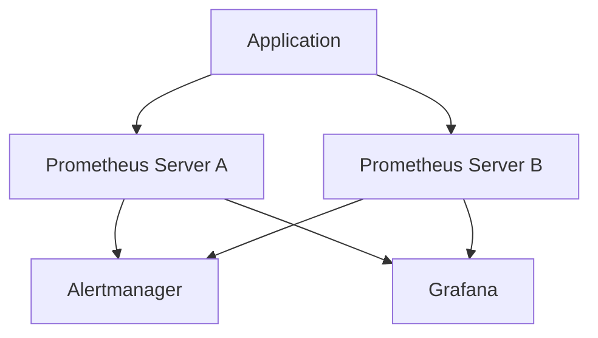
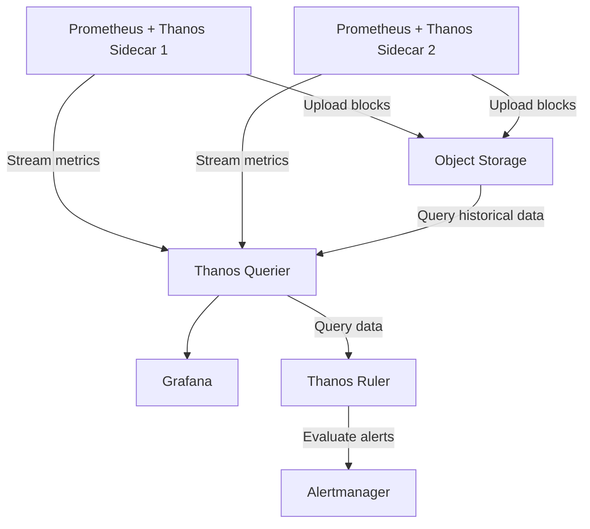
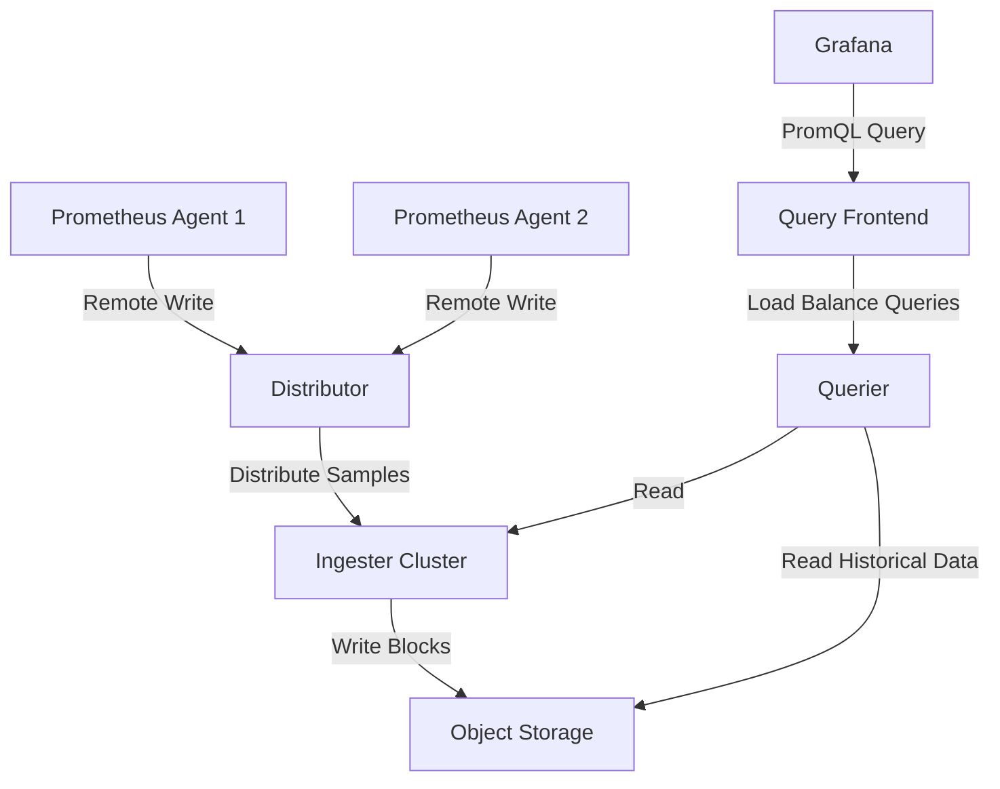
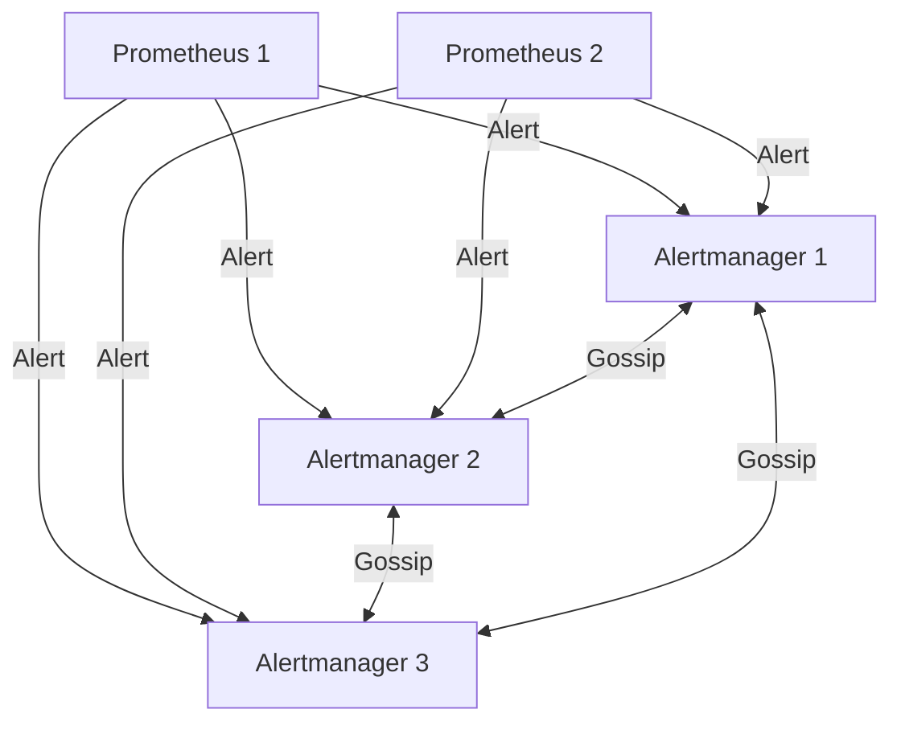

# High Availability Setup

## Introduction

In production environments, monitoring systems like Prometheus are critical infrastructure components that should never fail. A monitoring outage can leave your team blind to application or infrastructure issues. High Availability (HA) in Prometheus refers to configuring your monitoring system to eliminate single points of failure, ensuring continuous operation even when individual components fail.

This guide explains how to implement high availability for Prometheus, covering redundant server deployments, data replication strategies, and load balancing approaches. Whether you're managing a small cluster or a large-scale infrastructure, these principles will help you build a resilient monitoring system.

## Understanding Prometheus High Availability Challenges

Before diving into implementation, it's important to understand the specific challenges of making Prometheus highly available:

1. **Stateful Nature**: Prometheus stores time-series data locally by default
2. **Single-Node Architecture**: Prometheus was designed as a single-node application
3. **Lack of Native Clustering**: Unlike some databases, Prometheus doesn't have built-in clustering
4. **Consistency Requirements**: Alerting requires consistent data views to avoid duplicate or missed alerts

## High Availability Patterns for Prometheus

### Pattern 1: Simple Redundancy (Active-Passive)

The simplest approach to Prometheus HA is running identical, independent Prometheus servers that scrape the same targets.



#### Implementation Steps:

1. **Deploy multiple Prometheus instances** with identical scrape configurations:

```yaml
# prometheus-1.yml
global:
  scrape_interval: 15s

scrape_configs:
  - job_name: 'web-servers'
    static_configs:
      - targets: ['web1:9090', 'web2:9090', 'web3:9090']
```

2. **Configure identical alerting rules** on each Prometheus server:

```yaml
# alert-rules.yml
groups:
- name: example
  rules:
  - alert: InstanceDown
    expr: up == 0
    for: 5m
    labels:
      severity: critical
    annotations:
      summary: "Instance {{ $labels.instance }} down"
      description: "{{ $labels.instance }} of job {{ $labels.job }} has been down for more than 5 minutes."
```

3. **Set up Alertmanager deduplication** to handle duplicate alerts from multiple Prometheus servers:

```yaml
# alertmanager.yml
global:
  resolve_timeout: 5m

route:
  group_by: ['alertname', 'instance', 'job']
  group_wait: 30s
  group_interval: 5m
  repeat_interval: 12h
  receiver: 'team-email'

receivers:
- name: 'team-email'
  email_configs:
  - to: 'team@example.com'
```

### Pattern 2: Advanced Redundancy with Thanos

For larger deployments, [Thanos](https://thanos.io/) extends Prometheus to provide:
- Long-term storage via object storage (S3, GCS, etc.)
- Global query view across Prometheus instances
- Centralized alerting and rule evaluation



#### Implementation Steps:

1. **Deploy Prometheus with Thanos sidecar**:

```yaml
# prometheus.yml
global:
  external_labels:
    region: us-east-1
    replica: replica-1

storage:
  tsdb:
    path: /prometheus
    retention: 2d  # Short local retention, long-term in object storage
```

2. **Run the Thanos sidecar alongside Prometheus**:

```bash
thanos sidecar \
  --tsdb.path /prometheus \
  --prometheus.url http://localhost:9090 \
  --objstore.config-file bucket_config.yaml
```

3. **Configure the object storage for Thanos**:

```yaml
# bucket_config.yaml
type: S3
config:
  bucket: "thanos-metrics"
  endpoint: "s3.amazonaws.com"
  access_key: "${ACCESS_KEY}"
  secret_key: "${SECRET_KEY}"
```

4. **Deploy Thanos Querier for unified querying**:

```bash
thanos query \
  --store 10.0.0.1:10901 \
  --store 10.0.0.2:10901 \
  --store 10.0.0.3:10901
```

### Pattern 3: Cortex/Mimir for Multi-Tenant HA Prometheus

For the most advanced setups, especially when dealing with multi-tenancy requirements, Cortex (or its successor Grafana Mimir) provides a horizontally scalable, highly available Prometheus-compatible monitoring system:



#### Implementation Steps:

1. **Configure Prometheus as an agent for remote-write**:

```yaml
# prometheus-agent.yml
global:
  scrape_interval: 15s
  external_labels:
    cluster: production
    __replica__: replica-1

remote_write:
  - url: http://cortex:9009/api/v1/push
    basic_auth:
      username: "user"
      password: "password"

scrape_configs:
  - job_name: 'web-servers'
    static_configs:
      - targets: ['web1:9090', 'web2:9090']
```

2. **Deploy Cortex/Mimir components**:

```yaml
# cortex-config.yaml
distributor:
  shard_by_all_labels: true
  pool:
    health_check_ingesters: true

ingester:
  lifecycler:
    ring:
      kvstore:
        store: consul
        prefix: collectors/
      replication_factor: 3

storage:
  engine: blocks
  blocks:
    backend: s3
    s3:
      bucket_name: cortex-blocks
      endpoint: s3.amazonaws.com
```

## Alertmanager High Availability

Prometheus is only part of the monitoring stack - Alertmanager also needs to be highly available:



1. **Configure Alertmanager in cluster mode**:

```yaml
# alertmanager.yml
global:
  resolve_timeout: 5m

cluster:
  listen-address: "0.0.0.0:9094"
  peer: "alertmanager-1:9094"
  peer: "alertmanager-2:9094"
  peer: "alertmanager-3:9094"

route:
  group_by: ['alertname', 'job']
  group_wait: 30s
  group_interval: 5m
  repeat_interval: 12h
  receiver: 'team-email'

receivers:
- name: 'team-email'
  email_configs:
  - to: 'team@example.com'
```

2. **Configure Prometheus to send alerts to all Alertmanager instances**:

```yaml
# prometheus.yml
alerting:
  alertmanagers:
  - static_configs:
    - targets:
      - alertmanager-1:9093
      - alertmanager-2:9093
      - alertmanager-3:9093
```

## Practical Examples: High Availability Deployment

### Example 1: Docker Compose Setup for Simple HA

Here's a Docker Compose example for a simple HA setup with two Prometheus instances and a clustered Alertmanager:

```yaml
version: '3'

services:
  prometheus-1:
    image: prom/prometheus:latest
    volumes:
      - ./prometheus-1.yml:/etc/prometheus/prometheus.yml
      - ./alert-rules.yml:/etc/prometheus/alert-rules.yml
      - prometheus1_data:/prometheus
    command:
      - '--config.file=/etc/prometheus/prometheus.yml'
      - '--storage.tsdb.path=/prometheus'
      - '--web.console.libraries=/usr/share/prometheus/console_libraries'
      - '--web.console.templates=/usr/share/prometheus/consoles'
    ports:
      - "9091:9090"

  prometheus-2:
    image: prom/prometheus:latest
    volumes:
      - ./prometheus-2.yml:/etc/prometheus/prometheus.yml
      - ./alert-rules.yml:/etc/prometheus/alert-rules.yml
      - prometheus2_data:/prometheus
    command:
      - '--config.file=/etc/prometheus/prometheus.yml'
      - '--storage.tsdb.path=/prometheus'
      - '--web.console.libraries=/usr/share/prometheus/console_libraries'
      - '--web.console.templates=/usr/share/prometheus/consoles'
    ports:
      - "9092:9090"

  alertmanager-1:
    image: prom/alertmanager:latest
    volumes:
      - ./alertmanager-1.yml:/etc/alertmanager/alertmanager.yml
    command:
      - '--config.file=/etc/alertmanager/alertmanager.yml'
      - '--cluster.listen-address=:9094'
      - '--cluster.peer=alertmanager-2:9094'
      - '--cluster.peer=alertmanager-3:9094'
    ports:
      - "9093:9093"
      - "9094:9094"

  alertmanager-2:
    image: prom/alertmanager:latest
    volumes:
      - ./alertmanager-2.yml:/etc/alertmanager/alertmanager.yml
    command:
      - '--config.file=/etc/alertmanager/alertmanager.yml'
      - '--cluster.listen-address=:9094'
      - '--cluster.peer=alertmanager-1:9094'
      - '--cluster.peer=alertmanager-3:9094'
    ports:
      - "9095:9093"
      - "9096:9094"

  alertmanager-3:
    image: prom/alertmanager:latest
    volumes:
      - ./alertmanager-3.yml:/etc/alertmanager/alertmanager.yml
    command:
      - '--config.file=/etc/alertmanager/alertmanager.yml'
      - '--cluster.listen-address=:9094'
      - '--cluster.peer=alertmanager-1:9094'
      - '--cluster.peer=alertmanager-2:9094'
    ports:
      - "9097:9093"
      - "9098:9094"

  grafana:
    image: grafana/grafana:latest
    environment:
      - GF_SECURITY_ADMIN_PASSWORD=admin
    volumes:
      - grafana_data:/var/lib/grafana
      - ./grafana-datasources.yml:/etc/grafana/provisioning/datasources/datasources.yml
    ports:
      - "3000:3000"

volumes:
  prometheus1_data:
  prometheus2_data:
  grafana_data:
```

### Example 2: Thanos Deployment with Kubernetes

Here's a simplified example of a Prometheus deployment with Thanos on Kubernetes:

```yaml
apiVersion: apps/v1
kind: StatefulSet
metadata:
  name: prometheus
spec:
  serviceName: "prometheus"
  replicas: 2
  selector:
    matchLabels:
      app: prometheus
  template:
    metadata:
      labels:
        app: prometheus
    spec:
      containers:
      - name: prometheus
        image: prom/prometheus:latest
        args:
        - "--config.file=/etc/prometheus/prometheus.yml"
        - "--storage.tsdb.path=/prometheus"
        - "--storage.tsdb.retention.time=2d"
        - "--web.enable-lifecycle"
        volumeMounts:
        - name: prometheus-config
          mountPath: /etc/prometheus/
        - name: prometheus-data
          mountPath: /prometheus
        ports:
        - containerPort: 9090
          name: prometheus
      
      - name: thanos-sidecar
        image: thanosio/thanos:latest
        args:
        - "sidecar"
        - "--tsdb.path=/prometheus"
        - "--prometheus.url=http://localhost:9090"
        - "--objstore.config-file=/etc/thanos/bucket.yml"
        volumeMounts:
        - name: prometheus-data
          mountPath: /prometheus
        - name: thanos-config
          mountPath: /etc/thanos
        ports:
        - containerPort: 10901
          name: grpc
        - containerPort: 10902
          name: http
      
      volumes:
      - name: prometheus-config
        configMap:
          name: prometheus-config
      - name: thanos-config
        secret:
          secretName: thanos-objstore
  
  volumeClaimTemplates:
  - metadata:
      name: prometheus-data
    spec:
      accessModes: [ "ReadWriteOnce" ]
      resources:
        requests:
          storage: 10Gi
```

## Best Practices for Prometheus HA

1. **Geographical Distribution**: For critical systems, deploy Prometheus servers across different data centers or availability zones

2. **Resource Isolation**: Ensure each Prometheus instance has dedicated resources to prevent resource contention

3. **Consistent Configuration**: Use configuration management tools like Ansible, Chef, or Puppet to ensure consistent configuration across all Prometheus instances

4. **Monitoring your Monitoring**: Set up external monitoring for your Prometheus instances themselves

5. **Regular Backup**: Even with HA, maintain regular backups of your Prometheus data

6. **Testing Failover**: Regularly test failover scenarios to ensure your HA setup works as expected

7. **Implementing Health Checks**: Use health checks to detect and replace failed Prometheus instances automatically

8. **Scaling Considerations**:
   - Consider federation for large-scale deployments
   - Use recording rules to pre-compute expensive queries
   - Implement proper retention policies

## Diagnosing HA Issues

Common issues in Prometheus HA setups and how to diagnose them:

| Issue | Symptoms | Diagnosis Commands |
|-------|----------|-------------------|
| Alertmanager Cluster Split-Brain | Duplicate alerts | `curl -s alertmanager:9093/-/ready` to check cluster status |
| Data Inconsistency | Different query results | Compare `prometheus_tsdb_head_series` metrics between instances |
| Network Partitioning | Node isolation | Check gossip protocol with `tcpdump` |
| Storage Bottlenecks | High latency | Monitor `prometheus_tsdb_head_samples_appended_total` |

## Summary

High availability for Prometheus is crucial for maintaining continuous monitoring in production environments. The approaches range from simple redundant setups to advanced distributed systems like Thanos or Cortex/Mimir.

Key takeaways:
- Simple HA can be achieved with redundant Prometheus servers and deduplicating Alertmanager
- Thanos provides an excellent middle ground with long-term storage and global query view
- Cortex/Mimir offers the most advanced HA and multi-tenancy features
- Always consider the entire monitoring pipeline, including Alertmanager

Implementing HA requires careful planning, but it provides the peace of mind that your monitoring system will stay online even when components fail. Remember that the HA approach you choose should match your organization's scale, complexity, and reliability requirements.

## Additional Resources

- [Prometheus High Availability Documentation](https://prometheus.io/docs/operating/ha/)
- [Thanos Project Documentation](https://thanos.io/tip/thanos/getting-started.md/)
- [Grafana Mimir Documentation](https://grafana.com/docs/mimir/latest/)
- [CNCF Prometheus Certification](https://www.cncf.io/certification/training/)

## Exercises

1. **Basic HA Setup**: Deploy two Prometheus servers with identical configurations scraping the same targets. Configure Grafana to use both as data sources.

2. **Alertmanager Clustering**: Set up a three-node Alertmanager cluster and test its behavior when one node fails.

3. **Thanos Implementation**: Deploy Prometheus with Thanos sidecar and set up a MinIO server as object storage. Query historical data using Thanos Querier.

4. **Failure Simulation**: In your HA setup, simulate failure of various components (Prometheus, Alertmanager, storage) and observe system behavior.

5. **Load Testing**: Generate high metric loads and evaluate how your HA setup handles increased pressure, measuring query performance across redundant instances.