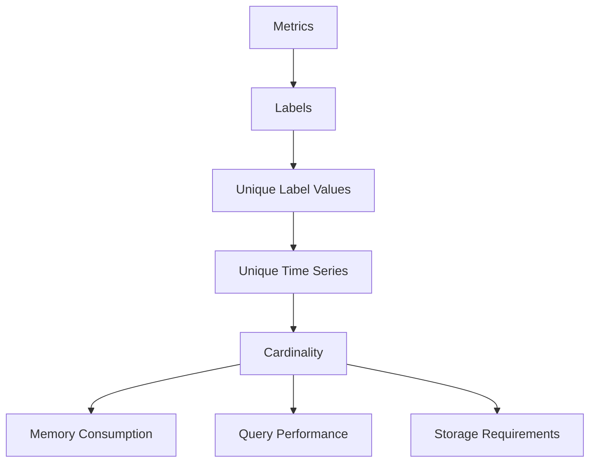

# Performance Optimization

## Introduction

Performance optimization is a critical aspect of managing Prometheus in production environments. As your monitoring needs grow and the volume of metrics increases, you may encounter challenges related to query performance, storage consumption, and resource utilization. This guide will explore various techniques to optimize your Prometheus deployment, ensuring it remains efficient, responsive, and reliable even at scale.

Performance optimization for Prometheus involves balancing three key aspects:

1. **Query efficiency** - Ensuring queries complete quickly
2. **Storage optimization** - Managing disk space consumption
3. **Resource utilization** - Properly allocating CPU and memory resources

By understanding and implementing the techniques covered in this guide, you'll be able to maintain a high-performing monitoring system even as your infrastructure grows.

## Understanding Prometheus Performance Factors

Before diving into specific optimization strategies, it's important to understand the factors that impact Prometheus performance:

### Cardinality

Cardinality refers to the number of unique time series in your Prometheus database. High cardinality is the most common cause of performance problems.



### Scrape Interval and Retention

The frequency at which you collect metrics and how long you store them directly impacts resource consumption.

### Query Complexity

Complex PromQL queries, especially those with many operations or high cardinality, can consume significant resources.

## Query Optimization Techniques

### 1. Optimize Your PromQL Queries

Inefficient queries can consume excessive resources. Here are some strategies to optimize your PromQL queries:

#### Avoid using `.*` in regex matchers

**Inefficient:**

```promql
http_requests_total{path=~"/api/.*"}
```

**Better:**

```promql
http_requests_total{path=~"/api/[^/]*"}
```

#### Limit the time range when possible

**Inefficient:**

```promql
rate(http_requests_total[24h])
```

**Better:**

```promql
rate(http_requests_total[5m])
```

#### Use aggregation to reduce the number of returned series

**Inefficient:**

```promql
http_requests_total{job="api-server"}
```

**Better (if you only need totals by endpoint):**

```promql
sum by(endpoint) (http_requests_total{job="api-server"})
```

### 2. Use Recording Rules for Complex Queries

Recording rules allow you to precompute frequently used or computationally expensive expressions and save their result as a new time series.

**Example recording rule configuration:**

```yaml
groups:
  - name: example
    rules:
      - record: job:http_requests_total:rate5m
        expr: sum by(job) (rate(http_requests_total[5m]))
```

After adding this rule, you can query `job:http_requests_total:rate5m` instead of calculating the rate expression each time.

### 3. Implement Query Caching

Starting with Prometheus 2.48.0, you can enable response caching to improve performance for frequently executed queries:

```yaml
# prometheus.yml
query_cache:
  # Enable caching
  enabled: true
  # Set maximum memory usage (bytes)
  max_size_bytes: 1073741824  # 1GB
  # Set maximum time to live for cached results
  max_ttl: 5m
```

## Storage Optimization

### 1. Adjust Data Retention

By default, Prometheus stores data for 15 days. Adjust this based on your needs:

```yaml
# prometheus.yml
storage:
  tsdb:
    retention.time: 30d  # Store data for 30 days
```

### 2. Configure TSDB Compression

The time series database (TSDB) uses compression to reduce disk usage:

```yaml
# prometheus.yml
storage:
  tsdb:
    # Set to 1.0 for maximum compression (higher CPU usage)
    # Set to 0.0 for minimum compression (lower CPU usage)
    compression_factor: 0.8
```

### 3. Manage Block Sizes

Prometheus stores data in blocks. Tuning the block parameters can improve performance:

```yaml
# prometheus.yml
storage:
  tsdb:
    # How long to wait before writing a new block
    min_block_duration: 2h
    # Maximum block duration
    max_block_duration: 24h
```

## Cardinality Management

### 1. Design Metrics with Cardinality in Mind

Choose labels carefully to avoid explosion in the number of time series:

**High cardinality (avoid):**

```promql
http_requests_total{user_id="12345", session_id="abcdef", request_id="xyz123"}
```

**Better approach:**

```promql
http_requests_total{endpoint="/api/users", status_code="200"}
```

### 2. Use `exemplar` for High-Cardinality Data

For high-cardinality data like request IDs or user IDs, use exemplars instead of labels:

```go
// Go example using the Prometheus client
httpRequestsCounter.WithLabelValues("/api/users", "200").Observe(0.42, prometheus.Labels{
    "request_id": "xyz123",
    "user_id": "12345",
})
```

### 3. Implement a Metric Naming Convention

Establish a consistent naming convention to avoid duplicate metrics with slightly different names:

```
<namespace>_<subsystem>_<name>_<unit>
```

For example: `http_server_requests_seconds_count`

## Resource Management

### 1. Hardware Sizing Guidelines

Based on your metrics volume:

| Metrics Volume | CPU Recommendations | Memory Recommendations | Storage Recommendations |
|----------------|---------------------|------------------------|-------------------------|
| < 10K series   | 2 CPU cores         | 4 GB RAM               | 50 GB SSD               |
| 10K-100K series| 4-8 CPU cores       | 8-16 GB RAM            | 100-500 GB SSD          |
| 100K-1M series | 8-16 CPU cores      | 32-64 GB RAM           | 500 GB-2 TB SSD         |

### 2. Tune Scrape Configuration

Adjust scrape configurations to balance between monitoring frequency and resource consumption:

```yaml
scrape_configs:
  - job_name: 'critical-services'
    scrape_interval: 10s
    scrape_timeout: 5s
  
  - job_name: 'less-critical-services'
    scrape_interval: 30s
    scrape_timeout: 10s
```

### 3. Configure Memory Management

Prometheus provides settings to manage memory usage:

```yaml
# prometheus.yml
query:
  max_samples: 50000000  # Maximum number of samples in a query
  timeout: 2m            # Maximum query execution time
```

## Practical Examples

### Case Study: Optimizing a High-Cardinality Environment

Consider a web service that initially tracked HTTP requests with detailed labels:

```promql
http_requests_total{path="/api/user/profile", method="GET", status="200", user_id="12345", region="us-west", device="mobile", app_version="2.3.4"}
```

This approach created millions of time series and led to performance issues.

**Solution:**

1. Removed high-cardinality labels from metrics:

```promql
http_requests_total{path="/api/user/profile", method="GET", status="200"}
```

2. Created specific aggregated metrics for important dimensions:

```promql
http_requests_by_region_total{path="/api/user/profile", method="GET", status="200", region="us-west"}
http_requests_by_device_total{path="/api/user/profile", method="GET", status="200", device="mobile"}
```

3. Used exemplars to track specific requests for troubleshooting.

**Result:** Query performance improved by 90%, and storage requirements decreased by 75%.

### Case Study: Query Optimization

A dashboard with this query was taking 30+ seconds to load:

```promql
sum by(service, endpoint) (rate(http_request_duration_seconds_count{environment="production"}[5m]))
```

**Solution:**

1. Created a recording rule to pre-compute this expression:

```yaml
groups:
  - name: http_metrics
    rules:
      - record: job:http_request_duration_seconds_count:rate5m
        expr: sum by(service, endpoint) (rate(http_request_duration_seconds_count{environment="production"}[5m]))
```

2. Updated the dashboard to use the pre-computed metric:

```promql
job:http_request_duration_seconds_count:rate5m
```

**Result:** Dashboard loading time reduced to under 1 second.

## Monitoring Prometheus Itself

To optimize Prometheus, you should monitor its own performance:

```yaml
scrape_configs:
  - job_name: 'prometheus'
    static_configs:
      - targets: ['localhost:9090']
```

Key metrics to watch:

- `prometheus_tsdb_head_series` - Number of active time series
- `prometheus_engine_query_duration_seconds` - Query execution time
- `prometheus_tsdb_storage_blocks_bytes` - Disk usage
- `process_resident_memory_bytes` - Memory usage

## Summary

Performance optimization is an ongoing process that involves:

1. **Designing metrics carefully** to avoid cardinality problems
2. **Optimizing queries** using efficient PromQL expressions and recording rules
3. **Managing storage** through proper retention policies and compression
4. **Allocating appropriate resources** based on your metrics volume

By implementing these best practices, you can ensure your Prometheus deployment remains efficient and reliable even as your monitoring needs grow.

## Additional Resources

- [Prometheus Documentation: Storage](https://prometheus.io/docs/prometheus/latest/storage/)
- [Prometheus Documentation: Query Optimization](https://prometheus.io/docs/prometheus/latest/querying/optimization/)
- [PromCon Talks on Performance](https://prometheus.io/community/events/)
- [Grafana Labs: Cardinality is (almost) killing you](https://grafana.com/blog/2022/10/20/how-high-cardinality-affects-prometheus-and-what-we-can-do-about-it/)

## Exercises

1. Analyze your current Prometheus metrics and identify high-cardinality series using:
   ```promql
   topk(10, count by (__name__, job) (count by (__name__, job, instance) ({__name__!=""})))
   ```

2. Implement at least two recording rules for your most frequently used or complex queries.

3. Create a Prometheus dashboard to monitor the performance of your Prometheus server itself.

4. Review your retention settings and calculate the optimal storage based on your metrics volume and business requirements.