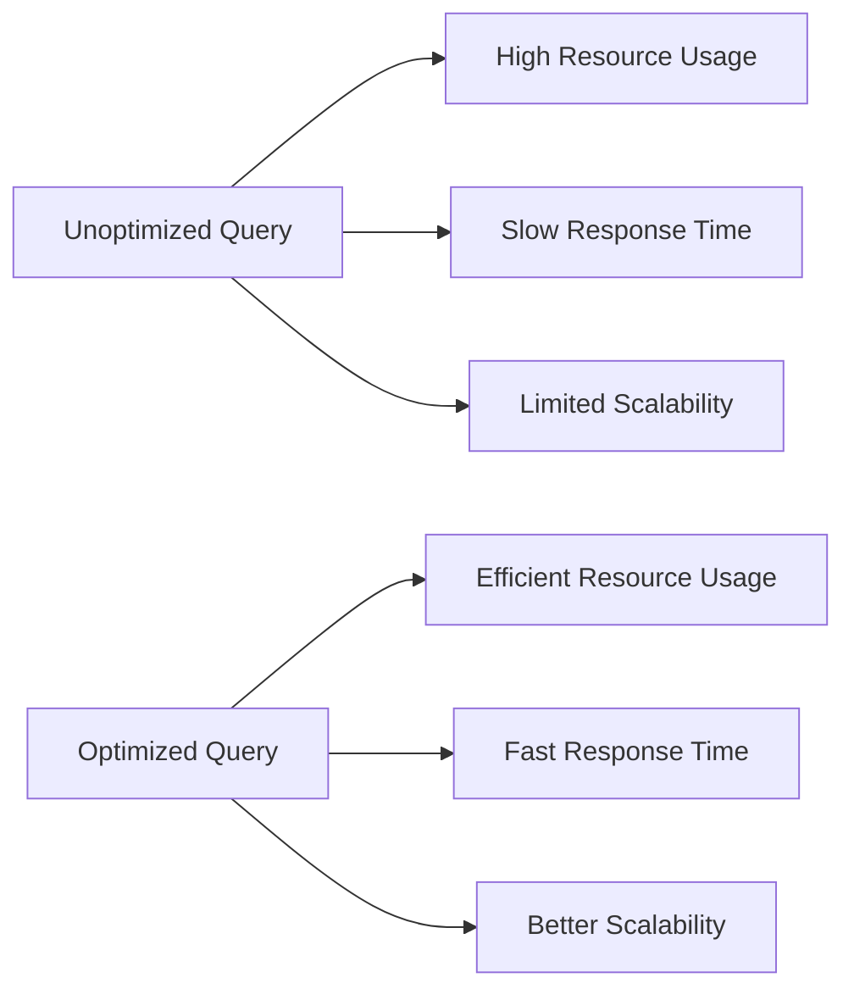

# Query Optimization

## Introduction

Query optimization is a critical aspect of working effectively with Prometheus. As your monitoring infrastructure grows, poorly optimized queries can lead to excessive resource consumption, slower response times, and in worst cases, system instability. This guide will teach you how to write efficient PromQL queries that deliver the insights you need without unnecessary overhead.

## Why Query Optimization Matters

When working with Prometheus at scale, the difference between an optimized and unoptimized query can be dramatic:

- **Resource usage**: Inefficient queries consume more CPU and memory
- **Response time**: Optimized queries return results faster
- **Scalability**: Well-formed queries allow your monitoring to grow with your infrastructure
- **User experience**: Faster dashboards and alerting evaluations



## Common Query Optimization Techniques

### 1. Limit Time Ranges

One of the most effective optimizations is limiting the time range of your queries. Shorter time ranges mean less data to process.

```promql
# Less efficient (querying 24 hours of data)
rate(http_requests_total[24h])

# More efficient (querying 5 minutes of data)
rate(http_requests_total[5m])
```

Always use the smallest time window that meets your needs.

### 2. Use Appropriate Recording Rules

Recording rules pre-compute expensive expressions and save the results. This is especially valuable for frequently used queries or dashboard panels.

In your `prometheus.yml`:

```yaml
rules:
  - name: my_recording_rules
    interval: 1m
    rules:
      - record: job:http_requests:rate5m
        expr: rate(http_requests_total[5m])
```

Then, instead of calculating the rate every time, you can query the pre-computed value:

```promql
job:http_requests:rate5m
```

### 3. Apply Specific Label Filters Early

Filter metrics as early as possible in your query to reduce the data volume Prometheus needs to process.

```promql
# Less efficient: filtering after rate calculation
rate(http_requests_total[5m]) > 100

# More efficient: filtering before rate calculation
rate(http_requests_total{status="500"}[5m])
```

### 4. Avoid Using High-Cardinality Labels

High-cardinality labels (like unique IDs or timestamps) dramatically increase the number of time series and can impact query performance.

```promql
# Problematic: Using high-cardinality user_id label
http_requests_total{user_id="12345"}

# Better: Use service-level metrics with controlled cardinality
http_requests_total{service="authentication"}
```

### 5. Use Subqueries Carefully

Subqueries can be useful but may introduce significant overhead. Use them sparingly and with appropriate step parameters.

```promql
# Potentially expensive subquery
max_over_time(rate(http_requests_total[5m])[1h:])

# More efficient if applicable for your use case
max_over_time(rate(http_requests_total[5m])[1h:5m])
```

The `:5m` sets the resolution of the subquery, reducing computation.

### 6. Prefer `rate()` over `irate()`

While `irate()` gives you the instant rate between the last two samples, `rate()` averages over the entire time range, which is generally more useful and less noisy for most dashboards and alerts.

```promql
# More stable, typically preferred
rate(http_requests_total[5m])

# More volatile, use only when you need the very latest change
irate(http_requests_total[5m])
```

### 7. Optimize Regex Queries

Regular expressions are powerful but can be expensive. Keep them as specific as possible.

```promql
# Less efficient: broad regex
http_requests_total{endpoint=~".+"}

# More efficient: specific regex
http_requests_total{endpoint=~"^/api/v1/.+"}

# Even better: exact match when possible
http_requests_total{endpoint="/api/v1/users"}
```

## Real-World Example: Dashboard Optimization

Consider a dashboard showing error rates across multiple services. Here's how we can optimize it:

### Unoptimized Version

```promql
sum(rate(http_requests_total{status=~"5.."}[5m])) by (service) / 
sum(rate(http_requests_total[5m])) by (service)
```

This query calculates the error rate for all services, but recalculates this value for every dashboard refresh.

### Optimized Version

First, create recording rules:

```yaml
rules:
  - name: http_errors
    interval: 1m
    rules:
      - record: service:http_requests_errors:rate5m
        expr: sum(rate(http_requests_total{status=~"5.."}[5m])) by (service)
      - record: service:http_requests_total:rate5m
        expr: sum(rate(http_requests_total[5m])) by (service)
```

Then, in your dashboard:

```promql
service:http_requests_errors:rate5m / service:http_requests_total:rate5m
```

This divides pre-computed values instead of recalculating them each time, significantly reducing CPU usage.

## Performance Analysis Tools

### Query Stats in Prometheus UI

The Prometheus UI provides statistics about query execution. Look for:

- **Timings**: How long the query took to execute
- **Returned series**: The number of time series returned

### TSDB Stats

The `/tsdb-status` endpoint in Prometheus provides insights about the time series database:

```
http://your-prometheus-server:9090/tsdb-status
```

Look for metrics like:
- **Head series**: Number of active time series
- **Head samples**: Number of samples in the in-memory database
- **Ingestion rate**: Samples ingested per second

## Common Query Mistakes to Avoid

1. **Using `group_by` without aggregation**: This creates unnecessary series.
2. **Querying too many metrics at once**: Break complex dashboards into multiple simpler queries.
3. **Unnecessary math operations**: Simplify expressions where possible.
4. **Ignoring query execution time**: Monitor and optimize slow queries.
5. **Not using appropriate time windows**: Adjust range intervals based on metric collection frequency.

## PromQL Functions for Better Performance

Some PromQL functions are designed to help with performance optimization:

- **`topk`** and **`bottomk`**: Limit results to N highest/lowest values
- **`count_values`**: Count values instead of returning all matching series
- **`quantile`**: Calculate quantiles instead of processing all data points

```promql
# Instead of returning all services, focus on top 5 by error rate
topk(5, service:http_requests_errors:rate5m / service:http_requests_total:rate5m)
```

## Summary

Query optimization is essential for maintaining a performant Prometheus setup as your monitoring needs grow. By following these best practices, you can ensure that your PromQL queries are efficient, responsive, and scalable:

- Use appropriate time ranges
- Implement recording rules for expensive calculations
- Filter early in query execution
- Control cardinality
- Use regex and subqueries carefully
- Regularly review and optimize slow queries

Remember that the best query optimization strategy often depends on your specific monitoring architecture and needs. Continuously test and refine your approach as your system evolves.

## Additional Resources

- [Prometheus Query Optimization Documentation](https://prometheus.io/docs/prometheus/latest/querying/optimization/)
- [PromLabs: PromQL Optimization Tips](https://promlabs.com/blog/categories/promql/)
- [Robust Perception Blog](https://www.robustperception.io/blog/)

## Exercises

1. Identify three queries in your current Prometheus setup that take the longest to execute. Optimize them using the techniques in this guide.

2. Create recording rules for the top five most frequently used queries in your dashboards.

3. Analyze a complex dashboard and identify opportunities to improve query performance by pre-aggregating data or filtering earlier in the query pipeline.

4. Practice converting a query using `group_by` operations into equivalent but more efficient recording rules.

5. Benchmark the performance difference between using `rate()` vs. `increase()` for your specific metrics and cardinality.