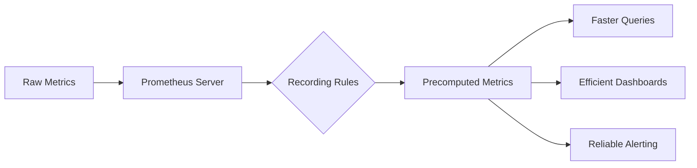

# Recording Rules Best Practices

## Introduction

Recording rules are a powerful feature in Prometheus that allow you to precompute frequently used or computationally expensive expressions and save their results as new time series. These precomputed time series can then be queried much more efficiently than executing the original expression every time.

In this guide, we'll explore best practices for creating and managing recording rules in Prometheus, helping you optimize your monitoring system and improve query performance.

## Why Use Recording Rules?

Before diving into best practices, let's understand why recording rules are essential:

1. **Performance Optimization**: Complex queries can be expensive to compute on-demand. Recording rules precompute these expressions at regular intervals.

2. **Dashboard Efficiency**: Grafana dashboards that use precomputed metrics load faster and put less strain on your Prometheus server.

3. **Query Simplification**: Recording rules can transform complex expressions into simple metrics, making them easier to use.

4. **Alerting Reliability**: Using recording rules in alerting ensures that alert evaluation is fast and reliable.

Let's see how recording rules work with a simple diagram:



## Basic Recording Rule Syntax

Recording rules in Prometheus are defined in a YAML configuration file. Here's the basic structure:

```yaml
groups:
  - name: example
    interval: 30s
    rules:
      - record: job:http_requests:rate5m
        expr: sum(rate(http_requests_total[5m])) by (job)
```

Each rule consists of:
- `record`: The name of the new time series to create
- `expr`: The PromQL expression to evaluate

## Recording Rules Best Practices

### 1. Use Consistent Naming Conventions

Follow a consistent naming pattern for your recording rules to make them easily identifiable and understandable.

#### Recommended Pattern: `level:metric:operations`

- `level`: The aggregation level (e.g., `instance`, `job`, `cluster`)
- `metric`: The base metric name
- `operations`: The operations applied (e.g., `rate5m`, `sum`, `ratio`)

#### Example:

```yaml
# Good
- record: job:http_requests_total:rate5m
  expr: sum(rate(http_requests_total[5m])) by (job)

# Avoid
- record: http_request_rate_by_job
  expr: sum(rate(http_requests_total[5m])) by (job)
```

### 2. Group Related Rules Together

Organize your recording rules into logical groups. Rules in the same group are evaluated sequentially, so you can reference earlier rules within the same group.

```yaml
groups:
  - name: http_metrics
    interval: 30s
    rules:
      # Base rates
      - record: instance:http_requests:rate5m
        expr: rate(http_requests_total[5m])
      
      # Job-level aggregation (uses the rule above)
      - record: job:http_requests:rate5m
        expr: sum by (job) (instance:http_requests:rate5m)
```

### 3. Set Appropriate Evaluation Intervals

Choose rule evaluation intervals based on the volatility of the data and the query requirements:

- **High-frequency metrics**: 15-30s intervals
- **Standard metrics**: 30s-1m intervals
- **Slow-changing metrics**: 5m intervals

```yaml
groups:
  - name: critical_metrics
    interval: 15s
    rules:
      - record: instance:cpu:usage:rate1m
        expr: rate(node_cpu_seconds_total{mode="user"}[1m])
  
  - name: standard_metrics
    interval: 1m
    rules:
      - record: job:http_errors:ratio5m
        expr: sum(rate(http_requests_total{status=~"5.."}[5m])) by (job) / sum(rate(http_requests_total[5m])) by (job)
```

### 4. Optimize Rule Expressions

Write efficient PromQL expressions to minimize the computational load:

#### Use Appropriate Time Windows

```yaml
# Good for recent trends
- record: job:http_requests:rate5m
  expr: sum(rate(http_requests_total[5m])) by (job)

# Good for longer patterns
- record: job:http_requests:rate1h
  expr: sum(rate(http_requests_total[1h])) by (job)
```

#### Limit Label Cardinality

High cardinality labels can cause performance issues. Be selective about which labels to include.

```yaml
# Better - retains only necessary labels
- record: api:request_duration_seconds:p95
  expr: histogram_quantile(0.95, sum by (job, method, path, le) (rate(http_request_duration_seconds_bucket[5m])))

# Avoid - includes all labels
- record: api:request_duration_seconds:p95_all_labels
  expr: histogram_quantile(0.95, sum by (job, method, path, status, user, region, le) (rate(http_request_duration_seconds_bucket[5m])))
```

### 5. Build Complex Metrics Incrementally

For complex calculations, break down the computation into multiple steps:

```yaml
groups:
  - name: error_rates
    interval: 30s
    rules:
      # Step 1: Calculate total requests per job
      - record: job:http_requests:rate5m
        expr: sum by (job) (rate(http_requests_total[5m]))
      
      # Step 2: Calculate error requests per job
      - record: job:http_errors:rate5m
        expr: sum by (job) (rate(http_requests_total{status=~"5.."}[5m]))
      
      # Step 3: Calculate error ratio using previous results
      - record: job:http_errors:ratio5m
        expr: job:http_errors:rate5m / job:http_requests:rate5m
```

### 6. Add Context with Labels and Comments

Use labels and YAML comments to provide context and documentation for your rules:

```yaml
groups:
  - name: service_metrics
    interval: 30s
    rules:
      # Rule to track request latency at the 95th percentile for each service
      - record: service:request_latency_seconds:p95
        expr: histogram_quantile(0.95, sum by (service, le) (rate(request_duration_seconds_bucket[5m])))
        labels:
          purpose: "SLO tracking"
          team: "platform"
```

### 7. Test Rules Before Deployment

Before deploying recording rules to production, test them using the Prometheus `/api/v1/query` endpoint to ensure they produce the expected results.

Example test using curl:

```bash
curl -s 'http://prometheus:9090/api/v1/query' --data-urlencode 'query=sum(rate(http_requests_total[5m])) by (job)'
```

You can also use the Prometheus expression browser to validate the output of your rules.

### 8. Implement Recording Rules for SLIs/SLOs

Recording rules are perfect for Service Level Indicators (SLIs) and Service Level Objectives (SLOs):

```yaml
groups:
  - name: slos
    interval: 30s
    rules:
      # Availability SLI - percentage of successful requests
      - record: service:availability:ratio5m
        expr: sum(rate(http_requests_total{status!~"5.."}[5m])) by (service) / sum(rate(http_requests_total[5m])) by (service)
      
      # Latency SLI - 90th percentile request duration
      - record: service:latency_seconds:p90
        expr: histogram_quantile(0.9, sum by (service, le) (rate(http_request_duration_seconds_bucket[5m])))
      
      # SLO error budget consumption rate
      - record: service:error_budget:consumption_rate
        expr: (1 - service:availability:ratio5m) / (1 - 0.99) # Assuming 99% SLO target
```

### 9. Create Rules for Frequently Used PromQL Patterns

Identify common query patterns in your dashboards and alerts, and create recording rules for them:

```yaml
groups:
  - name: common_patterns
    interval: 30s
    rules:
      # CPU usage per container
      - record: container:cpu:usage_seconds:rate5m
        expr: sum(rate(container_cpu_usage_seconds_total[5m])) by (container, pod, namespace)
      
      # Memory usage per container
      - record: container:memory:usage_bytes
        expr: container_memory_usage_bytes
      
      # Network traffic per instance
      - record: instance:network:receive_bytes:rate5m
        expr: sum(rate(node_network_receive_bytes_total[5m])) by (instance)
```

### 10. Monitor Your Recording Rules

Create alerts to monitor the health of your recording rules evaluation:

```yaml
groups:
  - name: prometheus_rules
    rules:
      - alert: PrometheusRuleEvaluationFailures
        expr: increase(prometheus_rule_evaluation_failures_total[5m]) > 0
        for: 5m
        labels:
          severity: warning
        annotations:
          summary: "Prometheus rule evaluation failing"
          description: "Prometheus has failed to evaluate {{ $value }} rules in the last 5 minutes."
```

## Practical Example: Creating a Recording Rules Configuration

Let's put these best practices together in a complete example for monitoring a web application:

```yaml
groups:
  # HTTP traffic metrics
  - name: http_metrics
    interval: 30s
    rules:
      # Base rates by instance and job
      - record: instance:http_requests:rate5m
        expr: rate(http_requests_total[5m])
      
      - record: job:http_requests:rate5m
        expr: sum by (job) (instance:http_requests:rate5m)
      
      # Status code breakdowns
      - record: job:http_requests:rate5m:status
        expr: sum by (job, status) (rate(http_requests_total[5m]))
      
      # Error ratios
      - record: job:http_errors:ratio5m
        expr: sum by (job) (rate(http_requests_total{status=~"5.."}[5m])) / sum by (job) (rate(http_requests_total[5m]))
  
  # Latency metrics
  - name: latency_metrics
    interval: 30s
    rules:
      # Percentile latencies by job and endpoint
      - record: job:http_latency:p50
        expr: histogram_quantile(0.5, sum by (job, endpoint, le) (rate(http_request_duration_seconds_bucket[5m])))
      
      - record: job:http_latency:p90
        expr: histogram_quantile(0.9, sum by (job, endpoint, le) (rate(http_request_duration_seconds_bucket[5m])))
      
      - record: job:http_latency:p99
        expr: histogram_quantile(0.99, sum by (job, endpoint, le) (rate(http_request_duration_seconds_bucket[5m])))
  
  # System metrics
  - name: system_metrics
    interval: 1m
    rules:
      - record: instance:cpu:usage:rate5m
        expr: rate(node_cpu_seconds_total{mode="user"}[5m])
      
      - record: instance:memory:usage:percent
        expr: (node_memory_MemTotal_bytes - node_memory_MemAvailable_bytes) / node_memory_MemTotal_bytes * 100
```

## Implementing Recording Rules in Prometheus

Now that we've covered the best practices, let's see how to implement recording rules in your Prometheus setup:

1. Create a rules file (e.g., `recording_rules.yml`) with your rules configuration.

2. Update your Prometheus configuration (`prometheus.yml`) to include the rules file:

```yaml
rule_files:
  - "recording_rules.yml"
```

3. Reload your Prometheus configuration (without restarting):

```bash
curl -X POST http://prometheus:9090/-/reload
```

4. Verify your rules are loaded in the Prometheus UI by navigating to Status > Rules.

## Performance Considerations

When implementing recording rules, keep these performance considerations in mind:

1. **Memory Usage**: Each recorded time series consumes memory. Monitor Prometheus memory usage when adding new rules.

2. **Rule Evaluation Time**: Monitor `prometheus_rule_group_evaluation_duration_seconds` to ensure rule evaluation doesn't take too long.

3. **Storage Impact**: Recording rules create new time series that require additional storage. Plan your storage capacity accordingly.

4. **Cardinality Explosion**: Be careful with high-cardinality labels in recording rules to avoid excessive time series creation.

## Summary

Recording rules are a powerful tool for optimizing Prometheus performance and making your metrics more accessible. By following these best practices, you can create an efficient and maintainable recording rules configuration:

- Use consistent naming conventions
- Group related rules together
- Set appropriate evaluation intervals
- Optimize rule expressions and limit cardinality
- Build complex metrics incrementally
- Provide context with labels and comments
- Test rules before deployment
- Implement rules for SLIs/SLOs
- Create rules for common query patterns
- Monitor the health of your recording rules

By applying these practices, you'll improve query performance, reduce load on your Prometheus server, and create a more responsive monitoring system.

## Additional Resources

- [Prometheus Recording Rules Documentation](https://prometheus.io/docs/prometheus/latest/configuration/recording_rules/)
- [PromQL Best Practices](https://prometheus.io/docs/practices/rules/)
- [Grafana Labs: Recording Rules Guide](https://grafana.com/blog/2020/02/04/how-to-use-recording-rules-in-prometheus-and-grafana/)

## Exercises

1. Review your existing Prometheus dashboards and identify three frequently used or computationally expensive queries that could benefit from recording rules.

2. Create recording rules for calculating the 95th percentile latency for your most critical services.

3. Implement a hierarchical set of recording rules that calculate error rates at different aggregation levels (instance, job, and service).

4. Set up monitoring for your recording rules to ensure they're evaluating successfully.